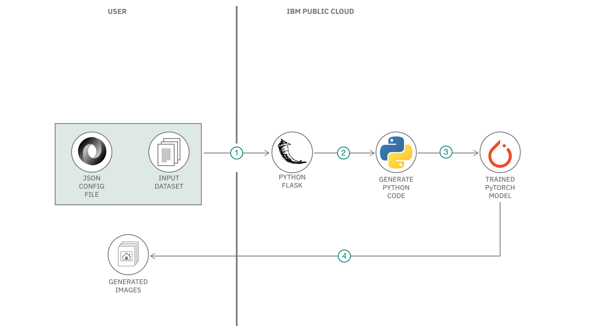

# 敵対的生成ネットワークを使用してファッション画像を生成する

### コードを 1 行も作成せずに、GAN モデルを定義し、ファッション画像を生成する DCGAN モデルを実装する

English version: https://developer.ibm.com/patterns/supplement-nnm-in-watson-studio-for-gan-model-with-configuration-no-code
  ソースコード: https://github.com/IBM/gan-toolkit-pattern

###### 最新の英語版コンテンツは上記URLを参照してください。
last_updated: 2019-12-04

 
## 概要

このコード・パターンでは、敵対的生成ネットワーク (GAN) モデルを定義して深層畳み込み GAN (DCGAN) モデルを実装する、シンプルな JSON 表現に目を向けます。この手法を使用すれば、コードを 1 行も作成せずに、ファッション画像を生成できます。

## 説明

分類タスクで使用する深層学習モデルのパフォーマンスは、トレーニング・データ内でどれだけたくさんの画像を使用できるかによって限りがあります。このことから、データを増やすために元のデータと同じように見えるデータを合成的に生成する、データ増補の手法が使用されることがよくあります。敵対的生成ネットワークは、このような合成した現実的画像を生成するために使用されている、最先端のモデルです。

Fashion MNIST は、10 クラスのラベルが関連付けられたデータセットであり、MNIST 数字分類用データセットの代わりとして簡単に使用できます。分類の精度を高めるために、多くの深層学習モデルが [Fashion MNIST データセット](https://developer.ibm.com/jp/patterns/train-a-model-on-fashion-dataset-using-tensorflow-with-ffdl/)を使用してトレーニングされています。トレーニング・データセットをさらに多くの画像で増補できれば、こうした分類子のパフォーマンスの向上につながります。深層畳み込み敵対的生成ネットワーク (DCGAN) モデルは、高品質の Fashion MNIST 画像を生成するための敵対的生成ネットワーク (GAN) です。

このオープンソース・プロジェクトには、カスタム GAN モデルを設計して実装するために使用できる以下のツールがバンドルされています。

* シンプルな JSON 構造を使用して GAN モデルのアーキテクチャーを指定するためのツール。このツールを使用すれば、コードを 1 行も作成することなくアーキテクチャーを指定できます。
* JSON 構造を使用して、さまざまな GAN コンポーネントのあらゆるパラメーターをカスタマイズするためのツール。
* 設計した GANモデルを任意のカスタム・データ (ファッション・データセットなど) に対してトレーニングし、新しい画像を生成するためのツール。

## フロー

1. ユーザーが、トレーニング対象の GAN モデルのアーキテクチャーを定義する JSON 構成ファイルを作成します。
1. ユーザーが REST API 呼び出しによって、JSON 構成ファイルを IBM Cloud 内の Python-Flask サーバーに送信します。
1. Flask API がリアルタイムで JSON 構成ファイルをデコードし、GAN モデル定義を作成します。
1. 続いて Flask API が GAN モデル定義をエラー・フリーの PyTorch コードに変換します。
1. PyTorch の GAN モデルが、指定された入力ファッション画像データセットを使用してトレーニングされます。
1. トレーニング済みモデルが、入力データセットには含まれていない、同様のファッション画像を新しく生成します。
1. 新しく生成された画像は、IBM Cloud 内の Python ランタイムから収集できます。

## 手順

このパターンの詳しい手順については、[README](https://github.com/IBM/gan-toolkit-pattern/blob/master/README.md) ファイルを参照してください。手順の概要は以下のとおりです。

1. IBM Cloud でアカウントを作成します。
1. IBM Cloud CLI をインストールします。
1. CLI を使用して IBM Cloud アカウントにログインします。
1. IBM Cloud のターゲット組織とスペースをセットアップします。
1. GitHub リポジトリーのクローンを作成します。
1. GAN 構成ファイルを作成します。
1. マニフェスト・ファイルと ProcFile を編集します。
1. IBM Cloud 内の新しい Python ランタイムにアプリをプッシュします。
