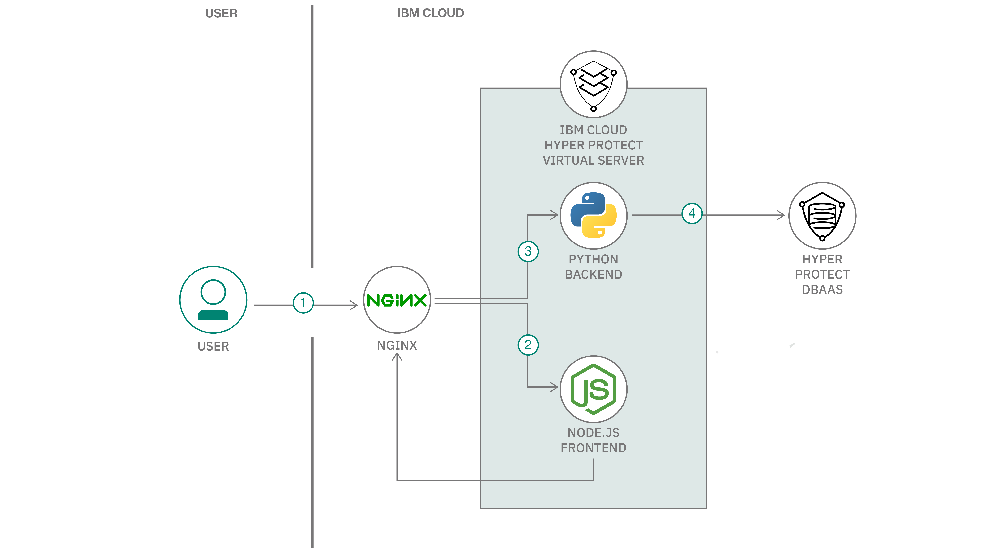

# エンドツーエンド暗号化を備えた災害支援募金 Web サイトを構築してデプロイする

### Node.js フロントエンドと Python バックエンドを使用し、MongoDB データベースにデータを保管する

English version: https://developer.ibm.com/patterns/./systems-create-a-secure-disaster-donations-website
  ソースコード: https://github.com/IBM/disaster-donations-website

###### 最新の英語版コンテンツは上記URLを参照してください。
last_updated: 2019-11-15

 
## 概要

このコード・パターンでは、MongoDB データベースにデータを保管する災害支援募金 Web サイトを構築するために、Node.js フロントエンドと Python バックエンドを作成してデプロイする方法を説明します。

## 説明

自然災害の発生後に、義援のために寄付をしようとする人々はたくさんいます。寄付のためにクレジット・カード情報を入力することはよくありますが、これは機密性の高い個人情報です。この情報を保護するにはどうすればよいでしょうか？特に [EU 一般データ保護規則 (GDPR)](https://eugdpr.org/) のような規制の観点から、個人情報を攻撃者から守るためには、どこにデータを保管すればよいのでしょうか？

このコード・パターンでは、まず始めに、IBM Cloud Hyper Protect DBaaS MongoDB インスタンスを作成する方法を説明します。これは接続とストレージが暗号化された、マネージド MongoDB インスタンスです。次に、RESTful JSON リクエストを Mongo 呼び出しに変換する Python バックエンド・アプリケーションを作成して、データベースを簡単に操作できるようにします。最後に Express フレームワークを使用して、静的 Web サイトの役割を果たす Node.js アプリケーションを作成してデプロイします。この Web サイトから jQuery を使用して Python バックエンド・アプリケーションにリクエストを送信し、HTTPS でリクエストを処理できるようにします。この一連の手順に従うと、クレジット・カード情報を受け入れて暗号化した上でデータベースに送信し、この機密情報が終始暗号化された状態に維持される災害支援募金 Web サイトが完成します。このアプリケーションを IBM Cloud Hyper Protect Virtual Server 内で実行することで、アプリで使用するストレージも確実に暗号化できます。

このコード・パターンを完了すると、以下の方法がわかるようになります。

* Docker コンテナーを作成して実行する
* MongoDB データベースとやりとりするための Python RESTful インターフェースをデプロイする
* 静的 Web サイトの役割を果たす Node.js Express アプリケーションをデプロイする
* Nginx リバース・プロキシーを作成し、Cloud Foundry 内で実行して TLS に対応する

## フロー

1. ユーザーが Web サイトにリクエストを送信します。
1. Nginx がリクエストを Node.js フロントエンドにルーティングします。
1. フロントエンドが Nginx プロキシーを呼び出します。Nginx プロキシーは URL を照合してバックエンド Python アプリケーションにリクエストをルーティングします。
1. Python バックエンドが RESTful JSON リクエストを Hyper Protect DBaaS 呼び出しに変換します。

## 手順

このパターンの詳しい手順については、[README](https://github.com/IBM/disaster-donations-website/blob/master/README.md) ファイルを参照してください。フロントエンド、バックエンド、およびプロキシーのコンポーネントの README ファイルにリンクされています。
