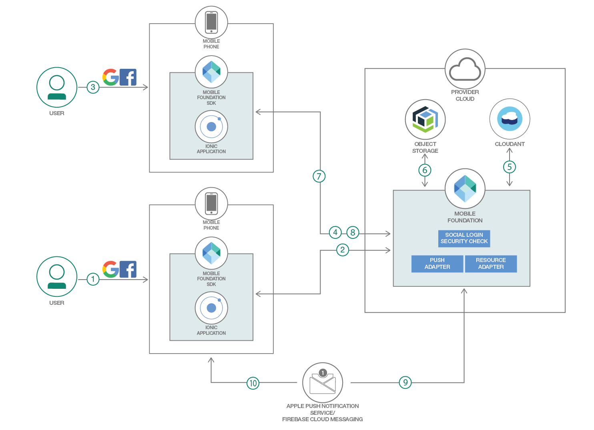

# ハイブリッド・モバイル・アプリにプッシュ通知機能を追加する

### IBM Mobile Foundation の統合通知システムを利用し、ベンダーのインフラストラクチャーを使って iOS、Android、Windows、Ionic、または Cordova アプリにプッシュ通知や SMS 通知を送信する

English version: https://developer.ibm.com/patterns/tag-based-push-notifications-for-hybrid-mobile-applications
  
ソースコード: https://github.com/IBM/tag-based-push-notifications/

###### 最新の英語版コンテンツは上記URLを参照してください。
last_updated: 2019-01-09

 
_**注: 本コード・パターンは、複合パターンの一部となっているものです。** この複合パターンを構成するコード・パターンは、スタンドアロン・アプリケーションにすることも、別のコード・パターンの続きとして使用することもできます。この複合パターンは、次のコード・パターンからなります。_

* クラウド・ネイティブ・バックエンドを使用したハイブリッド・モバイル・アプリを開発する
* [モバイル・ユーザー認証を実装する](https://developer.ibm.com/patterns/implementing-mobile-user-authentication)
* [モバイル・オフライン同期をセキュリティーで保護する](https://developer.ibm.com/jp/patterns/secure-offline-synchronization-ibm-mobile-foundation/)
* ハイブリッド・モバイル・アプリにプッシュ通知機能を追加する] (本パターン)

## 概要

このコード・パターンでは、IBM Mobile Foundation API を利用してハイブリッド・モバイル・アプリにプッシュ通知機能を追加する方法を説明します。

## 説明

プッシュ通知はモバイル・アプリケーションに不可欠な部分です。企業が最新のオファリングを宣伝する場合や、金融機関が取引に関して顧客に注意を促す場合、あるいは店舗が顧客に対して重要な発表を行う場合は、プッシュ通知が重宝します。気象などのリアルタイムの情報を更新したり、旅行関連の最新情報を知らせたりする場合にも、プッシュ通知を利用できます。顧客がモバイル・アプリケーションをインストールして通知にサブスクライブしていれば、企業がエンド・ユーザーにメッセージを伝えて必要に応じてアクションをとるよう要請するには、プッシュ通知が最も迅速で簡単な方法になります。サーバーから発信されるプッシュ通知では、通知を配信するためにデバイスに応じたさまざまなサービスが利用されます。

IBM Mobile Foundation には、プッシュ通知または SMS 通知を iOS、Android、Windows のアプリケーションに送信するための API メソッドがまとめて用意されています。IBM Mobile Foundation を使用すれば通知メカニズムが統一されているため、ユーザーやデバイスと通信するプロセス全体が、開発者にとって完全に透過的なものになります。

このコード・パターンでは、コード・パターン「クラウド・ネイティブ・バックエンドを使用したハイブリッド・モバイル・アプリケーションを開発する<!--(/patterns/develop-hybrid-mobile-app-with-cloud-native-back-end/)-->」で説明しているアプリケーションに、プッシュ通知機能を追加します。これにより、ユーザーが Google マップで地域を選択して、その地域内で報告された問題について通知を受信できるようサブスクライブすると、その地域内で任意のユーザーが問題を送信した時点でサブスクライブ済みのユーザー全員に通知が送信されるようにします。

このコード・パターンを完了すると、以下の方法がわかるようになります。

* IBM Mobile Foundation で、タグ・ベースのプッシュ通知を作成する
* IBM Mobile Foundation の REST API を使用して、IBM Mobile Foundation サーバー上でプッシュ通知タグを作成する
* IBM Mobile Foundation REST API を使用してプッシュ通知を送信する
* ユーザーの現在地から指定の半径内にある一連の場所を検索するために、Cloudant 地理空間インデックスを使用してクエリーを実行する

## フロー

1. ユーザーがモバイル・アプリを起動して、ログイン画面上で自分の資格情報を入力するか、ソーシャル・ログインを選択します。アプリのホーム・ページに、ユーザーの現在地から半径 1000 メートル内で報告された苦情が表示されます。ユーザーが「Watch Area (地域の監視)」ページを開き、地図内の場所を選択してから「*Receive notifications (通知を受け取る)*」をクリックします。
2. ユーザーが選択した地域名と同じタグ名を使用して Push Notification Subscription API が呼び出されます。IBM Mobile Foundation サーバー上でタグが作成されて (既存のものがない場合)、そのタグに対するアプリケーション・サブスクリプションが完了します。
3. 別のユーザーがこのモバイル・アプリを起動して、ログイン画面上で自分の資格情報を入力するか、ソーシャル・ログインを選択します。ホーム・ページ上で + ボタンをクリックし、新しい都市問題を報告します。説明を入力し、問題がある現場の画像と地理位置情報を取り込んだ後、ユーザーが「*Submit (送信)*」ボタンをクリックします。
4. リソース・アダプターがトリガーされます。
5. モバイル・アプリがテキスト・データを Cloudant NoSQL DB をアップロードします。
6. モバイル・アプリが、取り込まれた画像のサイズを変更してサムネイル画像を作成し、元の画面とサムネイル画像の両方を Cloud Object Storage にアップロードします。
7. 更新された問題のリストがモバイル・アプリのホーム・ページ上に表示されます。
8. 2 番目のユーザーによって新しい問題が送信されると、プッシュ・アダプターが呼び出されます。この呼び出しは、該当する地域に関して報告された問題の通知にサブスクライブしているユーザー全員に通知を送信するために行われます。
9. プッシュ・アダプターは Apple Push Notification サービスまたは Google Cloud Messaging に通知を送信します。
10. Apple Push Notification サービスまたは Google Cloud Messaging により、タグ・ベースの通知サブスクライバー全員に通知が送信されます。

## 手順

詳細な手順については、[README](https://github.com/IBM/tag-based-push-notifications/blob/master/README.md) を参照してください。
