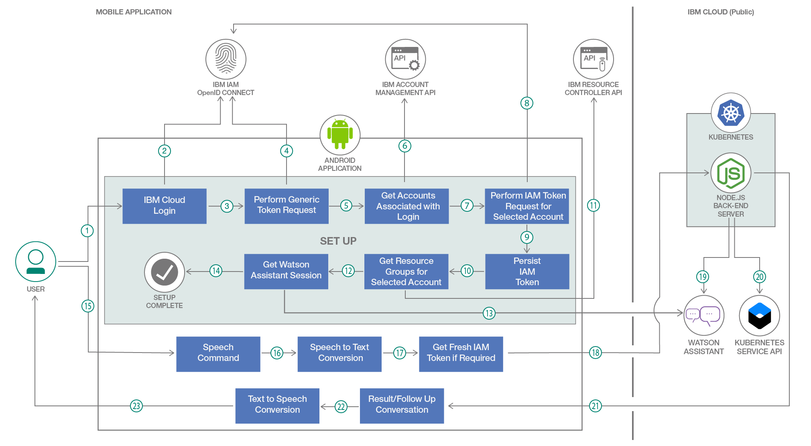

# Kubernetes 対話アシスタントを作成する

### Kubernetes インスタンスを作成、管理できるアプリに話しかける

English version: https://developer.ibm.com/patterns/talk-to-an-app-which-which-can-create-and-manage-your-kubernetes-instances
  ソースコード: https://github.com/IBM/kubernetes-speech-assistant

###### 最新の英語版コンテンツは上記URLを参照してください。
last_updated: 2019-06-12

 ## 概要

例えば、コンピューターから離れているときに、Kubernetes クラスター上のバックエンドをデプロイする必要があるのに、まだプロビジョニングしていないことに気付いたとします。タスクに応じた適切な構成を選んだ後、クラスターのプロビジョニングが完了するまでには数分かかることはわかっています。そうなると、アイドル画面のコンピューターを前に、早く作業を開始したいと手をこまねきながら、クラスターが初期化されるのを待っている自分の姿が目に浮かぶことでしょう。

私の世界では、そうはなりません！

このコード・パターンでは、クラウド内に Kubernetes 対応の音声アシスタントを作成する方法を紹介します。

IBM Cloud 上の Watson&trade; Assistant と Kubernetes Service を利用してアプリケーションを作成する例を通して、IBM Identity and Access Management と、OpenID、Watson Assistant に接続された Node.js バックエンド・サーバーからなる Android アプリケーションを作成する方法を学んでください。

## 説明

この開発者コード・パターンでは、Android モバイル・デバイス用の Kubernetes 対応音声アシスタント・アプリを作成する方法を説明します。この音声アシスタントがあれば、クラウド・インターフェースを手作業で操作することなく、スマートフォンに向かって自然言語で話しかけるだけで Kubernetes クラスターをプロビジョニングし、表示して管理することができます。

このパターンで紹介する Android アプリは、アプリケーション・ロジックを保持して IBM Cloud Kubernetes Service と対話する Node.js バックエンド・サーバーを操作するためにモバイル・デバイスのユーザーが使用するものです。このパターンでは、ネイティブ・アプリケーションで OpenID Connect 仕様に従って IBM Identity and Access Management を使用する例を紹介します。また、Watson Assistant についても紹介します。Watson Assistant は、モバイル・ユーザーが話す自然言語を理解し、その話のコンテキストで話者のインテントを IBM Cloud 上で実行可能な Kubernetes コマンドに変換することができます。

このコード・パターンでは、以下のスキルを習得します。

* IBM Identity and Access Management の OpenID Connect 仕様に関連付けられた Android アプリケーションを作成する
* Express.js を使用して、Watson Assistant と IBM Cloud Kubernetes Service と連動する Node.js サーバーを開発する
* インテント、エンティティー、ダイアログ・フローを作成する Watson Assistant をセットアップする
* Android アプリケーションにネイティブな形で、音声をテキストに、テキストを音声に変換する
* Android アプリケーション上の OpenID Connect 認証トークンを管理する
* Node.js バックエンド・サーバーを IBM Cloud Kubernetes Service 上にデプロイする

## フロー

1. ユーザーが Android アプリ上で IBM Cloud アカウントにログインします。
1. IBM Identity and Access Management の OpenID Connect プロトコルを使用して、スマートフォンのブラウザー上でユーザーが IBM Cloud ログイン画面にリダイレクトされます。
1. 認証が成功すると、IBM Identity and Access Management の汎用トークンを取得するためのリクエストが開始されます。
1. リクエストでは汎用トークンを取得するために、ステップ 2 で取得した認証コードが OpenID Connect プロトコルに送信されます。
1. 該当する IBM Cloud ユーザー ID に関連付けられているアカウントのリストを取得するためのリクエストが開始されます。
1. リクエストではユーザー ID に関連付けられているリストを取得するために、IBM Identity and Access Management の汎用アクセス・トークンが IBM Account Management API に送信されます。取得されたリストから、ユーザーがアカウントを選択します。
1. ユーザーによって選択されたアカウントの IBM Identity and Access Management トークンを取得するためのリクエストが開始されます。
1. リクエストでは選択されたクラウド・アカウントにリンクされたトークンを取得するために、IBM Identity and Access Management の汎用リフレッシュ・トークンと選択されたアカウント ID が OpenID Connect プロトコルに送信されます。
1. トークン・オブジェクトは後で使用できるように、有効期限が切れるまでユーザーのデバイス上に維持されます。
1. 選択されたアカウントのリソース・グループのリストを取得するためのリクエストが開始されます。
1. リクエストではアカウントに関連付けられているリソース・グループのリストを取得するために、アカウント固有のアクセス・トークンが IBM Resource Controller API に送信されます。取得されたリストから、ユーザーがリソース・グループを選択します。
1. Watson Assistant セッションを開始するためのリクエストが開始されます。
1. リクエストでは Node.js サーバーを介して Watson Assistant API SDK と対話して、新しい Watson Assistant セッションを開始します。
1. Android アプリケーションの構成が完了すると、ユーザーがアプリケーションとの対話を開始できるよう、ビューが変更されます。
1. ユーザーは音声コマンドをアプリケーションに送信するために、マイクのボタンをタップして話しかけます。
1. ネイティブの Android 音声テキスト変換機能を使用して、音声がテキストに変換されます。
1. リフレッシュ・トークン・リクエストが送信されます (アクセス・トークンの有効期限が切れている場合、このリクエストでは前のリフレッシュ・トークンが使用されます)。
1. IBM Cloud 上の Kubernetes クラスターでホストされている Node.js バックエンド・サーバーに、取得したリフレッシュ・トークンとユーザー・テキスト入力の両方が送信されます。
1. ユーザー・テキスト入力は Watson Assistant に送信され、テキストとエンティティーの存在に関する情報が抽出されます。
1. ユーザー入力のコンテキストが完全であり、Kubernetes コマンドを実行するために必要なすべての情報が取得されると、IBM Cloud 上の Kubernetes Service API に、ユーザー・アクション・リクエスト、ユーザー・アクセス・トークンの他、コマンドを実行するためのパラメーターが送信されます。
1. コマンドの実行結果 (またはユーザー・リクエストの詳細を取得するための補足質問) が Android アプリケーションに送信されます。
1. アプリケーションで受信したテキストが、ネイティブの Android テキスト音声変換機能を使用して音声に変換されます。
1. ユーザーに対して音声が中継されて会話が続行されます。

## 手順

このコード・パターンに取り組む準備はできましたか？このコード・パターンの詳しい手順については、GitHub リポジトリー内の [README.md](https://github.com/IBM/kubernetes-speech-assistant/blob/master/README.md) ファイルを参照してください。手順の概要は以下のとおりです。

1. リポジトリーのクローンを作成します。
1. IBM Identity and Access Management をセットアップします。
1. IBM Cloud でサービス・インスタンスを作成します。
1. Watson Assistant を構成します。
1. Node.js サーバーを Kubernetes にデプロイします。
1. Android アプリケーションを構成します。
1. アプリケーションを実行します。
