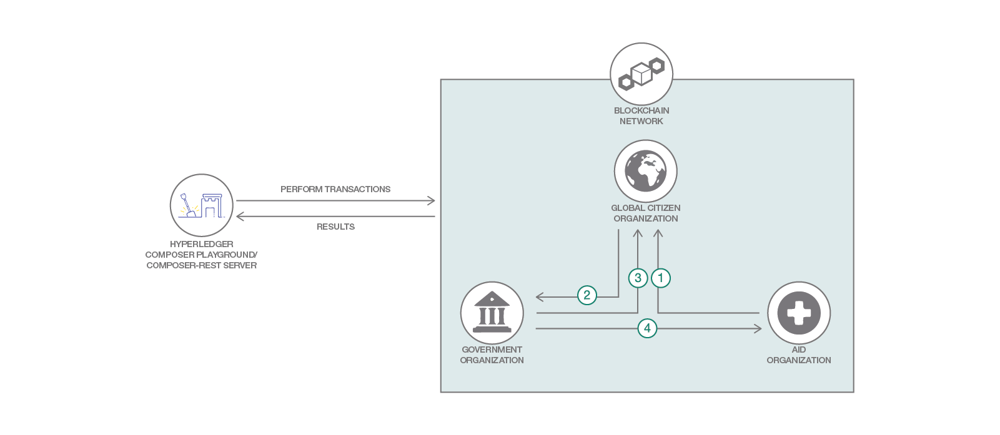

# ブロックチェーンを使用して寄付金をトラッキングする

### Hyperledger Composer Playground と Hyperledger Composer REST サーバーを使用して、IBM Blockchain Platform 上でブロックチェーン・ネットワークを作成、構成、操作する

English version: https://developer.ibm.com/patterns/track-donations-blockchain
  ソースコード: https://github.com/IBM/global-citizen

###### 最新の英語版コンテンツは上記URLを参照してください。
last_updated: 2018-04-18

 
_**Note:** This code pattern is currently being updated to focus on IBM Blockchain Platform V2.0._

## 概要

想像してください。極貧をはじめとする社会問題に対する慈善活動が尊ばれることだと確信を持って、あらゆる市民が慈善活動に参加する社会を。活動で集めた寄付金が、それを最も必要としている人々の手に実際に渡ることを。そして、すべての寄付金が実際に違いをもたらすことを。より透明性のあるシステムであれば、価値ある大義を人々がより進んで支持する動機になると思いませんか？いっそのこと、寄付する額を増やそうという気にさせるのはどうでしょう？

それには、このパターンに従って IBM Blockchain Platform 上でシンプルな 3 人のメンバーからなるネットワークを構築してください。このネットワーク上で、目的別の寄付と資金振替を政府が行い、援助団体に登録し、Global Citizen がそれを検証するという仕組みです。ネットワークを構築した後は、scikit-learn を使用して複数のモデルをトレーニングし、どのモデルが最も正確なオピオイド処方の予測を行うかを評価します。

## 説明

Global Citizen は、地球上で最も革新的な民間非営利団体の 1 つとして挙げられます。過去 10 年にわたり、Global Citizen メンバーのコミュニティーは 1300 万件を超える寄付を促し、とりわけ重要な目的に際立った貢献をしています。Global Citizen は慈善活動の説明責任において業界を先導し、人々の真の意見として成長し続けています。

現在 Global Citizen が最も重要な問題の 1 つとして捉えているのは、寄付金自体に関する透明性と説明責任です。私たちが社会として極貧や感染症などの非常に大きな問題を実際に解決しようとすることになれば、いずれの目的にしても、世界で最も影響力の大きい援助資金供与グループ、つまり連邦政府から約束された資金を集めなければなりません。

このような政府による資金供与に対して市民が求める透明性と説明責任を確実にするのが、ブロックチェーンです。IBM Blockchain と Global Citizen との協力により、開発者は今までに類を見ない寄付金トラッキング・アプリケーションを構築できるようになっています。しかも、その作業は一貫して IBM Blockchain Platform 上で行うことができます。

IBM Code のこの開発者パターンでは、シンプルな 3 人のメンバー (政府、AID.org、Global Citizen) からなるネットワークを IBM Blockchain Platform&trade; 上で構築する方法を説明します。このネットワーク上で、政府による目的別の寄付と資金振替、援助団体への登録、Global Citizen による検証を行うという仕組みです。このパターンを完了すると、IBM Blockchain Platform Starter Plan で Starter Kit、Hyperledger Composer Playground、および Hyperledger Composer REST サーバーを使用してネットワークを作成、構成、操作する方法を理解できます。

ぜひ挑戦してください！このコード・パターンと Global Citizen チャレンジについては、[Blockchane Innovator シリーズ](https://developer.ibm.com/tv/blockchain-innovators/)の週刊 Q&amp;A をご覧ください。

## フロー

1. 寄付案を作成し、レビュー対象として Global Citizen 組織に送信します。
1. 資金を募るために寄付案を政府機関に送信します。
1. 資金拠出の明細を反映して寄付案を更新します。
1. 寄付に従って資金を振替します。

## 手順

このパターンの詳細な手順については、[README](https://github.com/IBM/global-citizen/blob/master/README.md) を参照してください。手順の概要は以下のとおりです。

1. ビジネス・ネットワーク・アーカイブ (BNA) を生成します。
2. IBM Blockchain サービス・インスタンスを作成します。
3. シークレットを取得します。
4. 取得したシークレットを使用して、認証局から証明書を取得します。
5. admin-pub.pem ファイルを使用して、証明書をピアに追加します。
6. 管理ビジネス・ネットワーク・カードを作成します。
7. ランタイムをインストールしてネットワークを起動します。
8. 新しいビジネス・ネットワーク・カードを作成します。
9. ビジネス・ネットワークとやり取りします。
