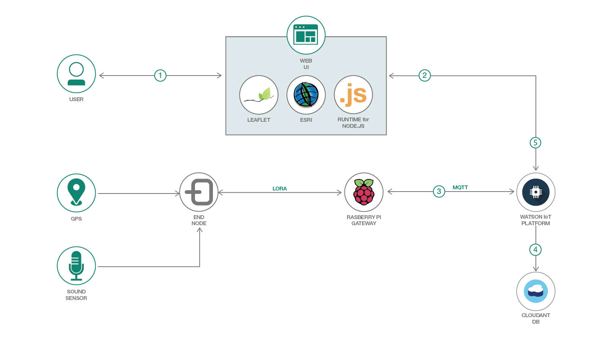

# LoRaWAN ネットワーキングを使用した長距離対応 IoT システムで資産を追跡し、センサー・データを視覚化するnetworking

### IoT センサー、Raspberry Pi ゲートウェイ、MQTT、Watslon IoT Platform を使用して資産とデバイス・データを追跡し、Leaflet と ArcGIS でデータを視覚化して地図上に表示する

English version: https://developer.ibm.com/patterns/tracking-assets-visualizing-sensor-data-lorawan-iot
  
ソースコード: https://github.com/IBM/iot-mapping

###### 最新の英語版コンテンツは上記URLを参照してください。
last_updated: 2018-11-02

 ## 概要

このコード・パターンでは、資産を追跡して、Watson IoT Platform からの着信データを Leaflet と ArcGIS を使用した地図アプリケーション上で視覚化する方法を説明します。

## 説明

このコード・パターンを完了すると、移動する資産を追跡する方法がわかるようになります。このコード・パターンで扱う「移動する資産」とは、配送トラック (あるいは配送トラック内の配送物) など、GPS モジュールを取り付けられるあらゆる IoT デバイスを指します。さらに、タグを付けた野生の動物を資産として扱うこともできます。このコード・パターンでは、接続された各種の IoT デバイスに関連付けられたセンサー・データを視覚化する方法も説明します。視覚化するセンサー・データに該当するのは、温度、音、大気質、湿度など、測定可能なあらゆる物理プロパティーです。

このパターンでは、センサー・データを収集するハードウェアがセットアップ済みであることを前提とします。セットアップの例については、コード・パターン「[LoRaWAN ネットワークを使用した長距離対応 IoT システムのハードウェア・プラットフォームをセットアップする](https://developer.ibm.com/jp/patterns/set-up-lorawan-iot-gateway-hardware/)」を参照してください。

このパターンを完了すると、以下の方法がわかるようになります。

* センサー・データと位置データを Watson IoT Platform にパブリッシュする
* 視覚化する履歴 CSV データセットをインポートする
* データを Cloudant データベース内で維持する
* IoT 資産を地図上に表示する

## フロー

1. ユーザーがマッピング UI または MQTT メッセージを使用してエンドノード (IoT デバイス) を登録します。ここでのエンドノードは、位置データとセンサー・データをパブリッシュできる、追跡可能な資産です。
1. Express バックエンドが、1 つ以上のエンドノードに対応する Watson IoT Platform チャネルにサブスクライブします。
1. エンドノードが継続的に、位置、時間、およびセンサー・データを格納した JSON オブジェクトを Watson IoT Platform にパブリッシュします。
1. Watson IoT Platform がデータを Cloudant DB に維持します。
1. マッピング UI が Leaflet を使用して、地図上のマーカー位置を更新します。

## 手順

詳細な手順については、[README](https://github.com/IBM/iot-mapping/blob/master/README.md) を参照してください。
