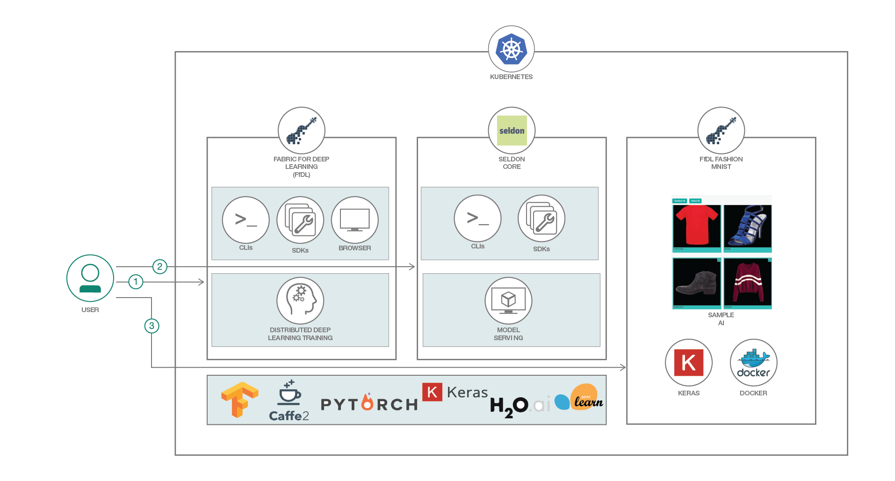

# ファッション関連のデータ・セットを使用してモデルをトレーニングする

### TensorFlow と Fabric for Deep Learning を利用し、Fashion MNIST モデルをトレーニングして Kubernetes 上にデプロイする

English version: https://developer.ibm.com/patterns/./train-a-model-on-fashion-dataset-using-tensorflow-with-ffdl
  ソースコード: https://github.com/IBM/FfDL/tree/master/demos/fashion-mnist-training

###### 最新の英語版コンテンツは上記URLを参照してください。
last_updated: 2019-03-28

 ## 概要

GPU を使用して構成された、Kubernetes クラスター上の IBM Fabric for Deep Learning (FfDL) を使用して、Fashion MNIST モデルをトレーニングする方法を学んでください。このコード・パターンでは、Keras で定義されている Fashion MNIST モデルを、TensorFlow と FfDL を使用してトレーニングし、Kubernetes GPU クラスター上にデプロイします。FfDL では Caffe、Torch、TensorFlow などの深層学習ライブラリーを使用して、Kubernetes 上の深層学習プラットフォームをスケーリングすることができます。このコード・パターンではさらに、Seldon を使用してモデルをラップした上でクラスターにデプロイする方法、モデルを使用するアプリを作成する方法を説明します。

## 説明

Fashion MNIST は、オリジナルの MNIST データ・セットをそのまま置き換えられるように意図されています。このデータ・セットは 60,000 個のトレーニング用サンプルと 10,000 個のテスト用サンプルからなり、各サンプルは各種衣類の 28 x 28 グレースケール画像です。Fashion MNIST データ・セットはオリジナルの MNIST よりも複雑なことから、より完全なベンチマーク・ツールとして役立ちます。

このコード・パターンでトレーニング対象とするモデルは、3 つの畳み込み層の後に 2 つの緻密層が続く CNN です。128 個のバッチ・サイズを使用して 30 エポックの間、ジョブを実行します。ジョブが完了すると、モデルは画像を入力として取り、その画像が特定のクラスに分類される信頼スコアの予測を返せる状態になります。

Web アプリは、アップロードされた画像を Web ページ上に表示して、予測された確信スコアが高い上位 3 つのクラスの名前をリストアップするように設計されています。ページ上には付随するワード・クラウドも表示され、ワードのサイズによって、画像のクラスの有力候補として上位にリストアップされているクラスの出現頻度を示します。

## フロー

1. ユーザーが FfDL インスタンスに対する Fashion MNIST モデル・トレーニング・ジョブを送信します。FfDL は Fashion MNIST モデルをトレーニングし、ジョブが完了するとモデル・ファイルを Object Storage に格納します。これにより、Object Storage は S3 に対応できるようになります。
1. モデルのトレーニングが完了したら、そのモデルに対応する Seldon をデプロイします。ユーザーは、トレーニング済みモデルを Object Storage から取得して、Seldon 上で Ambassador の動的 Ingress とともにモデルを処理する Seldon デプロイを作成します。
1. ユーザーが Web アプリケーションをコンテナー化して Kubernetes 上にデプロイします。これで、Web アプリケーションが Seldon 上でホストされている深層学習モデルを使用して、さまざまなファッションに関する予測を行えるようになります。

## 手順

このコード・パターンに取り組む準備はできましたか？アプリケーションを起動して使用する方法について詳しくは、[README](https://github.com/IBM/FfDL/blob/master/demos/fashion-mnist-training/README.md) を参照してください。
