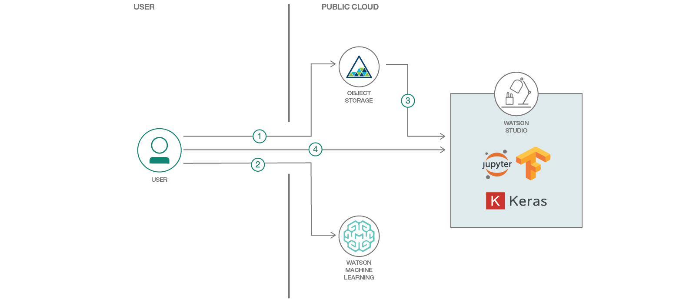

# 音声分類子をトレーニングして評価する

### 深層学習モデルをトレーニングして、Watson Machine Learning 上で埋め込み音声を分類する

English version: https://developer.ibm.com/patterns/train-and-evaluate-an-audio-classifier-using-keras-and-jupyter-notebook
  ソースコード: https://github.com/IBM/audioset-classification

###### 最新の英語版コンテンツは上記URLを参照してください。
last_updated: 2018-07-13

 ## 概要

この開発者コード・パターンでは、IBM の Deep Learning as a Service (DLaaS) プラットフォーム上 (Watson&trade; Machine Learning サービス) で埋め込み音声を分類できるように深層学習モデルをトレーニングし、IBM Watson Studio 上でそのモデルを使用して推測/評価を行う手順を説明します。

## 説明

例えば、ラベル付け/分類されていない音楽の膨大な集合があるとします。既存の音楽ジャンルでトレーニングされた分類子であれば、こうしたファイルを効率的に整理して、レコメンデーション・システムに取り込むことができます。あるいは、Google Home や Amazon Alexa などのデジタル・アシスタントを使用することも考えられます。これらのアシスタントはすでに優れた音声認識機能を備えていますが、十分にトレーニングされた分類子を使用すれば、音声や会話の枠にとどまらない拡張機能によって、さらにスマートなアシスタントにすることができます。

このコード・パターンで作成するモデルは、埋め込み音声を入力として使用し、527 の音声クラスについて、出力の確率/スコアを生成します。これらのクラスには、音声、音楽ジャンル、そして雨、雷、自動車といった自然環境音など、幅広い音が含まれています。音声クラスを網羅したリストについては、AudioSet Ontology を参照してください。このモデルは未処理の音声をそのまま受け入れるのではなく、10 秒間の埋め込み音声を受け入れます。未処理の音声の埋め込みベクトルは、VGGish モデルを使用して生成することができます。VGGish モデルは 1 秒間の未処理の音声をそれぞれ長さ 128 の埋め込み (ベクトル) に変換するため、分類子の入力としてのテンソルの形状は 10 x 128 になります。この概念を説明し、IBM Cloud プラットフォーム上の機能を明らかにするために、Google の AudioSet データを使用します。これなら、処理済みの埋め込み音声をそのまますぐに使用できます。このコード・パターンでは AudioSet データを使いますが、このモデルを使用して独自のカスタム音声分類子を作成し、独自の音声データでトレーニングすることもできます。

このコード・パターンを完了すると、以下の方法がわかるようになります。

* IBM Cloud の Object Storage バケットをセットアップし、トレーニング用データをクラウドにアップロードする
* Watson Machine Learning に深層学習モデルをアップロードしてトレーニングする
* Object Storage バケットを IBM Watson Studio に統合する
* IBM Watson Studio で Jupyter Notebooks を使用して、評価用データ・セットに対して推測を行う。

## フロー

1. トレーニング用ファイルを Object Storage にアップロードします。
1. Watson Machine Learning 上でトレーニングを実行します。
1. トレーニング済みモデルの重みを IBM Cloud 上の新しいバケットに転送して、IBM Watson Studio にリンクします。
1. Watson Studio 上で、接続された Jupyter Notebook をアップロードして実行し、推測を行います。

## 手順

このコード・パターンに取り組む準備はできましたか？アプリケーションを起動して使用する方法について詳しくは、[README](https://github.com/IBM/audioset-classification/blob/master/README.md) を参照してください。
