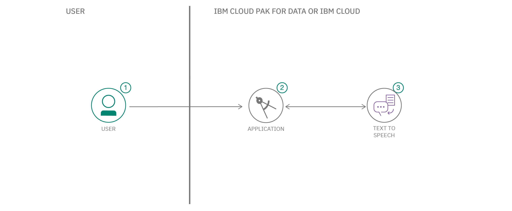

# 音声ファイルの音声をリアルタイムで文字に書き起こす

### 音声をテキストに書き起こす、多言語対応の Web アプリを作成する

English version: https://developer.ibm.com/patterns/transcribe-audio-in-real-time-or-from-an-audio-file
  ソースコード: https://github.com/IBM/speech-to-text-code-pattern

###### 最新の英語版コンテンツは上記URLを参照してください。
last_updated: 2020-07-09

 ## 概要

このコード・パターンでは Node.js と React コンポーネントを使用して、マイクまたはファイルから音声を取得し、その音声をテキストに書き起こす Web アプリを作成します。このアプリでテキスト書き起こしに利用するのは、複数の言語に対応するさまざまなモデルを使用できる IBM® Watson™ Speech to Text です。Watson Speech to Text は IBM Cloud 上で利用することも、IBM Cloud Pak&reg; for Data に用意されている Watson API Kit を介して利用することもできます。

## 説明

React コンポーネントと Node.js サーバーを使用して作成する、この音声テキスト変換 Web アプリは、マイクまたはファイルから音声入力を取得します。取得した音声は WebSocket 経由でストリーミングされて、リアルタイムのテキスト書き起こしに使用されます。表示されるテキストが発話に併せて更新される様子を確認できます。

Node.js サーバーは、サービスに対して資格情報を使って認証を行うために使用します。ユーザーの資格情報がブラウザーに送信されないよう、Web アプリはこのサーバーに一時的なトークンをリクエストします。

このアプリは入門ガイドとして意図されています。音声テキスト変換アプリは楽しみながら学べるサンプル・アプリです。ただし、学習の成果が実際に現れるのは、このコードを使用して音声入力を受け入れるように独自のアプリケーションを拡張したときです。

Watson Speech to Text は IBM Cloud 上で利用することも、IBM Cloud Pak for Data に用意されている Watson API Kit を介して利用することもできます。IBM Cloud Pak for Data を使用する場合、独自のプライベート・クラウド上や、Red Hat OpenShift が稼働する任意の場所に Watson Speech to Text サービス・インスタンスをプロビジョニングできます。

このコード・パターンを完了すると、以下の方法がわかるようになります。

* WebSocket を使用して音声を Watson Speech to Text サービスにストリーミングする
* Web アプリ内に Watson Speech to Text を統合する
* React コンポーネントと Node.js サーバーを使用する

## フロー

1. ローカル、IBM Cloud、または IBM Cloud Pak for Data で実行されているアプリケーションに、ユーザーが音声入力を渡します。
1. アプリケーションが WebSocket 接続を介して音声データを Watson Speech to Text サービスに送信します。
1. Watson Speech to Text サービスがデータを処理しながらデータから抽出したテキストとその他のメタデータに関する情報をアプリケーションに返します。すると、その情報がアプリケーションで表示されます。

## 手順

このパターンの詳細な手順については、[readme](https://github.com/IBM/speech-to-text-code-pattern/blob/master/README.md) ファイルを参照してください。手順の概要は以下のとおりです。

1. Watson Speech to Text サービス・インスタンスをプロビジョニングします。
1. サーバーをデプロイします。
1. Web アプリを使用します。
