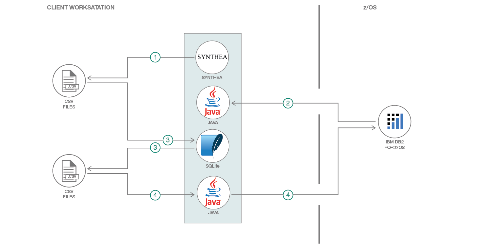

# ビッグデータの CSV ファイルを変換してデータベースにロードする

### ファイルを生成して SQLite というツールで変換し、zload という JDBC 関数を使用して Db2 for z/OS データベースにロードする

English version: https://developer.ibm.com/patterns/transform-load-big-data-csv-files-db2-zos-database
  ソースコード: https://github.com/IBM/summit-health-synthea/

###### 最新の英語版コンテンツは上記URLを参照してください。
last_updated:	2019-03-21

 
## 概要

このコード・パターンでは、一連の CSV ファイルを生成し、SQLite ツールで変換してから、zload という JDBC 関数を使用して Db2 for z/OS データベースにロードする方法を説明します。

## 説明

このコード・パターンは、クラウド・テクノロジーで z/OS システム上に保管されているデータにアクセスする方法を説明する、[医療関連のコード・パターン・サンプル・セット](https://developer.ibm.com/series/systems-example-health-series/)のうちの 1 つとして作成されたものです。患者の医療データを大量に生成して Db2 for z/OS データベースに取り込む方法を模索していたところ、こうした合成データを生成できる、Synthea というオープンソース・ツールを見つけました。

Synthea CSV ファイルは、Example Health アプリケーション内で使用するテーブル・スキーマに一致するように変換する必要があります。この変換を容易にする、SQLite というパブリック・ドメイン・ツールを見つけました。

最終的には、変換後の CSV ファイルを分散型ワークステーションから Db2 for z/OS データベースにロードする必要があります。そのために使用することにしたのは、zload という JDBC 関数です。zload は、Db2 for z/OS バージョン 12 以降で使用できます。

## フロー

シェル・スクリプト (`run.sh` または `run.bat`) で処理を進めます。主要な 4 つのステップは以下のとおりです。

1. Synthea ツールを呼び出します。このツールによって、合成された患者の医療データが含まれる一連の CSV ファイルを生成します。
1. JDBC プログラムを呼び出しまて、DB2 for z/OS データベース内の現在の最大患者数を確認します。
1. SQLite プログラムを呼び出して、Synthea によって生成された CSV ファイルを DB2 for z/OS データベースのスキーマと一致するように変換します。
1. JDBC プログラムを呼び出して、変換後の CSV ファイルを the DB2 for z/OS データベース内のテーブルにロードします。

## 手順

このパターンの詳しい手順については、[README](https://github.com/IBM/summit-health-synthea/blob/master/README.md) ファイルを参照してください。手順の概要は以下のとおりです。

1. 必要なツールをインストールします。
1. プロジェクトのクローンを作成してビルドします。
1. Synthea プロジェクトのクローンを作成してビルドします。
1. 必要に応じて、synthea/src/main/resources/synthea.properties 内のプロパティーを変更します。
1. DB2 for z/OS データベースを作成します。
1. スクリプトが DB2 for z/OS データベースに接続するために必要な環境変数をセットアップします。
1. 現行ディレクトリーを Synthea プロジェクトに設定して、プロジェクトからスクリプトを実行します。
