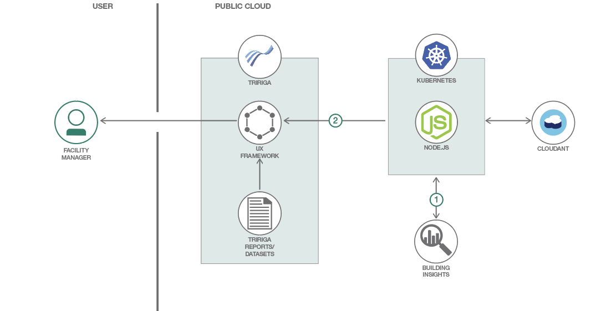

# TRIRIGA 認知アプリに Building Insights API を統合する

### TRIRIGA インスタンス内で Building Insights データを視覚化するカスタム・アプリケーションを作成する

English version: https://developer.ibm.com/patterns/./tririga-perceptive-app-w-building-insights
  ソースコード: https://github.com/IBM/tririga-occupancy

###### 最新の英語版コンテンツは上記URLを参照してください。
last_updated: 2019-02-15

 
_**注: このパターンは複合パターンの一部を構成するものです。** 複合パターンに含まれる 2 つのパターンは、それぞれスタンドアロン・アプリケーションとして使用できます。また、もう一方のコード・パターンの続きとして取り組むこともできます。複合パターンの構成要素は次のとおりです。_

* TRIRIGA 認知アプリに Building Insights API を統合する (このパターン)
* [TRIRIGA を使用して屋内測位システムを統合する](https://github.com/IBM/japan-technology/blob/main/Code-Patterns/indoor-positioning-mobile-app-iot-platform-tririga-building-insights)

## 概要

この開発者コード・パターンでは、TRIRIGA&reg; インスタンス内でカスタムの認知アプリケーションを作成する方法を説明します。

TRIRIGA は、不動産ポートフォリオ、建設プロジェクト、ワークプレース・アセットなどのデータを統合して企業の施設をモニタリングするためのシステムです。この TRIRIGA 機能をカスタム・ビジネス・ロジックによって拡張するために、このコード・パターンでは UX フレームワークを使用して「認知アプリ」をデプロイします。認知アプリとは、TRIRIGA UX フレームワークを使用して動的にビルドされるカスタム・アプリケーションのことです。認知アプリは MVC アーキテクチャーとして構造化されています。MVC の「ビュー」の部分は Polymer ライブラリーを使用して作成されることから、モジュール式の Web コンポーネントを組み合わせて簡単にインタラクティブなダッシュボードを作成できるようになっています。これらのコンポーネントが、グラフ、地図、画像などの視覚的要素になります。各コンポーネントをレンダリングするには、内部 TRIRIGA レポートからプルしたデータや、他のオファリング (Building Insights、Weather Company) の API によって取得したデータを使用できます。

このプロジェクトの依存関係 (Polymer、Web コンポーネント、UX フレームワーク) はすべて、TRIRIGA インスタンスにあらかじめインストールされています。サードパーティーの依存関係を追加するには、プロジェクト・コードと一緒にその依存関係をアップロードします。

## 説明

Building Insights サービスには、リアルタイムの占有状態/エネルギーのセンサー・データを取得する API が用意されているだけでなく、予測と例外に対応するアナリティクス・エンジンも備わっています。Building Insights サービスでは 1 時間あたりのエネルギー消費量、ビルディング内の各フロアーにいる人数などのセンサー・データを追跡できます。このコード・パターンのソリューションでは一例として、Building Insights のアナリティクス・エンジンとデータを TRIRIGA に統合します。この統合を実現するために、Node.js バックエンドを Kubernetes 上にデプロイし、利用可能な API を REST で定期的に呼び出します。取得したデータは Cloudant&reg; データベース内にキャッシュします。

このコード・パターンをひと通り完了すると、以下の方法がわかるようになります。

* カスタマイズした Polymer アプリケーションを設計し、TRIRIGA インスタンスに公開する
* Building Insights API を介して占有状態とエネルギーのデータをプルする
* 履歴データを Cloudant&reg; データベース内に維持する

## フロー

1. Node.js バックエンドが 1 時間ごとに Building Insights API リクエストを行って更新データセットを取得し、特定の値を Cloudant データベース内に維持します。こうして構築されていく 1 時間ごとの時系列データセットを使用して、カスタム・アナリティクス・モデル/グラフを作成することができます。
2. カスタム TRIRIGA アプリが Node.js バックエンドからフォーマット化されたセンサー・データをプルし、グラフと表をレンダリングします。

## 手順

手順に取り組む準備はできましたか？詳細な手順については、[README](https://github.com/IBM/tririga-occupancy/blob/master/README.md) ファイルを参照してください。
