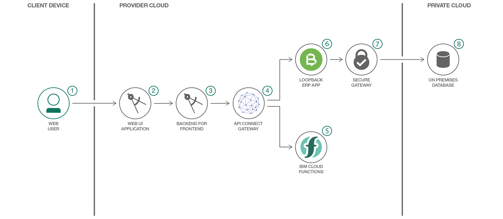

# API を使用してエンタープライズ・データの力を解き放つ

### LoopBack を使用してエンタープライズ・データ用の API を作成して公開する

English version: https://developer.ibm.com/patterns/unlock-enterprise-data-using-apis
 ソースコード: https://github.com/ibm/acme-freight

###### 最新の英語版コンテンツは上記URLを参照してください。
last_updated: 2018-07-01

 
## 概要

LoopBack と API Connect を利用して、API を介して既存のエンタープライズ資産を利用できるようにする方法を学んでください。このコード・パターンでは、Acme Freight という架空のロジスティクス会社が、LoopBack を使用してエンタープライズ・リソース・プランニング (ERP) システム内に保管されている資産を公開します。その上で、API Connect 内の単一のインターフェース内部で管理されているマイクロサービス・アーキテクチャーを使用して、公開された資産を新規および既存のアプリケーションに安全に配信します。

## 説明

Acme Freight という架空のロジスティクス会社では、[Logistics Wizard](https://github.com/IBM-Cloud/logistics-wizard) というアプリケーションを使用して資産の一部を管理しています。このアプリケーションは、3 つの Cloud Foundry アプリケーションと複数の OpenWhisk アクションを含む、複数のマイクロサービスで構成されています (Acme Freight とサーバーレスの詳細については、開発者向けコード・パターン「[Make apps smarter with serverless](https://developer.ibm.com/patterns/make-apps-smarter-with-serverless/)」を参照してください)。

Acme Freight では、新規および既存のアプリケーションとデータ用の API を迅速に作成して公開するために設計された、LoopBack というオープンソースの Node.js フレームワークを使用することにしました。LoopBack を使用すれば、Acme Freight の既存の ERP システムに統合するアプリケーションを作成できます。さらに、API Ccnnect を使用することで、管理された API を介してデータを公開できます。

LoopBack を使用すると、簡単に CRUD API を作成して既存のデータ・ソースから公開することができます。簡単な LoopBack 入門として、[このリンク先の動画チュートリアル](https://developer.ibm.com/apiconnect/2017/03/09/loopback-in-5-minutes/)を見てください。このチュートリアルでは、既存の MongoDB データ・ストアから 5 分で API を作成する方法を説明しています。

## フロー

1. Web ユーザーが配送の進捗と気象条件をモニターします。
1. フロントエンドのアプリケーションが Web ユーザー・インターフェースを提供します。
1. バックエンドのアプリケーションがフロントエンドとシステム・サービス間の API 呼び出しを管理します。
1. API Connect は、バックエンドの各種マイクロサービスへのアクセスを単純化するセキュアな API を提供します。
1. IBM Cloud Functions が小売店周辺の気象条件をモニターし、他の配送に関する推奨を提示します。
1. Enterprise Resource Planning (ERP) アプリケーションがエンタープライズ・リソース (製品、配送センター、小売業者、配送品など) を公開して、アクセスを管理します。
1. Secure Gateway サービスを利用して、オンプレミスまたは外部クラウドのデータへのアクセスを許可します。
1. オンプレミス・アプリケーションがエンタープライズ・リソースをセキュアに保管します。

## 手順

このコード・パターンに取り組む準備はできましたか？アプリケーションを起動して使用する方法について詳しくは、[README](https://github.com/IBM/acme-freight/blob/master/README.md) ファイルを参照してください。
