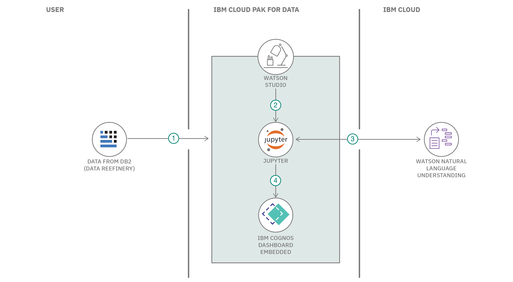

# 先進的な NLU を使用して販売業者の質を見極める

### Watson Natural Language Understanding を利用してカスタマー・レビューに込められた感情を分析する方法を学ぶ

English version: https://developer.ibm.com/patterns/use-advanced-nlp-to-analyze-customers-reviews
  ソースコード: https://github.com/IBM/customer-sentiment-on-seller-quality-nlu-cp4d

###### 最新の英語版コンテンツは上記URLを参照してください。
last_updated: 2020-03-25

 
## 概要

このコード・パターンに従うには、データ精製の基本知識が必要です。また、このパターンではチュートリアル「[Collect, cleanse, and enhance your data](https://developer.ibm.com/tutorials/collect-cleanse-and-enhance-your-data)」に従って作成したデータセットを使用します。そのため、このコード・パターンを開始する前に上述のチュートリアルを完了してください。

どの e-コマース Web サイトでも、商品の販売者は格付け (0 ～ 5 つ星) の対象となっています。顧客は購入した商品を基に、その販売者を星の数で評価するという仕組みです。顧客はこうした販売者に対する評価を考慮して、販売者に関するある程度の洞察を得ることができます。そしてその洞察に基づいて、特定の販売者から商品を購入するかどうかを判断できます。このコード・パターンでは、レビューの感情分析などでさらに多くのパラメーターを分析し、洞察に溢れた、販売者に対する評価を導き出します。

## 説明

e-コマース Web サイトの増加により、顧客満足度が e-コマース・ビジネスのあらゆる側面に影響を与えるようになっています。所定の販売者が販売しているどの商品でも、2 つの主要なメトリックを使用すれば、顧客満足度を測定することができます。

* 商品について顧客が評価した格付けの平均
* 販売者から提供された製品に対する顧客の感情を表すレビュー

このコード・パターンでは、より洞察に溢れた販売者格付けのキュレーションを行うために、商品に関するレビューを抽出し、Watson Natural Language Understanding を利用してレビューに込められた感情を分析し、スコアを算出します。このスコアが、所定の商品の配送遅延に照らし合わされることになります。そして最後に、0 ～ 5 の販売者品質格付けを導き出します。

このコード・パターンを完了すると、以下の方法がわかるようになります。

* 高度な NLP を使用してテキストを分析し、コンテンツからセンチメント、感情、関係などのメタデータを抽出する
* Jupyter Notebook で、小さなコードを実行してデータを処理し、直ちに結果を表示する
* Data Refinery を利用して、機械学習タスクで使用するトレーニング・データを準備する
* インタラクティブなダッシュボードを作成し、Watson Embedded Dashboard を利用してリアルタイムでデータから直接グラフを生成する

## フロー

1. Db2 内の精製されたデータをロードできるよう、IBM Cloud Pak for Data または IBM Cloud 内の IBM Watson Studio プロジェクトへの接続を作成します。
1. IBM Db2 接続によってデータセットを読み取るように Jupyter Notebook をセットアップします。
1. Jupyter Notebook で、IBM Cloud Pak for Data または IBM Cloud 上の Watson Natural Language Understanding サービスを利用して、販売者の格付けを計算するアルゴリズムを実行します。
1. データから引き出した洞察を、IBM Cloud Pak for Data または IBM Cloud 上の Watson Embedded Dashboard を利用して視覚化します。

## 手順

詳細な手順については、[README](https://github.com/IBM/customer-sentiment-on-seller-quality-nlu-cp4d/blob/master/README.md) ファイルを参照してください。手順の概要は以下のとおりです。

1. データセットをダウンロードします。
1. Watson Natural Language Understanding サービス・インスタンスを作成します。
1. プロジェクトを作成します。
1. Db2 接続をプロジェクトに追加します。
1. Jupyter Notebook を準備して実行します。
1. Watson Embedded Dashboard をプロジェクトに追加します。
1. ダッシュボードを視覚化します。
