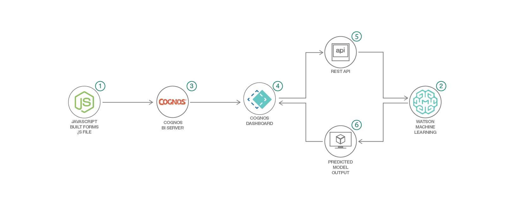

# Cognos ダッシュボードから Watson Machine Learning を利用して、通信会社の顧客離れをリアルタイムで予測する

### 機械学習モデルを動的に作成して、リアルタイムのダッシュボードを作成する

English version: https://developer.ibm.com/patterns/use-cognos-custom-controls-to-display-real-time-ml-model-scores
  ソースコード: https://github.com/IBM/invoke-wml-using-cognos-custom-control/

###### 最新の英語版コンテンツは上記URLを参照してください。
last_updated: 2018-10-04

 ## 概要

Cognos 11 はプロのレポート作成者向けとして位置付けられているだけでなく、特にパワー・ユーザーとデータ・サイエンティスト向けに、Watson のような自然言語検索機能やチャートの自動提案機能などを備えています。カスタム・コントロールをはじめとする最新の機能を駆使し、Cognos アプリケーションからクラウド・ホスト型サービスとやり取りまたは通信することも可能です。

このコード・パターンでは、カスタム・コントロール・ウィジェットを作成し、そのウィジェットを Cognos ダッシュボード内に統合してリアルタイムの結果を表示する方法を説明します。この例では、JavaScript を使用して、内部で Watson Machine Learning API を介してモデルを呼び出します。この例で使用するデータセットは、通信会社のサンプル顧客データです。このデータを使用して、顧客離れを左右する行動を予測します。また、関連するすべての顧客データを分析して、顧客維持に焦点を絞ったプログラムを開発することもできます。

## 説明

Cognos ダッシュボードから機械学習モデルの出力をリアルタイムで確認する必要がある場合、外部メカニズムによって、モデルを呼び出し、パラメーターを渡し、スコアをデータベースに書き込まなければなりません。Cognos はデータベースから最新のスコアを読み取ってダッシュボードに表示します。けれども機械学習モデルの出力を表示するプロセスは厄介であり、表示される出力はリアルタイムのものでもありません。

このコード・パターンでは、IBM クラウド上でホストされている Watson Machine Learning モデルを IBM Cognos ダッシュボードから呼び出す方法を説明します。一部の Cognos ユーザーにとっては、機械学習モデルによるスコア/予測結果を Cognos コンソール内から動的に取得することが要件となります。けれども古いバージョンの Cognos アプリケーションには、機械学習モデルを直接呼び出すための単純なソリューションや方法はありません。一方、最新バージョンのリリース (このコード・パターンではデモ用に Cognos 11.0.11 を使用しています) では、JavaScript/D3 チャートを使用して作成したカスタム・ウィジェットから、クラウド・プラットフォーム上でホストされているモデルを呼び出せるようになっています。カスタム・ウィジェットにより、Cognos ダッシュボードから洞察を得られるだけでなく、ダッシュボードにタブを追加するか、同じアプリケーション内に別のダッシュボードを組み込んで、モデルの必須パラメーターを入力して予測結果の出力を瞬時に表示することもできます。

このコード・パターンを完了すると、以下の方法がわかるようになります。

* Cognos カスタム・コントロールを使用してリアルタイム・ダッシュボードを作成する
* 外部 JavaScript を Cognos レポートにインポートする
* クラウド上でホストされている機械学習モデルを、Cognos から REST API を使用して呼び出す

## フロー

1. JavaScript を使用してカスタム・コントロール・ウィジェットを作成し、Cognos の webcontent フォルダーに格納します。
1. Watson Machine Learning モデルを作成し、Web サービスとしてデプロイします。
1. Web ブラウザー上で Cognos を起動します。
1. カスタム・コントロールを使用して Cognos レポートを作成し、作成したレポートを実行します。
1. レポートから、入力パラメーターを基に WML モデルが呼び出されます。
1. WML モデルから出力が取得されて Cognos ダッシュボード上に表示されます。リアルタイムの WML モデル出力でダッシュボードが更新されます。

## 手順

詳細な手順については、[README](https://github.com/IBM/invoke-wml-using-cognos-custom-control/blob/master/README.md) ファイルを参照してください。手順の概要は以下のとおりです。

1. Watson Studio で Watson Machine Learning モデルを作成してデプロイします。
1. WML 資格情報とモデル API コードを取得します。
1. Node アプリケーションを介して WML モデルをホストします。
1. カスタム・コントロール・ウィジェットを作成します。
1. Cognos レポートを作成し、カスタム・コントロール・ウィジェットをインポートします。
1. レポートを実行して結果を分析します。
