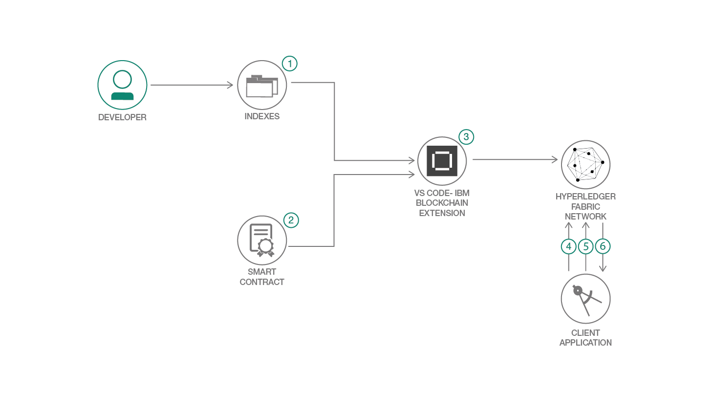

# Hyperledger Fabric 1.4 のクエリー機能を探る

### 特定のフィールドのすべての値とそれぞれの値が含まれているドキュメントを格納するリファレンスを作成する

English version: https://developer.ibm.com/patterns/using-query-capability-with-blockchain-with-ibp-vscode-extension-for-think
  ソースコード: https://github.com/IBM/queryPattern

###### 最新の英語版コンテンツは上記URLを参照してください。
last_updated: 2019-03-27

 ## 概要

この開発者コード・パターンでは、Hyperledger Fabric 内のピアのワールド・ステートに関するクエリーを実行する方法を見ていきます。データベースとして実装されるワールド・ステートには、ネットワークのすべての履歴 (発行されたトランザクションなど) が格納されます。ワールド・ステートに関するクエリーを実行すると、ネットワーク内の資産の現状を確認するのに役立ちます。このコード・パターンでは例として、Hyperledger Fabric 1.4 のドキュメントに記載されている商業手形の使用ケースを用い、CouchDB ワールド・ステート・データベースのインデックスを作成するプロセスに従います。インデックスを作成した後は、スマート・コントラクトを更新し、新しく作成したインデックスを使用してワールド・ステートのクエリーを実行するロジックを組み込みます。そしてワールド・ステートに資産を取り込む 100 件のトランザクションをシミュレーションした後、Node.js SDK を使用していくつかのクエリーを実行し、返された結果を確認します。

## 説明

ワールド・ステートのクエリーを実行する方法を説明する前に、データベース・インデックスとは何か、そしてインデックスがクエリーに役立つ理由を説明しておかなければなりません。

インデックスについて理解するために、ワールド・ステートのクエリー実行によって行われる動作を見ていきましょう。例えば、ユーザー「Bob」が所有するすべての資産を調べるとします。このクエリーを実行すると、データベースの内部に保管されている JSON ドキュメントが 1 つずつ検索され、ユーザーの値が bob と一致するすべてのドキュメントが返されます。これは大したことに思えないかもしれませんが、データベース内に数百万件のドキュメントが保管されている場合を考えてください。その場合、データベース内にあるこれらすべてのドキュメントを検索しなければならないため、クエリーから結果が返されるまでに相当な時間がかかることになります。インデックスを使用する場合、特定のフィールドのすべての値とそれぞれの値が含まれているドキュメントを格納するリファレンスを作成します。つまり、データベース内のすべてのドキュメントを検索するのではなく、インデックスでユーザー「bob」のオカレンスを検索し、そこで参照されているドキュメントが返されることになります。ここで重要な点は、ドキュメントがデータベースに追加されるたびに、インデックスを更新しなければならないことです。一般に CouchDB ではクエリーを受信した時点でインデックスが更新されますが、Hyperledger Fabric の場合、インデックスの更新は新しいブロックがコミットされるたびに行われるため、クエリーの実行時間が短縮されます。これは、インデックス・ウォーミングと呼ばれるプロセスです。

## フロー

1. 開発者がクエリー・インデックスを作成します。

2. 開発者がクエリー・ロジックをスマート・コントラクトに追加します。

3. IBM Blockchain の VS Code 拡張機能を使用して、スマート・コントラクトとインデックスをパッケージ化し、そのパッケージをローカル Hyperledger Fabric ネットワークにインストールしてインスタンス化します。

4. ネットワーク上で 100 件のトランザクションをシミュレーションしてワールド・ステートにデータを取り込みます。

5. Node.js クライアント・アプリケーションが Hyperledger Fabric SDK を使用して承認側ノードにクエリーを送信します。これにより、クエリーのトランザクションが評価されます。

6. クエリーの結果が返されます。

## 手順

このパターンに取り組む準備はできましたか？詳細な手順については、[README](https://github.com/IBM/queryPattern/blob/master/README.md) を参照してください。
