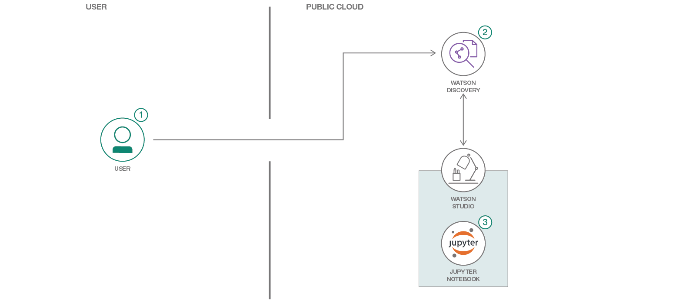

# Watson Studio を使用して、Watson Discovery News から返されたクエリー結果を視覚化する

### Watson Studio を使用して Watson Discovery News から返されたクエリー結果を視覚化し、ビットコインに対する感情を把握するプロセス全体を紹介します

English version: https://developer.ibm.com/patterns/using-sentiment-analysis-to-understand-bitcoin-market
  ソースコード: 'https://github.com/IBM/crypto-discovery-news-sentiment-analysis'

###### 最新の英語版コンテンツは上記URLを参照してください。
last_updated: '2018-09-25'

 
## 概要

ニュース記事を基に、特定の事象に対する全体的な感情を把握することは可能でしょうか？その答えは、イエスです。Watson Studio、Watson Discovery、Watson Discovery News などの Watson サービスを利用すれば、非構造化データから洞察を引き出し、その結果に対してクエリーを実行できます。このコード・パターンでは、Watson Studio を使用して Watson Discovery News から返されたクエリー結果を視覚化する方法を説明します。

## 説明

Watson Discovery News は、Watson が自動的にニュース記事をドキュメントの集合に追加して、ユーザーがクエリーできるようにするサービスです。ニュース記事は毎日追加されます。つまり嬉しいことに、ソースから自分でニュース記事を収集するという大変な仕事を省いて、データから価値を引き出す仕事だけに集中することができます。このデータを使用するのに、高度なスクレイパーを作成して独自の Elasticsearch (または別の検索エンジン) をデプロイする必要はありません。独力でこのデータを使用できます。データ・サイエンスを使用し、視覚化を作成すれば、データの異常を明らかにして、重要なイベントの発生時にアラートを起動することができます。

このコード・パターンでは、Watson Studio と Watson Discovery News を利用して、ビットコインに関する記事をクエリーし、記事に対する感情を視覚化します。このパターンは、Watson Discovery を独自のアプリケーションに統合する際のベースラインとなります。

このコード・パターンをひととおり完了すると、以下の方法がわかるようになります。

* データ・サイエンス・プロジェクトに Watson Studio を使用する
* Watson Discovery News を使用してデータ・パイプラインを作成する
* トピックに対する感情のデータを分析する

## フロー

1. IBM Cloud に登録します。
1. Watson Discovery サービス・インスタンスを作成します。
1. Jupyter Notebook を使用して新しい Watson Studio プロジェクトを作成します。
1. 出力を視覚化します。

## 手順

このコード・パターンに取り組む準備はできましたか？アプリケーションを起動して使用する方法について詳しくは、[README](https://github.com/IBM/crypto-discovery-news-sentiment-analysis/blob/master/README.md) を参照してください。
