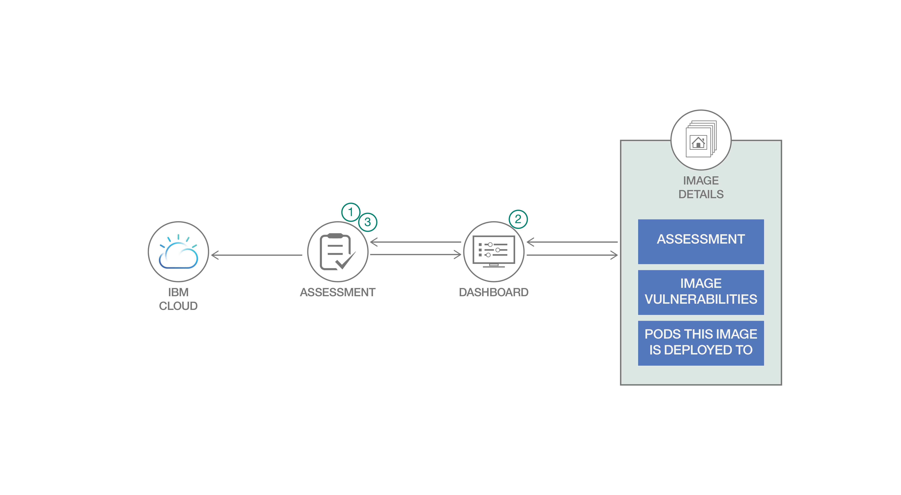

# コンテナー・イメージ内に潜む脆弱性を検出して対処する

### API を使用して、コンテナーをスキャンしたデータを取得してダッシュボード内に表示し、スキャン結果をリアルタイムで処理する

English version: https://developer.ibm.com/patterns/using-vulnerability-advisor-containers
  ソースコード: https://github.com/IBM/VulnerabilityAdvisorDashboard

###### 最新の英語版コンテンツは上記URLを参照してください。
last_updated: 2019-08-06

 
この数年にわたる開発者向けツールとテクノロジーのイノベーションにより、ソリューションを概念化する際の選択肢が増えました。けれども、ツール・スタックが進化したとは言え、攻撃ベクトルを制限するといったセキュア・エンジニアリングの手法を意識しなければならないことに変わりはありません。意識するのは簡単なことのように聞こえますが、実際のところ、本番レベルのソフトウェアや最新型のあらゆるソフトウェアでは、以下の要素のどれもが攻撃ベクトルになり得ます。

* オペレーティング・システム (OS) の脆弱性: パッチが適用されていないライブラリーや OS コンポーネント、脆弱なカーネル・バージョン、脆弱なネットワーク・ライブラリー・バージョン。
* 構成の脆弱性: 非セキュアな OS 設定 (パスワードやログインなど) ならびに、root の使用が許可される、IP が許可リストに登録されていない、セキュア・シェル (SSH) が欠けているなどのネットワーク構成。
* アプリケーションの弱点: XSS、バッファー・オーバーフロー、SQL インジェクション。

コンテナー化によって、再利用可能なソフトウェアを繰り返し可能な形で開発する方法は劇的に改善されました。それでも、コンテナーのユーザーが上記の脅威にさらされないようにする方法に関して、共通の懸念がまだ存在しています。コンテナー化に伴って、この懸念は増幅されます。それは、コンテナーのあらゆるレイヤーがたった 1 つのリンクで結ばれるためです。コンテナーを生成すると、そのコンテナーを別のコンテナーのベースとして使用することができます。そうなると、コンテナーのレイヤーを結ぶすべてのリンクが攻撃ベクトルと脅威にさらされることになります。

このコード・パターンに付属のサンプル・コードで、IBM Cloud Container Registry 内に組み込まれている脆弱性アドバイザーのアプリケーション・プログラミング・インターフェース (API) を利用する方法を学んでください。脆弱性アドバイザーは、コンテナーのセキュリティーを確保するための強力なサービスです。このサービスを利用すると、現在実行中のイメージを含め、レジストリー内の Docker イメージをスキャンして、イメージのレイヤーおよび構成の脆弱性を検出できます。このコード・パターンの目標は、この脆弱性のデータを有用で実用的なものにすることです。

## 説明

このコード・パターンでは、Vulnerability Advisor API を使用してコンテナーのスキャン結果をリアルタイムで取得し、このデータを処理する方法を説明します。さらに、Vulnerability Advisor API を利用したサンプルのダッシュボード・アプリケーションに処理後の情報を表示して、脆弱性アドバイザー・サービスから取得したデータを基に、これらの API を操作してアクションを実行する方法も説明します。

[脆弱性アドバイザーのドキュメント](https://cloud.ibm.com/docs/services/Registry?topic=va-va_index#va_index)を参照すると、全般的な情報を入手できます。Vulnerability Advisor API の使用方法について詳しくは、[この API ドキュメント](https://cloud.ibm.com/apidocs/container-registry/va)をご覧ください。

コンテナーを IBM Cloud Container Registry サービスにロードすると、脆弱性アドバイザーによって自動的にコンテナーがスキャンされます (必要に応じて、API を使用して脆弱性評価を開始することもできます)。スキャンによるデータを取得するには、いくつかの方法があります。

Vulnerability Advisor API から取得できるアカウント・データは、IBM Cloud アカウントに関する極めて重要な情報を提供します。コンテナー・レジストリーにイメージをアップロードするためには、IBM Cloud アカウントを使用します。Vulnerability Advisor API では、アカウント・レベルのビューで、アカウントごとに集約された評価を確認できます。このビューは、アカウントに属するすべてのイメージをグループ化して一覧表示するのに役立ちます。また、イメージごとにダッシュボードへのリンクを作成して、ユーザーがリンクを選択すると、その特定のイメージに関する詳細情報が表示されるようにすることもできます。

`GET /va/api/v3/report/account` API を使用すると、アカウントに属するすべてのリソースに関する脆弱性評価を取得できます。この API から返されるデータには、複数の評価 (アカウントに属するコンテナーまたはイメージごとに 1 つの評価) が含まれます。この API から返される脆弱性評価には以下のデータが含まれます。

* 識別された構成の問題 (是正措置が必要な問題など) とその説明、各問題が定義済みのポリシーで免除対象となっているかどうか、および問題が識別されることになった、失敗したチェックのタイプ。
* 評価の ID。
* イメージのスキャンが実行された時間を示すタイム・スタンプ。
* イメージで識別された共通脆弱性識別子 (CVE) のリスト。このリストには、免除対象の脆弱性であるかどうか、CVE ID、セキュリティー通知に関する情報、脆弱性の要約が記載されます。
* 脆弱性、識別された構成の問題、適用される免除に基づく、イメージの全体的な状況。

上記のうち、サンプル・コードではダッシュボード内に ID、スキャンのタイム・スタンプ、全体的な状況を表示します。

`report/account` API と同様に、`GET /va/api/v3/report/account/status` を使用すると、アカウントに属するイメージごとに累積された評価結果を取得できます。これらの結果が、サンプルのダッシュボード・アプリに取り込まれます。評価結果には、以下の問題の数が示されます。

* 検出された問題の数
* 検出された免除対象の問題の数
* 脆弱性の数
* 免除対象の脆弱性の数
* 構成に関する問題の数
* 構成に関する免除対象の問題の数

Vulnerability Advisor API から取得した詳細な情報を基に、イメージとその使用状況について理解を深めることができます。このデータを使用して、アプリのユーザーはダッシュボードで選択したイメ―ジを詳しく調べることができます。

`GET /va/api/v3/exemptions/image/{resource}` を使用すると、イメージに適用されるすべての免除のリストを取得できます。脆弱性アドバイザーによるスキャンでは、免除対象の脆弱性を検出できます。これらの脆弱性は、仮説に基づいた例として適用外であるか、重要でないため、評価のステータスには影響しません。免除を作成するには 2 つの方法があります。1 つは、特定のイメージに適用される免除 (この API によって返されます)、もう 1 つはアカウントに属するすべてのイメージに適用される免除 (次の API 呼び出しを参照) です。

`GET /va/api/v3/exempt/image` API を使用すると、アカウントに属するすべてのイメージに対して適用される、アカウント・レベルで定義されたすべての免除のリストを取得できます。返されるデータには、以下が含まれます。

* アカウント ID
* 問題 ID
* 問題のタイプ

`GET /va/api/v3/report/image/{name}` を使用すると、指定したイメージの脆弱性評価を取得できます。返されるデータは上記のアカウント脆弱性評価と同様ですが、この API は特定のイメージを対象とするため、返される脆弱性評価は 1 つのイメージに対するものだけです。`GET /va/api/v3/report/image/{name}` と `GET /va/api/v3/report/account` は、同じ評価データを共有します。

`GET /va/api/v3/report/image/status/{name}` から返されるデータは、アカウント・レベルで集約された脆弱性状況と同様ですが、この API のスコープは、API 呼び出しで指定されたイメージです。この API からは、`GET /va/api/v3/report/account/status` から取得する評価データと同様のデータが返されます。つまり、この API で返されるのも 1 行のみの集約データです。

`GET /va/api/v3/report/image/{name}/containers` を使用すると、インスタンス化されたコンテナーとして実行されているイメージのリストを取得できます。これらのイメージは、アカウントに属し、アカウントによって作成されたものです。この呼び出しで返されるデータを基に、コンテナー・イメージのポッドとランタイムの場所を特定できます。

* 祖先の名前
* 祖先のタイプ
* クラスター
* ID
* 名前
* ポッド

このコード・パターンで使用する、IBM Cloud 内の API は、IBM の認証サービスで保護されています。したがって、これらの API を使用するには、入力パラメーターとしてアカウント ID と認証トークンを渡す必要があります。サンプル・コードではサンプル・アカウント ID を使って、`ibmcloud iam oauth-tokens` を使用したベアラー・トークンを取得していますが、本番環境ではこれよりも堅牢なソリューションを実装してください。

## フロー

サンプルのダッシュボード・アプリでは、いくつかのコンテナーがコンテナー・レジストリーにサブミットされていること、そして脆弱性アドバイザーの評価が完了していることを前提としています。

1. ダッシュボードは 2 つの部分からなります。1 つはメイン・ダッシュボードで、ここから Vulnerability Advisor API (`/va/api/v3/report/account` と `/va/api/v3/report/account/status`) を呼び出します。

2. この 2 つの API は、アカウントに属するすべてのコンテナーの状況と脆弱性を集約したデータを返します。ダッシュボードは、返されたリストに含まれる各イメージを繰り返し処理し、対応する情報を表示します。各イメージは、コンテナーの詳細ページへのリンクとして表されます。  

3. アプリのユーザーがダッシュボードでイメージのリンクを選択すると、ユーザーは選択したコンテナーに関する詳細ページにリダイレクトされます。詳細ページには、以下の API 呼び出しを使用して取得した情報が表示されます。

    * `/va/api/v3/exemptions/image/{resource}`
    * `/va/api/v3/exempt/image`
    * `/va/api/v3/report/image/{name}`
    * `/va/api/v3/report/image/status/{name}`
    * `/va/api/v3/report/image/{name}/containers`

## 手順

このコード・パターンに取り組む準備はできましたか？詳細な手順については、[README ファイル](https://github.com/IBM/VulnerabilityAdvisorDashboard/blob/master/README.md)を参照してください。手順の概要は以下のとおりです。

1. リポジトリーのクローンを作成します。
2. Oauth トークンを取得してログインします。
3. 追加の構成手順を行います。
4. アプリを実行し、カレント・ディレクトリーを最上位ディレクトリーに変更して `node app.js` を実行します。
