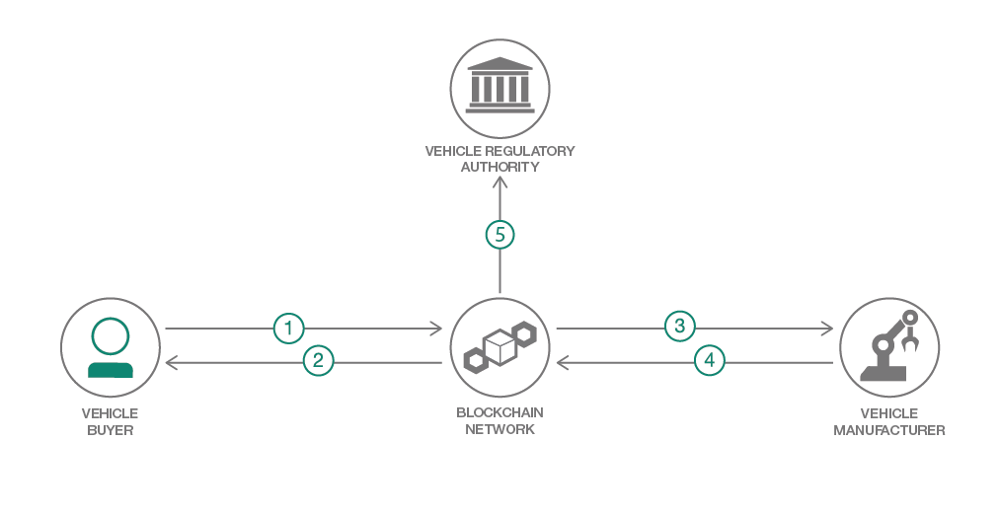

# ブロックチェーンを使用して自動車製造プロセスを効率化する

### Hyperledger Composer API を使用して自動車製造プログラムと Node.js Web アプリを作成する

English version: https://developer.ibm.com/patterns/vehicle-demo-using-starter-plan
ソースコード: https://github.com/IBM-Blockchain/vehicle-manufacture

###### 最新の英語版コンテンツは上記URLを参照してください。
last_updated: 2018-09-20

 
## 概要

このコード・パターンでは、IBM Blockchain Platform の利点を明らかにするために、このプラットフォームを使用してアプリケーションを開発する方法を説明します。自動車の購入および製造というシナリオに IBM Blockchain Platform を適用する利点は、自動車の購入者、製造業者、および規制担当者それぞれに応じたビューを表示できることです。

## 説明

想像してください。あなたは自動車の製造業者で、最近、理想どおりのコンセプト・カーを完成させたところです。その自動車の販売を開始したところ、何十万件もの注文が押し寄せてきました。大量の注文に対応するためには、自動車の製造および組立工程を自動的に管理できる方法が必要です。しかも、規制機関の基準に準拠するため、そして監査に備えるために、会社のビジネス取引のすべてを記録する必要もあります。この場合、ブロックチェーンを使用して統制規則をスマート・コントラクト内のコードに統合すれば、必要な要件を満たしていることが確実になり、監査にもブロックチェーンの記録で対応できるようになります。

このコード・パターンでは、Hyperledger Composer を使用してブロックチェーン対応の自動車製造プログラムを作成する方法を説明し、Node.js Web アプリケーションを使って、そのプログラムをデモンストレーションします。このアプリケーションで紹介するのは、自動車の購入および製造のシナリオです。

Node.js Web アプリケーションには 3 つのダッシュボードがあります。1 つ目のダッシュボードは自動車の**購入者**向けのものです。このダッシュボードでは、購入者が自動車のカタログを表示して、選択した自動車をカスタマイズしたり、自動車を購入したりできます。2 つ目のダッシュボードでは、**製造業者**が自動車の購入申し込みを表示し、自動車製造工程を追跡したり、配送状況の詳細を確認したりできます。3 つ目のダッシュボードは規制担当者が使用します。**規制担当者**はこのダッシュボードで自動車の製造プロセスを監督し、ブロックチェーンに記録されたすべてのトランザクションのリストを表示できます。

自動車の組立工程でシャーシなどの部品と内装の組み立て/取り付けが行われると、それに併せてブロックチェーン資産が更新されます。自動車が完成すると、スマート・コントラクトに従って自動的に車両識別番号 (VIN) が割り当てられます。これにより、規制監督を継続できるため、規制担当者が手作業で承認する必要はありません。

このコード・パターンは、Hyperledger Composer を使用してブロックチェーン・ネットワークの構築を開始しようとしている開発者を対象にしています。このコード・パターンを完了すると、以下の方法がわかるようになります。

* Hyperledger Composer を使用して基本的なブロックチェーン・ネットワークを作成する
* ネットワークを手作業で IBM Blockchain スターター・プランにデプロイする
* Composer を使用して、ブロックチェーン・ネットワークと相互作用する Node.js Web アプリケーションを構築する

ネットワークをデプロイした後、デモに沿って手順を実行します。[GitHub](https://github.com/ash7594/vehicle-manufacture/blob/code-pattern-mods/apps/vehicle-manufacture/tutorial.md) 上で手順を確認することもできます。

## フロー

1. 自動車購入者がダッシュボード上で自動車のカタログを表示します。
1. 自動車を選択した後、モデル、外装、内装や、その自動車に利用できる他のパッケージ/アドオンを選択してカスタマイズします。
1. 購入者が注文を送信します。
1. 製造業者の従業員がダッシュボード上で注文を受信します。従業員はダッシュボード上で自動車の組立工程の進捗状況や配送ステータスを確認できます。
1. 自動車の規制担当者がすべての詳細を表示して追跡し、ブロックチェーン上の注文に変更を加えて、最大限の透明性を確実にします。

## 手順

このコード・パターンに取り組む準備はできましたか？アプリケーションを起動して使用する方法について詳しくは、[README](https://github.com/IBM-Blockchain/vehicle-manufacture/blob/master/README.md) を参照してください。
