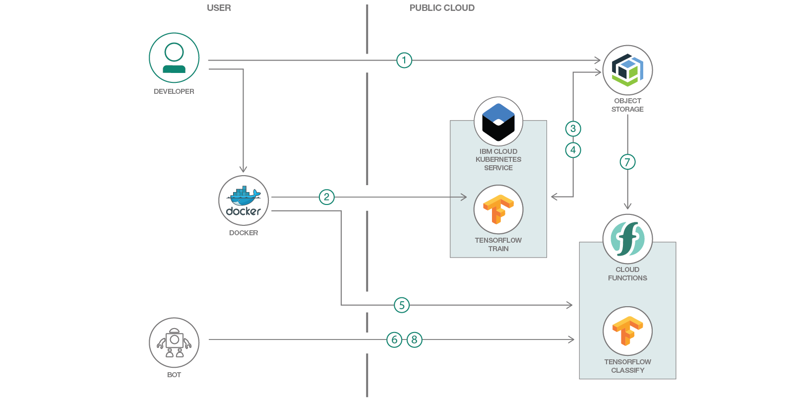

# Anki Cozmo ロボットをトレーニングして他のおもちゃを認識できるようにする

### OpenWhisk 関数内で稼働する TensorFlow を使用して、トイ・ロボットに視覚認識スキルを備える

English version: https://developer.ibm.com/patterns/visual-recognition-with-tensorflow-and-openwhisk

ソースコード: https://github.com/IBM/visual-recognition-for-cozmo-with-tensorflow

###### 最新の英語版コンテンツは上記URLを参照してください。
last_updated: 2018-09-19

 
## 概要

このコード・パターンでは、Anki Cozmo トイ・ロボット向けアプリを作成します。このサンプル・アプリは拡張された MobileNet モデルを使用して、他の 3 種類のおもちゃ (シカ、ドラゴン、恐竜) を認識します。このモデルに対する予測は、OpenWhisk 関数内で稼働する TensorFlow によって実行されます。モデルのトレーニングは IBM Cloud 上の Kubernetes 上で行われます。

## 説明

このコード・パターンに含まれるサンプル・アプリケーションは、Ansi Cozmo トイ・ロボットが別のおもちゃを認識できるようにするために、MobileNet TensorFlow モデルを拡張して使用します。このモデルを使用した予測は、OpenWhisk 関数内で稼働する TensorFlow によって実行されます。

このコード・パターンのベースとなっているのは、Niklas Heidloff による「[Sample Application: how to use TensorFlow in OpenWhisk](http://heidloff.net/article/visual-recognition-tensorflow)」のサンプル・アプリケーションです。

このコード・パターンでは以下のコンポーネントを使用します。

* [Cloud Object Storage](https://cloud.ibm.com/catalog/services/cloud-object-storage?cm_sp=ibmdev-_-developer-patterns-_-cloudreg): クラウド・データ・ストア内のデータの保管、管理、アクセスを可能にします。
* [Kubernetes](https://cloud.ibm.com/docs/containers/container_index.html): IBM Cloud 上の Kubernetes クラスターに含まれる Docker コンテナー内で、可用性の高いアプリを管理できます。
* [Cloud Functions](https://cloud.ibm.com/openwhisk/?cm_sp=ibmdev-_-developer-patterns-_-cloudreg) (Apache OpenWhisk ベース): 極めてスケーラブルなサーバーレス環境内で、オンデマンドでコードを実行できます。
* [Tensorflow](https://www.tensorflow.org/): オープンソース・ソフトウェア・ライブラリーを使用して、データ・フロー・グラフを使った数値計算を処理します。

このコード・パターンでは、以下のタスクに対処する方法を説明します。

* TensorFlow モデルを作成する
* Docker イメージをデプロイする
* Cloud Functions を作成する
* 単純な Cloud Foundry Web アプリを起動する

## フロー

1. 開発者が写真を撮ります (おそらく Anzi Cozmo ロボットを使用して撮りますが、必ずしもそうとは限りません)。撮った写真を IBM Cloud Object Storage にアップロードします。
2. 開発者が TensorFlow を含めた Docker イメージをビルドし、Kubernetes をトリガーして「トレーニング用」コンテナーを実行します。
3. トレーニング用コンテナーが Cloud Object Storage から画像をロードします。
4. TensorFlow がニューラル・ネットワークをトレーニングし、トレーニングしたネットワークを Cloud Object Storage にアップロードします。
5. 開発者が TensorFlow を含めた「分類子用」Docker イメージをビルドし、そのイメージを使用して IBM Cloud Functions アクション/シーケンスを作成します。
6. 開発者がサンプル Web アプリまたはロボットのいずれかから、画像に対して Cloud Function をトリガーします。
7. 事前にトレーニングされた TensorFlow グラフが Cloud Object Storage から取得されます。
8. イメージが分類されて、結果が返されます。

## 手順

このコード・パターンに関する詳細な手順は、GitHub リポジトリー内にある [README.md](https://github.com/IBM/visual-recognition-for-cozmo-with-tensorflow/blob/master/README.md) ファイルに記載されています。手順の概要は以下のとおりです。

1. 写真を撮ります。
1. 写真をアップロードします。
1. モデルをトレーニングします。
1. モデルを OpenWhisk にデプロイします。
1. Web アプリケーションからモデルをトレーニングします。
1. Cozmo ロボットを使用して視覚認識をテストします。
