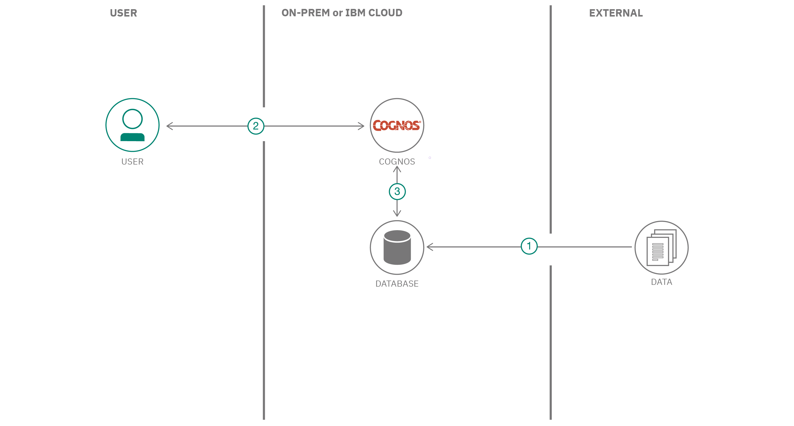

# 販売データと在庫レベルを分析するための Cognos Analytics ダッシュボードを作成する

### ビジネス・データで製品のパフォーマンスを分析し、顧客に関する洞察を視覚化する

English version: https://developer.ibm.com/patterns/visualize-customer-insights-with-business-data-for-product-performance-analysis
  ソースコード: https://github.com/IBM/cognos-analytics-to-visualize-business-data

###### 最新の英語版コンテンツは上記URLを参照してください。
last_updated: 2020-06-04

 ## 概要

Cognos&reg; Analytics を利用すると、データを視覚化して組織全体で実用的な洞察を共有するのが今までになく容易になり、データ駆動型の意思決定が促進されます。この開発者コード・パターンでは、製品のパフォーマンス分析を目的に、Cognos Analytics 内でビジネス・データを視覚化する方法を説明します。

## 説明

企業が既存のビジネス・データを視覚化して製品のパフォーマンスを分析するには、CSV ファイルやデータ・ウェアハウスなどのさまざまなソースから膨大なデータを簡単に取り込んで、各種のチャートで視覚化できるツールが必要です。こうしたチャートは、企業の各製品のパフォーマンスを分析して、パフォーマンス改善のための実用的な意思決定を行う上で役立ちます。ビジネス・インテリジェンス・ソリューションとしての IBM Cognos Analytics を利用すると、AI を注入したセルフサービス機能を使用して、データの準備、分析、レポート作成を加速できます。Cognos Analytics により、データを視覚化して組織全体で実用的な洞察を共有するのが今までになく容易になり、データ駆動型の意思決定が促進されます。このコード・パターンでは、製品のパフォーマンス分析を目的に、Cognos Analytics 内でビジネス・データを視覚化する方法を説明します。

このコード・パターンは、Cognos Analytics コード・パターン・シリーズの第 2 回です。この最初のコード・パターン「Watson Discovery で処理した非構造化データを Cognos Analytics ダッシュボード内で視覚化する」では、データ・モジュールのセットアップ方法、ダッシュボードの作成方法、Cognos Analytics UI の操作方法といった、Cognos Analytics の基本コンセプトについて説明します。例として、コーヒー製造業者が一般大衆のコーヒーの好みについての洞察を引き出すために、ブランドに対する顧客からの格付けと感情を経時的に追跡する視覚化を作成します。

ここでは、店舗情報、売上高データ、在庫レベルなどのビジネス・データを取り込んでこの事例研究を拡充します。データを Db2&reg; Warehouse スキーマにアップロードした後、このデータ・ウェアハウスを Cognos Analytics に接続します。その上で、ビジネス・データを視覚化するダッシュボードを作成します。

## フロー

1. 製品データとビジネス・データを Db2 Warehouse のテーブルにロードします。
1. ユーザーが Cognos Analytics を実行します。
1. Cognos Analytics を Db2 Warehouse インスタンスにリンクします。このデータ・ウェアハウス内のデータを使用して、Cognos Analytics ダッシュボード上で視覚化を作成できます。

## 手順

このパターンの詳しい手順については、[README](https://github.com/IBM/cognos-analytics-to-visualize-business-data/blob/master/README.md) ファイルを参照してください。手順の概要は以下のとおりです。

1. リポジトリーのクローンを作成します。
1. IBM Cloud 上で IBM Db2 Warehouse サービス・インスタンスを作成します。
1. Db2 サービス資格情報を環境ファイルに追加します。
1. データベース内にデータをロードするスクリプトを実行します。
1. Cognos Analytics 内でデータベース接続を作成します。
1. 接続されたデータベースからメタデータをロードします。
1. Cognos Analytics 内でデータ・モジュールを作成します。
1. Cognos Analytics ダッシュボードを作成します。
1. 視覚化をダッシュボードに追加します。

このパターンを「[Cognos Analytics ダッシュボードを作成する](https://developer.ibm.com/jp/patterns/visualize-unstructured-data-from-watson-discovery-in-the-cognos-analytics-dashboard/)」パターンと併せて使用して、[AI で非構造化データを分析して製品のパフォーマンスを把握する](https://developer.ibm.com/articles/leverage-the-voice-of-the-customer-using-watson-discovery-to-show-business-results-in-cognos-analytics)ためのソリューションを完成させてください。
