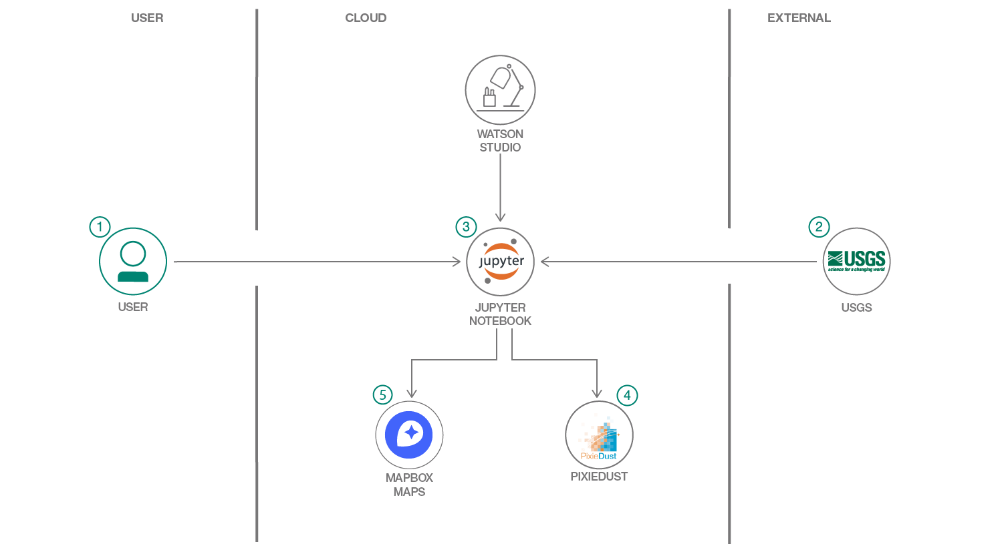

# Python を使用してデータを視覚化する

### 一般公開されている洪水データセットを使用して、チャート、グラフ、地図を作成する

English version: https://developer.ibm.com/patterns/visualize-data-with-python

ソースコード: https://github.com/IBM/visualize-data-with-python

###### 最新の英語版コンテンツは上記URLを参照してください。
last_updated: 2019-06-07

 ## 概要

このコード・パターンでは、データを使用して Jupyter Notebook などの成果物を作成しているあらゆる人を対象に、pandas、PixieDust、folium などのオープンソース・ライブラリーの力を明らかにします。pandas は、Python にデータ・フレームと系列を導入したライブラリーです。今や、Python を使用したデータ分析には pandas が不可欠となっています。IBM Watson&trade; Studio でホストされた PixieDust を使用すれば、複雑なコードを作成しなくても、対話式で動的かつ迅速にチャート、グラフ、テーブルを作成できます。また、PixieApp を使用することで、Jupyter Notebook に直接 UI 要素を埋め込むこともできます。Watson Studio では USGS や PixieDust などのオープンソース・プロバイダーによるライブラリーを使用してデータを分析し、データ視覚化を共有できるようになっています。さらに、folium では Python エコシステムのデータ・ラングリングの力と Leaflet.js ライブラリーのマッピングの力を利用できます。Python でデータを操作してから、folium を使って Leaflet 地図内に可視化できます。

## 説明

[USGS](https://www.usgs.gov/) は合衆国政府の科学部局です。USGS の科学者たちは米国の地勢、自然資源、そして合衆国を脅かす自然災害を研究し、[waterdata.usgs.gov](https://waterdata.usgs.gov/nwis/nwismap/?site_no=08075763&agency_cd=USGS) サイトを含む多数のソースでオープンソース・データを提供しています。

このコード・パターンでは、Watson Studio 上でデータ・サイエンスとデータ・エンジニアリングの標準的な手法のいくつかを使用して、2017 年に発生したテキサス州ヒューストンの大洪水に関する一般公開データを分析します。Watson Studio は、クラウド・ベースのインタラクティブなコラボレーション環境です。この環境ではデータ・サイエンティスト、開発者、そしてデータ・サイエンスに興味を持つ人々が、さまざまなツール (RStudio、Jupyter Notebook 、Spark など) を使用して共同作業を行い、データを共有してデータから洞察を引き出すことができます。

このコード・パターンを完了すると、以下の方法がわかるようになります。

* [Jupyter Notebook ](https://jupyter.org/)を使用して、データをロードし、視覚化、分析する
* [Watson Studio](https://www.ibm.com/jp-ja/cloud/watson-studio) 内で Jupyter Notebook を実行する
* IPython Notebook のヘルパーとして [PixieDust](https://github.com/pixiedust/pixiedust) を利用する
* [PixieApps](https://pixiedust.github.io/pixiedust/pixieapps.html) を使用してダッシュボードを作成する
* 一般公開データを見つけて、キュレートしてから表示する
* [Mapbox GL](https://docs.mapbox.com/mapbox-gl-js/api/) と folium を使用してインタラクティブな地図を作成する

## フロー

1. Jupyter Notebook を Watson Studio プラットフォーム上にロードします。
1. 2017 年のヒューストン大洪水に関する USGS データを Notebook にロードします。
1. Notebook を使用して、データをクレンジングしてから表示します。
1. 相互作用可能な PixieApp ダッシュボードを作成します。
1. Mapbox と folium を使用して地図を視覚化します。

## 手順

このパターンの詳細な手順については、[README](https://github.com/IBM/visualize-data-with-python) を参照してください。手順の概要は以下のとおりです。

1. Watson Studio に登録します。
1. Notebook を作成します。
1. Notebook を実行します。
1. 結果を分析します。
1. 分析結果を保存して共有します。
