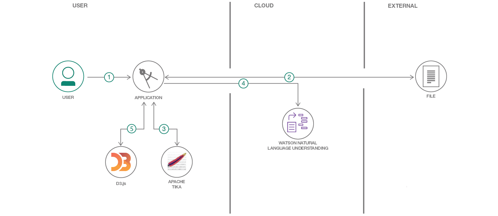

# Watson Natural Language Understanding を利用して非構造化データを視覚化する

### 強力なアナリティクス・エンジンによってデータにコグニティブ・エンリッチを適用し、洞察を引き出す

English version: https://developer.ibm.com/patterns/visualize-unstructured-text
  ソースコード: https://github.com/IBM/visualize-unstructured-data-with-watson

###### 最新の英語版コンテンツは上記URLを参照してください。
last_updated: 2018-12-28

 ## 概要

このコード・パターンでは、Watson™ Natural Understanding、Apache Tika、D3.js を使用して非構造化データを視覚化する Web アプリを作成します。ユーザーが任意のローカル・ファイルをアップロードすると、このアプリは Apache Tika を使用して非構造化データ・ファイルからテキストを抽出します。抽出されたテキストは Watson Natural Language Understanding に渡され、このサービスによってエンティティーと概念が抽出されます。最後に、アプリは D3.js を視覚化ツールとして使用して、結果をユーザーに表示します。

## 説明

Watson Natural Understanding サービスを利用する最大の利点は、コグニティブ・エンリッチを適用してデータから洞察を引き出す、その強力なアナリティクス・エンジンにあります。抽出される主なエンリッチには、次のものがあります。

* エンティティー – 人、企業、組織、都市など
* キーワード – データのインデックス付けや検索で通常使用される重要なトピック
* 概念 – 必ずしもデータ内で参照されているとは限らない、識別された一般概念
* 感情 – 各ドキュメントの全体的な感情 (肯定的または否定的)

これらのエンリッチを表示するために使用するのは、D3.js という強力な視覚化手法を提供する JavaScript ライブラリーです。このアプリでは、データを活性化するのに役立つ D3.js を使用してエンリッチのそれぞれを対話式バブル・クラウドで表示し、各要素のサイズと位置によって、その相対的重要性を示します。

このコード・パターンを完了すると、以下の方法がわかるようになります。

* Watson Natural Language Understanding のインスタンスを作成して使用する
* Apache Tika を使用して非構造化ファイルからテキストを抽出する
* D3.js を使用して視覚化を表示する

## フロー

1. ユーザーが Watson Natural Language Understanding サービスの資格情報を構成して、アプリを起動します。
1. ユーザーが処理対象のデータ・ファイルを選択してロードします。
1. アプリが Apache Tika を使用してデータ・ファイルからテキストを抽出します。
1. 抽出されたテキストが Watson NLU に渡されて、エンリッチが適用されます。
1. アプリが D3.js ライブラリーを使用して、エンリッチされたデータを UI 内で表示します。

## 手順

このパターンに取り組む準備はできましたか？詳細な手順については、[README](https://github.com/IBM/visualize-unstructured-data-with-watson/blob/master/README.md) を参照してください。
