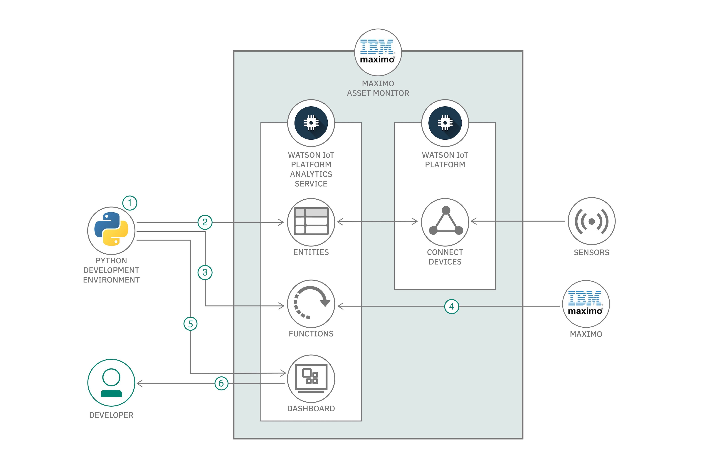

# Visualize IoT data in dashboards using Python

### Publish IoT asset data from external sources into Maximo Asset Monitor

English version: https://developer.ibm.com/patterns/visualizing-iot-data-in-dashboards-using-python
  
ソースコード: https://github.com/IBM/watson-analytics-dashboard

###### 最新の英語版コンテンツは上記URLを参照してください。
last_updated: 2019-10-29

 
## Summary

In this code pattern, you'll learn how to publish IoT asset data from external sources (like IBM&reg; Maximo solutions) to Maximo Asset Monitor. Then, you build monitoring dashboards in Maximo Asset Monitor that let you visualize data trends over time.

## Description

IBM Maximo is an enterprise asset management solution that helps you put that data to work making better decisions based on insights from enhanced analytics. By publishing IoT asset data to Maximo Asset Monitor by using a Python function, you can monitor your own assets to ensure availability, utilization, and efficiency.

When you have completed this code pattern, you understand:

* Understand how you can use a Python function, an HTTP `preload` function, to load data into Maximo Asset Monitor from any REST Service
* Build a dashboard using Maximo Asset Monitor to monitor, visualize, and analyze IoT asset data from external data sources like IBM Maximo
* Deploy, schedule, and run this Python function in Maximo Asset Monitor to retrieve data every 5 minutes.

## Flow

1. Set up your Python development environment.
1. Create an entity type in Watson IoT Platform.
1. Deploy the function.
1. Schedule the function to collect asset data.
1. Create a monitoring dashboard to manage the asset.
1. View the data in the monitoring dashboard.

## Instructions

Find the detailed steps for this pattern in the [README](https://github.com/IBM/watson-analytics-dashboard/blob/master/README.md).
