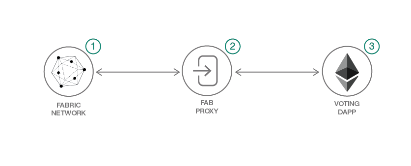

# Hyperledger と Ethereum を使用して投票用アプリケーションを開発する

### Ethereum の Web3 および Solidity スマート・コントラクトに、Hyperledger でホストされた Fabric およびチェーンコード EVM を統合する分散型アプリを構築する

English version: https://developer.ibm.com/patterns/./voting-app-hyperledger-ethereum
  ソースコード: https://github.com/IBM/vote-hyperledger-ethereum

###### 最新の英語版コンテンツは上記URLを参照してください。
last_updated: 2018-11-14

 
## 概要

このコード・パターンでは、Hyperledger Fabric 内で実行される Solidity スマート・コントラクトに対してメソッドを呼び出す分散型アプリを構築する方法を説明します。このアプリには Fabric プロキシー・サーバーを組み込みます。このサーバーを使用して、実行中の Hyperledger Fabric と、チェーンコード Ethereum 仮想マシン (EVM) を統合したフレームワークとの間で Web3 呼び出しを変換することで、スマート・コントラクトのデプロイを可能にします。

## 説明

この単純な分散型投票アプリケーションでは、Hyperledger Fabric ネットワークとチェーンコード EVM を使用して、Web3 と Solidity スマート・コントラクトのデプロイを 1 つにまとめます。

Ethereum のツールのコーディングをよく理解している開発者であれば、Ethereum の知識を Hyperledger インフラストラクチャーに適用できるはずです。

このコード・パターンを完了することで、パーミッション制ブロックチェーン・フレームワーク (Hyperledger) とパーミッションレス制ブロックチェーン・フレームワーク (Ethereum) を併せて使用する方法を理解できます。

## フロー

このアプリは、Ethereum 標準を使用して構築されています。つまり、アプリは「ガス」実行料金に従ってトランザクションの支払いを行うということです。Hyperledger Fabric とそのネットワークはこの分散型アプリをホストするだけです。したがって、Solidity スマート・コントラクトを簡単にデプロイして処理できます。Hyperledger Fabric で Ethereum のガスの代わりとなるのは、一般に、チェーンコード付きで作成されたデジタル・トークンです。

このパターンに従うには、まず、リポジトリーを複製してプロジェクトの所有者になります。けれどもその前に、必要なすべてのツールが揃っていて、それらのツールが必要なバージョンであることを確認してください。

以下の手順で、インストール・プロセスの概要を説明します。

1. Hyperledger Fabric バイナリーと Docker イメージをインストールし、プロジェクトに必要なリポジトリーを複製して、Fabric ネットワークを起動します。
1. Fab プロキシーを構成し、ポート 5000 上で起動します。
1. Web3、Solidity、そして分散型アプリケーションを実行するために必要な依存関係をインストールします。DApp はポート 3000 で listen します。

## 手順

詳細な手順については、[README](https://github.com/IBM/vote-hyperledger-ethereum/blob/master/README.md) を参照してください。
