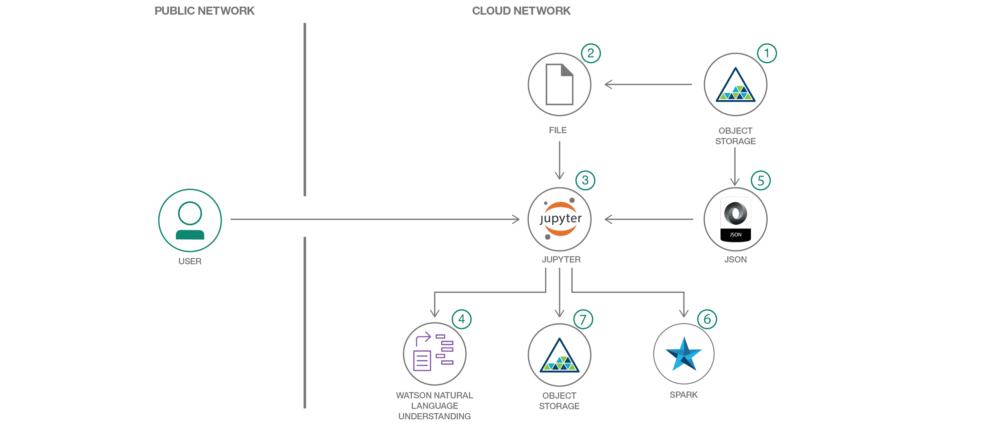

# さまざまなソースからのドキュメントを互いに関連付ける

### Python NLTK と IBM Data Science Experience を利用して、複数のドキュメント全体にわたってコンテンツを相互に関連付ける

English version: https://developer.ibm.com/patterns/watson-document-correlation
  ソースコード: https://github.com/IBM/watson-document-co-relation

###### 最新の英語版コンテンツは上記URLを参照してください。
last_updated: 2017-10-20

 
_**Note: This pattern is part of a composite pattern.** These are code patterns that can be stand-alone applications or might be a continuation of another code pattern. This composite pattern consists of:_

* [Watson のテキスト分類を拡張する](https://developer.ibm.com/jp/patterns/extend-watson-text-classification/)
* さまざまなソースからのドキュメントを互いに関連付ける (このパターン)

## 概要

テキスト・アナリティクスには、ドキュメント、書籍、ソーシャル・メディアの他、さまざまなソースに含まれるテキスト・コンテンツから洞察を引き出すという作業が伴います。各種のソース全体にわたってテキスト・コンテンツの相互関係を検出して全体像を把握することは、一般的な要件です。このコード・パターンでは、Watson Natural Language Understanding (NLU)、Python Natural Language Processing Toolkit (NLTK)、IBM Watson Studio を利用して、エンティティーと属性のグラフを作成し、エンティティー間の関係を基に、各種のリソース全体でテキスト・コンテンツを相互に関連付けます。

## 説明

このコード・パターンでは、IBM DSX 内の Jupyter Notebook と、Python NLTK ツールキットおよび IBM Watson NLU を利用して、さまざまなドキュメントのテキスト・コンテンツを相互に関連付けます。相関アルゴリズムを駆動するのは、関係を確立するためのルールと文法を格納する入力 JSON 構成ファイルです。この JSON 構成ファイルに変更を加えることで、ドキュメント全体にわたって、より正確なテキスト・コンテンツ間の相関関係を見つけ出すことができます。

このコード・パターンをひととおり完了すると、以下の方法がわかるようになります。

* DSX 内で Jupyter Notebook を作成して実行する
* Watson Studio Object Storage を利用してデータと構成ファイルにアクセスする
* IBM Watson NLU API を使用して、Jupyter Notebooks 内のドキュメントからメタデータを抽出する
* 単純化された Python 関数を使用して、非構造化データを抽出してフォーマット化する
* 構成ファイルを使用して、同一指示と関係文法を指定する
* 処理後の JSON 出力を Watson Studio Object Storage に保管する

## フロー

1. 対象のドキュメントを IBM Cloud Object Storage に保管します。
2. ドキュメントのコンテンツはテキスト形式で保管されていて、Jupyter Notebook によって取得されて処理されます。
3. IBM Watson Studio 上でホストされている Jupyter Notebook には、ドキュメントのコンテンツを相互に関連付けるための完全な処理ロジックが含まれています。
4. ドキュメントのコンテンツが最初に Watson NLU に送信されて、そのレスポンスが Watson NLU から返されます。
5. 次に、相関アルゴリズムを駆動する入力 JSON 構成ファイルが Object Storage から取得されます。Python NLTK モジュールによって、構成ファイル内に指定されているタグ・パターンに基づくキーワード、POS タグ、チャンクが生成されます。
6. IBM Watson Studio は Spark によって駆動されます。
7. Watson NLU からの出力と Python NLTK からの出力を結合して、エンティティー (および属性) とエンティティー間の関係を示すグラフが作成されます。相関アルゴリズムを駆動するのは、入力構成です。出力されるエンティティーと関係のグラフは、Object Storage 内に保管されます。

## 手順

Find the detailed steps for this pattern in the [README](https://github.com/IBM/watson-document-co-relation/blob/master/README.md). The steps will show you how to:

1. Sign up for Watson Studio.
2. Create IBM Cloud services.
3. Create the notebook.
4. Add the data and configuraton file.
5. Update the notebook with service credentials.
6. Run the notebook.
7. Analyze the results.
