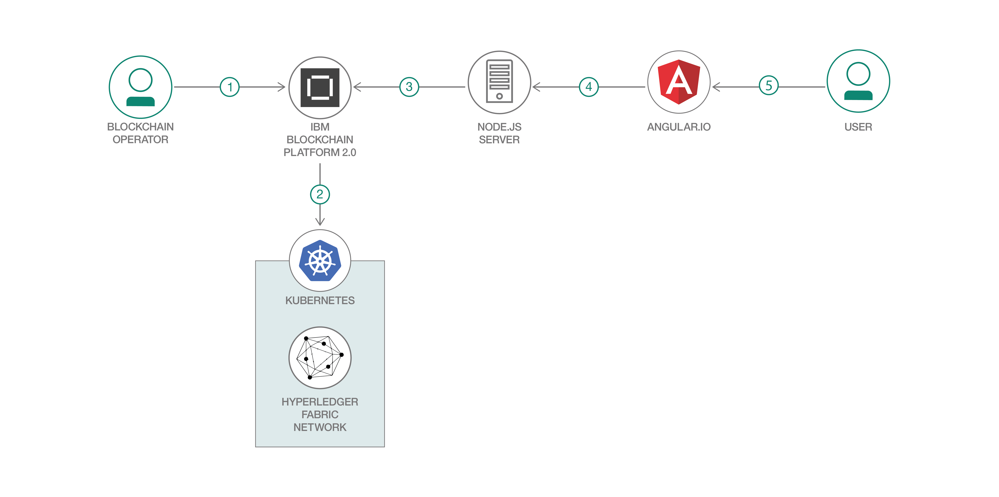

# Kubernetes クラスターを使用して Fabric ネットワークのスマート・コントラクトをブロックチェーンにデプロイする

### Vue.js クライアントで Node.js API を使用してネットワークとやり取りする

English version: https://developer.ibm.com/patterns/write-a-smart-contract-for-the-fabcarcommercial-paper-or-iks-cluster-with-saas-v2-beta-network-think
  
ソースコード: https://github.com/IBM/fabcar-blockchain-sample

###### 最新の英語版コンテンツは上記URLを参照してください。
last_updated: 2019-06-17

 ## 概要

IBM Blockchain Platform 2.0 では、ダッシュボード・コンソールを使用してブロックチェーン・ネットワークのコンポーネントをデプロイ、管理できるようになっています。このダッシュボード・コンソールを使用すれば、ネットワークのノード (ピア、発注者、認証局 (CA) など) をセットアップすることも、ネットワークを管理する組織とアイデンティティーを作成することもできます。さらに、手作業によるセットアップなしで、コンソールから直接 IBM Cloud Kubernetes サービスにスマート・コントラクトをデプロイできます。

この開発者パターンでは、Hyperledger Fabric のサンプル Fabcar スマート・コントラクトを IBM Blockchain Platform 2.0 上のネットワークにデプロイし、このネットワークとやり取りする Node.js Express サーバーと、Web インターフェースを提供する Vue.js クライアントを開発する方法を説明します。

## 説明

このコード・パターンでは、IBM Blockchain Platform 2.0 上にネットワークをセットアップし、そのネットワークに Fabcar スマート・コントラクトをデプロイする手順を説明します。手順では、スマート・コントラクトに対するトランザクションを送信するアイデンティティーを含め、ネットワークとやり取りするサンプル・アプリケーションをセットアップします。アプリケーションにセットアップするのは、fabric-network および fabric-ca-client ライブラリーを使用してネットワークへのリクエストを処理する Node.js サーバーと、Web インターフェースを表示する Vue.js クライアントです。

このコード・パターンを完了すると、以下の方法がわかるようになります。

* IBM Blockchain Platform 2.0 上に Hyperledger Fabric ネットワークをセットアップする
* IBM Blockchain Platform 2.0 を介してスマート・コントラクトをインストールし、インスタンス化する
* Hyperledger Fabric SDK を使用してデプロイ済みネットワークとやり取りする Node.js サーバーを開発する
* ネットワークとのインターフェースを取る Web アプリの Vue.js フロントエンドを作成する

## フロー

1. ブロックチェーン・オペレーターが IBM Blockchain Platform 2.0 サービスをセットアップします。
1. IBM Blockchain Platform 2.0 を使用して Hyperledger Fabric ネットワークを作成し、IBM Kubernetes サービスにデプロイします。これにより、Fabcar スマート・コントラクトをネットワークにインストールしてインスタンス化できるようにします。
1. Node.js アプリケーション・サーバーは Fabric SDK を使用して IBM Blockchain Platform 2.0 上にデプロイされたネットワークとやり取りし、Web クライアント用の API を作成します。
1. Vue.js クライアントは Node.js API を使用してネットワークとやり取りします。
1. ユーザーが Fabcar Vue.js Web インターフェースとやり取りして、ブロックチェーンのレジャーと状態を更新、照会します。

## 手順

手順に取り組む準備はできましたか？詳細な手順については、[README](https://github.com/IBM/fabcar-blockchain-sample/blob/master/README.md) を参照してください。
