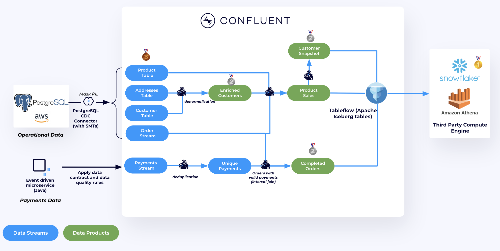

# Real-Time Stream Processing Workshop

**Build a Data Streaming Platform with Confluent Cloud & Apache Flink**

## Welcome to the Online Retailer Flink Workshop!

In this hands-on workshop, you'll step into the role of a data engineer at an online retailer tasked with building a real-time analytics platform. You'll capture live customer, order, and payment data from the retailer's operational database, clean and validate it to ensure data quality, protect sensitive credit card information with encryption, and create analytics-ready data products — all powered by Confluent Cloud and Apache Flink. By the end, you'll have streaming data flowing directly into a data lakehouse, queryable from Amazon Athena or Snowflake, without building a single ETL pipeline.



## What You'll Build

By the end of this workshop, you'll have:

- ✅ **Real-time customer data** streaming from PostgreSQL to Confluent Cloud
- ✅ **Live product analytics** using Flink SQL joins and aggregations
- ✅ **Client-Side Field Level Encryption (CSFLE)** protecting sensitive credit card data with zero code changes
- ✅ **Apache Iceberg tables** with Tableflow for instant data lake integration
- ✅ **Data governance** with schema validation, data quality rules, and field-level encryption
- ✅ **Analytics-ready datasets** queryable from Amazon Athena and optionally Snowflake

**Time commitment:** 90 minutes total (30 min setup + 60 min labs)

## Prerequisites

Before starting, make sure you have:

| Requirement | Check |
|-------------|-------|
| **Confluent Cloud account** with [API Keys](https://docs.confluent.io/cloud/current/security/authenticate/workload-identities/service-accounts/api-keys/overview.html#resource-scopes) (`Cloud resource management` permissions) | [Sign up here](https://www.confluent.io/get-started/) |
| **AWS account** with credentials set | Set AWS env variables |
| **Terraform** installed | `brew install hashicorp/tap/terraform` or [download](https://www.terraform.io/downloads) |
| **GIT CLI** installed | `brew install git`  |
| **AWS CLI** installed | `brew install awscli`  |
| **Snowflake account** *(optional)* | With ACCOUNTADMIN privileges. For querying Iceberg tables as an alternative to Athena |
| **Confluent CLI** | Required for cleanup steps. `brew install confluentinc/tap/confluent` or [download](https://docs.confluent.io/confluent-cli/current/install.html) |

<details>
<summary>📦 Quick Install Commands</summary>

**macOS:**
```bash
brew tap hashicorp/tap
brew tap confluentinc/tap
brew install git hashicorp/tap/terraform awscli confluentinc/tap/confluent
```

> **Note:** If you previously installed Terraform from the community tap (`homebrew/core`), you may get a naming conflict. Run `brew uninstall terraform` first, then install from the HashiCorp tap as shown above.

**Windows (PowerShell):**
```powershell
winget install -e --id Git.Git
winget install -e --id HashiCorp.Terraform
winget install -e --id Amazon.AWSCLI
winget install -e --id Confluent.ConfluentCLI
```
</details>

---

> **💡 Pro Tip:** Use Chrome's split-screen view to have the instructions on one side and Confluent Cloud on the other!
<video src="https://github.com/user-attachments/assets/68395ba4-c12c-4daa-b71b-168e7d14bf33" controls autoplay loop muted inline width="50%">
</video>

## Setup (Allow 30 minutes)

### Step 1: Clone and Navigate

```bash
git clone https://github.com/confluentinc/online-retailer-flink-demo.git
cd online-retailer-flink-demo/terraform
```

### Step 2: Configure AWS Account

1. Ensure your AWS credentials are configured in the shell where you will run Terraform. You can set them via environment variables:
   ```bash
   export AWS_ACCESS_KEY_ID="<your-access-key>"
   export AWS_SECRET_ACCESS_KEY="<your-secret-key>"
   export AWS_SESSION_TOKEN="<your-session-token>"  # if using temporary credentials
   ```
2. Verify you are using the correct AWS account by running:
   ```
   aws sts get-caller-identity
   ```

> [!IMPORTANT]
> **Same Shell Window Required**
>
> The AWS credential environment variables must be exported in the same shell window where you will run `terraform` commands

### Step 3: Update Your Terraform.tfvars file

1. Find the `terraform.tfvars.template` file located in `online-retailer-flink-demo/terraform` and rename it to `terraform.tfvars`
2. Replace the placeholders with your Confluent Cloud API Key and Secret


### Step 4: Deploy Infrastructure

Run these commands to initialize, validate and build-out your cloud infrastructure:

```bash
terraform init
terraform validate
terraform apply -auto-approve
```

>[!NOTE]
> ☕ **Grab a coffee!**
>
> This should take 7-10 minutes to provision:
>
> - Confluent Cloud environment with Kafka + Flink
> - AWS PostgreSQL database
> - S3 buckets for data lake
> - Schema Registry and Stream Governance
> - ECS services running pre-built container images

---

## Workshop Paths

Once deployment completes, choose your path:

### Path 1: Hands-On Labs (Recommended for workshops)

Work through the labs step-by-step. Each lab builds on the previous one, with challenge sections and detailed instructions.

#### [**LAB 1: Payment Processing & Tableflow**](./LAB1/LAB1-README.md)

Set up data governance (CSFLE encryption + data quality rules), validate payments in real-time with Flink, and materialize Kafka topics as Iceberg tables with Tableflow. Query your data from Amazon Athena or optionally Snowflake.

#### [**LAB 2: Customer360 & Product Sales Analytics**](./LAB2/LAB2-README.md) ⏱️ *Optional - Time Permitting*

Learn to join streaming data with Flink SQL, mask PII data, and create enriched customer profiles.

> [!TIP]
> **Focus on LAB 1 first!**
>
> LAB 2 is optional and can be completed after the workshop if you run short on time.

> [!TIP]
> **Snowflake Users**
>
> Both labs include collapsible Snowflake sections as an alternative to Amazon Athena for querying Iceberg tables. A Snowflake account with ACCOUNTADMIN privileges is required for the one-time setup.

### Path 2: End-to-End Demo (Recommended for self-paced exploration)

#### [**Shift Left Demo**](./shiftleft/README.md)

A continuous end-to-end walkthrough covering data quality, deduplication, PII encryption, enriched data products, and Tableflow — all in one narrative. Independent of LAB 1 and LAB 2.

---

## Clean Up

> [!WARNING]
> **Don't skip this!**
>
> Avoid unexpected charges by cleaning up when you're done.

### Step 1: Snowflake Cleanup (If Used)

If you set up Snowflake during the workshop, clean up the Snowflake resources:

```sql
-- In Snowflake, run these commands to remove workshop resources
DROP ICEBERG TABLE IF EXISTS completed_orders;
DROP ICEBERG TABLE IF EXISTS product_sales;
DROP ICEBERG TABLE IF EXISTS thirty_day_customer_snapshot;
DROP EXTERNAL VOLUME IF EXISTS iceberg_external_volume_<your_initials>;
DROP CATALOG INTEGRATION IF EXISTS glueCatalogInt_<your_initials>;
```

Also remove the Snowflake trust policy entries you added to the IAM role in the AWS Console (under **IAM > Roles > Trust Relationships**).

### Step 2: Destroy Infrastructure

The destroy script handles everything automatically — disabling Tableflow on all topics, deleting catalog integrations, cleaning up CSFLE keys, and running `terraform destroy`.

```bash
# From the terraform/ directory
./demo-destroy.sh        # macOS/Linux
demo-destroy.bat         # Windows
```

> [!NOTE]
> The destroy script requires the [Confluent CLI](https://docs.confluent.io/confluent-cli/current/install.html).

---

## Need Help?

- **Running into issues?** Check the [**Troubleshooting Guide**](./TROUBLESHOOTING.md) for common problems and solutions
- **During the workshop:** Raise your hand or ask in Slack
- **After the workshop:** Check the [video walkthrough](https://www.confluent.io/resources/demo/shift-left-dsp-demo/)
- **Issues or feedback:** [Open a GitHub issue](https://github.com/confluentinc/online-retailer-flink-demo/issues)

---

## Ready to Start?

👉 **[Begin LAB 1: Payment Processing & Tableflow](./LAB1/LAB1-README.md)**

Let's build something awesome! 🚀