# OpenMP on IBM POWER でわかりやすく解説する GPU プログラミング − パート 2
### MPI と非 MPI アプリケーションのケース・スタディ

English version: https://developer.ibm.com/technologies/systems/articles/gpu-programming-with-openmp-part-2/

###### 最新の英語版コンテンツは上記URLを参照してください。

### Author: Aditya Nitsure, Pidad D'souza
last_updated: 2020-05-28


## はじめに

いま、時代はヘテロジニアス型システムです。世界最高速のスーパーコンピューターである [IBM Summit](https://www.ibm.com/thought-leadership/summit-supercomputer/) は、ヘテロジニアス型ノードで構成された最大のクラスターです（訳注：本記事のオリジナル版執筆時点）。各ノードは、IBM® Power® System AC922 デュアル・ソケットの 22 コア・サーバーで、プロセッサー・チップあたり 3 個の NVIDIA Volta GPU を搭載しています。

ヘテロジニアス型クラスターが徐々に浸透するにつれ、ハイ・パフォーマンス・コンピューティング（HPC）のアプリケーションは、ヘテロジニアス型ノード上でアクセラレーター（あるいは GPU）を使うことに注力し始めました。図 1 は 2 ノードのヘテロジニアス型クラスターで、各ノードに CPU（C0、C1）と GPU（G0〜G5）が搭載されています。ハイブリッド・プログラミングは、対称マルチプロセッシング（SMP）クラスター内の複数ノード間でのスケールを実現するために使われます。これはほとんどの HPC アプリケーションにおいて、一般的に使われる枠組みです。Message Passing Interface（MPI）と Open Multi-Processing（OpenMP）の組み合わせは、ハイブリッド・プログラミングの世界では広く使われており、それぞれノード間とノード内でスケールするために使用されます。

##### 図 1. ヘテロジニアス型クラスター内のノード
​​​​
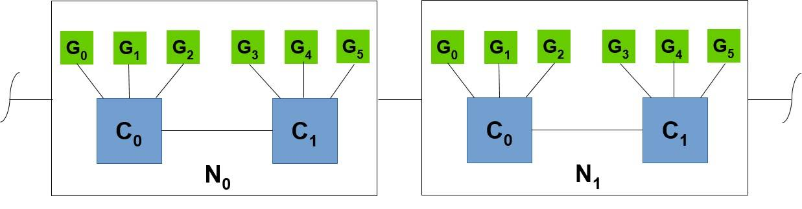

これまでは、伝統的に GPU プログラミングに CUDA と OpenCL が使われてきました。OpenACC や OpenMP のようなデレクティブ・ベースのプログラミング・モデルは、伝統的な GPU プログラミングに代わるものです。OpenMP 4.0 仕様から GPU オフロードのディレクティブがサポートされるようになりました。IBM、Cray、Intel®、その他の重要なコンパイラー提供会社が早い時点でコンパイラーに組み込んだおかげで、ヘテロジニアス型クラスターでのハイブリッド・プログラミングの枠組みにおいて、OpenMP を使用した GPU プログラミングが注目を集めるようになりました [[15](#ref)], [[16](#ref)]。

[以前の記事](../../Articles/gpu-programming-with-openmp/)で、OpenMP を使ってワークロードを単一 GPU にオフロードするプログラミングが容易であることを実例を使って示しました。この記事では、MPI および非 MPI アプリケーションに OpenMP の GPU オフロードを使用することで、データの区分化と GPU がスケールするプログラミングが容易であることを紹介します。このケース・スタディでは、ほんの少しのコードを変更するだけで、MPI と非 MPI のコードが複数 GPU にわたってスケールし、CPU 単独の場合に比べて数倍のスピード・アップを達成することができました。MPI アプリケーションでは、小規模行列に対してはアプリケーションの実行時間における通信時間が支配的ですが、行列が大きくなると計算が大量になるため、通信時間の影響は小さくなります。

HPC 分野において、MPI はアプリケーションがクラスター内の複数ノードにわたってスケールする分散メモリ・モデルの標準となりました。典型的な MPI プログラミングでは、データは区分化され、処理はクラスター内の同一ノードまたは異なるノード上のプロセスに分散されます。プロセス間のデータのやり取りは、MPI のポイント・トゥー・ポイント API やコレクティブ通信 API を明示的に呼び出すことによって行われます。

共有メモリー・アーキテクチャーではスレッド間でワークロードを分散しますが、そこで使用する並列プログラミングにおいて、OpenMP は人気のあるプログラミング・モデルです。スレッド間で分散処理を行うために領域を論理的に分割する必要がありますが、全ての CPU スレッドが全メモリーにアクセスできるので、明示的にデータ転送を指示する必要はありません。

物理や論理データの区分化戦略は、計算領域のタイプ、領域をまたぐデータ交換量、通信頻度、使用するデータ構造の種類などに依存します。図 2 は、計算領域のデータ区分化をするさまざまな方法を模式化したものです。この区分化は、別個の計算ユニット（Compute Unit: CU）（例：ノード、コア、アクセラレーター）に各領域を割り当てることを可能にします。

##### 図 2. 計算領域を区分化するさまざまな方法

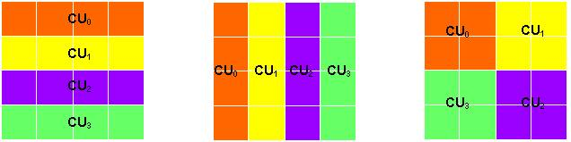

今回のケース・スタディーでは、MPI プログラムと非 MPI プログラムの中から OpenMP を使って GPU オフロードを行い、簡単な行列乗算アルゴリズムの検証を行いました。図 3 は、行（行列 A）と列（行列 B）を乗算し、行列 C という結果を導き出す行列乗算の模式図示です。

##### 図 3. 行列乗算（模式図）

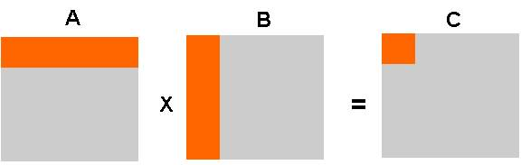

**\*注：** ユーザーは、標準的な行列演算アルゴリズムに対しては、ESSL（Engineering and Scientific Subroutine Library）や cuBLAS ライブラリーを使用することができます。

図 4 は、OpenMP を使用した非 MPI 行列乗算プログラムの流れです。3 つのステージがあり、それぞれ、初期化、問題解決、そして結果収集です。また、プログラムを CPU 単独で実装した場合、単一 GPU で実装した場合、そして複数 GPU で実装した場合を比較し、変更点を青色で強調しています。

図 4 の最初の列 (a) は、典型的な共有メモリ型の CPU 単独 OpenMP 実装で、行列 A と B を最初に初期化します。OpenMP プラグマ `#pragma omp parallel for collapse(2)` は、CPU スレッド・レベルでの並列化を実現します。結果行列 C は、全てのスレッドで計算されます。

図 4 の 2 番目の列 (b) は、OpenMP プラグマを使用した単一 GPU へのオフロードを示します。OpenMPプラグマでの変更点は青色で記されています。GPU オフロード・デバイス構文 `target` はデバイスで起動する領域を指定します。`team` 構文は 1 個のマスター・スレッドを持つチームを作成し、`parallel for` 構文は各チーム内に複数 OpenMP スレッドを作り、`distribute` 構文はチームやスレッド間で処理を分散するために反復処理を区分化します。`data map` 節は CPU メモリー内で宣言された変数をデバイス（GPU）メモリーにコピー、あるいは転送の方向によってはその逆を行います。スレッドの全てのチームは、`device(#GPU ID)` キーワードで指定される GPU の上で稼働します。

##### 図 4. OpenMP を使用した非 MPI 行列乗算プログラム

##### (a) CPU 単独の OpenMP 実装 (b) 単一 GPU オフロードの OpenMP 実装 (c) 複数 GPU オフロードの OpenMP 実装

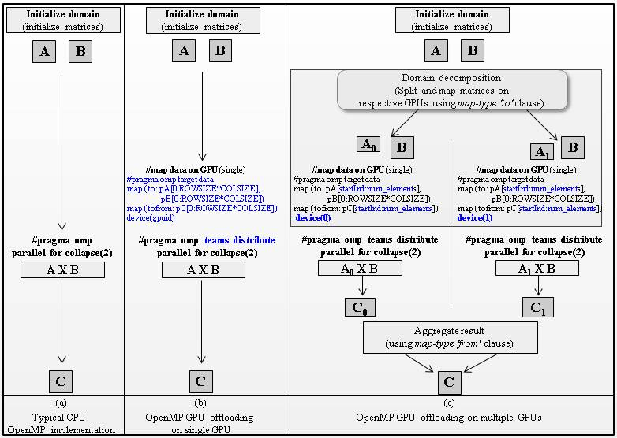

## 複数 GPU 上でスケールするコード（非 MPI）

現行の OpenMP 仕様は、ワークロードを全ての使用可能な GPU に分散するメカニズムを定義していません。そのため、プログラマーは明示的に複数 GPU にワークロードを分散をする必要があります。図 5 の MPI と非 MPI コードで示すように、今回の例ではデータを区分化する戦略を用いました。入力行列 A と結果行列 C を分割して同一セクションに入れ、各 GPU が行列 A と C の一部を受け取るようにします。二番目の入力行列 B は全ての GPU で共有します。リスト 1 は、OpenMP `sections` 節を使用して複数 GPU にオフロードする非 MPI 実装です。各セクション下のコード・セグメントは、非同期に並列実行します。`sections` 節の最後で、並列実行した全タスクが同期します。リスト 2 は行列乗算関数の汎用的な実装を示し、その中で配列の異なるセクションを複数の GPU にマップします。`data map` 節は、行列を分割して各 GPU にマップし、結果を収集するために使います。

##### 図 5. 行列乗算 – データの区分化と 4 つの GPU への分散

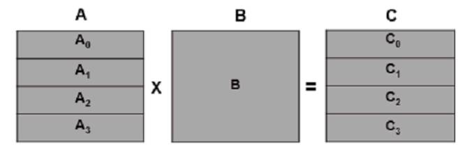

図 4 の 3 番目の列 (c) は、OpenMP プログラムを使用した複数 GPU（2 GPU）へのオフロードを示します。入力された行列 A と結果の行列 C は A0 と A1 の二つのパーツと C0 と C1 の二つのパーツにそれぞれ分割され、各 GPU にマップされます。全ての GPU は、割り当てられた行列部分に対する乗算を行います。結果行列は、from 節によって CPU メモリーに再度マップされます。明示的な収集作業は不要です。OpenMP の GPU オフロード構文は、GPU が 1 つでも複数でも変わらないことに注意してください。

## 複数 GPU 上でスケールするコード（MPI）

図 6 は、OpenMP を使用した MPI 行列乗算プログラムの流れです。プログラムを CPU 単独の実装と複数GPU の実装で比較し、変更点を強調（青色）しています。

図 6 の最初の列 (a) は、各 MPI タスクを 1 個のプロセッサーにマップする典型的な CPU 単独の MPI 実装です。マスター・タスクは入力行列 A と行列 B を初期化し、使用可能なプロセッサーに分散するために、行列 A と行列 C を `MPI_Scatter` で分割します。そして、`MPI_Broadcast` を使用して行列 B をブロードキャストします。各 MPI タスクは行列乗算関数を呼び出し、結果行列の割り当て部分をマスター・タスクに送ります。`MPI_Gather` は、全てのタスクからデータを収集します。CPU スレッド・レベルでの並行化は、OpenMP を使用した行列乗算関数の内部で実装されます。リスト 3 は、行列乗算の MPI 実装です。

図 6 の 2 番目の列 (b) は、MPI プログラム内で OpenMP を使用し、複数 GPU（2 GPU）にオフロードしています。OpenMP プラグマは青色で強調されています。ワークロードの分散は、MPI プログラミング・モデルに元から備わっているため、追加でワークロード分散やデータ区分化ロジックを実装する必要はありません。OpenMP `data map` 節によって、MPI タスクは全ての使用可能な GPU にマップされます。map 節の `to` と `from` キーワードで、CPU と GPU 間でデータを移動します。全ての GPU が、割り当てられた行列の乗算を行います。

##### 図 6. OpenMP を使用した MPI 行列乗算プログラム

##### (a) CPU 単独の OpenMP 実装 (b) 複数 GPU オフロードの OpenMP 実装

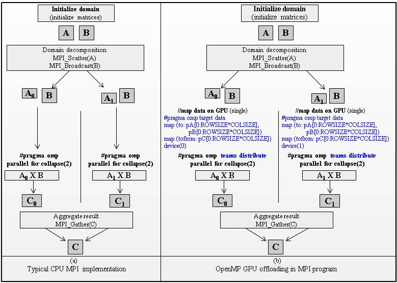

## 考察

表 1 は、Spectrum MPI と XLC コンパイラーを使用して、Power AC922 サーバー上で今回のコードをコンパイルした際のコマンドです。

##### 表 1. OpenMP の GPU オフロードを使用した MPI と非 MPI 行列乗算のコンパイル

| **OpenMP の GPU オフロードを使用した MPI 行列乗算** | **OpenMP の GPU オフロードを使用した非 MPI行列乗算** |
| --- | --- |
| `mpicc -o mpi_ompGO mpi_mm.c mm.c gpuoffload.c -qsmp=omp -qoffload -qtgtarch=sm_70 -lcudart -L/usr/local/cuda/lib64`| `xlc -o ompGO main.c gpuoffload.c -qsmp=omp -qoffload -qtgtarch=sm_70 -lcudart -L/usr/local/cuda/lib64` |
| `-O3 -qhot -mcpu=power9 -mtune=power9 -maltivec` | `-O3 -qhot -mcpu=power9 -mtune=power9 -maltivec` |

### GPU スケーラビリティ

これまでの GPU プログラミングと対比して、MPI と非 MPI の実装における単一 GPU へのオフロードは、容易であり最小限の労力とコード変更のみが必要であることが分かりました。2 つ以上の GPU 上にアプリケーションをスケールさせる場合、使用可能な GPU にワークロードを分散する必要があります。非 MPI アプリケーションに比べると、MPI アプリケーションで GPU スケーラビリティを達成することは、比較的容易であると考えられます。これは、タスク間でのデータの区分化とワークロードの分散が、MPI プログラミングの枠組みに元から備わっているためです。各 MPI タスクは、単一の GPU にマップすることができます。マップされたタスクは、それ自身のワークロードを対応する GPU にオフロードします。今回の MPI 実装では、タスクと GPU をマップするための最小限のコードを追加するだけで、2 つ以上の GPU 上にコードをスケールさせることができました。非 MPI 実装の場合、プログラマーはデータの区分化と GPU へのワークロード分散のロジックを実装する必要があります。今回の非 MPI 実装では、複数 GPU 上にコードをスケールさせるために、単一 GPU 実装に比べてコードの変更がおおよそ 20% 多くなりました。図 7 は、CPU 単独時のパフォーマンスと比べた GPU スケーラビリティと速度向上です。

##### 図 7. MPI 行列乗算の GPU の速度向上

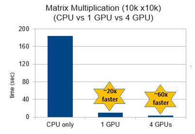

### 通信時間

図 8 は、OpenMP による GPU オフロードを使用した MPI と非 MPI の行列乗算コードの、CPU 時間、GPU 時間、および通信時間です。MPI 実装は、相対的により多くの時間がかかります。これは通信に追加の時間を必要とするためですが、どちらのケースでも CPU と GPU でかかる時間は変わりません。大きさの異なる行列で検証（図 9 参照）では、行列の大きさが大きくなるにつれて、計算強度が上がるため相対的通信時間が徐々に減少しました。

##### 図 8. MPI と非 MPI プログラムでの CPU 時間、GPU 時間、および通信時間

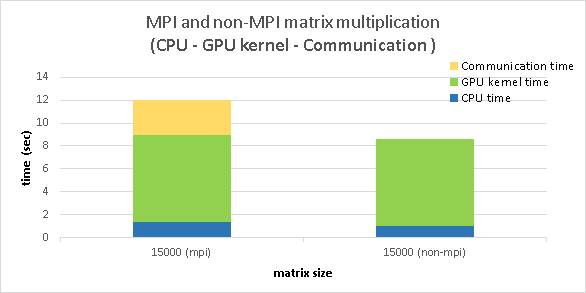

##### 図 9. 行列サイズに対する MPI 通信時間

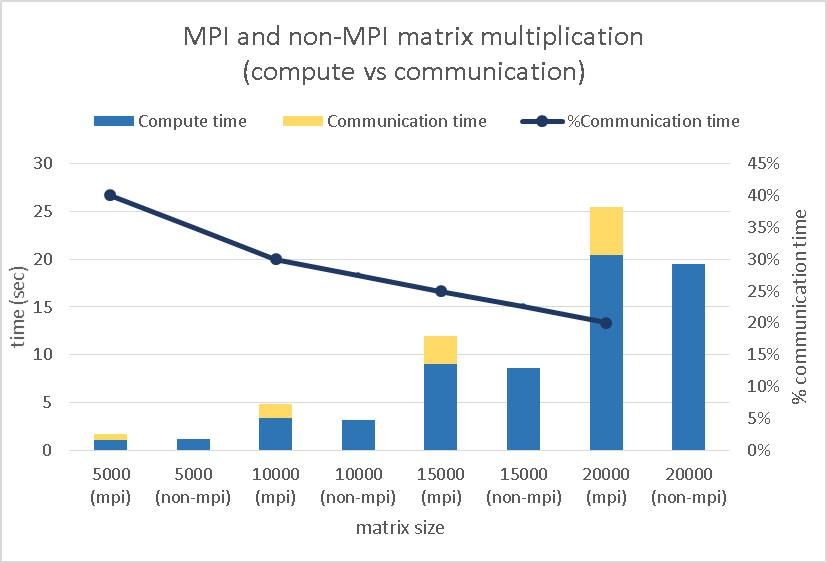

## ヘテロジニアス型クラスターにおける GPU 監視

各ノードのそれぞれの GPU アクティビティとメモリーの統計を監視するためには、nvidia-smi と numastat ツールを利用することができます。[前の記事](../../Articles/gpu-programming-with-openmp/)で、これらのツールについて説明しました。

ヘテロジニアス型クラスター環境で、IBM Spectrum® LSF® は GPU の使用と GPU リソース監視を行う機能を提供します。bjobs、bhists、そして bacct といったコマンドは、-gpu オプションを使用することで、終了したジョブから GPU リソースの使用情報を表示することができます。bhosts、lshosts、そして lsload といったコマンドは、-gpu オプションを使用することで、GPU 利用率、メモリー使用量、状態、エラー、温度、その他を表示することができます [[5](#ref)] [[6](#ref)]。図 10、11、12 は、NVIDIA V100 GPU を搭載した 2 台の Power AC922 サーバー・ノード上で、GPU 化した MPI アプリケーションを実行した際の lsload と bhosts コマンドの出力です。

さらに、IBM Spectrum LSF は、構成、ヘルスチェック、各種 GPU 関連の障害診断を行うために、NVIDIA の data center GPU manager（DCGM）を組み込むことができます [[7](#ref)] [[8](#ref)]。

##### 図 10. lsload コマンド（-gpu オプション）を使用したヘテロジニアス環境における GPU モニタリング

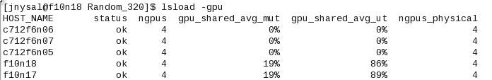

##### 図 11. lsload コマンド（-gpuload オプション）を使用したヘテロジニアス環境における GPU モニタリング

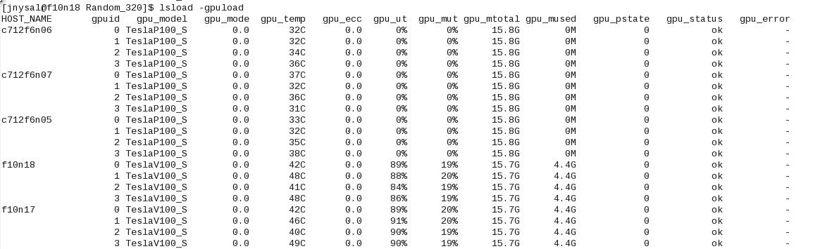

##### 図 12. bhosts コマンドを使用したヘテロジニアス環境における GPU モニタリング

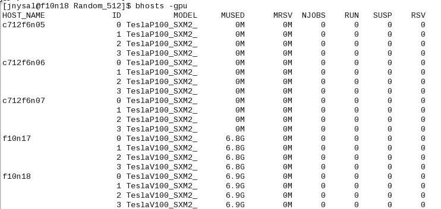

## まとめ

ヘテロジニアス型システムは、エクサスケール・コンピューティングの競争において新しい時代を築きつつあります。プログラマーは、ヘテロジニアス型システムに搭載される各種計算ユニットで動くアプリケーションの開発や適応化を行う必要があります。OpenMP コミュニティは、CPU と GPU を使用する並列プログラミングの汎用（ベンダー非依存）モードをサポートするための努力を続けてきました。この記事は、MPI と非 MPI アプリケーションでの OpenMP GPU オフロードのメリットとデメリットを紹介しました。OpenMP の GPU オフロード・プラグマを使用することで、いかなるアプリケーションも、最小限の開発労力で複数 GPU 上にスケールさせることができます。

<a id="ref" />

## 参考情報

1. [A full description of OpenMP 4.5 data and programming constructs](https://www.openmp.org/wp-content/uploads/openmp-4.5.pdf)
1. [Code optimization with IBM XL compilers on Power architectures](https://www-01.ibm.com/support/docview.wss?uid=swg27005174&amp;aid=1)
1. [Engineering and Scientific Subroutine Library (ESSL) version 6.2](https://www.ibm.com/support/knowledgecenter/SSFHY8_6.2/navigation/welcome.html)
1. [IBM Spectrum MPI](https://www.ibm.com/support/knowledgecenter/en/SSZTET_10.3/welcome.html)
1. [Monitoring GPU resources using IBM Spectrum LSF](https://www.ibm.com/support/knowledgecenter/SSWRJV_10.1.0/lsf_gpu/chap_monitor_gpu_resources.html)
1. [Enabling GPU features in IBM Spectrum LSF](https://www.ibm.com/support/knowledgecenter/SSWRJV_10.1.0/lsf_gpu/chap_enable_gpu_features.html)
1. [Integrating IBM LSF scheduler and NVIDIA DCGM](https://www.ibm.com/support/knowledgecenter/en/SSWRJV_10.1.0/lsf_gpu/lsf_gpu_nvidia_dcgm_features.html)
1. [NVIDIA Data Center GPU Manager Simplifies Cluster Administration](https://devblogs.nvidia.com/nvidia-data-center-gpu-manager-cluster-administration/)
1. [CUDA Basic Linear Algebra Subroutine Library (cuBLAS)](https://docs.nvidia.com/cuda/cublas/index.html)
1. [A case study for performance portability using OpenMP 4.5](https://sc18.supercomputing.org/proceedings/workshops/workshop_files/ws_waccpd109s2-file1.pdf)
1. [Experiences Porting Mini-applications to OpenACC and OpenMP on Heterogeneous Systems](https://cug.org/proceedings/cug2019_proceedings/includes/files/pap137s2-file1.pdf)
1. [Targeting GPUs with OpenMP 4.5 Device Directives](http://on-demand.gputechconf.com/gtc/2016/presentation/s6510-jeff-larkin-targeting-gpus-openmp.pdf)
1. Benchmarking and Evaluating Unified Memory for OpenMP GPU Offloading
   - [https://www.researchgate.net/publication/320748250_Benchmarking_and_Evaluating_Unified_Memory_for_OpenMP_GPU_Offloading](https://www.researchgate.net/publication/320748250_Benchmarking_and_Evaluating_Unified_Memory_for_OpenMP_GPU_Offloading)
   - [https://llvm-hpc4-workshop.github.io/slides/Li.pdf](https://llvm-hpc4-workshop.github.io/slides/Li.pdf)
1. [OpenMP Accelerator Support for GPUs](https://www.openmp.org/updates/openmp-accelerator-support-gpus/)
1. [OpenMP compilers and tools](https://www.openmp.org/resources/openmp-compilers-tools/)
1. [Performance analysis of OpenMP on a GPU using a CORAL proxy application](https://www.researchgate.net/publication/301461578_Performance_analysis_of_OpenMP_on_a_GPU_using_a_CORAL_proxy_application)
1. [Porting and Optimizing Applications for AC922 servers using OpenMP and Unified Memory](https://openpowerfoundation.org/wp-content/uploads/2018/10/Leopold-Grinberg.OpenPOWER2018.pdf)

## 付録

このセクションは、本検証で使用した非 MPI と MPI の行列乗算アプリケーション・コード・セグメントのリストです。

#### 非 MPI 行列乗算

##### リスト 1. 行列乗算 – OpenMP による複数 GPU にオフロードする非 MPI 実装

```
void matrix_multiplication_multigpuoffload()
{
    //distribute work on multiple GPUs
    #pragma omp parallel sections
    {
        #pragma omp section
        {
            m_multiply(0);  // run on GPU 0
        }
        #pragma omp section
        {
            m_multiply(1);  // run on GPU 1
        }
        #pragma omp section
        {
            m_multiply(2);  // run on GPU 2
        }
        #pragma omp section
        {
            m_multiply(3);  // run on GPU 3
        }
    }
}
```

##### リスト 2. OpenMP の GPU オフローディング・ディレクティブを使用した行列乗算関数

```
// 注：ROWSIZE と COLSIZE は行列の行数と列数を定義したマクロです

void m_multiply(int gpuid)
{
    int i = 0; int j = 0; int k = 0;

    // get the number of devices (GPUs) on the node.
    int ng = omp_get_num_devices();

    // calculate number of elements per GPU
    int num_elements = ROWSIZE*COLSIZE/ng;

    // find the starting index of array for respective GPU
    int startInd = gpuid*num_elements;

    // start and end of i-index for square matrix traversal
    int is = gpuid * (ROWSIZE/ng);
    int ie = is + (ROWSIZE/ng);

  // OpenMP map clause to copy data to/from GPU
    #pragma omp target data
    map (to: pA[startInd:num_elements],pB[0:ROWSIZE*COLSIZE])
    map (tofrom: pC[startInd:num_elements]) device(gpuid)
    #pragma omp target
    map (to: pA[startInd:num_elements],pB[0:ROWSIZE*COLSIZE])
    map (tofrom: pC[startInd:num_elements]) device(gpuid)
  // distributes the work among team of GPU threads
    #pragma omp teams distribute parallel for collapse(2) private(i,j,k)
    for(i=is;i<ie;i++)
    {
        for(j=0;j<COLSIZE;j++)
        {
            for(k=0; k<COLSIZE; k++)
            {
                pC(i,j)+=pA(i,k)*pB(k,j);
            }
        }
    }
}
```

#### MPI 行列乗算

##### リスト 3. 行列乗算 – OpenMP の GPU オフロードによる MPI 実装

```
// 注：ROWSIZE と COLSIZE は行列の行数と列数を定義したマクロです
 int main(int argc, char** argv)
 {
       int pid;        // process rank
    int np;        // number of processes
       int ng = 4;         // number of GPUs
       int msize = COLSIZE;    // matrix size

      MPI_Init(&argc,&argv);
      MPI_Comm_size(MPI_COMM_WORLD, &np);   // assign total number of tasks
      MPI_Comm_rank(MPI_COMM_WORLD, &pid); // assign rank

    // initialize all matrices
       init_arrays_matmul_mpi(np, pid);

       MPI_Barrier(MPI_COMM_WORLD);
       double start = MPI_Wtime();

       // broadcast matrix size to all tasks
       MPI_Bcast ( &msize, 1 , MPI_INT , 0 , MPI_COMM_WORLD ) ;

       //0th task split pA and send to np tasks.
       MPI_Scatter( pA , ROWSIZE/np * COLSIZE, MPI_DOUBLE , recA , ROWSIZE/np * COLSIZE, MPI_DOUBLE , 0, MPI_COMM_WORLD ) ;

       // broadcast copy of pB to all tasks
        MPI_Bcast ( pB, ROWSIZE * COLSIZE, MPI_DOUBLE , 0 , MPI_COMM_WORLD );

       #ifdef MPI_MM_GPU
                gpuid = pid*ng/np;
                matrix_multiplication_gpuoffload(gpuid, np, pid, recA, recC);
       #else // run on CPU
                matrix_multiplication(np, pid, recA, recC);
       #endif

       //0th task gather result (recA) from all tasks.
       MPI_Gather( recC, ROWSIZE/np * COLSIZE, MPI_DOUBLE, pC, ROWSIZE/np * COLSIZE, MPI_DOUBLE, 0, MPI_COMM_WORLD);

        MPI_Barrier(MPI_COMM_WORLD);
        double end = MPI_Wtime();
        double time = end - start ;
        printf (" ********** process %d : time = %f \n" , pid , time ) ;

 MPI_Finalize();

     return 0;
 }
```

##### リスト 4. OpenMP の GPU オフローディングを使用した行列乗算関数

```
void matrix_multiplication_gpuoffload(int gpuid, int np, int pid, double *pA, double *pC)
{
    int i = 0; int j = 0; int k = 0;

    #pragma omp target data
map (to: pA[0:ROWSIZE/np*COLSIZE],pB[0:ROWSIZE*COLSIZE])
map (tofrom: pC[0:ROWSIZE/np*COLSIZE]) device(gpuid)
    #pragma omp target device(gpuid)
    #pragma omp teams distribute parallel for collapse(2) private(i,j,k)
    for(i=0;i<ROWSIZE/np;i++)
    {
        for(j=0;j<COLSIZE;j++)
        {
            for(k=0;k<ROWSIZE;k++)
            {
                pC(i,j)+=pA(i,k)*pB(k,j);
            }
        }
    }
}
```

## 謝辞

著者は、Tom Heller と Leopold Grinberg の貴重な意見と技術レビューに感謝いたします。
