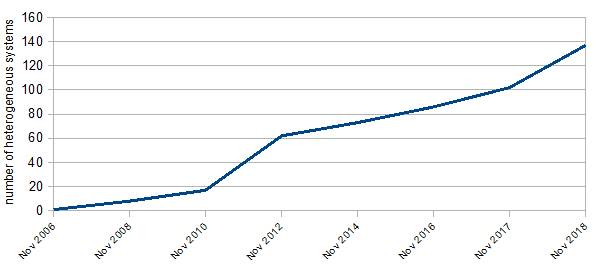
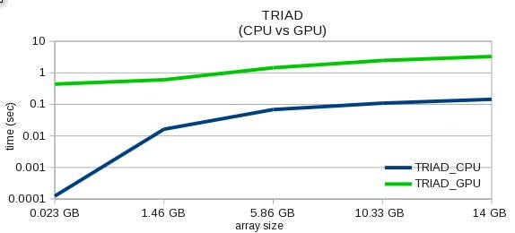
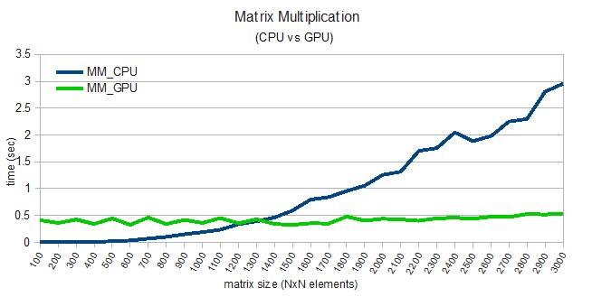
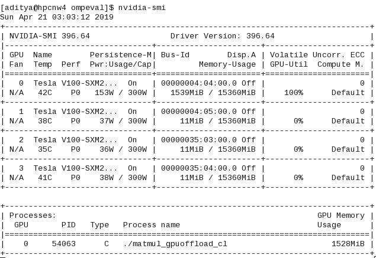
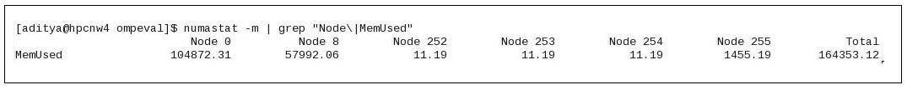

# OpenMP on IBM POWER でわかりやすく解説する GPU プログラミング − パート 1

### OpenMPを使用したアーキテクチャー非依存プログラミング

English version: https://developer.ibm.com/articles/gpu-programming-with-openmp/

###### 最新の英語版コンテンツは上記URLを参照してください。

### Author: Aditya Nitsure, Himanshu Shrivastava, Pidad Dsouza
last_updated: 2019-06-13


## 背景
エクサ級コンピューティングへの競争において、エネルギー消費は最大の課題です。エネルギー消費を計画値に抑える方法のひとつは、複数のプロセッサー・アーキテクチャーを使用するヘテロジニアス・コンピューティングを採用することです。現時点での世界最高速スーパーコンピューターは [IBM&reg; Summit](https://www.ibm.com/thought-leadership/summit-supercomputer/) であり、これは4068個のIBM Power&reg; 計算ノード（IBM POWER9&trade; プロセッサー・テクノロジー）と27,648個のNVIDIA Voltaグラフィックス処理装置（GPU）を搭載した、ヘテロジニアス型システムです。アクセラレーターを使用したヘテロジニアス型システムを使用する傾向は、一貫して続いています。今日、トップ500スーパーコンピューターの30%は、アクセラレーター搭載のヘテロジニアス型システムです。図1は過去10年間のアクセラレーター搭載スーパーコンピューターのトレンドです。

*図 1. Top500リストにおけるヘテロジニアス（アクセラレーター搭載）型システム（参照元： [https://www.top500.org/statistics/list/](https://www.top500.org/statistics/list/)）*  


過去10年間で、多くのHPCアプリケーションがGPU上で動作するようになりました。適切なプログラミングによって、アクセラレーター（GPU）はアプリケーションのパフォーマンスをN倍に高速化できることが分かりました。ここで、Nは2、5、10あるいはさらに大きな値を取ることもあります。そこにはばらつきがあり、アプリケーションのタイプ、アルゴリズム、そしてハードウェア等に依存します。

## はじめに

GPUは、数千にも及ぶ小さなプロセッシング・コアから大量の計算パワーを得ています。数千のスレッドを並行して実行可能であり、従ってデータ並列処理やsingle-instruction multiple-data（SIMD）ワークロードに最適です。NVIDIA CUDAプログラミングは、よく使われているプログラミング・モデルです。GPU上で稼働するアプリケーションを開発するためには、このタイプのプログラミングに精通していなければなりません。そして、GPUに最適化するためには、アプリケーションを再構築する必要があります。

OpenMP GPUプログラミングは、CUDAプログラミングに代わるものです。このディレクティブ・ベースの技法は、CPUにおけるメモリー共有型並列化の分野ではすでによく知られており、技法の習得やアプリケーション・プログラムでの実装が容易です。また、GPUで高速化するソフトウェアの移植性を、さらに高める方法を提供します。OpenMP標準の目的のひとつは、プログラム内にGPUベンダー固有のステートメントを記述する必要性を最小にすることです。これによって、異なるGPUアーキテクチャー間でのコードの移植性を高めます。

OpenMP標準4.0以降のバージョンでは、C、C++、およびFORTANプログラミング言語に対するプラグマが導入され、ワークロードを汎用GPUにオフロードできます。OpenMP GPUによるオフロードの詳細な使用方法は、OpenMP仕様 [[7](#ref7)]  とインターネット上にあるGPUオフロードの例で確認することができます。以下の論文 [[1](#ref1)]、[[2](#ref2)]、[[3](#ref3)] はGPUにオフロードするプラグマの使用方法を説明しています。本記事は、16GBメモリのNVIDIA Telsa V100 GPUを4個搭載したIBM Power AC922サーバーを使用して、メモリー主体と計算主体のアプリケーションに対してOpenMPでGPUにオフロードした際のメリットを評価します。ここでは、メモリー主体のTriadコードと計算主体の行列積用GPUオフロードOpenMPプログラムを使用します。図3のように、行列が大きくなってくると、行列積でのGPUへのオフロードのメリットが明確に見えてきます。

ワークロードをGPUにオフロードするためには、OpenMPデバイス構文を使用します。`target` 構文でデバイス上で起動する領域を指定します。`target data` は変数をデバイス上にマップします。`target` 内の `teams` プラグマは、複数のOpenMPスレッドと共にチーム・セットを生成します。`distribute` 構文は、反復を分割し各チームにマップします。以下のリストは、GPUオフロードに必要なプラグマの要約です。

**デバイス構文**:  

* `omp target data`
* `omp target`
* `omp target update`
* `omp declare target`
* `omp teams`
* `omp distribute`
* `omp distribute parallel for`
* `omp declare target`
* 組み合わせ構文、またはネストした構文

**仕様4.5におけるオフロードの機能拡張**:  

* `firstprivate`、`private`、および`defaultmap` の `target` 構文への追加
* `map` 節の拡張
* 組み合わせディレクティブ用 `if` 節
* 暗黙的 `firstprivate`
* `omp target enter data`
* `omp target exit data`
* `omp target parallel`
* `nowait` と `depend` 節の `target` 構文への追加
* `omp target simd`

ワークロードをGPUにオフロードするためには、コンパイラーがGPUへのオフロードをサポートし、またGPUと連携するためのインターフェース（ライブラリー）をGPUベンダーが提供する必要があります。ここでの実験では、IBM XLCとCLANGコンパイラーを用いて、OpenMPでGPUにオフロードするTriadと行列積コードをコンパイルしました。IBM XLC 13.1.5とCLANG 6.0コンパイラーで、OpenMP 4.0仕様のGPUオフロード（NVIDIA GPUが対象）に対する基本的なサポートが行われました。さらに、IBM XLC 16.1.1とCLANG 7.0以降で、OpenMP 4.5仕様のGPUオフロードに対するサポートを開始しました [[9](#ref9)]。両コンパイラーともNVIDIAインターフェースを使用してGPUカーネルを起動し、必要な場合はCPU・GPU間のデータ転送を行います。

表1で示すコンパイラーのフラグは、XLCとCLANGコンパイラーでOpenMPでGPUオフロードのプログラムをコンパイルするために使用するものです。GPUにワークロードをオフロードするようにコンパイラーに指示する、つまりコンパイラーにGPU特有のコードを生成させるためには、XLCでは `-qsmp=omp & -qoffload` を、CLANGでは `-fopenmp` を使用します。XLCとCLANGでそれぞれ `-qtgtarch` と `-fopenmp-targets` を使用して、対象 [GPUアーキテクチャー](https://www.ibm.com/support/knowledgecenter/en/SSXVZZ_13.1.6/com.ibm.xlcpp1316.lelinux.doc/compiler_ref/opt_tgtarch.html) を指定します。 *Sm_70* はNVIDIA Tesla V100 GPUアーキテクチャーを表し、_nvptx64-nvidia-cuda_ は64ビット・プラットフォーム用NVIDIAデバイス・オフロード・ツールチェーンを使用することを示します。NVIDIA GPUを使用する際は、プログラムをCUDAランタイム・ライブラリー（**libcudart.so**）と共にリンクする必要があります。このライブラリーは、通常CUDAツールキット導入時にCUDA導入ディレクトリー（/usr/local/cuda/lib64/）に導入されます。

*表 1. OpenMP GPUオフロードのプログラムをXLCとCLANGでコンパイルする際のフラグ*  

| XLCコンパイラー使用時のGPUオフロード | CLANGコンパイラー使用時のGPUオフロード |
|--|--|
|`#xlc -o ompGO main.c gpuoffload.c -qsmp=omp -qoffload -qtgtarch=sm_70  -lcudart -L/usr/local/cuda/lib64` | `#clang -o ompGO main.c gpuoffload.c -fopenmp -fopenmp-targets=nvptx64-nvidia-cuda   -lcudart -L/usr/local/cuda/lib64`|

## OpenMPにおけるGPUオフロードに関する考察

Triadプログラムはメモリ主体のベンチマークで、CPUメモリー・サブシステムに負荷をかけるために設計されたものです。Triadオペレーションは、通常以下のように3つの一次元配列を用いて、1回の反復で2回の浮動小数点演算を実行します。

A[i] = B[i] + *constant* `*` C[i]

リスト1は、OpenMPを用いてGPUにワークロードをオフロードするTriadコードです。図2は、CPUとGPUオフロード時のTriadオペレーション完了に要した時間で、GPUメモリーに収まる最小から最大サイズの配列に対して計測したものです。

*リスト 1. OpemMPプラグマを用いてGPUにオフロードするTriadオペレーション*  

```
    #pragma omp target data map (to: c[0:N], b[0:N]) map(tofrom: a[0:N])
    #pragma omp target teams distribute parallel for
    for (j=0; j<N; j++)
    {
        a[j] = b[j]+scalar*c[j];
    }
```

*図 2. CPUとGPUにおけるTriadオペレーション*  


GPU TriadオペレーションはCPUとGPU間のメモリー転送が支配的です。GPUで行う計算は最低限の量で、計算と転送がオーバラップすることはほとんどありません。GPUでの計算は瞬時に終了しますが、GPUの計算能力がアプリケーション全体のパフォーマンスに恩恵を与えることはありません。

Triadプログラムに比べると、行列積はメモリーと計算主体です。典型的なに二次元行列積は、2個の入力と1個の結果、合計3個の配列を必要とし、エレメント計算毎に2N回の浮動小数点演算を伴います。

リスト2はOpenMPでワークロードをGPUにオフロードする行列積コードです。図3は、CPUとGPUオフロード時の異なる行列サイズの行列積に要した時間です。

*リスト 2. OpenMPプラグマを使用した行列積のGPUオフロード*  

```
    #pragma omp target data map (to: pA[0:N*N],pB[0:N*N]) map (tofrom: pC[0:N*N])
    #pragma omp target
    #pragma omp teams distribute parallel for collapse(2) private(i,j,k)
    for(i=0;i<N;i++)
    {
        for(j=0;j<N;j++)
        {
            for(k=0;k<N;k++)
            {
                pC(i,j)+=pA(i,k)*pB(k,j);
            }
        }
    }
```

**注**：3つの行列は一次元配列として割り当てられ、便宜上次のようなマクロを用いてアクセスされます： `#define pA(i,j) (pA[((i)*N) + (j)])`

*図 3. CPUとGPUにおける行列積*  


図3のグラフから、小さい行列のワークロードをGPUにオフロードしても、アプリケーションの全体パフォーマンスには貢献しないということが分かります。しかし、問題の規模が大きくなるにつれて、行列積における計算の部分は O(N<sup>3</sup>) で増えます。行列のサイズが約1300 x 1300になると、CPUのパフォーマンスはGPUと同じになります。さらに大きい行列では、CPUとGPU間のデータ転送は些細なものとなり、GPUへのオフロードはパフォーマンスに対してメリットを発揮します。

## OpenMP GPUオフロードのモニタリング

CPUで稼働するジョブのモニタリングには、`top` コマンドが使用されます。同様に、ワークロードがGPUにオフロードされている場合のNVIDIA GPUのモニタリングには、 `nvidia-smi` コマンドを使用します。`nvidia-smi` コマンドは計算に寄与するGPU、その占有度合い（使用率）、メモリー消費量などを表示します。図4は、行列積プログラム実行中の `nvidia-smi` コマンドの出力です。

**注**：*nvidia-smi* ツールはCUDAツールキットの一部であり、CUDAツールキットを導入したシステム上で利用可能となります。

*図 4. GPUにオフロードしたOpenMP行列積実行中のnvidia-smi出力イメージ*  


`numastat` ツール（`numactl` パッケージの一部）も、CPUとGPUで稼働しているプロセスのメモリー統計をチェックするために使用できます。全メモリー、使用中メモリーとフリー・メモリー、NUMA（Non-Uniform Memory Access）ノード毎のNUMAヒットとミスを表示します。NUMAについて、ヘテロジニアス型システムではCPUとGPU双方から取得した情報を提供します。`-m` オプションを使用すると、meminfoのようにシステム全体のメモリー使用情報を表示します。`-p` オプションを使用してプロセスIDを指定することができ、特定プロセスのノード毎のメモリー割り当てを確認することができます。図5は行列積プログラム実行中の `numastat` コマンドの出力です。`numastat` 出力で、Node 0とNode 8はCPUノードであり、GPUはNode 252から255として表示されています。システム構成から、Node 255はGPU0にマップされていることが分かります。占有メモリー量は1455MBに増加しており、これはプロセス（行列積）がGPU0上で稼働しているからです。

*図5. GPUにオフロードしたOpenMP行列積実行中のnumastat出力イメージ*  


## まとめ

ヘテロジニアス型システムの時代がやってきています。GPUアクセラレーター搭載のIBM Power AC922は、このハイ・パフォーマンス・コンピューティング（HPC）時代の先頭を走っています。オープン・スタンダード、異なるGPUアーキテクチャー間の移植容易性、プログラミング容易性、そして（CPU共有メモリー型プログラミングにおいて）広く受け入れられている状況は、OpenMPをヘテロジニアス型システムにおける有望なプログラミング・モデルに位置付けています。この記事では、OpenMPプラグマの使用方法、IBM POWER9プロセッサー・システム上でXLCとCLANGを使用したOpenMP GPUオフロード・プログラムのコンパイル、およびオフロードしたプログラムをモニターするツールの説明を行いました。また、Triadと行列積の例を用いて、メモリー主体と計算主体のOpenMP GPUオフロード・プログラムの振る舞いを紹介しました。GPUにオフロードするOpenMPプログラムを作成するために、プログラマーは `parallel for`、`teams`、および `distribute` 節に精通する必要があります。これらは並列度を上げるために必要不可欠です。ループを融合（collapse）することも並列度を上げます。CPU・GPU間のデータ転送を最小化、あるいはGPUでの計算とオーバーラップすることに取り組みましょう。

## 参考情報

1. <a id="ref3" /> [Performance Evaluation of OpenMP's Target Construct on GPUs \- Exploring Compiler Optimizations](https://pdfs.semanticscholar.org/ceea/16c7a3d5a7dda02a566e189f05ab2f72f23c.pdf)
1. <a id="ref5" />[CUDA C best practices guide](https://docs.nvidia.com/cuda/cuda-c-best-practices-guide/index.html)
1. <a id="ref6" />[OpenMP on GPUs, first experiences and best practices](http://on-demand.gputechconf.com/gtc/2018/presentation/s8344-openmp-on-gpus-first-experiences-and-best-practices.pdf)
1. <a id="ref7" />[A full description of OpenMP 4.5 data and programming constructs](https://www.openmp.org/wp-content/uploads/openmp-4.5.pdf)
1. <a id="ref8" />[Code optimization with IBM XL compilers on Power architectures](https://www-01.ibm.com/support/docview.wss?uid=swg27005174&aid=1)
1. <a id="ref9" />[OpenMP compilers and tools support](https://www.openmp.org/resources/openmp-compilers-tools/)
