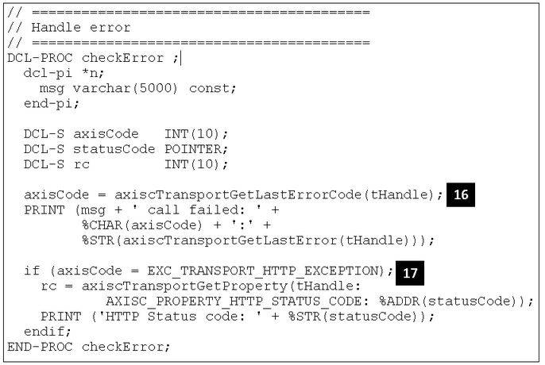

# RPGからユーザー定義SOAPとRESTメッセージの送受信

### 統合Webサービス・クライアントAPIはペイロードを送信する簡単な方法を提供します

English version: https://developer.ibm.com/articles/i-send-receive-user-defined-soap-rest-messages-trs/

###### 最新の英語版コンテンツは上記URLを参照してください。

### Author: Nadir Amra
last_updated: 2019-03-01

## はじめに

<sidebar>サポートされるIBM iオペレーティング・システムでAPIを使用するためには、以下のプログラム一時修正（PTF）が必要です： 
7.3: SI60805, SI60808  
7.2: SI60806, SI60809  
7.1: SI60807, SI60810
</sidebar>

ILEのための統合Webサービス・クライアントは、SOAPメッセージを送るために使われており、すでに数年の実績があります。SOAPメッセージ送付ではスタブを生成することで、SOAPのメッセージング・プロトコルの詳細を隠蔽します。スタブに生成された構造体のフィールドに値を設定し、Webサービスを呼び出し、レスポンスを受け取ります。この方法は大変うまく機能してきました。

しかし、スタブを経由せずにユーザー定義のペイロードだけを送りたいような場合、例えばスタブでは生成されないExtensible Markup Language（XML）ドキュメントなどではどうでしょう？あるいは、REST（Representational State Transfer）リクエストでJSON（JavaScript Object Notation）ペイロードを送りたくても、現状のスタブ生成はこれをサポートしません。どうしますか？

この質問への回答こそが統合Webサービス・クラアントです。クライアント・ライブラリーは拡張され、新しいアプリケーション・プログラミング・インターフェース（API）をサポートし、これによってユーザー定義ペイロードを送ることが可能になりました。この記事は、APIに関する情報およびILE RPGで書かれたAPI使用事例を紹介します。

## 新トランスポートAPIについて

クライアント・アプリケーションは、サーバーとの送受信を制御するために、トランスポートAPIを用いることができます。

RPGプログラミングでは、APIと定数は _include_ ファイル内で定義されます： `/QIBM/ProdData/OS/WebServices/V1/client/include/Axis.rpgleinc`

以下の表はトランスポートAPIの一覧です。トランスポートAPI機能の詳細は、[Integrated Web Services for IBM i](https://www-01.ibm.com/support/docview.wss?uid=isg3T1026868) サポート・ページの _Integrated Web Services Client for ILE programming_ を参照してください。

 **表 1. トランスポートAPI**
 <table border="0" cellpadding="0" cellspacing="0" class="ibm-data-table" data-widget="datatable" summary=""><thead> <tr> <th class="ibm-background-neutral-white-30"> <strong>関数</strong></th> <th class="ibm-background-neutral-white-30"> <strong>使用目的</strong></th></tr></thead> <tbody> <tr> <td style="vertical-align:top"> axiscTransportCreate() </td> <td style="vertical-align:top"> トランスポート・オブジェクトを作成する。 </td></tr> <tr> <td style="vertical-align:top"> axiscTransportDestroy() </td> <td style="vertical-align:top"> トランスポート・オブジェクトを破棄する。 </td></tr> <tr> <td style="vertical-align:top"> axiscTransportReset() </td> <td style="vertical-align:top"> トランスポート・オブジェクトを初期状態にリセットする。 </td></tr> <tr> <td style="vertical-align:top"> axiscTransportSetProperty() </td> <td style="vertical-align:top"> トランスポートのプロパティをセットする。 </td></tr> <tr> <td style="vertical-align:top"> axiscTransportGetProperty() </td> <td style="vertical-align:top"> トランスポートのプロパティを取得する。 </td></tr> <tr> <td style="vertical-align:top"> axiscTransportSend() </td> <td style="vertical-align:top"> トランスポートを通じてバイト列を送る。 </td></tr> <tr> <td style="vertical-align:top"> axiscTransportFlush() </td> <td style="vertical-align:top"> トランスポートのバッファー内データをフラッシュする。 </td></tr> <tr> <td style="vertical-align:top"> axiscTransportReceive() </td> <td style="vertical-align:top"> トランスポートからデータを受け取る。 </td></tr> <tr> <td style="vertical-align:top"> axiscTransportGetLastErrorCode() </td> <td style="vertical-align:top"> 直近で失敗したトランスポート・オペレーションのエラー・コードを取得する。 </td></tr> <tr> <td style="vertical-align:top"> axiscTransportGetLastError()  </td> <td style="vertical-align:top"> 直近で失敗したトランスポート・オペレーションのエラー文字列を取得する。 </td></tr></tbody></table>

以下は、トランスポートAPIを用いた場合の典型的なプログラムの流れです：

1. `axiscTransportCreate()` 関数を使用して、トランスポート・オブジェクトを作成する。関数コール時にWebサービスのURLを指定します。
2. `axiscTransportSetProperty()` 関数を使用して、トランスポートのプロパティに値をセットする（例：接続タイムアウト、HTTPメソッド、HTTPヘッダー、ペイロードのUTF-8への変換の有無、など）。
3. `axiscTransportSend()` 関数を使用して、（もし有れば）データを送る。データは`axiscTransportFlush()` をコールするまでバッファーされます。トランスポート・プロパティの AXISC_PROPERTY_CONVERT_PAYLOAD に"`false`"をセットしない限り、データは自動的にUTF-8に変換されます（”false”の場合、データはそのまま送付されます）。
4. `axiscTransportFlush()` 関数を呼び出して、リクエストをクライアントに送る。
5. `axiscTransportReceive()` 関数をコールして、リクエストに対するレスポンスを受信する。リクエストに対するHTTPレスポンスは、ヘッダーとステータスを含みます。HTTPレスポンスをコンシュームするために、データが返されない場合でもこのAPIを呼ぶ必要があります。トランスポート・プロパティの AXISC_PROPERTY_CONVERT_PAYLOAD に "`false`" をセットしない限り、データは自動的にUTF-8からジョブの文字化コードセットID（CCSID）に変換されます（”false”の場合、データはそのまま返送されます）。
6. `axiscTransportDestroy()` をコールしてトランスポート・オブジェクトを破棄します。

ここで、APIを使用してRESTリクエストを行うサンプル・クライアントを見てみましょう。

## この記事で用いるREST APIについて

本クライアント事例が呼び出すREST APIは、こちらの記事で説明されています：[パート 3：IBM i用統合Webサービス・サーバーを使用したRESTサービスの構築](../../Tutorials/i-rest-web-services-server3/)。この記事で開発されたREST APIが前提とするデータベースには、登録済学生情報が収められています。RESTの規則に則って、取得、追加、削除、および更新を行うことができます。表2はサンプル・コードで使用するAPIの要約です。

 **表 2. 学生情報登録サンプルにおけるREST API情報**
 <table border="0" cellpadding="0" cellspacing="0" class="ibm-data-table" summary=""> 
 <thead> 
     <tr> <th class="ibm-background-neutral-white-30"></th></tr>
 </thead>
 <tbody> 
 <tr> <th rowspan="6" scope="row">REMOVE</th> <th scope="row">URL</th>
   <td> <em>/context-root/students/{id}</em></td></tr>
     <tr> <th>Method</th> <td>DELETE</td></tr> 
     <tr> <th>Request body</th> <td>None</td></tr> 
     <tr> <th rowspan="3" scope="row">Returns</th> <td>204 No content</td></tr> 
         <tr> <td>404 Not found</td></tr> 
         <tr> <td>500 Server error</td></tr> 
 <tr> <th rowspan="6" scope="row">CREATE</th> <th scope="row">URL</th> <td> <em>/context-root/students</em></td></tr> 
     <tr> <th>Method</th> <td>POST</td></tr> 
     <tr> <th>Request body</th> <td>JSON</td></tr> 
     <tr> <th rowspan="3" scope="row">Returns</th> <td>201 Created</td></tr> 
         <tr> <td>409 Conflict</td></tr> <tr> <td>500 Server error</td></tr> 
         <tr> <th rowspan="5" scope="row">GETALL</th> <th scope="row">URL</th> <td> <em>/context-root/students</em></td></tr> 
<tr> <th>Method</th> <td>GET</td></tr> 
<tr> <th>Request body</th> <td>None</td></tr> 
<tr> <th rowspan="2" scope="row">Returns</th> <td>200 OK and JSON </td></tr> 
    <tr> <td>500 server error</td></tr>
</tbody>
</table>

学生情報登録データベースは、図1で示されるレコードを保持します。

 **図 1. 学生情報登録データベースのレコード**
 <figure></img></figure>

## APIの使用 – REST要求の送信

クライアント・アプリケーションは、以下のようにREST APIを呼び出します：  

1. DELETE HTTPメソッドを用いて登録済学生情報を削除する。
2. POST HTTPメソッドを用いて学生情報を登録する。
3. GET HTTPメソッドを用いて全ての登録済学生情報を取得する。

これ以上の前口上はやめて、新しいクライアントAPIを使用したコードを確認してみましょう。図2はコードの最初の部分です。

 **図 2. クライアント・アプリケーション・コード（パート1/7）**
 <figure></img></figure>

図2を見れば、フリー・フォーム・コードをサポートするILE RPGコンパイラーを使用していることが分かります。フリー・フォーム・コードでは1桁目から行末までを使用することができます。最初の行の1桁目に記述した `**FREE` によって、この指定を行っています（**1**）。それ以外で注目すべき点は、各種クライアントAPI機能のプロトタイプと関連する定数を取り込むための `/COPY` 文です（**2**）。

以下のコードは、登録済学生情報の削除を開始するロジックの最初の部分です。

 **図 3. クライアント・アプリケーション・コード（パート2/7）**
 <figure></img></figure>

行（**3**）のコメントを外して、トレースを有効化する関数をコールすることができます。コメントを外すと、`/tmp/axistransport.log` にトレース・ファイルを作ります。 表2から、リソースを削除するためには、URIのフォーマットが `/`_context-root_`/students/`_{id}_ でなければならないことが分かります。この例では、識別コード823M934LAのリソース（登録済学生情報）を削除します（**4**）。`axiscTransportCreate()` APIをコールしてトランスポート・オブジェクトを作成し（**5**）、`axiscTransportSetProperty()` APIをコールしてHTTPリクエストで使用するメソッドをDELETEにセットします（**6**）。これで全てです。リクエスト送信に伴うペイロードはありません。`flushAndReceiveData()` サブルーチンをコールして、リクエストをサーバーに送ります（**7**）。このルーチンに関する詳細は後述しますが、サブルーチンの基本的な動きは、リクエストの送信とレスポンスへの対応です。

図4のコードは、新しい学生情報の登録レコードを作成するロジックです。

 **図 4. クライアント・アプリケーション・コード（パート3/7）**
 <figure></img></figure>

`axiscTransportReset()` APIの呼び出し時にURIを指定し、新しい学生情報の登録レコードを作成します（**8**）。JSONデータを送らなければならないので、`axiscTransportSetProperty()` APIを呼び出してHTTPリクエストのコンテンツ・タイプをapplication/jsonにセットし（**9**）、同じAPIを使用してHTTPメソッドをPOSTにセットします。リクエストのペイロードはJSON形式で、登録用の新学生情報レコードを含みます（**10**）。`axiscTransportSend()` APIをコールして、データをトランスポート・オブジェクトに格納します（**11**）。サブルーチン `flushAndReceiveData()` をコールして、リクエストをサーバーに送ります（**12**）。

次のステップは、図5に示すように全ての登録済学生情報レコードの取得です。

 **図 5. クライアント・アプリケーション・コード（パート4/7）**
 <figure></img></figure>

新規学生情報登録レコードの作成時に使用したURIは、登録済学生情報レコードの取得でも使用するので、トランスポート・オブジェクトのリセットは不要です。登録済学生情報レコードを取得するには、HTTPメソッド `GET` を使用します（**13**）。ここでも、送信するリクエストにペイロードは不要です。`flushAndReceiveData()` をコールすることで、リクエストをサーバーに送ります（**14**）。最後に `axiscTransportDestroy()` APIをコールしてトランスポート・オブジェクトを破棄します（**15**）。

ここで、ヘルパー・サブルーチンを見てみましょう。図6は `PRINT()` サブルーチンです。このサブルーチンは、標準出力（stdout）にプリント出力するCのランタイムprintf()関数を使用します。したがって、`PRINT()` サブルーチンに渡されたデータは、全て標準出力に書き出されます。

 **図 6. クライアント・アプリケーション・コード（パート5/7）**
 <figure></img></figure>

図7は checkError() サブルーチンです。トランスポートAPIコール時にエラーが発生したら、`checkError()` サブルーチンをコールします：

 **図 7. クライアント・アプリケーション・コード（パート6/7）**
 <figure></img></figure>

このサブルーチンは、エラー・コードと関連するエラー・メッセージを標準出力に書き出します（**16**）。エラー・コードが、予期しないHTTPステータス・コードをサーバーが返したことを示すならば（**17**）、HTTPステータス・コードを取得して標準出力に書き出します。

図8は `flushAndReceiveData()` サブルーチンです。HTTPリクエストを送信し、HTTPレスポンスを受け取るために、このサブルーチンをコールします。

 **図 8. クライアント・アプリケーション・コード（パート7/7）**
 <figure></img></figure>

`axiscTransportFlush()` APIをコールして、HTTPリクエストの送信を開始します（**18**）。`axiscTransportReceive()` APIをコールして、HTTPリクエストに対するレスポンスを受け取ります（**19**）。データが存在する限り、処理すべきデータが無くなるまで `axiscTransportReceive()` APIをコールし続けます（**20**）。

## 実際のコードが動くところを見てみましょう

コードをコンパイルするには（ここでは、前述のRPGフリー・フォーム用PTFをロード・適用済みと仮定します）、以下のCLコマンドを実行します（ここで`<library>`を実際のIBM iライブラリーに置き換えてください）：

<code-listing html-highlight="all-highlighting-off"><pre> &lpar;newline&rpar;CRTRPGMOD MODULE(&lpar;less-thanlibrary&lpar;greater-than/CLIENTR) SRCSTMF('/clientrest.rpgle') &lpar;newline&rpar;CRTPGM PGM(&lpar;less-thanlibrary&lpar;greater-than/CLIENTR) MODULE(&lpar;less-thanlibrary&lpar;greater-than/CLIENTR) BNDSRVPGM((QSYSDIR/QAXIS10CC))</pre></code-listing>

プログラム作成後、QShellセッションを開始し（QSH CLコマンドを使用）、以下のコマンドを実行してプログラムを呼び出します：

<code-listing html-highlight="all-highlighting-off"><pre>system 'call &lpar;less-thanlibrary&lpar;greater-than/clientr'</pre></code-listing>

Webサービスがシステム上にデプロイ済みで、それが既に稼働しており、全てが正常に動作しているならば、図9に示すような情報が出力されるはずです。

 **図 9. クライアント・アプリケーション・コードの出力**
 <figure></img></figure>

削除オペレーションが行われてHTTPステータス・コードが204ならば、成功を意味し、サーバーは何も返しません。作成オペレーションが行われてHTTPステータス・コードが201ならば、新しいリソースが作成されたことを示します。最後に、全ての登録済情報レコードの取得が成功すれば、HTTPステータス・コードは200（OK）になります。このデータの中に、新しく作成した登録済学生情報レコードを見つけることができます。

## まとめ

新しいAPIを使用すると、HTTPトランスポートを通してユーザー定義ペイロードを送信ることができます。これがサポートされたことで、送信内容を厳密に管理しながらRESTリクエストやSOAPリクエストを送ることができるようになりました。APIはHTTPプロトコルの細かい部分の処理を行い、上位プログラムは送受信時のペイロードなどの重要な部分の処理を行います。私たちは統合Webサービスのユーザー経験の向上に努めています。ご意見をお待ちしています。
