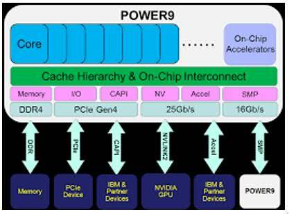
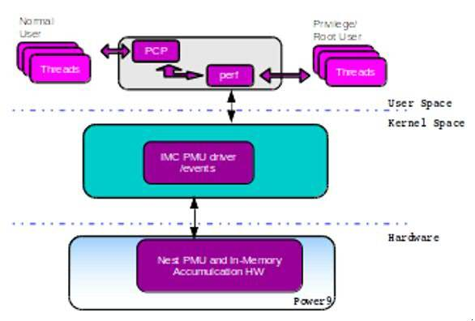
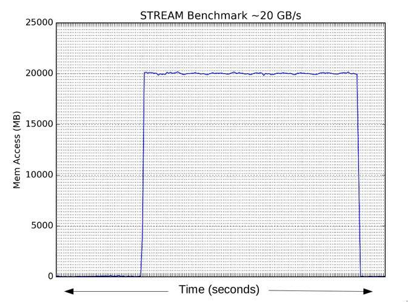

# IBM POWER9 インメモリー収集カウンター

### ネストPMUカウンターとLinux perfへの統合の概要

English version: https://developer.ibm.com/articles/power9-in-memory-collection-counters/

###### 最新の英語版コンテンツは上記URLを参照してください。

### Author： Anju T Sudhakar, Madhavan Srinivasan
last_updated: 2019-02-13


## 概要

IBM&reg; POWER9&trade; プロセッサーは、前世代のIBM POWERプロセッサーに対して新しい機能が追加されています。それらのうちの一つは、ネストPerformance Monitor Unit (PMU)で、これによりソケット・レベルでの資源の使用状況を詳細に計測することができます。この記事は、IBM POWER9プロセッサーに搭載されたネストPMUと、Linux perfへの統合を紹介します。また、ネストPMUのさまざまなハードウェアとソフトウェアのコンポーネントに言及し、IBM POWER9プロセッサーのネスト・ユニットの一つを例にあげて、イベントと実用的な測定基準とともに解説します。

## IBM ネストPMU

IBM POWER9プロセッサーを搭載するシステムには、ネスト・ユニットと呼ばれる多くの装置があり、これらはコアの中にはありませんが、チップ（コアの外側）に搭載されています。これらの装置は高いパフォーマンスを発揮するために、コアと密接に接続されています。ネスト・ユニットには、対称型マルチプロセッシング(SMP)インターコネクト、同期メモリー・コントローラー(Memory Controller Synchronous: MCS)、Coherently Attached Processor Proxy (CAPP)、NVLink装置、そしてオンチップ・アクセラレーターなどが含まれます。

ネスト・ユニットは、ソケットの全体的なパフォーマンスを向上するために、一体となって重要な役割を果たします。しかし、場合によってはそれがボトルネックになることもあり得ます。

インメモリー・データベースのようなメモリーを集中的に使用するアプリケーションを例に取ります。すでに高いメモリー帯域幅が使用されているソケットに、そのようなアプリケーションをスケジュールすると、アプリケーションのスループットを低下させ、各トランザクションの要求処理時間を増大させることがあり得ます。

## ネストPMUの利点

メモリ帯域幅の使用度合いは、CPU毎のPMUイベントによってもたらされます。しかし、そこにはコストが発生します。すなわち、帯域幅イベントに対する全プロセッサーのプログラムと、それを特定するためのカウンター・データの事後処理に伴うものです。しかも、全ての起こり得るメモリー処理に関する詳細を得られるとは限りません。

**Fig 1 : IBM POWER9 プロセッサー**  


ハイ・パフォーマンス・コンピューティング(HPC)の分野では、SMPインターコネクトの帯域使用量を知る事が重要です。これらの計測のためにCPU毎のPMUイベントを使用すれば、イベント・カウンター収集のためのアクションが頻繁に行われるために、OSジッターが増えることがあります。

IBM POWER9プロセッサーはネストPMUを実装しており、それによりソケット・レベルでのリソース使用状況を計測することが可能となります。それぞれのネストPMUは専用のパフォーマンス計測カウンターとハードウェア・イベントを持っています。これまでのプロセッサーPMUイベントと異なり、ネストPMUイベントはコアの外を行き交うデータに特化しています。IBM POWER9プロセッサーはハードウェアによる累積ロジックを実装しており、イベント・カウンター・データをネスト装置からメモリーに定期的に更新します。

## インメモリー収集

ネストを装備するためのエンドツーエンドLinuxソフトウェア・スタックを、インメモリー収集カウンターと呼びます。IBM POWER9のネストPMUとイベントは、Linux perf APIを通じて外部から参照されます。Linuxカーネル4.14あるいはそれ以降のバージョンでネストPMUがサポートされます。

**Fig 2 : インメモリー収集のためのLinuxインターフェース**


ネスト・ユニットはソケット・レベルの資源なので、監視を行うためには、高いレベルの権限（例えばrootユーザー）が必要です。また、ネストPMUは個別のプログラムのプロファイリングを行わないので、プログラム内部で何が起きているかを示すことはできません。

全てのネストPMUがシステム立ち上げ時に有効化されるわけではありません。PMUの有効化には、システム構成が重要な役割を果たします。ほとんどの基本的なネストPMU、例えばパワーバス、MCS、さらにXlinkのようなインターコネクト・バスは、有効化されます。しかし、NVLink、CAPP、そしてメモリー・バッファ・チップなどのようなPMUを有効化するためには、対応するカードがシステム内のスロットに装填されなければなりません。

ネストPMUカウンターの重要な優位点の一つとして、カウンター・データがハードウェアの累積ロジックによって、メモリーに累積されることがあげられます。これにより、カウンター・データに対するプログラムや読み込みに関する遅延が減少します。

## ネスト同期メモリー・コントローラー(Memory Controller Synchronous: MCS) PMU

同期メモリー・コントローラー(MCS)は、チップ・レベルの装置であり、メインメモリーのデータの出入りのフローを管理します。POWER9プロセッサーのMCSは、業界標準のDual Inline Memory Module (DIMM)を、バッファー・チップ付きと無しの形でサポートします。POWER9ネストMCS PMUはnest_mcs*_imcとして登録されます。システム構成によって、論理メモリー・コントローラーの数は異なります。ネストMCS PMUはたくさんの有用なイベントを提供し、その中にはソケット・レベルのリードとライトのカウントが含まれ、これらは合計メモリ帯域幅の計算において重要です。

例えば、MCSでサポートされるPMUイベントを取得するには、以下の `perf` コマンドを実行します:

```
# perf list nest_mcs
List of pre-defined events (to be used in -e):
nest_mcs01_imc/PM_MCS01_128B_RD_DISP_PORT01/ [Kernel PMU event]
nest_mcs01_imc/PM_MCS01_128B_RD_DISP_PORT23/ [Kernel PMU event]
nest_mcs01_imc/PM_MCS01_128B_WR_DISP_PORT01/ [Kernel PMU event]
nest_mcs01_imc/PM_MCS01_128B_WR_DISP_PORT23/ [Kernel PMU event]
nest_mcs01_imc/PM_MCS01_64B_RD_DISP_PORT01/ [Kernel PMU event]
nest_mcs01_imc/PM_MCS01_64B_RD_DISP_PORT23/ [Kernel PMU event]
nest_mcs01_imc/PM_MCS01_AMO_OP_DISP_PORT01/ [Kernel PMU event]
nest_mcs23_imc/PM_MCS23_128B_RD_DISP_PORT01/ [Kernel PMU event]
nest_mcs23_imc/PM_MCS23_128B_RD_DISP_PORT23/ [Kernel PMU event]
nest_mcs23_imc/PM_MCS23_128B_WR_DISP_PORT01/ [Kernel PMU event]
nest_mcs23_imc/PM_MCS23_128B_WR_DISP_PORT23/ [Kernel PMU event]
nest_mcs23_imc/PM_MCS23_64B_RD_DISP_PORT01/ [Kernel PMU event]
nest_mcs23_imc/PM_MCS23_64B_RD_DISP_PORT23/ [Kernel PMU event]
nest_mcs23_imc/PM_MCS23_AMO_OP_DISP_PORT01/ [Kernel PMU event]
#
```

上記はnest_mcs_imc PMUのための `perf list` コマンドの出力です。.

いくつかのネストPMUイベントにはスケール係数が付加されます。それぞれのイベントのスケール係数は、/sysfsディレクトリーにイベントの属性を加えてエクスポートされます。

例えば、MCSのネストPMUイベントのスケール係数を取得するには、以下のコマンドを実行します:

```
# pwd
/sys/bus/event_source/devices/nest_mcs01_imc/events
# ls
PM_MCS01_128B_RD_DISP_PORT01 PM_MCS01_128B_WR_DISP_PORT23.scale
PM_MCS01_128B_RD_DISP_PORT01.scale PM_MCS01_64B_RD_DISP_PORT01
PM_MCS01_128B_RD_DISP_PORT23 PM_MCS01_64B_RD_DISP_PORT01.scale
PM_MCS01_128B_RD_DISP_PORT23.scale PM_MCS01_64B_RD_DISP_PORT23
PM_MCS01_128B_WR_DISP_PORT01 PM_MCS01_64B_RD_DISP_PORT23.scale
PM_MCS01_128B_WR_DISP_PORT01.scale PM_MCS01_AMO_OP_DISP_PORT01
PM_MCS01_128B_WR_DISP_PORT23 PM_MCS01_AMO_OP_DISP_PORT01.scale
# cat PM_MCS01_128B_RD_DISP_PORT01.scale
256
```

それぞれの論理MCS双方のポートに、リードとライト128バイトのイベント・カウンターを追加することで、バイト単位の合計メモリー帯域幅を取得することができます。

合計メモリー帯域幅を取得するための手順は以下の通りです:

 1. シェル・プロンプトでperfコマンドを実行し、以下のようなイベントを開始します:

     ```
     `$` perf stat -e nest_mcs01_imc/PM_MCS01_128B_RD_DISP_PORT01/ -e nest_mcs01_imc/PM_MCS01_128B_RD_DISP_PORT23/ -e  nest_mcs01_imc/PM_MCS01_128B_WR_DISP_PORT01/ -e nest_mcs01_imc/PM_MCS01_128B_WR_DISP_PORT23/ -e nest_mcs23_imc/PM_MCS23_128B_RD_DISP_PORT01/ -e nest_mcs23_imc/PM_MCS23_128B_RD_DISP_PORT23/  -e nest_mcs23_imc/PM_MCS23_128B_WR_DISP_PORT01/ -e nest_mcs23_imc/PM_MCS23_128B_WR_DISP_PORT23/  -I 1000 –-per-socket
     ```

     **備考:**
     * perf `stat` コマンドの-eオプションはイベント・リストを表示します。
     * -Iオプションによって、カウンター・データをミリ秒単位を可能にします。上記の場合、間隔は１秒となります。
     * `--per-socket` オプションはソケット単位でカウンター・データを総計します。以下のような出力が表示されます（ここでは完全な出力は表示していません）:

     ```
     [……]
     3.010493181 S0        1                768      nest_mcs01_imc/PM_MCS01_128B_RD_DISP_PORT01/
     3.010493181 S0        1                  0      nest_mcs01_imc/PM_MCS01_128B_RD_DISP_PORT23/
     3.010493181 S0        1                256      nest_mcs01_imc/PM_MCS01_128B_WR_DISP_PORT01/
     3.010493181 S0        1                  0      nest_mcs01_imc/PM_MCS01_128B_WR_DISP_PORT23/
     7.769641499 S8        1                  0      nest_mcs01_imc/PM_MCS01_128B_WR_DISP_PORT23/
     7.769641499 S8        1              5,376      nest_mcs23_imc/PM_MCS23_128B_RD_DISP_PORT01/
     7.769641499 S8        1                  0      nest_mcs23_imc/PM_MCS23_128B_RD_DISP_PORT23/
     7.769641499 S8        1                256      nest_mcs23_imc/PM_MCS23_128B_WR_DISP_PORT01/
     7.769641499 S8        1                  0      nest_mcs23_imc/PM_MCS23_128B_WR_DISP_PORT23/
     [……]
     ```

 1. ソケットあたりの合計メモリー帯域幅をGB/秒で計算するために、以下の計算式を用います:

     ((Sum of all _RD_ counts) \* 64)/ (1024 \* 1024 \* 1024) + ((Sum of all _WR_ counts) \* 64)/ (1024 \* 1024 \* 1024)

以下のグラフはネストMCSカウンターから得られたメモリー帯域幅データを秒単位でプロットしたものです。ここでは、STREAMベンチマークで負荷をかけています。

**Fig 3 : ネストMCSカウンターから得られたメモリー帯域幅データ**


## まとめ

IBM POWER9には待望の新機能ネスト・カウンターが追加されました。perfコマンドを使用することで、数々の役立つ重要な計測値をシステムから簡単に取得することができます。このデータをトラブルシューティングや、パフォーマンス向上、さらにIBM Power Systems&trade; サーバー上で稼働するワークロードの効率向上に活用することができます。
