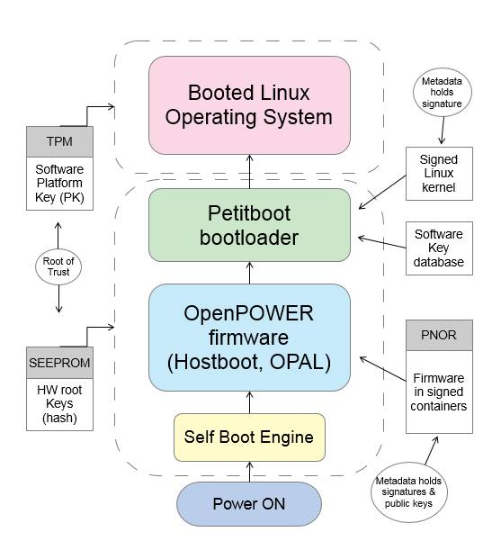
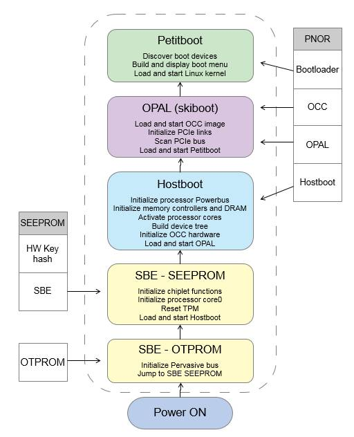
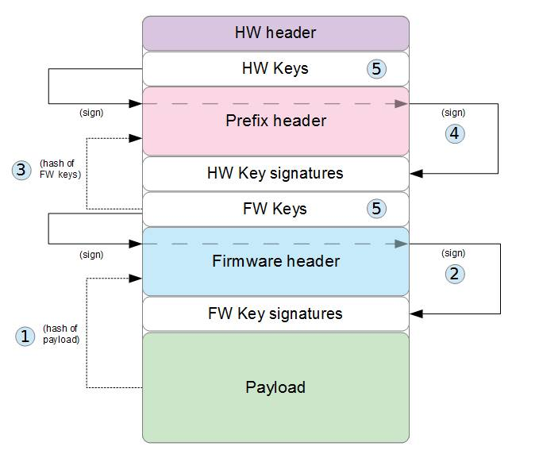
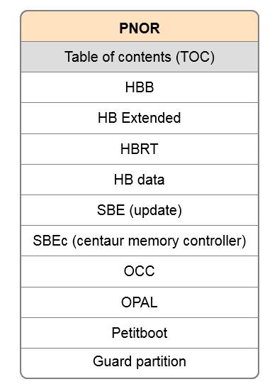
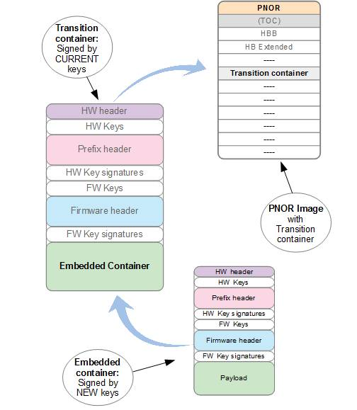

# OpenPOWERセキュア・ブートとトラステッド・ブート　パート２：IBM OpenPOWERセキュア・ブートによるシステム・ファームウェアの保護

### ブート・コードへのサイバー攻撃に対するシステム強化

English version: https://developer.ibm.com/articles/protect-system-firmware-openpower/

###### 最新の英語版コンテンツは上記URLを参照してください。

### Author： Dave Heller, Nageswara Sastry
last_updated: 2019-04-29

## はじめに

IBM&reg; OpenPOWERには、トラステッド・ブートとセキュア・ブートと呼ばれる２つの基本的なセキュリティ機能があります。これによって、サーバーの保全性を確保し、ブート・コードへのサイバー攻撃に対する防御を行います。トラステッド・ブートでは、システムのブート時に実行可能コードのセキュア記録・計測を行います。リモート承認と呼ばれるプロセスを用いることで、計測結果を安全に取得し、ファームウェアやターゲット・オペレーティング・システム（OS）の保全性を検証することができます。

セキュア・ブートも同様にOSとファームウェアの保全性の確保に役立ちます。ただし、後で確認するための計測を行うのではなく、セキュア・ブートはその場で妥当性の確認を行い、確認に失敗すればブート・プロセスを止めます。これら２つの機能はお互いを補完・協働し、プラットフォームのブート・コードに対する包括的な保護を行います。この記事では、システム・ファームウェアの保護に重点を置いて、セキュア・ブートの手法について説明します。

## セキュア・ブートとトラステッド・ブート

>セキュア・ブート：検証と強制

>トラステッド・ブート：計測と記録
* セキュア・ブートは、ブート中に悪意のあるコードを実行することを防ぐことで、システムの保全性を保ちます。
* トラステッド・ブートは、ブート中に特定のイベント・チェーンが起動したことを検証するための計測を行います。この計測結果は後に検査され、それらが信頼できるイベントであるかどうかを判定します。

トラステッド・ブートは保全性の計測を行い、その計測結果をトラステッド・プラットフォーム・モジュール（Trusted Platform Module: TPM）に記録します。リモート認証を経てこの計測結果を取得し、ファームウェアの保全性の検証に使用します。トラステッド・ブートの役割は、許可されていないファームウェアの検知、あるいは許可されていないOSやブート構成のロードの検知を可能にすることです。

この記事では、セキュア・ブートを詳説します。セキュア・ブートは、悪意のあるコードをブート中に実行しないことで、システムの保全性を保ちます。各実行モジュールをフラッシュ・メモリからロードするとき、セキュア・ブートがその真正性を確認します。検証に失敗すると、ブート・プロセスは止まります。セキュア・ブートの役割は、許可されていないファームウェアを実行しない、および許可されていないOSや構成のロードを行わないことです。

トラステッド・ブートを用いることで、許可されたファームウェア、OS、および構成でシステムをブートしたことを判定するために、リモート認証を使用することができます。また、トラステッド・ブートにより、ネットワーク・ベースの資源に対するアクセス管理を行えます。例えば、ホスト・ソフトウェアと構成が検証されるまで、OSによる保護されたデータ・ストアへのアクセスを拒否する、あるいはハイパーバイザーによる保護されたゲスト・イメージへのアクセスを拒否することができます。もちろん、このためにはサーバー外部でのサービスが必要となります。そのため、既存の認証やプロビジョンの仕組みを活用できるデータ・センターやクラウド・コンピューティング環境に適しています。これとは異なり、セキュア・ブートは確認をローカルで行い、外部のサービスを必要としません。

セキュア・ブートはトラステッド・ブートの必須基盤である「計測に対する信頼の基点のコア」（Core Root of Trust for Measurement: CRTM）を確立するためにも使用されます。CRTMによって、許可されたコードが計測した結果のみがTPMに書き込まれることを確実にします。OpenPOWERシステム上でCRTMを確立するためには、最低限のセキュア・ブートをファームウェアに実装しなければなりません。この記事では、CRTM以外の場面でのコンポーネント検証において、どのようにセキュア・ブートが使われるかを説明します。

## プラットフォーム・ファームウェアに対するセキュア・ブート保護

セキュア・ブートによって、各実行可能モジュールと暗号署名を照らし合わせ、確実にプラットフォーム・ファームウェアの保全性を保ちます。OpenPOWERサーバーのブート・プロセスで、一連の実行可能ファームウェア・コンポーネントをフラッシュ・メモリーからロードします。セキュア・ブートが有効になっていれば、ブート・シーケンス内の各コンポーネントは、次のコンポーネントを実行する前に、その保全性と真正性を検証します。保全性はセキュア暗号ハッシュ、例えばSHA512によって検証されます。真正性は楕円曲線ディジタル署名アルゴリズム（Elliptic Curve Digital Signature Algorithm: ECDSA）等の暗号署名によって検証されます。

セキュア・ブートは、全ての実行可能コンポーネントに対する信頼チェーンを確立します。この信頼チェーンは、ハードウェアによって裏付けられます。つまり、セキュア・ブートが最初の微小な実行コードを信頼するのは、書き換え不可能なシステムのハードウェアにそれが保管されているからです。しかし、これ以降に動作する各コンポーネントは、フラッシュ・メモリー内の非保護領域からロードされるため、検証されるまで信頼できません。セキュア・ブートは、各コンポーネントをフラッシュ・メモリーに保管します。保管場所は暗号署名を含むセキュア・コンテナーです。各コンポーネントをロードするとき、セキュア・ブートはコンポーネントを署名で認証し、失敗したらブートを止めます。

> セキュア・ブートは全ての実行可能ブート・コードに対する完全な信頼チェーンを提供し、それをプラットフォーム・ハードウェアが裏付けます。

## OpenPOWERサーバーのブート方法

図１はOpenPOWERのブート・フローの概要です。システムが、電源ボタンあるいはベースボード・マネジメント・コントローラー（Baseboard Management Controller: BMC）を通じてパワー・オン信号を受信すると、セルフ・ブート・エンジン（Self-boot Engine: SBE）と呼ばれる微小なコードが、フラッシュ・メモリーからOpenPOWERファームウェアのロードを開始します。ここでいくつかのステージのブート・コードがロードされます。この中には、HostbootやOpenPOWER Abstraction Layer（OPAL）が含まれます。（以降のセクションでファームウェア・レベルのブート・フローを詳しく説明します。）

数ステップ後に、ファームウェアはPetitbootブート・ローダーのステージに到達します。PetitbootはOpenPOWERのプラットフォーム・ブート・ローダーです。Petitbootは柔軟なブート・ローダーで、組み込みLinux®カーネルで稼働します。Petitbootはインテリジェント・ディスカバリー・プロセスを実行し、ローカルのストレージ装置上あるいはネットワーク越しに利用可能なブート可能メディアを検索します。その後、事前構成されたブート順序、あるいはユーザー入力（例えばブート・メニューからの選択）に従って、Petitbootはターゲットのブート・デバイスを選択し、オペレーティング・システムのロードを試みます。

**図１．OpenPOWERブート・フロー**  


## セキュア・ブートのセキュリティ・ドメイン

OpenPOWERのセキュア・ブートは２つのセキュリティ・ドメインで構成されます。それぞれ、ファームウェア・ドメインとオペレーティング・システム（OS）ドメインです。ファームウェア・ドメインは、Petitbootまでのプラットフォーム・ファームウェアのブートを管理します。オペレーティング・システム・ドメインはターゲットOSあるいはハイパーバイザーのブートを管理します。

各ドメインには暗号鍵が関連づけられ、該当ドメイン内のブート・コードの真正性を検証するために使われます。ファームウェア・ドメインに関連づけられた鍵は、ハードウェア（HW）鍵とファームウェア（FW）鍵と呼ばれます。OSドメインに関連づけられる鍵は、プラットフォーム鍵（Platform Key: PK）、鍵交換鍵（Key-Exchange Key: KEK）、そしてソフトウェア鍵データベース（DB）鍵です。

鍵の各セットは階層を構成し、指定ルート鍵と、ルート配下に１つ以上の鍵レベルが存在します。指定ルート鍵は、ファームウェア・ドメインの場合はHW鍵、OSドメインの場合はプラットフォーム鍵（PK）です。最下位階層レベルはコード署名鍵で、システム上での稼働を許可されたコンポーネントに電子署名するために使われます。ファームウェア・ドメインでは、実行可能ファームウェア・モジュールに署名するためにFW鍵を使います。OSドメインでは、DB鍵でブート可能OSイメージ（例えばLinuxカーネル）に署名します。鍵の階層を表１に示します。

**表１．鍵の階層**  
| セキュア・ドメイン | 鍵 | 機能 | ルート鍵？ | 秘密鍵所有者（通常時） |
| -- | -- | -- |-- | --|
|ファームウェア・ドメイン | HW（ルート）鍵 | ドメインに対する権限。FW鍵への署名 | Yes | プラットフォーム・ベンダー |
| |FW鍵 |ファームウェア・コンポーネントへの署名；HW鍵による許可| No |プラットフォーム・ベンダー|
| オペレーティング・システム・ドメイン | プラットフォーム鍵（PK） | ドメインに対する権限（ルート鍵）；KEK鍵への署名、KEKデータベースの更新を許可 | Yes | プラットフォーム所有者 |
| |鍵交換鍵（KEK） |DB鍵への署名とソフトウェア鍵の更新を許可|  No | OSベンダー |
| |ソフトウェア鍵データベース（DB）鍵| ターゲットOSあるいはハイパーバイザー（ブート可能Linuxカーネル）| No | OSベンダーあるいはプラットフォーム所有者 |

鍵は非対称鍵であり、それぞれの鍵には公開部分と秘密部分があります。秘密部分、あるいは秘密鍵は鍵所有者によって保護（秘匿）される必要があります。公開部分、あるいは公開鍵は公に配布しても構いません。機能的に表現すると、公開鍵は秘密鍵で作られた署名の検証に使われます。

ファームウェア・ドメインでは、HWとFW秘密鍵の管理は通常プラットフォーム・ベンダー：IBMあるいは相手先ブランド設計製造者（Original Design Manufacturer: ODM）です。場合によって、秘密鍵は最終顧客（プラットフォーム所有者）が保持することもあります。OSドメインでは、秘密PKはプラットフォーム所有者が保持します。鍵交換鍵は通常OSベンダー、例えばRed Hat、SUSE、あるいはUbuntu等が管理します。DB鍵はOSベンダー又はプラットフォーム所有者が管理します。

>OpenPOWERセキュア・ブートは、ファームウェア用とオペレーティング・システム用に、独立したセキュリティ・ドメインを提供します。各ドメインは暗号鍵階層によって保護されています。

図１に示されるように、各ドメインはプラットフォームのハードウェアに保存（あるいは保護）されている「信頼の基点」（Root of Trust）に依拠します。ファームウェア・ドメインでは、信頼の基点はHWルート鍵のセキュア・ハッシュです。HWルート鍵は、シリアルEEPROM（Serial Electrically Erasable Programmable Read-Only Memory: SEEPROM）として知られるフラッシュ・メモリー内の保護領域に保管されます。OSドメインでは、信頼の基点はソフトウェア・プラットフォーム鍵（PK）であり、TPM NVRAMに保管されます。

Petitbootブート・ローダーはファームウェア・ドメインの権限下にあることに注意してください。これは、PetitbootモジュールそのものがFW鍵で署名されているからです。PetitbootはOSドメインにある鍵を使用して、署名済みLinuxカーネルを検証します。

## OpenPOWERファームウェアのブート・シーケンス

図２はファームウェア・レベルでのブートの流れの詳細です。ブートはプロセッサーのセルフ・ブート・エンジン（Self Boot Engine: SBE）コードから始まります。SBEにはいくつかのステージがあり、最初の部分はプロセッサーのOTPROM（One-Time Programmable Read-Only Memory）に保管され、それ以外の部分はPOWERプロセッサー・モジュールのSEEPROMモジュールに保管されます。SBE（OTPROM）はPOWERプロセッサー内の通信に使われるパーベイシブ・バス（Pervasive bus）を初期化し、プロセッサーにSBE（SEEPROM）コードの実行を指示します。

**図２．OpenPOWERファームウェアのブートの流れ**  


SBE（SEEPROM）はいくつかのタスクを実行します。その中には、ホスト・プロセッサー・ベースのNORフラッシュ・メモリー（PNOR）へのアクセスの初期化を含みます。PNORには、残りのOpenPOWERファームウェアが保管されています。PNORは複数の論理区画に分かれており、各区画はファームウェア・モジュールを含みます。最初にロードされるイメージはHostboot Base （HBB）で、Hostboot実行コアと、Hostboot追加機能の初期化を行うドライバーとユーティリティを含みます。これらの追加機能はHostboot拡張イメージに保管され、それはPNORからロードされた後続イメージです。

Hostbootはいくつかのステップを実行します。その中には、Powerbus初期化やPOWERデバイス・ツリー作成を含みます。スリープ・ウィンクル（Sleep-Winkle：SLW）は電源状態を制御します。HostbootはSLWイメージとHostbootランタイム・サービス（HBRT）のロードと初期化を行います。最後に、HostbootはOPALをロードし、制御を渡します。

OPALはホスト側のPCIe（Peripheral Component Interconnect Express）バスの初期化を行い、利用可能なアダプターを検出します。最後にOPALはPetitbootブート・ローダーをロードし、これを実行します。そして、今度はPetitbootがOSのロードを行います。

以下は各OpenPOWERファームウェア・モジュールが行う機能の詳細です：

* セルフ・ブート・エンジン（SBE）（OTPROM） – ブート・プロセスを始動するために使用されるマイクロ・コントローラー。IBM POWER®プロセッサー内の通信に使用されるパーベイシブ・バスの初期化。SBE（SEEPROM）のコードにジャンプ
* セルフ・ブート・エンジン（SBE）（SEEPROM） – シングル・プロセッサー・コア、L2とL3キャッシュの初期化。さらに以下を実施：
    * チップレット機能（POWERプロセッサー内の独立した機能ユニット）の初期化
    * TPMのリセット
    * PNORフラッシュへのアクセスの初期化
    * PNORからHBBをL3キャッシュにロードし、HBBを実行
* Hostbootベース（Hostboot base: HBB） － Hostbootモジュールのコア、あるいはカーネル。POWERプロセッサー用一般実行環境、メッセージ交換、タスク制御、メモリー管理、および割り込みのサポートを提供
* Hostboot拡張イメージ － 残りのHostboot機能。コンテナー形式であり、Hostboot拡張表と呼ばれる目次とHostbootサブ・コンポーネントのコードが含まれる。Hostbootはブート時に以下の初期化を行う：
    * Powerbusを初期化し、プロセッサーと外部リソース、例えばキャッシュ、メイン・メモリー、I/Oを接続
    * メモリー・コントローラーの初期化、およびDRAM（主記憶）学習（タイミングとスループットの最適化）と初期化
    * 各コアのスリープ・ウィンクル（sleep-winkle：SLW）イメージのロードと初期化を行い、各コアに対してWinkle-Wakeupコールを呼び出し
    * 属性とシステム構成情報を保持するメモリー構造であるPOWERデバイス・ツリーを作成
    * Hostbootランタイム（HBRT）サービスのロードと初期化
    * OPAL層をロードし、実行の切り替え
* スリープ・ウィンクル（sleep-winkle: SLW） － ミニ実行エンジン。電源フル供給状態、スリープ（コアは電源オフ、キャッシュはアクティブ）状態、およびウィンクル（コアとキャッシュ双方の電源オフ）状態の間で、プロセッサーとL2・L3キャッシュの状態遷移を行う。
* オン・チップ・コントローラー（On Chip Controller: OCC） － OCCの実行可能イメージ。OCCはプロセッサーのための温度と電源管理の機能を制御する組み込みサブプロセッサー
* Hostbootランタイム（HBRT） － OS実行中にも常駐するHostbootの一部。プロセッサーとメモリーの実行時診断とOCCとのインターフェースを提供
* OpenPOWER抽象化層（OpenPOWER abstraction layer: OPAL） － PCIeバスの初期化を行い、POWERプラットフォーム・サービスへの標準インターフェースをオペレーティング・システム層に提供
* Petitbootブート・ローダー － 組み込み型Linuxカーネル。Petitbootブート・ローダー・アプリケーションを含む。ブート可能メディアの検出、ブート・メニューの構成と表示、およびランタイム・オペレーティング・システムのロード。

Hostboot、OPAL、およびOpenPOWERブート・プロセスに関する詳細は、[*OpenPower Firmware Documentation*](https://github.com/open-power/docs/) を参照してください。

## OpenPOWERセキュア・ブートの流れ

前述のように、全ての実行可能コンポーネントを対象として、あるコンポーネントが次のコンポーネントを検証した後に実行を許可することで、セキュア・ブートは信頼チェーンを確立します。信頼チェーンはハードウェアによって裏付けられている述べましたが、これは最初に実行されるコードであるSBEが、書き換え不可能なプロセッサーのOTPROMに保管されているからです。SBEの後続部分は保護されたSEEPROMに保管されており、それはHWルート鍵の権限、あるいは物理的な機器の操作をしなければ、更新できません。

残りのファームウェアはPNORに保管されており、それはフラッシュ・メモリー内の非保護領域です。PNORはBMCを通してアクセス可能であり、通常のファームウェア書き込み操作によって更新できます。適切なデバイス・ドライバーを使用すれば、実行中のオペレーティング・システムを経由してPNORを変更することが可能です。これらの手法はパスワードによって保護されるべきですが、このような保護はファームウェアにおける「信頼の基点」の対象外です。OpenPOWERセキュア・ブートは、PNORは信頼できないという前提で実装されています。

>OpenPOWERセキュア・ブートは、ファームウェア・コンポーネントは検証されるまで信頼できないと仮定しています。

PNORに導入されたファームウェアを保護するために、各コンポーネントはセキュア・コンテナーに保管されており、セキュア・コンテナーは暗号署名を内部に含んでいます。次モジュールがロードされるとき、前モジュールのセキュア・ブート・コードは、署名を用いて次モジュールの保全性と真正性を検証します。SBE（SEEPROM）はHBBを検証し、HBBはHostboot拡張イメージを検証し、同様に続きます。どこかでチェックが失敗したら、セキュア・ブートはシステムを止めます。

セキュア・ブートは、システム・ボード上のセキュア・モード無効化ジャンパーによって有効化されます。ジャンバーが取り除かれると、強制的にセキュア・モードに入り、各コンポーネントのセキュア・ブート・コードが活性化されます。ジャンパーがセットされていると、セキュア・モードは無効化され、ブート・プロセスはコンテナーのメタデータを無視し、署名の有無にかかわらずPNORからイメージをロードします。

セキュア・モードのステータスは、POWERデバイス・ツリーのエントリーを経由してファームウェア上位層（OPALとPetitboot）に伝えられます。セキュア・モードが有効化されると、デバイス・ツリーは以下のように作成されます：

```
# ls -l /proc/device-tree/ibm,secureboot/ total 0
-r--r--r--	1 root	root	18 Apr 1 06:00 compatible
-r--r--r--	1 root	root	7 Apr 1 06:00 hash-algo
-r--r--r--	1 root	root	64 Apr 1 06:00 hw-key-hash
-r--r--r--	1 root	root	15 Apr 1 06:00 name
-r--r--r--	1 root	root	4 Apr 1 06:00 phandle
-r--r--r--	1 root	root	0 Apr 1 06:00 secure-enabled
```

デバイス・ツリーのノードは、SEEPROMに刻み込まれたH/W鍵のハッシュ値も含みます。これは、３つのH/Wルート鍵（公開部分）のSHA512ハッシュです。

```
# cat /proc/device-tree/ibm,secureboot/hash-algo sha512

# cat /proc/device-tree/ibm,secureboot/hw-key-hash | xxd -p 40d487ff7380ed6ad54775d5795fea0de2f541fea9db06b8466a42a320e6 5f75b48665460017d907515dc2a5f9fc50954d6ee0c9b67d219dfb708535 1d01d6d1
```

## ファームウェア鍵の階層

表１のように、ファームウェア・ドメインは２レベル鍵階層を用いています。ルート鍵はH/W鍵で、署名鍵はFW鍵です。つまり、HW鍵がFW鍵に署名し、FW鍵がファームウェア・コンポーネントに署名します。各セット毎に３つの鍵があり、それによって署名プロセスにおける職務分掌が可能になります。

これらは非対称鍵であり、それぞれ公開部分と秘密部分があります。現在の実装では、512ビットECDSA鍵の使用が指定されています。秘密鍵は安全に保存されなければならず、IBM 4767 PCIe Cryptographic Coprocessorのようなハードウェア・セキュリティ・モジュール（Hardware Security Module: HSM）に保管する必要があります。公開鍵はコンポーネントのコンテナーに追加され、ブート時の署名確認で使用します。

鍵の階層をHWで裏付けるために、POWERプロセッサーSEEPROM内の保護されたフラッシュ・メモリーに、３つのHWルート公開鍵のSHA512ハッシュが組み込まれます。このハッシュを組み込むプロセスを刻印プロセスと呼び、プラットフォーム・ベンダーあるいはプラットフォーム所有者が（通常一回のみ）行います。セキュア・ブートがPNORからコンテナーをロードするとき、各セキュア・コンテナー内のHW鍵ハッシュを、SEEPROMに保管されている値に照らし合わせます。これが、ファームウェアの署名に使用した鍵が適切に許可されていることを、セキュア・ブートが検証する方法です。

>OpenPOWERファームウェアはセキュア・コンテナー内のフラッシュ・メモリーに保管されており、セキュア・コンテナーはセキュア・ブート検証で必要なメタ・データを提供します。

## セキュア・ファームウェア・コンテナー

OpenPOWERファームウェアの各コンポーネントはセキュア・コンテナーにパッケージされ、セキュア・コンテナーはセキュア・ブート検証に必要なハッシュと署名を保持します。コンテナーは、現実にはファームウェア・イメージの前に付けられたメタデータ・ヘッダーです。

図３は簡略化したコンテナーのレイアウトです。ヘッダーはファームウェアのビルド・プロセス中、あるいはその後のパッケージングのステップで作成されます。ヘッダーを構成するために、以下のステップを実施します：

1. ファームウェア・イメージ（コンテナーのペイロード）のハッシュ（SHA512）を、ファームウェア・ヘッダーと呼ばれるヘッダー領域に追加する
1. ３つのFW鍵所有者によるファームウェア・ヘッダーへの署名情報の作成を要求し、署名情報をファームウェア・ヘッダー直後の領域に追加する
1. ３つのFW鍵のハッシュを計算し、これをプリフィックス・ヘッダーと呼ばれるヘッダー領域に追加する
1. ３つのHW鍵所有者によるプリフィックス・ヘッダーへの署名情報の作成を要求し、署名情報をプリフィックス・ヘッダー直後の領域に追加する（FW鍵はHW鍵によって署名されたペイロードであると言えます）
1. 公開HW鍵のコピーをハードウェア・ヘッダーと呼ばれる領域に追加し、公開FW鍵をプリフィックス・ヘッダーのペイロード領域に追加する

**図３．セキュア・ブート・コンテナーの構築**  


図では署名操作はコンテナー・ヘッダー内のHWとFW鍵が行なっているように表現されています。現実には、HWとFW秘密鍵を用いて署名操作を行い、それらの鍵は安全に保管されています。コンテナー・ヘッダーに追加する鍵は公開鍵で、検証に用います。図の署名フローは、図解上の表現にすぎません。

ヘッダーは秘密鍵やシークレットを含みません。各署名済みペイロードの信頼チェーンの確立に必要な公開情報のみを含みます。これで、セキュア・ブートは十分な情報を得られたので、各ペイロードの検証に必要な３つのステップを完了できます：

1. ３つのFW鍵を用いて、ペイロードに対する署名を検証
1. ３つのHW鍵を用いて、FW鍵に対する署名を検証
1. HW鍵のハッシュとプロセッサーSEEPROM内のハッシュが合致することを検証

３つの条件が満たされると、セキュア・ブートはコンポーネントの実行を許可します。

OpenPOWERファームウェアはいくつかのコンテナーで構成され、それらは区分化されたPNORイメージにパッケージされます。このPNORイメージが、新しいホスト・ファームウェアをOpenPOWERサーバーに書き込むときに更新されます。

図４はPNORイメージのレイアウトを示しています。コンポーネント・ヘッダーが作られると、コンテナー化されたコンポーネントをPNORイメージに追加します。このとき、必要なパディングが行われ、その後、目次（Table of Contents: TOC）を作成し、区画のオフセットを記載します。

**図４．PNORイメージ・レイアウト**  



## ファームウェア鍵管理

サーバーの調達方法や使用目的に依存しますが、HWとFWの秘密鍵は、IBM、ODMベンダー、あるいは最終顧客が管理します。OpenPOWERサーバーをIBMから購入する場合、IBM HW鍵のハッシュがSEEPROMに組み込まれた形で、システムが提供されます。ファームウェア更新は、IBM Fix Central等を通じて、IBMから得られます。IBMがリリース用にファームウェアをパッケージするとき、IBM管理の鍵を用いてコンテナーをビルドします。IBMの製造プロセスでは、これらの鍵はHSMに保管され、秘密鍵がHSM外に流出することはありません。サーバーがセキュア・モードにあるとき、IBMの署名が無いファームウェアでブートすることはできません。

同様に、OpenPOWERサーバーをODMベンダーから購入する場合、ODMのHW鍵のハッシュがSEEPROMに組み込まれた形で、システムが提供されます。ファームウェア更新は、ODMがサポートする方法で得られます。

鍵の階層構造は、他の目的でも使用できます。OpenPOWERサーバーを使用する企業は、独自の鍵を管理し、独自のファームウェアに署名することを選択できます。例として、企業固有のセキュリティや機能要件に基づいて、独自のファームウェアを作成するデータ・センターのお客様が挙げられます。この場合、企業は独自のHW鍵ハッシュをシステムSEEPROMに組み込むことができます。この後で説明しますが、これは刻印プロセスを通じて行われます。企業は、独自ファームウェアへの署名や書き込み用PNORイメージの構築に関して、責任を持ちます。

職務における責任分担があるならば、２階層の鍵を用いることで、異なるファームウェア・モジュール（Hostboot、OPALなど）ビルドを担当するグループ間で、企業内部での職務分掌を実現できます。セキュア・ブートは、各ファームウェア・モジュールに対して異なるFW鍵を使用し、各FW鍵セットは同じHW鍵で署名することを許容します。HW鍵所有者は、PNOR内の全ファームウェア・モジュールに対する権限を持ち、それ故に、機器全体に対する権限を持ちます。

前述のように、HWとファームウェアの各セット毎に３つの鍵を用いることで、各署名オペレーションでの職務分掌を実現できます。３つ全てを用いる場合、セキュア・ブートでは、コンテナー・ヘッダー内に３つの鍵による署名が必要です。つまり、３つのFW鍵の所有者は、ファームウェア・モジュールをブート可能にするために、ファームウェア・モジュールに署名しなければなりません。３つのHW鍵の所有者は、モジュールを許可するために対応するFW鍵に署名しなければなりません。

## プラットフォームHW鍵の更新（鍵の移行）

３つのHW鍵のハッシュがSEEPROMに刻印されるので、これらHW鍵の所有者は実質上プラットフォームの所有者となります。セキュア・モードが有効である場合、これらの鍵によって許可されなければ、どのようなファームウェアでもシステムはブートしません。

プラットフォーム所有者は、SEEPROM内のHW鍵ハッシュを更新することでHWルート鍵を変更しても構いません。これは刻印プロセスを通して行います。最初に、移行用コンテナーを含む特別なPNORイメージを用意します。移行用コンテナーは現行HW鍵で署名しますが、新HW鍵を用いて署名したペイロードを含みます。このペイロードは、実際にはコンテナーが埋め込まれたものです。埋め込まれたコンテナーは、通常のコンテナーと同様に見えますが、現行鍵ではなく新HW鍵で署名されています。この様子を図５に示します。

**図５．PNORイメージと移行コンテナー**  


システムは、ブート時にPNOR内の移行コンテナーを検出します。具体的には、Hostbootモジュールがこの機能を行います。次に、プレフィックス・ヘッダーの署名部分にセットされた鍵移行ビットを確認します。もしビットがセットされていれば、Hostbootは鍵移行のためのコードに移動します。この時点までは、全ての実行可能コードが現在のHW鍵で検証されていることに注意してください。

ここから、移行用コードは埋め込まれたコンテナーにアクセスします。このコンテナー・ヘッダー内のHW鍵フィールドは、新しい（移行先の）HW鍵と、その鍵で生成された署名フィールドを保持しています。SEEPROMを更新する前に、この鍵が使用可能であることを確かめるために、移行用コードは新しい鍵を用いて全ての通常検証ステップを実施します。これによって、使用できない鍵でSEEPROMを更新することを防ぎます。

これで、移行用コードがSEEPROMを更新するために必要なものが全て揃いました。現行鍵の所有者のみがこのパッケージを作成できるので、操作は許可されていると言えます。新しい鍵を用いて、少なくともひとつの有効なコンテナーを署名できたので、この鍵は使用可能です。移行用コードは新しい鍵の（SHA512）ハッシュを計算し、SEEPROMに書き込み、現行の値を上書きします。ここで、システムは停止しシャットダウンします。

次に、新しいHW鍵で署名されたPNORイメージを書き込みます。これ以降、全てのイメージはこの鍵で署名されます。今回は、システムは通常のブートを行います。全体を通してセキュア・モードが有効になっており、現地での作業は不要であることに注意してください。全ての操作はBMCを通じてリモートで行うことができます。

## プラットフォームHW鍵の入れ替え（キーの回復）

使用者が現在のHW鍵の所有者ではない、あるいは鍵が失われた（秘密鍵が修復不能になった）ような場合は、SEEPROM内のHW鍵ハッシュを入れ替えるために現地での作業が必要となります。使用者はセキュア・モードを無効化できる強制ジャンパーをセットしなければなりません。移行コンテナーは現行HW鍵で署名されないことを除けば、その後のプロセスは上記と同じです。

SEEPROMが更新されると、新しい鍵で署名されたPNORイメージを書き込み、セキュア・モード無効化ジャンパーをとり外し、システムの電源を入れます。これでシステムはセキュア・モードで通常ブートします。これ以降、全てのイメージは新しいHW鍵で署名されていなければなりません。

## OpenPOWERオープン・ソース・ファームウェア

前のセクションで、いくつかのセキュア・ブートの機能とコードについて説明しました。OpenPOWERでは、すべてのファームウェア・コンポーネントはオープン・ソースであり、誰でもソース・コードを入手できます。コードを確認することで、これまでに説明してきたセキュア・ブートの機能について調べることができます。

OpenPOWERファームウェアは [*OpenPOWER Firmware Build Environment*](https://github.com/open-power/op-build) あるいはop-build上でビルドされ、これはオープン・ソースのコラボレーション・サイトである [*Github*](https://github.com/) 上で運用されています。 op-buildは [*buildroot*](https://github.com/open-power/buildroot) を用いてtoolchainを作成し、[*Hostboot*](https://github.com/open-power/hostboot)、[*skiboot*](https://github.com/open-power/skiboot)、[*OCC*](https://github.com/open-power/occ)、そして [*Petitboot*](https://github.com/open-power/petitboot) ブートローダー等、さまざまなファームウェア・コンポーネントのビルドを行います。セキュア・ブートに関わるほとんどのコードのコミットは、"secure"、"secure boot"、あるいは"secureboot"と類似のラベルが付けられています。このリストを調べたり、これらの単語で検索することで、これらのコミットを見つけることができます。例えば、skiboot内でセキュア・ブートとトラステッド・ブートを実装するライブラリは、libstbと呼ばれます。libstb APIは2016年9月28日に、[*d15dd47*](https://github.com/open-power/skiboot/commit/d15dd47) のコミットIDで、skibootに対してコミットされています（訳注：最新のコミットはGithub上で確認してください）。

>OpenPOWERセキュア・ブート・ファームウェアは、全てオープン・ソースで実現されており、オープン・スタンダートに準拠したセキュリティ機能を実装しています。

## OpenPOWERはオープン・プラットフォーム

OpenPOWER鍵移行プロセスによって、システムの構成方法や提供時期に関わらず、プラットフォーム所有者が機器に対する権限を獲得できます。OpenPOWERセキュア・ブートの権限を、元来のプラットフォーム所有者に固定し変更不可能にすることはできません。

OpenPOWERオープン・ソース・ファームウェアによって、プラットフォーム所有者はオープン・ファームウェア・スタックを、セキュア・モードのシステムで稼働することができます。これは、システムに初期導入されているファームウェアに依存しません。HW鍵ハッシュを新しい公開鍵ハッシュで更新することで、企業または個人ユーザーは、所有するファームウェアへの署名と安全なブートを行うことができます。

ここで、OpenPOWERセキュア・ブートは、ベンダー固有あるいは専有ファームウェアの使用を除外するものではないことに注意してください。ODMは一部または全体が非公開のコードに基づいた、セキュアな署名済みファームウェアを提供することができます。また、専有機能を提供するコードのソースを非公開にすることを選択できます。OpenPOWERセキュア・ブートは、稼働させるファームウェアとして、代替としてのオープン・ソース・ファームウェア・スタック、あるいは任意のファームウェアの選択肢をプラットフォーム所有者に提供します。

権限の新基点を確立することは、標準的なプラットフォーム所有者が選択することではないかもしれません。それを行うためには、プラットフォーム所有者は固有のファームウェアに署名しなければなりません。なぜならば、HW鍵ハッシュを更新した後は、セキュア・モード下のシステムはODMが署名したパッケージで起動しないからです。プラットフォーム所有者が、ファームウェアを最新の利用可能なバージョンに保つことを望む、すなわちセキュリティ・パッチの導入、バグの訂正、機能向上を行うためには、ファームウェアの定期的な再ビルドと署名を行う必要があります。

機能・信頼・オープンに対するプラットフォーム所有者の要件を、ODM提供のファームウェアが満たしているならば、この責任を果たすことにほとんどメリットを感じないでしょう。しかし、プラットフォーム所有者にODMが満足できない機能要件がある、あるいはODMファームウェア（または外部組織が提供するコード）を信頼しない場合、その機器に対する、独立した権限の新基点を確立することを選択できます。

## OpenPOWERファームウェアの更新

OpenPOWERホスト・ファームウェアは、ファームウェア・ダウンロード・パッケージに含まれるpUpdateユーティリティを用いて、BMC経由で更新することができます。ホスト・ファームウェア更新版は `.pnor` という拡張子が付いた１つのファイルで、前述の通りPNORのすべてのコンテンツを含んでいます。以下の例は、ネットワーク・ベースあるいはアウト・オブ・バンド方式で新しいPNORイメージを書き込んでいます。この例で使われているIPアドレスは、BMCのものです。操作にはBMCの管理者権限が必要です。

```
$ pUpdate -pnor P8DTU20161202_IBM_prod_sign.pnor -i lan -h 10.10.10.10 \
-u ADMIN -p ADMIN
version str len=8
Version info are not available.
If the PNOR update fails, PLEASE TRY AGAIN. Transfer data ................
Load	335872 bytes, 33554560 bytes
Load  1678336 bytes, 33554560 bytes
Load  4027392 bytes, 33554560 bytes
Load 15099904 bytes, 33554560 bytes validating PNOR image ................ Image validation passed.
Updating PNOR flash ................ updating new PNOR firmware ...74% updating new PNOR firmware ...93% updating new PNOR firmware ...100% "PNOR Update Complete."
```

更新はサーバーが稼働中でも可能で、稼働中のホストには影響を与えません。ファームウェアの更新は、次回のリブートで有効になります。

pUpdateユーティリティは、POWERとx86両システムのLinuxでサポートされます。ファームウェア・ダウンロード・パッケージは、各アーキテクチャの実行可能pUpdateを含みます。

## セキュア・ブート操作の検証

システムがセキュア・モードで正常にブートを開始したら、ブート中システム・コンソール上に `"secure mode on"` メッセージが表示されます：

```
[ 4.142741818,5] NVRAM: Size is 576 KB
[ 4.334350410,5] STB: secure mode on. [ 4.335615219,5] STB: trusted mode on
[ 4.338939542,5] ROM: romcode driver registered
[ 4.340772248,5] TPM: tpm0 registered: driver=i2c_tpm_nuvoton felsz=2018
```

セキュア・ブートで失敗した場合、失敗の内容によってコンソール出力は異なります。ブート・プロセス初期での失敗、例えばPNORからの最初のイメージ・ロード時に検証が失敗したような場合、システム・コンソールには何も表示されません。システム・コンソールへのアクセス機能を初期化する前に、SBEステージで失敗することもあり得ます。

後続ステージでのセキュア・ブートの失敗、例えば一部PNORイメージのみの検証が成功したような場合、コンソールには失敗のメッセージが表示されます。以下の例では、システムはOPALまでは正常にブートしましたが、OPALがPetitbootブート・ローダー・モジュール（ここでは `BOOTKERNEL0` ）の検証に失敗しています：

```
Verification fail:
STB: sb_verify failed: resource BOOTKERNEL0 STB: Secure mode enforced, aborting.
Aborting!
```

このように、システムがブートするためには、**すべての** ファームウェア・コンポーネントが正しく検証されなければなりません。いずれかのイメージが壊れたり改竄されると、セキュア・ブートはシステムを停止します。

## まとめ

IBM OpenPOWERサーバーは、セキュア・ブートとトラステッド・ブート双方の機能を提供します。それにより、システム・ファームウェアの保全性確保と、ブート・コードに対するサイバー攻撃からの保護を行います。トラステッド・ブートでは、重要なシステム・ファームウェアのセキュア計測と結果の保管を行い、その後の結果取得と独立した検証を可能にします。セキュア・ブートでは、破損あるいは許可されていないファームウェアの実行を防ぎ、ファームウェの検証に失敗したらシステムを停止します。これらの機能が合わさって、システムのブート・コードの統合的な保護を行います。そして、そのプラットフォームは全てオープン・スタンダード準拠のオープン・ソース・ファームウェアに基づいています。
