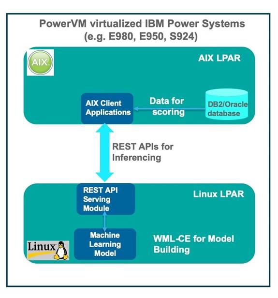
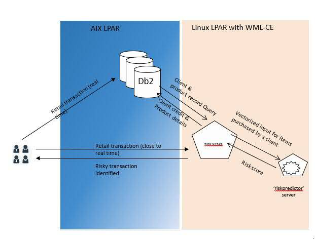

# IBM PowerVMで仮想化されたIBM Power Systemsへの人工知能（AI）環境の設定

### IBM AIX上のデータに対する推論

English version: https://developer.ibm.com/tutorials/ai-enterprise-power-systems/

###### 最新の英語版コンテンツは上記URLを参照してください。

### Author: Sanket Rathi, Kavana N Bhat, Phani Kumar Ayyagari
last_updated: 2019-09-10

## はじめに

人工知能（AI）が成熟するにつれて、あらゆる業界がAIの採用に動いています。これまで秘匿されていたデータ上の知見を解放し、戦略的に使おうとしています。多くの企業が種々のユースケースを継続的に調査し、さまざまなAIフレームワークを用いてデータを検証しています。さまざまな機械学習とディープ・ラーニング（MLDL）のフレームワークをサポート可能なIT基盤を持つことは、AI試行中の企業が抱える課題のひとつです。多くの場合、AI実行環境とデータが近ければ、セキュリティの観点と、使用するデータの高速移動の観点で利便性が高いと言えます。今日、お客様はIBM&reg; AIX&reg; が稼働するIBM Power Systems&trade; 上でML/DLモデルを簡単に実行・実験することができます（例：IBM Power&reg; System E980、Power E950、およびPower S924など、IBM PowerVM&reg; で仮想化されたIBM Power Systemsサーバー）。 

[](http://www.youtube.com/watch?v=v7US4hi9XqY "AI for AIX using WML CE")

このチュートリアルでは、IBM Watson&reg; Machine Learning Community Edition （WML CE）のPower Systemsサーバーへの導入方法と、それを用いたいくつかの実装例を説明します。ここでは、IBM Power Systemsサーバー上で稼働するLinux区画（または仮想マシン）のAI機能を使って、同一サーバーにあるIBM AIX&reg; 区画上のデータに対し、非GPUアクセラレーター環境で推論を実行する方法を紹介します。これによって、AIと企業の基幹業務との間で、セキュアーで高速、さらに低オーバーヘッドのデータ移動を行うことができます。

## WML CEの導入

WML CE 1.6.1はIBM PowerAIの以前のリリースをベースにビルドされた、機械学習とディープ・ラーニングのフレームワーク、そしてそれらの従属モジュールを収めたソフトウェア・ツールキットです。AIフレームワークを簡単に素早くデプロイすることを目的としています。

WMLCEはCondaレポジトリーまたはDockerイメージを用いて導入することができます。WML CEには２つのバージョンがあります（GPU搭載システムとCPU-onlyシステム）。このチュートリアルでは、CPU-onlyのIBM Power Systemsサーバーのイメージを使用します。

以下はWML CEの導入に必要なオペレーティング・システム要件です。

Red Hat Enterprise Linux（RHEL） 7.6 Little Endian（LE）for IBM POWER8&reg; およびIBM POWER9&trade;、またはUbuntu 18.04.1 LTS for IBM Power

PowerVMで仮想化したIBM Power SystemsサーバーにWML CEを導入するには、論理区画に上記のオペレーティング・システムのいずれかを導入してください。Power Linux区画をセットアップしたら、以下のセクションで説明する手法を用いてWML CEを導入してください。

### Condaを用いた導入

Condaを用いたWML CEの導入は、以下のステップを実行してください：

1. Anaconda基本パッケージを導入します（この例ではRHELとyumを用いています）。
   `# yum install wget nano bzip2`

1. Anacondaの導入：Condaイメージを用いてWML CEを導入するには、最初にシステムにAnaconda環境を導入します。Linux区画にAnacondaを導入するために、以下のステップを実行してください。

   1. Anaconda3の導入スクリプトをダウンロードします。
      `# wget https://repo.continuum.io/archive/Anaconda3-2019.03-Linux-ppc64le.sh`

   1. rootユーザーでAnacondaを導入します。
      `# bash Anaconda3-2019.03-Linux-ppc64le.sh`  
      Anacondaの使用許諾契約に同意し、導入先を指定します。デフォルトは$HOME/anaconda3です。

   1. Anacondaの導入後、環境の初期化とカレント・ターミナルに変更を反映するために、.bashrcスクリプトをsourceコマンドで実行します。 
      `# source ~/.bashrc`

   1. Anaconda3の基本環境はPython 3.7ですが、WML CEがサポートするレベルはPhython 3.6です。このため、以下のコマンドでAnaconda環境をPython 3.6にダウングレードします。
      `# conda install python=3.6`

1. WML CEの導入：WML CE（PowerAI）をAnaconda環境に導入するために、WML CE用のチャネルを構成し、その後powerai-cpuイメージを導入します。

   1. WML CE用のCondaチャネルを構成します。 
      `# conda config --prepend channels \ https://public.dhe.ibm.com/ibmdl/export/pub/software/server/ibm-ai/conda/`

   1. powerai-cpuイメージ（WML CE CPU-onlyイメージ）を導入します。 
      `# conda install powerai-cpu`

Anaconda導入中にプログラムのご使用条件が表示されます。これを読み、使用許諾条件に同意し、導入を完了させてください。同意がない場合、パッケージは導入されません。

プログラムのご使用条件を読み、以降の使用許諾の同意を自動的に行う場合は、Conda導入コマンドを実行する前に以下のコマンドを実行してください：

`# export IBM_POWERAI_LICENSE_ACCEPT=yes`

この後、WML CEが導入され、使用可能な環境の準備が整います。

**注意**：システムがエアー・ギャップ（外部ネットワークから隔離されている）環境にある場合、その環境向けにローカルCondaレポジトリーを作ることができます。以下を参照してください： [https://docs.anaconda.com/anaconda-repository/admin-guide/install/config/mirrors/mirror-anaconda-repository/](https://docs.anaconda.com/anaconda-repository/admin-guide/install/config/mirrors/mirror-anaconda-repository/).

### Dockerを用いた導入

DockerイメージはUbuntu 18.04をベースにしていますが、RHELシステムにも導入できます。Dockerイメージを用いたWML CEの導入は、以下のステップを実行してください。

1. まずDockerが導入されていることを確認します。導入されていなければ導入してください。  
   `# yum install docker`

1. Dockerデーモンを開始します。
   `# service docker start`

1. [PowerAI Docker hub](https://hub.docker.com/r/ibmcom/powerai/) から、**powerai** イメージを全パッケージ込みでpullします。CPU-onlyイメージを導入してください。ここで導入を間違えると、いくつかのフレームワークの起動時にGPUが要求されます。 
   `# docker pull ibmcom/powerai:1.6.1-all-cpu-ubuntu18.04-py3-ppc64le`

1. ダウンロードしたDockerイメージを起動します。
   `# docker run -ti --env LICENSE=yes ibmcom/powerai:1.6.1-all-cpu-ubuntu18.04-py3-ppc64le bash`

ここまでのステップが完了すると、Docker内に入ります。パッケージとAIフレームワークの大部分が導入済みで、使用可能な状態になっています。DockerイメージはConda環境です。イメージの中に何らかのパッケージが足りていなければ、Docker内で `conda install <package name>` コマンドを用いて導入することができます。例えば、Docker内でPython pandasパッケージが入っていなければ、 `conda install pandas` コマンドでpandasを導入することができます。

**注意**：Dockerイメージを導入するシステムがインターネットに接続されていない場合、いくつかの選択肢があります。

* ローカルDockerレジストリー・サーバーを立てることができます。
  [https://docs.docker.com/registry/deploying/](https://docs.docker.com/registry/deploying/)
* Dockerイメージを１つのサーバーに保管し、エアー・ギャップ・サーバーにリストアします。

## AIX向け機械学習

このチュートリアルでは、REST（Representational State Transfer）APIを用いてLinux区画のAIモデルをAIX区画からアクセスするシナリオを中心に説明します。これによって、AIXユーザーがAIX区画のデータに対する予測を実行できるようになります。Linux区画にモデルのデプロイを行い、REST APIを用いた推論をAIX区画から行います。LinuxとAIXの論理区画は同じPower Systemsサーバー内にあります。

### モデルの構築とデプロイメント

Power SystemsサーバーのLinux区画にWML CEを導入すると、ML/DLモデルの構築とデプロイの準備が整います。学習を終了すると、モデルが生成されシステム上に保管されます。モデルは、GPUアクセラレーター付きの計算サーバー（Power AC922システムなど）上にも構築でき、Linux区画に持ち込むことができます。

Linux区画にデプロイ可能なモデルは、TensorFlow ServingやFlask等のフレームワークを用いてサービスを提供することができます。デプロイされたモデルはREST APIをエクスポートします。AIX区画からREST APIを呼び出し、モデルにアクセスし予測を実行します。

### モデルのスコアリング/推論

REST APIを使用して推論のためにAIX区画上のデータベースからデータを取得し、そのデータをLinux区画に送ることができます。AIX上のC/C++やJavaで書かれた既存アプリケーションは、データを推論するためのREST APIメソッドを簡単に組み込んだり使用可能にしたりすることができます。 

モデルの構築、デプロイ、推論を図１に示します。

##### 図１．Linux上のモデルを用いたAIXデータの推論（PowerVMで仮想化されたPower Systemsサーバー内）



上記モデルの学習、デプロイ、推論を以下に具体例を用いて説明します。これらの例で使用するソース・コードは、次のURLからダウンロードすることができます。 [https://github.com/IBM/aix-ai-sample-wmlce](https://github.com/IBM/aix-ai-sample-wmlce)

## 例１ - TensorFlowベースのモデル

この例では銀行業務関連のユースケースを扱い、債権不履行を起こしうる加盟店を推測するモデルを作ります。モデルはWML CEが導入されているLinux区画にデプロイされ、REST API経由でサービスを提供します。REST APIを使用して推論のためにAIX区画からモデルにアクセスすることができます。後続のセクションで詳細を説明します。

### ユースケース

このユースケースは、クレジット・カード決済用企業ネットワークを使用している契約中の加盟店に関するものです。お客様は十分な審査をせずに多数の小額マーチャント・アカウントを承認しました。多くのマーチャント・アカウントは債務不履行者リストに仕分けられました。それらのマーチャント・アカウントは自動車、家具、家電などを主要カテゴリーとしていました。お客様は加盟申請審査プロセスにもっと注力すべきであると考えています。

### モデル構築とデプロイメント（Linux区画上で実施）

このセクションでは、モデル作成、デプロイ、さらにREST APIをエクスポートすることで、機械学習アルゴリズムがユースケースの問題を解決する様子を説明します。ここではTensorFlowベースのモデルを選択し、このユースケースをクラス分類問題として扱います。これは、加盟店を債務不履行と非債務不履行の２つのカテゴリーに分類する必要があるからです。

学習で使用するデータはRDBMS内、またはCSVファイルにあります。この例で使用するファイルを表１にリストします。

##### 表１．クライアントとサーバーのファイル一覧

|ファイル名|目的|
|--|--|
|train.py| Pythonコード。データ（cust_history.csv内）の学習とTensorFlowモデルの保管を行う|
|cust_history.csv|学習データ。RDBMからCSVフォーマットでエクスポートされたもの|
|process_data.py|Pythonヘルパー・コード。*.csvからデータを読み込み、データ変換を行う|
|flask-linux-server.py|Pythonコード。保管済モデルのロードと、そのモデルへのアクセスを提供するREST APIのエクスポートを行う|
|new_customers.csv|新規顧客データ（CSVフォーマット）。推論の対象になるもの|
|flask-aix-client.py|Pythonコード。AIX区画で稼働する。REST APIを呼び出して債務不履行の可能性のある新規顧客を予測する|
|insert_into_aix_db.sh|スクリプト。新規Db2データベースを作成しnew_customer.csv内のレコードを挿入する|

WML CEが導入されたLinux on Power LEシステムであれば、以下の２つのステップでモデルを生成することができます：

1. train.py を実行し、学習とTensorFlowモデルの生成を行います。  
   `# python train.py`  
   このスクリプトを実行すると、H5フォーマットで *cc_risk_analysis_model.h5* ファイルにモデルを保管し、変換されたデータは *feature_transofmed_model.pkl* として保管されます。

1. flask-linux-server.py スクリプトを実行し、Linux区画のFlaskベース・サーバーでREST APIをエクスポートします。 
   `# python flask-linux-server.py <your hostname> <portno>`

このコマンドはFlaskベース・サーバーを起動し、AIX区画からモデルにアクセスできるようにREST APIをエクスポートします。

### モデルのスコアリング/推論（AIXから実施）

推論用のREST APIは、AIX区画あるいはデータが保存されているどの論理区画からでもコールできます。この例では、予測対象のデータはIBM Db2&reg; データベースまたはCSVファイルに入っているものと仮定します。AIX区画上のデータを取得し、Linux区画で稼働しているFlaskサーバーに送り、予測を得ます。

このサンプルを実行するためには、AIXオペレーティング・システムのバージョンは7.1または7.2、Pythonのバージョンは3.7でなければなりません。AIXからの推論用のAPIコールは、`curl` コマンドを使用しても可能です（後述）。AIX用curlとpython3パッケージは [AIX Toolbox for Linux Applications](https://www.ibm.com/support/pages/aix-toolbox-linux-applications-downloads-alpha) から導入することができます。

以下の３つの方法のいずれかを用いて、AIX区画から推論を実行できます：

* Pythonクライアント・スクリプトがDb2データベースに接続してレコードを読み取り、REST APIを使用してLinux区画で稼働している推論用Flaskサーバーにリクエストを投げる
* Pythonクライアント・スクリプトがCSVファイルからデータを取得し、REST APIを使用してLinux区画で稼働している推論用Flaskサーバーにリクエストを投げる
* `curl` コマンドで推論用REST APIをコールする

### AIX Pythonクライアントで接続し、Db2データベース内のデータに対して推論を行う

この方法では、Pythonスクリプトを用いてDb2データベースに接続するため、IBM Db2モジュールが導入されている必要があります。

1. **IBM Db2 Pythonモジュールを導入します**。
   `# python3 -m pip install ibm_db`

1. **Db2データベースにデータを挿入します**。
   Db2データベースにnew_customers.csvファイルからデータを挿入するためのスクリプトが提供されています。以下のように実行します：
   **db2inst1** ユーザーでログインします。
   `# su - db2inst1`  
   スクリプトを実行し、データを挿入します。
   `# ./insert_into_aix_db.sh`  
   上記スクリプトを実行すると、new_customer.csvファイルに存在するレコードはLOANDBデータベースのNEW_CUSTOMERS表に挿入されます。

1. **推論を実行します**。  
   推論を実行するためには、以下のスクリプトを実行してDb2データベースからデータを読み込み、そのデータをLinuxサーバーに送り、モデルにアクセスして予測を得ます。
   `# python3 flask-aix-client.py -db2 <Linux LPAR Name> <Port>`

### AIX Pythonクライアントで接続し、CSVファイル内のデータに対して推論を行う

予測対象のデータは *new_customer.csv* ファイルに入っています。推論を実行するためには、以下のスクリプトを実行してデータを *new_customers.csv* ファイルから読み込み、そのデータをLinuxサーバーに送り、モデルにアクセスして予測を得ます。

`# python3 flask-aix-client.py -csv  <Linux LPAR Name> <Port>`

上記のコマンドは全データ（Db2とCSVのどちらでも）に対して予測を実行します。しかし、全データではなく、特定の加盟店に関する予測だけを得たい場合は、スクリプトを以下のように実行してください：

`# python3 flask-aix-client.py <-db2|-csv> <Linux LPAR Name> <Port> <Merchant_Name>`

例えば、CSV形式で与えられているデータを使って、加盟店 **Gold Acoustics** 社が債務不履行になるかどうかを照会するためには、以下のコマンドを実行します。このコマンドは、new_customer.csvから加盟店 **Gold Acoustics** 社のレコードを取得・送付し、推論を実行します。

`#python3 flask-aix-client.py -csv myhostname.ibm.com 5555 "Gold Acoustics"`

上記コマンドは予測値として0あるいは1を出力します。予測が０ならば、加盟店は債務不履行にはならないと考えられ、1ならば債務不履行になると考えられます。

### curlコマンドを用いた接続

`curl` コマンドを実行して、REST API経由でモデルにアクセスすることができます。以下の `curl` コマンドはサンプルの予測モデルにアクセスします：

```
# curl -k -X POST http://myhostname.ibm.com:5555/predict -H 'Cache-Control: no-cache' -H 'Content-Type: application/json' -d '[{"headers":["ACCT_STATUS_K_USD", "CONTRACT_DURATION_MONTH", "HISTORY", "CREDIT_PROGRAM", "AMOUNT_K_USD", "ACCOUNT_TYPE", "ACCT_AGE", "STATE", "IS_URBAN", "IS_XBORDER", "SELF_REPORTED_ASMT", "CO_APPLICANT", "GUARANTOR", "PRESENT_RESIDENT","OWN_REAL_ESTATE", "PROP_UNKN", "ESTABLISHED_MONTH", "OTHER_INSTALL_PLAN", "RENT",  "OWN_RESIDENCE", "NUMBER_CREDITS",  "RFM_SCORE",  "BRANCHES", "TELEPHONE",  "SHIP_INTERNATIONAL"],  "features":["NONE", 12, "CRITICAL ACCOUNT", "EDUCATION", 2096, "up to 100 K USD", "4 to 7 YRS", "NJ", "NO", "YES", "NO", "NO", "NO", "above 4 YRS", "YES", "NO", 49, "NO", "NO", "YES", 1, 2, 2, "NO", "NO"]}]'
```

このコマンドは予測値として0あるいは1を出力します。

## 例２ - Scikit-learnベースのモデル

これは、偽造小売トランザクション検出でe-コマースにおける不正を検出する例です。e-コマースにおける不正は様々な形態をとります。自動化リアルタイム検出の仕組みによる初期異常検出は、e-コマース・システムの重要な構成要素です。

### ユースケース

このユースケースは、例として顧客の挙動と詳細な購入履歴を用いて小売トランザクションのリスク・スコアを計算します。このリスク・スコアは、トランザクションをコミットしても安全かどうかを判断するために使用されます。

モデルはWML CEが導入されたLinux区画にデプロイされ、REST API経由でサービスを提供します。推論は、図２のように、トランザクションをコミットする前にAIXからアクセスすることも、小売トランザクションでDb2を更新するようなPOS（Point of Sales）システムからもアクセスできます。

##### 図２．Linux上のScikit-learnモデルを用いた、AIX上の小売トランザクションの不正検知（PowerVMで仮想化されたPower Systemsサーバー内）



## データベースの作成

データはAIXシステム上のDb2データベースにあります。以下のステップを実行し、データベースを作成し、サンプルの小売トランザクション・データを挿入してください。

1. IBM DB2 Pythonモジュールを導入します。
   `# python3 -m pip install ibm_db`

1. Db2データベースにデータを挿入します。
   datagenディレクトリ下のデータをDb2データベースに挿入するために、以下のタスクを実行してください：
   db2inst1 ユーザーでログインします。
   `# su - db2inst1`

1. 以下のスクリプトを実行してデータを挿入します。 
   `# ./insert_into_aix_db.sh`

上記スクリプトを実行すると、新規データベース **retails** 内のスキーマ **testcredit** 下の次の表にデータが挿入されます： **customers**、**manufacturers**、**merchants**、**products**、**orders**、**lineitem**、**merchant_promotion**、**manufacturer_promotion**

### モデル構築とデプロイメント（Linux区画で実施）

このセクションでは、モデル作成、デプロイ、REST APIのエクスポートを通じて、（前セクションの）ユースケースで言及した問題を機械学習アルゴリズムで解決する方法を説明します。このユースケースではScikit-learnモデルを使用し、ロジスティック回帰問題として扱います。トランザクションが0から1のレンジのリスク・スコア値を受け取る必要があるためです。

学習用データはCSVファイルに入っている必要があります。この例で使用するファイルを表２にリストします。

##### 表２．クライアントとサーバーのファイル

|ファイル名|目的|
|--|--|
|train_model.py|Pythonコード。データ（transaction_20kln.csvファイル）上での学習の実行とScikit-learnモデルを保管する|
|transaction_20kln.csv|学習データ。AIX上のRDBMSからCSVフォーマットでエクスポートされたもの|
|riskpredictor.py|Pythonコード。保管されたモデルのロード、および推論用モデルにアクセスするためのREST APIのエクスポートを行う|
|riskserver.py|Pythonコード。AIXサーバー上のDb2データベース（環境変数DB2_DSNで指定）から顧客の詳細情報を取得し、推論のための予測サーバー（環境変数CTR_URIで指定）にデータを渡す。|
|insert_into_aix_db.sh|スクリプト。新規Db2データベースを作成し、**datagen** ディレクトリー下のデータを表に挿入する。|

モデルを生成するには、WML CEが導入されている任意のLinux on Power LEシステム上で、以下のステップを実行してください：

1. 以下のコマンドを実行して学習とScikit-learnモデルの生成を行います。

   ```
   #cd model
   #python train_model.py
   ```

   このスクリプトを実行すると、pickleシリアライズ形式で *risk_model.npy* と*risk_encoder.p* ファイルにモデルが保管されます。

1. IBM Db2のPythonモジュールを導入 
   `# python3 -m pip install ibm_db`

1. 予測サーバー（*riskpredictor*）のスクリプトを実行し、Linux区画のFlaskベース・サーバー上でREST APIをエクスポートします。
   `# nohup python riskpredictor.py &`

   このコマンドを実行すると、Flaskベースの *riskpredictor* サーバーが起動し、予測実行のためのモデルへのアクセス・リクエストを待ち受けます。5001番ポートを使用します。
1. メイン・ドライバー（*zincserver*）を実行し、Linux区画のFlaskベース・サーバー上でREST APIをエクスポートします。ポート番号5000を使用します。

   ```
   # export DB2_DSN="DRIVER={IBM DB2 ODBC DRIVER};DATABASE=retails;HOSTNAME=<IP ADDR of AIX Sever>;PORT=50000;PROTOCOL=TCPIP;UID=db2inst1;PWD=db2inst1;"
   # export CTR_URI="http://<IP ADDR of LINUX Server>:5001/user"
   # nohup python riskserver.py &
   ```

リクエストを受け付けると、AIXサーバー上のDb2データベース（環境変数DB2_DSNで指定）から顧客の詳細情報を取り出し、*riskpredictor* サーバー（環境変数CTR_URIで指定）にデータを渡し、リスク・スコアを取得します。

### モデルのスコアリング/推論（AIXまたはトランザクション・サーバーから）

推論用REST APIは、データが保管されているAIX区画、あるいはトランザクションを起動した区画からコールすることができます。トランザクションIDをLinux区画の *zincserver* に渡すことでスコアリングを起動します。zincserverは、AIXシステム上のDb2データベースからトランザクションの詳細を読み出し、*riskpredictor* サーバーにそれを提供してリスク・スコアを取得します。

##### 推論の実行

AIX/Linuxサーバーから `curl` AIX/Linuxサーバーからcurlコマンドを実行して、REST API経由でLinux区画の *zincserver* にアクセスします。サンプルの予測用モデルにアクセスするには、以下の `curl` コマンドを参照してください：

`# curl -H "Content-Type: application/json" -d '{"TransID" : "<transaction Id>"}' -X POST http://<IP Addr of Linux System>:5000/fetch_ad`

上記コマンドの出力は、該当トランザクションのリスク・スコアです。

## まとめ

IBM AIXユーザーは、このチュートリアルで説明した方法を用いて、AIX上のデータに対する機械学習モデルを活用することができます。WML CEが導入されたLinux区画でモデルの学習・デプロイすると、推論用REST APIを用いて、AIX上のデータをLinux区画に送ることができます。既存のAIXアプリケーションにはREST APIを容易に組み込むことができるため、AIX上のデータをオンラインでスコアリングすることができます。アプリケーション要件次第で、リアルタイムでもバッチでもスコアリングを行うことができます。このチュートリアルでは、TensorFlowとScikit-learnベースのモデルを例に用いて、AIX上のデータに対する予測を実行する方法を説明しました。
