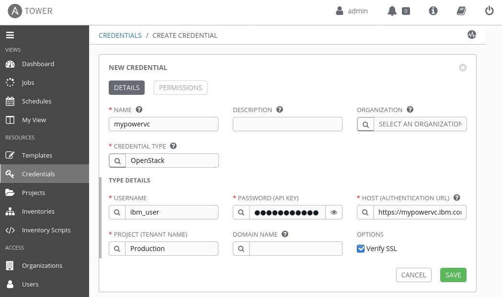
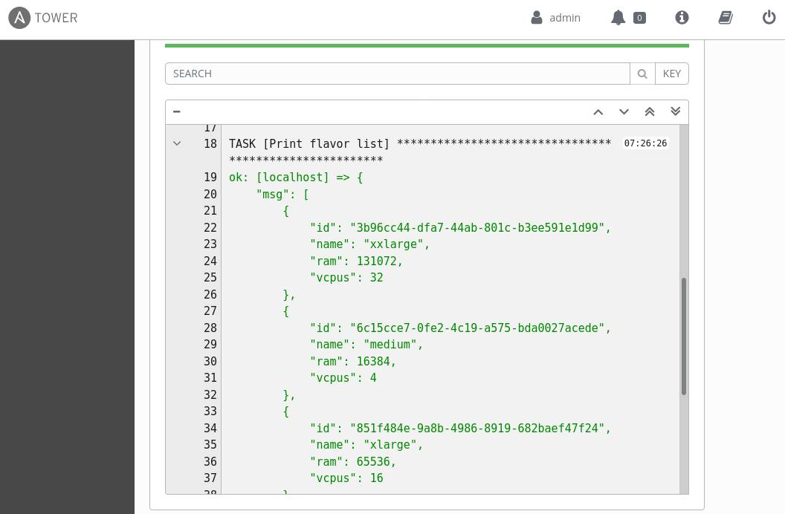
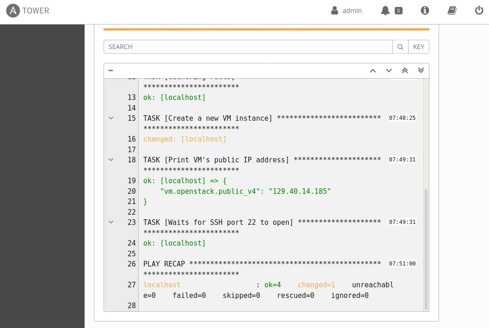

# Ansible を使用した PowerVC の自動化

### 強力で使いやすく設計された機能豊富な自動化ツール

---
English version: https://developer.ibm.com/components/ibm-power/tutorials/automating-powervc-using-ansible/

###### 最新の英語版コンテンツは上記URLを参照してください。

### Author: Jay Carman
last_updated: 2020-06-05

## Red Hat Ansible: Automation for everyone

自動化は、すべてのディジタル変革の基礎をなすメカニズムです。Red Hat&reg; [Ansible](https://www.ansible.com/) は機能豊富な自動化ツールであり、強力で使いやすく設計されています。次のような理由により、Ansible& の人気は上昇し続けています:

* 直感的である: 可読性のある言語（[YAML](https://docs.ansible.com/ansible/latest/reference_appendices/YAMLSyntax.html)）によって動作する
* エージェントレスである: [管理対象ホストの要件が最小限である](https://docs.ansible.com/ansible/latest/installation_guide/intro_installation.html#managed-node-requirements)
* すぐ使える: 基本インストールに数千ものモジュールを含む

Ansible は [Red Hat Ansible Automation Platform](https://www.ansible.com/products/automation-platform) でさらに拡張されます。その中には、 [Ansible Tower](https://www.ansible.com/products/tower) が含まれ、 インベントリー管理、スケジューリング、通知などの視覚的なダッシュボードを提供します。

## Ansible による IBM PowerVC の自動化

[IBM PowerVC](https://developer.ibm.com/powervc/overview/) は [OpenStack](https://www.openstack.org/) テクノロジー上に構築されており、IBM&reg; Power Systems&trade; のための戦略的エンタープライズ仮想化およびクラウド管理ソリューションです。この製品のメリットとして、簡略化した仮想化管理と運用、迅速なプロビジョニング、そして Ansible 等のテクノロジーとの上方統合があります。OpenStack からの継承によって、Ansible 付属の自由に使える OpenStack モジュールだけで使い始めることができます（これらの Ansible モジュールはコミュニティーを通してのみ利用可能で、現時点ではエンタープライズ・レベルのサポートは提供されないことに注意してください）。また、Ansible `uri` モジュールを使用して PowerVC APIs を直接呼び出すことができますが、これは OpenStack モジュールを経由しない場合があります。

## PowerVC に適用可能な OpenStack モジュール

先に述べたように、PowerVC は OpenStack テクノロジー上に構築されているため、OpenStack Ansible モジュールの多くは、_まさに_ PowerVC のターゲットに対して機能します。しかし、すべてのモジュールが適用可能というわけではありません。これは、PowerVC が提供するサービスが OpenStack の全サービスを網羅していないからです。 念のため、以下に本記事執筆時点での適用可能な Ansible モジュールのリストを提示します。

* os_auth
* s_client_config
* s_flavor_info
* s_image_info
* s_keypair
* s_networks_info
* s_nova_flavor
* s_nova_host_aggregate
* s_quota
* s_server
* s_server_group
* s_server
* s_server_action
* s_server_group
* s_server_info
* s_server_metadata
* s_server_volume
* s_volume

## 例: 仮想マシンのプロビジョニング

例として、[os_server](https://docs.ansible.com/ansible/latest/modules/os_server_module.html) モジュールを使用して新しく仮想マシン（VM）をプロビジョニングする流れを見てみましょう。

注: この例で使用するプレイブックと構成ファイルの全ては、次の GitHub で利用可能です。[https://github.com/ppc64le/devops-automation/tree/master/ansible/powervc](https://github.com/ppc64le/devops-automation/tree/master/ansible/powervc)

### Ansible の導入

導入の詳しい手順は、[Installing Ansible](https://docs.ansible.com/ansible/latest/installation_guide/intro_installation.html) を参照してください。この例における全操作は、コマンド・ライン・インターフェースで行うことができますが、[Ansible Tower](https://www.ansible.com/products/tower) と上流の [AWX プロジェクト](https://www.ansible.com/products/awx-project/faq)を確認してください。これらは、Ansible をエンタープライズ規模で管理する使いやすい GUI インターフェースを提供します。

Ansible OpenStack モジュールには、Python &#39;openstacksdk&#39; パッケージが必要です。Ansible Tower は、このパッケージが導入された状態で提供されます。Ansible CLI を使用しているなら、pip を使用して Ansible コントロール・ノードからパッケージを簡単に導入することができます: `pip install openstacksdk --user`。

[コントロール・ノード](https://docs.ansible.com/ansible/latest/network/getting_started/basic_concepts.html#control-node) にAnsibleを導入したら、空のプロジェクト・ディレクトリーを作成します。

```
$ mkdir ansible-demo
$ cd ansible-demo/
ansible-demo$
```

### インベントリーの構成

Ansible は、管理対象ホストの[インベントリー](https://docs.ansible.com/ansible/latest/user_guide/intro_inventory.html)を使用します。インベントリーは、ホスト名の一覧を記したシンプルなテキスト・ファイル形式をとります。より動的な環境下では、ホストの一覧と関連するメタ・データを生成するスクリプトを使用することができます。Ansible には[動的インベントリー・スクリプト](https://docs.ansible.com/ansible/latest/user_guide/intro_dynamic_inventory.html#inventory-script-example-openstack)が同梱されており、ここではそれを使用します。

動的インベントリー・スクリプトを使用するためには、接続と認証パラメーターを定義する必要があります。PowerVC は、関連環境変数を含む OpenStack RC ファイルを提供します（このファイルは [OpenStack CLI クライアント](https://docs.openstack.org/newton/user-guide/common/cli-install-openstack-command-line-clients.html)用にも使用されます）。&#39;powervcrc&#39; ファイルをダウンロードすれば、簡単に開始できます。コントロール・ノードで以下のステップを実行してください:

1. PowerVC ホストから &#39;powervcrc&#39; ファイルをダウンロードします。ヘッダーで指示されているように、書き込み許可を追加し、値を更新してください:

   ```
   ansible-demo$ export PVC_USER='prod_admin'
   ansible-demo$ export PVC_HOST='powervc-demo-server'
   ansible-demo$ scp ${PVC_USER}@${PVC_HOST}:/opt/ibm/powervc/powervcrc .
   prod_admin@powervc-demo-server's password:
   powervcrc                                     100% 1294    23.4KB/s   00:00
   ansible-demo$ chmod u+w powervcrc
   ansible-demo$ head -n 13 powervcrc
   # Copy this file to your user's home directory and edit as necessary.
   # In particular, you may wish to set these values:
   #    - OS_USERNAME     : Your PowerVC user name
   #    - OS_PASSWORD     : Your PowerVC password. If not set, openstack CLIs
   #                        will prompt for the password as needed.
   #    - OS_PROJECT_NAME : If you have multiple projects, specify which project
   #                        you want to access; else you can leave this as
   #                        ibm-default.
   #
   # NOTE: You should not add your password to this file until/unless its file
   # permissions prevent other users from reading it. This is one reason to copy
   # the file to your home directory and edit it there. Or you may wish to not
   # add your password at all and have the CLI prompt you, as noted above.
   ```

2. SSL を使用するためには、CA 証明書ファイルをダウンロードし、&#39;powervcrc&#39; の `OS_CACERT` 変数に正しいパスが設定されているようにしてください:

   ```
   ansible-demo$ scp ${PVC_USER}@${PVC_HOST}:/etc/pki/tls/certs/powervc.crt .
   prod_admin@powervc-demo-server's password:
   powervc.crt                                   100% 1253    18.8KB/s   00:00
   ansible-demo$ grep OS_CACERT powervcrc
   export OS_CACERT=./powervc.crt
   ```

3. &#39;ansible.cfg&#39; ファイルを作成して、デフォルトのインベントリーへのパスを設定し、OpenStack のプラグインを有効化します。このパラメータやその他多くのパラメーターに関する情報については、[Ansible Configuration Settings](https://docs.ansible.com/ansible/latest/reference_appendices/config.html) を確認してください。

   ```
   ansible-demo$ cat ansible.cfg
   [defaults]
   inventory = ./openstack.yml

   [inventory]
   enable_plugins = host_list, openstack

   ```

4. [OpenStack インベントリー・ソース](https://docs.ansible.com/ansible/latest/plugins/inventory/openstack.html) 'openstack.yml' を作成します。

   ```
   plugin: openstack
   expand_hostvars: yes
   fail_on_errors: yes
   ```

5. 最後に、&#39;powervcrc&#39; ファイルを source で実行します。インベントリーが機能していることを簡単に確認するためには、`ansible-inventory` を使用して全ての利用可能なホストをリストしてください:

   ```
   ansible-demo$ source powervcrc
   ansible-demo$ ansible-inventory --list --yaml
   all:
     children:
       Default Group:
         hosts:
           ansible-demo-vm-name-test40:
             ansible_host: 10.0.0.185
             ansible_ssh_host: 10.0.0.185
             openstack:
   ~以下略~

   ```

Ansible Tower GUI を使用して、同様のことを行うことができます。&#39;powervcrc&#39; ファイル内の情報を OpenStack の資格情報として入力します:



これで OpenStack 資格情報を使用して、インベントリーを作成し、ホスト・ソースを追加することができます。

### 利用可能なイメージ、フレーバー、およびネットワークの取得

VM を作成する際には、イメージ、フレーバー、およびネットワーク値を指定する必要があります。これらの情報は、PowerVC GUI、`openstack` CLI ツール、または Ansible モジュールを使用して取得することができます。以下の簡単なプレイブックは、PowerVC サーバーから情報を取得し、読みやすい形でリストを出力します。

プレイブックを実行するためには、ファイルに YAML を書き、そのファイル名を &#39;ansible-playbook&#39; に渡します。例: `ansible-playbook list_images.yml`

ここで確認すべきことは、コントロール・ノード上の &#39;ansible.cfg&#39; があるプロジェクト・ディレクトリーで操作を行っていること、そして接続定義のためにシェル上で `source powervcrc` を実行済みであることです。

[os_image_info](https://docs.ansible.com/ansible/latest/modules/os_image_info_module.html) モジュールは、イメージ情報を取得します:

```
---
- name: List available PowerVC Images
  hosts: localhost
  tasks:
    - name: Retrieve list of all AIX images
      os_image_info:
        properties:
          os_distro: aix  # remove this line to list all images
      register: result

    - name: Print image list
      debug:
        msg: "{{ result | json_query('openstack_image[*].
              {name: name, id: id, os_distro: os_distro, status: status,
              project: location.project.name}') }}"
```

[os_flavor_info](https://docs.ansible.com/ansible/latest/modules/os_flavor_info_module.html) モジュールは、フレーバー情報を取得します:

```
---
- name: List available PowerVC Flavors
  hosts: localhost
  tasks:
    - name: Retrieve list of all public flavors
      os_flavor_info:
        vcpus: ">=4"   # Optional filters
        ram: ">16000"  # See module docs for more options
      register: result

    - name: Print flavor list
      debug:
        msg: "{{ result | json_query('openstack_flavors[?is_public==`true`].
              {name: name, id: id, ram: ram, vcpus: vcpus}') }}"

```

[os_networks_info](https://docs.ansible.com/ansible/latest/modules/os_networks_info_module.html) モジュールは、ネットワーク情報を取得します:

```
---
- name: List available PowerVC Networks
  hosts: localhost
  tasks:
    - name: Retrieve list of all networks
      os_networks_info:
      register: result

    - name: Print Network list
      debug:
        var: result.openstack_networks

```

Ansible Tower でのフレーバー・リストの出力例:



### 仮想マシンの作成

最後に、[os_server](https://docs.ansible.com/ansible/latest/modules/os_server_module.html) モジュールを使用して、VM インスタンスを作成します。ファイルに以下のプレイブックを書き、値を実際の環境にあわせて実行してください。

プレイブックで使用する他モジュール:

* [os_keypair](https://docs.ansible.com/ansible/latest/modules/os_keypair_module.html): SSH 公開鍵を VM に追加します。
* [debug](https://docs.ansible.com/ansible/latest/modules/debug_module.html): VM に割り当てられたパブリック IP アドレスを表示します。&quot;print&quot; 文として debug モジュールを使用することができます。
* [wait_for](https://docs.ansible.com/ansible/latest/modules/wait_for_module.html): SSH 接続のために VM がポート 22 をオープンするまで待ちます。
* [shell](https://docs.ansible.com/ansible/latest/modules/shell_module.html): &#39;ssh-keyscan&#39; を使用して VM ホスト鍵を &#39;known_hosts&#39; ファイルに追加します。

```
---
- name: Create a PowerVC Virtual Machine
  hosts: localhost
  tasks:
    - name: Create an SSH Key Pair
      os_keypair:
        state: present
        name: ansible-ssh-key
        public_key_file: "{{ ansible_env.HOME }}/.ssh/id_rsa.pub"

    - name: Create a new VM instance
      os_server:
        state: present
        name: my-new-vm
        image: 94333b61-b751-4143-a177-cacdc7fa492d
        flavor: 6c15cce7-0fe2-4c19-a575-bda0027acede
        key_name: ansible-ssh-key
        nics:
          - net-name: Static_Prod_Network
        meta:
          hostname: my-new-vm
          group: ansible-vms
      register: vm

    - name: Print VM's public IP address
      debug:
        var: vm.openstack.public_v4

    - name: Waits for SSH port 22 to open
      wait_for:
        host: "{{ vm.openstack.public_v4 }}"
        port: 22

    - name: Add VM host key to known hosts
      shell: "ssh-keyscan -H {{ vm.openstack.public_v4 }} >> ~/.ssh/known_hosts"

```

Ansible Tower での VM 作成ジョブの出力例:



### 次に進みましょう: Ansible を使用して新インスタンス上のタスクを自動化する

 ここまでで、Ansible 構成管理の機能を十分に活用する準備が整いました。既存プレイブックの実行、新しいコンテンツの開発、あるいは [Ansible Galaxy](https://galaxy.ansible.com/) を使用したコミュニティからのダウンロードなどを行いましょう。

#### 簡単な例

Ansible の[アドホック・コマンド](https://docs.ansible.com/ansible/latest/user_guide/intro_adhoc.html)で、単純なホスト・タスクを CLI ワンライナーで実行できます。簡単な例を以下に示します:

```
ansible-demo$ ansible ansible-vms -a "uname -p" --user root
SSH password:
my-new-vm | CHANGED | rc=0 >>
powerpc

```

yum パッケージ・マネージャーのダウンロードと構成を行い、MariaDB を導入する IBM AIX&reg; 用プレイブック:

```
---
- name: Install MariaDB open source relational database
  hosts: ansible-vms
  tasks:
    - name: Download 'yum.sh' script
      get_url:
        url: https://public.dhe.ibm.com/aix/freeSoftware/aixtoolbox/ezinstall/ppc/yum.sh
        dest: /tmp/yum.sh
        mode: 0755
        validate_certs: False

    - name: Execute the 'yum.sh' script
      shell: /tmp/yum.sh

    - name: Install MariaDB package
      yum:
        name: mariadb-server
        state: latest

```
