# SQLステートメントをベースにしたREST APIの作成

### IBM Db2 for iと統合Webサービスの統合

English version: https://developer.ibm.com/tutorials/creating-rest-apis-based-on-sql-statements/

###### 最新の英語版コンテンツは上記URLを参照してください。

### Author: Nadir K. Amra
last_updated: 2019-08-23


## はじめに

長年にわたって、IBM i用統合Webサービスは、IBM iで統合化言語環境（Integrated Language Environment: ILE）プログラムやサービス・プログラムを、RESTやSOAP API（またはWebサービス）で公開することに注力してきました。HTTP Web Administration GUIを使用すれば、RPG、COBOL、またはCで作成したプログラムやサービス・プログラムを、あるいはコマンド言語（CL）を使って作成したプログラムでさえも、マウスをほんの数クリックするだけでAPI化することができます。

最新（2019年8月時点）のIBM iオペレーティング・システム IBM i 7.4 では、同じインターフェースを使用しながら、SQLステートメントをREST（Representational State Transfer）APIとしてデプロイすることができます。これにより、IBM&reg; Db2 for i&reg; をRESTfulサービス・プロバイダーにすることができます。

このチュートリアルは、SQLステートメントをREST APIとしてデプロイするためのステップを紹介します。

## 前提条件

このセクションでは、SQLステートメントを使用したREST API作成に必要なソフトウェア前提条件および前提知識を提示します。

### ソフトウェア

SQLをサポートする統合Webサービス・サーバーにはプログラム一時修正（PTF）が必要です。それらを全て取得するためには、最新のHTTPグループPTFをロードする必要があります。表1は、サポートするIBM iオペレーティング・システムのリリースに対するHTTPグループPTFです。

**表 1. ソフトウェア前提条件**

|IBM iリリース|HTTPグループPTF|
|--|--|
|IBM i 7.4 |SF99662（level 1 以降） |
|IBM i 7.3 |SF99722（level 19 以降） |

## 前提知識

このチュートリアルを読む前に、[パート 1：IBM i用統合Webサービス・サーバーを使用したRESTサービスの構築](../../Tutorials/i-rest-web-services-server1/)を読んで、RESTの原則と用語を理解してください。

[参考情報](#resources) セクションにはRESTに関連する各種情報へのリンクがあります。また、JavaScript Object Notation（JSON）とXMLに関する基本的なコンセプトを理解しておいてください。

## RESTfulアプリケーション

この説明の中で使用する例は、サンプルの学生情報登録アプリケーション（SRA）です。この例は、"[パート 3：IBM i用統合Webサービス・サーバーを使用したRESTサービスの構築](../../Tutorials/i-rest-web-services-server3/)"の中で、ILEサービス・プログラムをREST APIとして公開する方法の説明に使用したものです。このチュートリアルでも同じデータベースを使用しますが、ここでは、データベースとのインターフェースにサービス・プログラムを使用せずに同じ機能を実現する方法を説明します。

このサンプルSRAアプリケーションが提供する学生情報登録管理機能により、以下のことが行えます：

* 新しく学生情報を登録
* 登録済学生情報の編集
* 登録済学生情報の一覧
* 学生情報の取得
* 学生情報を登録から削除

ここで使用される唯一のオブジェクトはSTUDENTDBと呼ばれるデータベースであり、これには学生情報が保管されています。

## デプロイ前に行っておくべきこと

RESTful Webサービスをデプロイする際には、少なくとも以下の質問に対する回答が必要です：

1. URIをどのような外観にするか？
1. リソースがサポートするHTTPメソッドは何か？
1. どのタイプの入力コンテンツをサポートするか？
1. どのタイプでデータを返すか？
1. APIを実装するにあたり、どのようなSQLステートメントを使用するか？

表2は、SRAで使用するHTTPメソッドとUniform Resource Identifiers（URI）のマッピングの一覧です。

**表 2. HTTPメソッドとURIのマッピング**

|HTTPメソッド|URI |説明 |
|--|--|--|
|GET|/*context-root*/students|全ての登録済学生情報を取得する |
|GET |/*context-root*/students/{_id_} |特定の登録済学生情報を取得する|
|POST |/*context-root*/students |新しく学生情報を登録する |
|PUT |/*context-root*/students |登録済学生情報を更新する |
|DELETE|/*context-root*/students/{_id_}|登録済学生情報を削除する|

**注**: 統合Webサービス・サーバーにおけるデフォルトのコンテキスト・ルートは `/web/services` です。サーバーのコンテキスト・ルートは変更可能です。

各URIマッピングに対して、使用するSQLステートメントを確定し、プロシージャーIDとSQLステートメントの紐づけを行う必要があります。この情報は、SQLステートメントをベースにしたサービスをデプロイする際に必要となります。

**表 3. URIマッピングからSQLへのマッピング**

|URI|プロシージャーID |SQLステートメント |
|--|--|--|
|/*context-root*/students |GETALL |`SELECT * from STUDENTDB`|
|/*context-root*/students/{*id*}|GETBYID|`SELECT * from STUDENTDB`<br/>`WHERE "studentID" = ?`|
|/*context-root*/students|ADD|`INSERT INTO STUDENTDB`<br/>`("studentID", "firstName", "lastName", "gender")`<br/>`VALUES(?,?,?,?)`|
|/*context-root*/students|UPDATE|`UPDATE STUDENTDB SET`<br/>`"firstName" = ?, "lastName" = ?,`<br/>`"gender" = ?`<br/>`WHERE "studentID" = ?`|
|*/context-root*/students/{_id_}|REMOVE|`DELETE FROM STUDENTDB`<br/>`WHERE "studentID" = ?`|

## 事例におけるニーズ

このチュートリアルで開発するREST API事例は、学生情報登録データベースを前提としています。この事例は、REST規範に従って学生情報の取得、追加、削除、および更新を可能にすることに重点を置いています。

## ステップ 1. アプリケーションのデータベース・ファイルをセットアップする

この例では、STUDENTDBのDBファイルをSTUDENTSRCライブラリーに作成します。以下のCLコマンドを使用して、ライブラリーを作成します：

`CRTLIB STUDENTRSC`

以下のSQLコマンドで、表を作成します：

```
CREATE TABLE STUDENTRSC/STUDENTDB
 ("studentID"  CHAR (9) NOT NULL,
  "firstName"  CHAR (50) NOT NULL,
  "lastName"   CHAR (50) NOT NULL,
  "gender"  CHAR (10) NOT NULL,
  PRIMARY KEY ("studentID"))
```

以下のSQLコマンドで、登録用学生データを表に入力します：

```
INSERT INTO STUDENTRSC/STUDENTDB  
 ("studentID", "firstName", "lastName", "gender")
     VALUES('823M934LA', 'Nadir', 'Amra', 'Male'),
           ('826M660CF', 'John', 'Doe', 'Male'),
           ('747F023ZX', 'Jane', 'Amra', 'Female')  
```

サービスを実行するユーザー・プロファイルは、ライブラリーとデータベース・ファイルへのアクセス権限を保持するようにしてください。この例では、サーバー用デフォルト・ユーザー・プロファイルである QWSERVICE を使用します。そのために、以下のCLコマンドを実行してください：

```
CHGAUT OBJ('/qsys.lib/studentrsc.lib/studentdb.file')  
       USER(QWSERVICE)
DTAAUT(*RWX)
```

## ステップ 2. 統合Webサービス・サーバーを作成する

ILEプログラム・オブジェクトをRESTサービスとしてデプロイするためには、統合Webサービス・サーバーが作成済みで、それがバージョン2.6以上でなければなりません。すでに作成済みのものがあれば、このセクションをスキップしてもかまいません。新たに作らなければならない場合は、"[パート 2：IBM i用統合Webサービス・サーバーを使用したRESTサービスの構築](../../Tutorials/i-rest-web-services-server2/)"を読んで、サーバー作成方法を学習してください。

## ステップ 3. SQLステートメントをRESTful Webサービスとしてデプロイする

それでは、SRAを構成するSQLステートメントをRESTful Webサービスとしてデプロイしましょう。

### ステップ 3-1. SQLステートメントをWebサービスとしてデプロイする

ナビゲーション・バーにある **Deploy New Service** ウィザードへのリンクをクリックします。図1のようなページが表示されます。

**図 1. Webサービスのデプロイ - ステップ 1**  
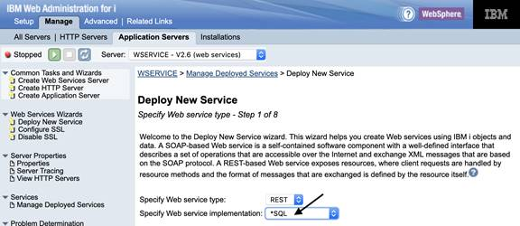

このページでSOAPあるいはREST Webサービスのデプロイを選択できます。また、Webサービスが、ILEプログラム/サービス・プログラムをベースにするか、あるいはSQLステートメントをベースにするかを選択できます。**`*`SQL** を選択して、WebサービスをSQLステートメント・ベースに指定し、**Next** をクリックしてください。

### ステップ 3-2. リソース（Webサービス）の名前を指定する

ここで、Webサービス（すなわちリソース）に意味のある名前を付け、説明を加えます。リソース名は **students** に変更されています（図2参照）。

**図 2. Webサービスのデプロイ - ステップ 2**  
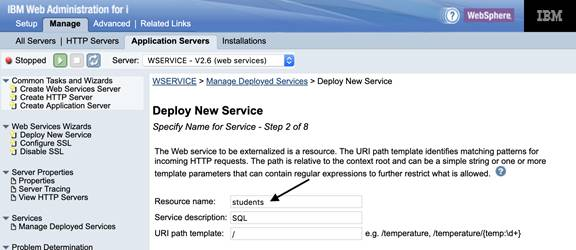

リソースにURIパスのテンプレートをセットすることができます。この例では、リソース名変更後のリソースへのパス情報で十分なので、ここでは何も設定しません：

/*context-root*/students

ページの一番下にある **Next** をクリックします。

### ステップ 3-3. データベースのプロパティを指定する

ウィザードは、データベースの各種プロパティを設定するページを表示します。図3を参照してください。

**図 3. Webサービスのデプロイ - ステップ 3**  
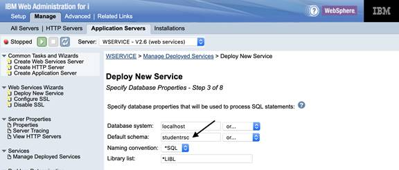

デフォルトでは、SQLステートメントを処理するデータベース・システムはローカル・ホスト（統合Webサービス・サーバーが稼働するシステム）です。データベース・ファイルがリモート・サーバーにあるならば、リモート・システムを指定しても構いません。

この例では、デフォルトのスキーマに **studentrsc** を指定しています。システムは、デフォルトのSQLスキーマを用いて、SQLステートメント内の非修飾名に対する名前解決を行います。例えば、`SELECT * FROM MYTABLE` というステートメントでは、MYTABLEに対して、システムはデフォルトのSQLスキーマだけを確認します。命名規則が \*SQL（SQL命名規則）であるか、\*SYS（システム命名規則）であるかによって、次の条件が適用されます：

* SQL命名規則では、デフォルト・スキーマが \*LIBL の場合、ライブラリー・リストの最初あるいは2番目のエントリー（どちらかの \*LIBL ではない方）がデフォルト・スキーマになります。もしライブラリー・リストで最初と2番目のエントリーが \*LIBL ならば、ユーザー・プロファイルがデフォルトのスキーマになります。
* システム命名規則では、\*LIBL がデフォルトのスキーマとしてセットされると、デフォルトのSQLスキーマはセットされません。システムは、ライブラリー・リスト内の指定されたライブラリーを使用して、非修飾名を検索します。

表を参照する場合は、以下の命名規則を指定できます：

* \*SQL は、SQL命名規則（ **schema.table** 方式）の使用を指定します。
* \*SYS は、システム命名規則（ **schema/table** 方式）の使用を指定します。

最後に、1つ以上のライブラリーを指定して、サーバー・ジョブのライブラリー・リストに追加、あるいはリストの置き換えができます。システムは、指定されたライブラリーを使用して非修飾プロシージャー名の名前解決を行い、ストアード・プロシージャーはライブラリーを非修飾名の名前解決に使用します。複数のライブラリーを使用するときは、コンマかスペースを用いて各エントリーを区切ります。サーバー・ジョブの現行ライブラリー・リスト用プレースホルダーとして、\*LIBL を使用することができます。

ページの一番下の **Next** をクリックします。

### ステップ 3-4. SQLステートメントを指定する

ウィザードは、SQLステートメントを追加するページを表示します（図4参照）。SQLステートメントはプロシージャーと関連付けられるので、プロシージャーにも意味のある名前を指定する必要があります（これは、クライアントからのリクエストに対して結果セットを返すときに、識別子として使用されるからです）。

**図 4. Webサービスのデプロイ - ステップ 4**  
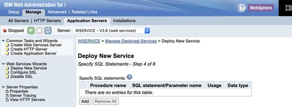

**Add** をクリックして、SQLステートメントを追加します。図5は、学生情報レコードを削除するSQLステートメントを追加した後のページです。

**図 5. Webサービスのデプロイ - ステップ 4 （学生情報レコードの削除）**  
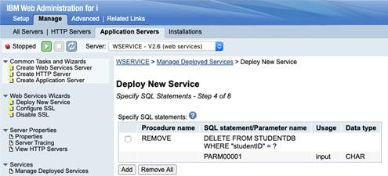

図5では、プロシージャー名として `REMOVE` を指定し、データベースからレコードを削除するSQLステートメントを設定しています。パラメーター・マーカーとして、削除対象の学生IDを使用することに注意してください。SQLステートメント追加後にContinueをクリックすると、ページにはパラメーター・マーカーに対応するパラメーターが表示されます。ここで、SQLステートメントを選択することで、パラメーターに関連づけられたIDを変更することもできます。パラメーター用IDを変更する必要があるのは、IDがクライアント・リクエストのHTTPペイロードに含まれる場合です（通常、ペイロードはPOSTまたはPUT HTTPメソッドに関連づけられます）。

図6では、残りのSQLステートメントを確認できます。全てのSQLステートメントに対して、パラメーターIDが変更されていることに注意してください。

**図 6. Webサービスのデプロイ - ステップ 4 （全SQLステートメント追加）**  
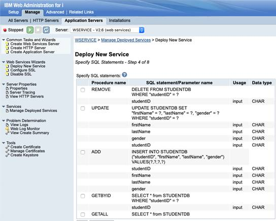

全てのSQLステートメントを追加したら、Nextをクリックします。

### ステップ 3-5. SQL情報を指定する

それぞれのプロシージャーはSQLステートメントを含みます。全てのプロシージャーに対して、SQLステートメント出力の処理方法を指定しなければなりません。

最初に処理するプロシージャーは `REMOVE` です。

**図 7. Webサービスのデプロイ - ステップ 5 （REMOVE）**  
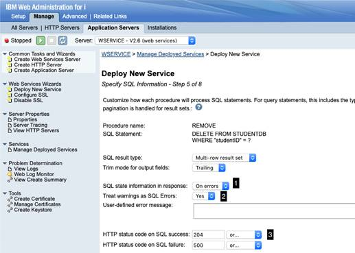

図7から、以下のことが分かります：

* レスポンスに入れるSQL状態情報に対するデフォルト設定として、SQL操作実行の失敗時のみとすることを指定しています（**1**）。
* SQL警告をエラーとみなすことをデフォルト設定として指定しています（**2**）。この指定は、DB接続、SQLステートメントの準備、およびSQLステートメントの実行に関連するSQL警告のみが対象です。これらのケースで発生した警告は、SQLエラーとして扱われます。 
* SQLステートメント実行成功時の返信HTTPステータス・コードに204（No Content）を指定しています（**3**）。SQL操作実行失敗時の返信HTTPステータス・コードのデフォルト値として、500（Server Error）を指定しています。

**Next** をクリックして、`UPDATE` プロシージャーの処理に進みます（図8を参照）。

**図 8. Webサービスのデプロイ - ステップ 5 （UPDATE）**  
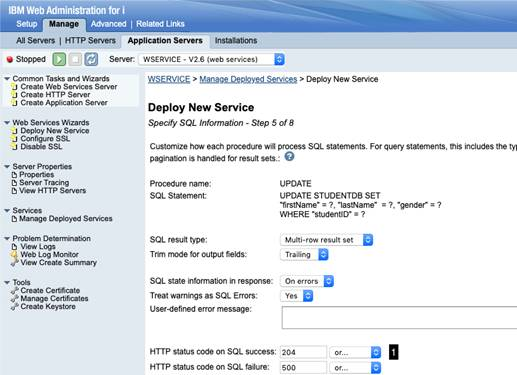

図8から、各フィールドにはデフォルト値をセットしていることが分かります。例外は、SQLステートメント実行が成功した場合に204（No Content）HTTPステータス・コードを返す設定をしていることです（1）。

**Next** をクリックして、`ADD` プロシージャーの処理に進みます（図9）。

**図 9. Webサービスのデプロイ - ステップ 5 （ADD）**  
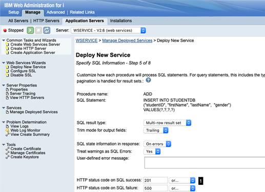

図9から、各フィールドにはデフォルト値をセットしていることが分かります。例外は、SQLステートメント実行が成功した場合に201（Created）HTTPステータス・コードを返す設定をしていることです（1）。

**Next** をクリックして、`GETBYID` プロシージャーの処理に進みます（図10）。

**図 10. Webサービスのデプロイ - ステップ 5 （GETBYID）**  
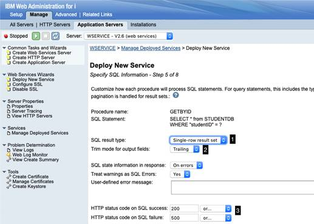

図10から、以下のことが分かります：

* このSQL操作は、単一行の結果セット（Single-row return set）を戻します（**1**）。これにより、レスポンスはオブジェクトの配列ではなく、単一オブジェクトを戻すようになります。オブジェクトの配列を戻すようにするには、ここで複数行の結果セット（Multi-row result set）を指定します。ここでの注意点は、Single-row result setを指定すると、結果が複数行であっても、1つの行しか戻さないことです。
* デフォルトの出力文字列の切り捨てモード（**2**）は、フィールドから末尾ブランクを削除する設定になっています。オプションとして、先頭ブランクの削除、先頭・末尾両方のブランクの削除、およびブランクを削除しないことを選択できます。通常、ここでNone（ブランクを削除しない）以外の値を設定するよりも、SQLステートメントでtrim関数を使用する方が上手く機能します。
* デフォルトのHTTPステータス・コードとして次の設定をしています（**3**）：成功ならば200（OK）、失敗ならば500（Server Error）。

**Next** をクリックして、`GETALL` プロシージャーの処理に進みます（図11）。

**図 11. Webサービスのデプロイ - ステップ 5 （GETALL）**  
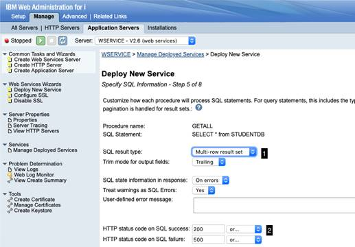

図11から、以下のことが分かります：

* SQL操作は、複数行の結果セット（Multi-row result set）を戻します（**1**）。これにより、レスポンスはオブジェクトの配列を戻すようになります。
* HTTPステータス・コードに対するデフォルト値として次の設定をしています（**2**）：成功ならば200（OK）、失敗ならば500（Server Error）。

これで、各プロシージャーのSQLに関連する情報の設定を完了しました。**Next** をクリックします。

### ステップ 3-6. リソース・メソッド情報を指定する

このステップを説明する前に、デプロイ予定のRESTfulアプリケーションにおけるREST情報をまとめておきましょう。表4はSRAにおける各リソース・メソッド（ここではプロシージャー）のREST情報の一覧です。

**表 4. 各プロシージャーにおけるREST情報**

| | | |
|--|--|--|
|**REMOVE**|**URL**|/*context-root*/students/{*id*}|
| |**Method** |DELETE |
| |**Request body**|None|
| |**Returns**|204 No content|
| | |500 Server error|
|**UPDATE**|**URL**| /*context-root*/students|
| |**Method**|PUT|
||**Request body**|JSON|
||**Returns**| 204 No content|
| ||500 Server error|
|**ADD**| **URL** |/*context-root*/students|
| |**Method** |POST|
||**Request body**|JSON|
| |**Returns** |201 Created|
| | |500 Server error|
|**GETBYID**| **URL**|/*context-root*/students/{*id*}|
| |**Method** |GET|
| |**Request body**|None|
| |**Returns**| 200 OK and JSON|
|| |500 Server error|
|**GETALL** |**URL**| /*context-root*/students|
| |**Method** |GET|
| |**Request body**| None|
| |**Returns** | 200 OK and JSON |
| | |500 server error|

最初に処理するのは `REMOVE` プロシージャーです。

**図 12. Webサービスのデプロイ - ステップ 6 （REMOVE）**  
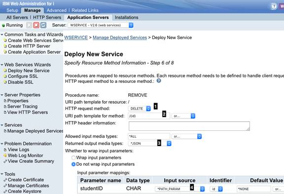

図12から、以下のことが分かります：

* HTTPリクエストのメソッドはDELETEに設定されています（**1**）。
* 表3で示されているように、URIのフォーマットは次のようになっています：
    _/context-root/students/{id}_
    これは、学生のID情報がURIの一部として渡されることを意味します。そのため、URIパスのテンプレートを指定し（**2**）、URIにマッチするHTTP DELETEリクエストが `REMOVE` プロシージャーに渡されるようにします。
* このプロシージャーはエンティティー本体を戻しません。ただし、何らかの値を設定しなければならないので、JSONをデフォルト値として指定しています（**3**）。
* URIパス変数 `id` を `studentID` パラメーターにインジェクトします。これを行うために、インプット・ソースとして `*PATH_PARAM` を指定し（**4**）、挿入するID（Identifier）を選択します。

**Next** をクリックして、`UPDATE` プロシージャーを処理します（図13）。

**図 13. Webサービスのデプロイ - ステップ 6 （UPDATE）**  
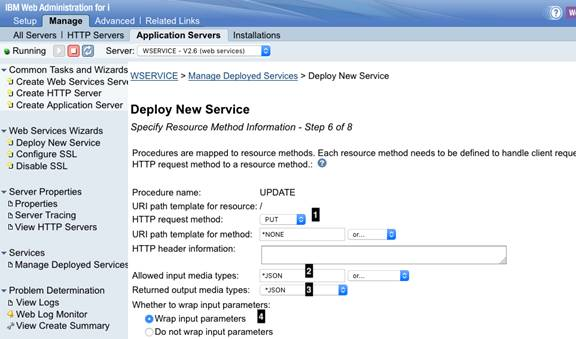

図13から、以下のことが分かります：

* HTTPリクエストのメソッドはPUTに設定されています（**1**）。
* 入力データのフォーマットはJSONです（**2**）。
* このプロシージャーはエンティティー本体を戻しません。ただし、何らかの値を設定しなければならないので、JSONをデフォルト値として指定しています（**3**）。
* リクエストはクライアント・リクエストのペイロードに入っているので、パラメーターをラップすることを指定しています（**4**）。

**Next** をクリックして、`CREATE` プロシージャーを処理します（図14）。

**図 14. Webサービスのデプロイ - ステップ 6 （ADD）**  
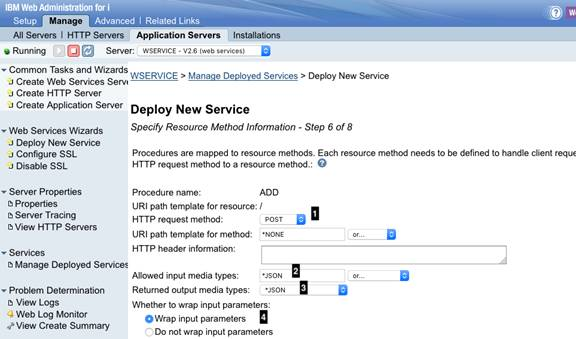

図14から、以下のことが分かります：

* HTTPリクエストのメソッドはPOSTに設定されています（**1**）。
* 入力データのフォーマットはJSONです（**2**）。
* このプロシージャーはエンティティー本体を戻しません。ただし、何らかの値を設定しなければならないので、JSONをデフォルト値として指定しています（**3**）。
* リクエストはクライアント・リクエストのペイロードに入っているので、パラメーターをラップすることを指定しています（**4**）。

**Next** をクリックして、`GETBYID` プロシージャーを処理します（図15）。

**図 15. Webサービスのデプロイ - ステップ 6 （GETBYID）**  
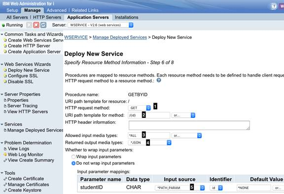

図15から、以下のことが分かります：

* HTTPリクエストのメソッドはGETに設定されています（**1**）。
* 表3で示されているように、URIのフォーマットは次のようになっています：
    _/context-root/students/{id}_
    これは、学生のID情報がURIの一部として渡されることを意味します。そのため、URIパスのテンプレートを指定し（**2**）、URIにマッチするHTTP GETリクエストが `GETBYID` プロシージャーに渡されるようにします。
* 入力データはありません。そのため、全ての入力メデイア・タイプを受け付けることをデフォルト値としてセットします（**3**）。
* 出力データのフォーマットはJSONです（**4**）。
* URIパス変数 `id` を `studentID` パラメーターにインジェクトします。これを行うために、インプット・ソース（Input source）として `*PATH_PARAM` を指定し、挿入するID（Identifier）を選択します（**5**）。

**Next** をクリックして、`GETALL` プロシージャーを処理します（図16）。

**図 16. Webサービスのデプロイ - ステップ 6 （GETALL）**  
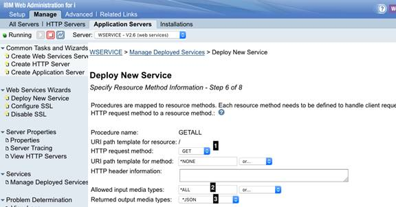

図16から、以下のことが分かります：

* HTTPリクエストのメソッドはGETに設定されています（**1**）。
* 入力データはありません。そのため、全ての入力メデイア・タイプを受け付けることをデフォルト値としてセットします（**2**）。
* 出力データのフォーマットはJSONです（**3**）。

これで、REST情報の設定を完了しました。**Next** をクリックします。

### ステップ 3-7. サービス用にユーザーIDを指定する

ここで、サービスを実行するためには、ユーザーIDを指定する必要があります。図17に示すように、サービスを実行するために、サーバーのユーザーID使用、既存ユーザーID指定、あるいは認証済ユーザーID使用（このためには、関連するHTTPサーバーでベーシック認証を有効にする必要があります。この方法は、[Integrated Web Services Server Administration and Programming Guide](http://www.ibm.com/support/docview.wss?uid=isg3T1026868)のSecurityの章を参照してください）が可能です。

**図 17. Webサービスのデプロイ - ステップ 7**  
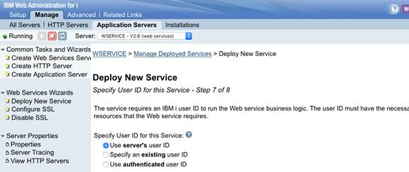

Webサービスを正しく実行するためには、ユーザーIDステータスを \*ENABLED にセットし、パスワードに \*NONE 以外の値を設定しなければなりません。ユーザーIDが無効であったり、パスワードに \*NONE が設定されると、警告メッセージが出力され、サービスは正しく稼働しません。さらに、指定したユーザーIDに適切な権限を与え、ライブラリー、データベース、およびファイルなどWebサービスが必要とするリソースやオブジェクトにアクセスできるようにしてください。

この例では、デフォルト値を使用します。**Next** をクリックします。

### ステップ 3-8. Webサービスをデプロイする - ステップ 8

Webサービスのデプロイ・ウィザードはサマリーのページを表示します（図18参照）。これにより、デプロイしようとしているWebサービスの詳細を確認できます。

**図 18. Webサービスのデプロイ - ステップ 8 （サマリー）**  
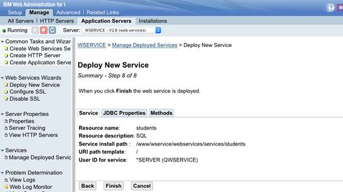

サマリー・ページの一番下にある **Finish** をクリックして、導入プロセスを完了します。Webサービスをデプロイすると、図19のように、サービスがアクティブ（サービス名左の緑色の丸印）になります：

**図 19. 正しくデプロイされたRESTful Webサービス**
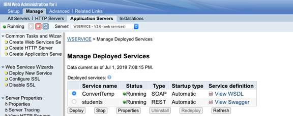

おめでとうございます。これで、SQLステートメントをRESTful Webサービスとしてデプロイすることに成功しました。 

ブラウザーを使用すれば、HTTP GETにバインドされたリソース・メソッドを、簡単にテストできます。図20は、全登録済学生情報をリクエストした結果です。

**図 20. Webサービスのテスト - 全登録済学生情報の取得**
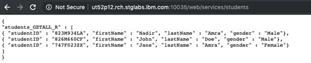

図21は、823M934LAというIDを持つ学生情報を要求した結果です。

**図 21. Webサービスのテスト - 登録済学生情報の取得**
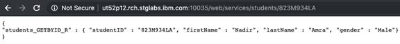

他のリソース・メソッドをテストするためには、外部ツール（例えばSoapUI）を使用しなければなりません。図22は、SoapUIを使用して新しい学生情報の登録をリクエストした結果です。

**図 22. Webサービスのテスト - 新学生情報の登録**
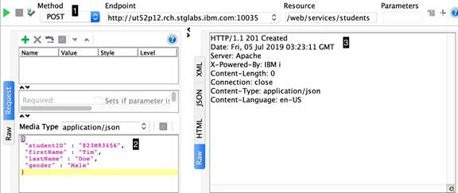

図22を見てみましょう。新しく学生情報を登録しようとしているので、HTTPメソッドはPOSTです（**1**）。サブペイン（**2**）には、JSON形式の登録用新学生データが表示されており、これはHTTP POSTリクエストの一部としてサーバーに送信されます。リクエストを送った後、サーバーのレスポンスはJSONデータを返しません（**3**）。作成要求が成功したので、RESTサービスはHTTPステータス・コード201（Created）を返しています。

図23は同じ要求を再度実行した結果です。

**図 23. Webサービスのテスト - 新学生情報の登録のエラー**
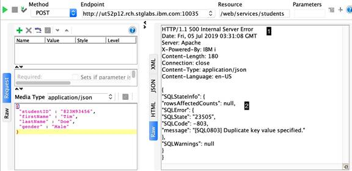

図23を見てみましょう。データベースに既存の学生IDを使用して学生情報を登録しようとしたので、サーバーはHTTPステータス・コード 500（Server Error）（**1**）とエラーに関する情報（2）を返し、それにはSQL状態、SQLコード、およびエラー・メッセージが含まれています。

## まとめ

このチュートリアルでは、IBM i用統合Webサービス・サーバーを使用して、SQLステートメントをベースにしたREST APIのデプロイ方法を説明しました。

統合Webサービス・サーバーによるRESTサポートは、IBM iプラットフォーム上のILEプログラム、サービス・プログラム、そしてSQLステートメントをベースとするREST APIの強固な基盤を提供します。IBM Web Administration for i GUIは高度に直感的な操作を行えます。これをWebサービスのデプロイに使用すれば、カスタムREST APIのプロタイピングやデプロイを高速に行うことができます。

<a id="resources" />

## 参考情報

* 参考情報
統合WebサービスのIBM iサポートに関する詳細は、[製品のWebページ](https://www-01.ibm.com/support/docview.wss?uid=isg3T1026868)を参照してください。
* [RESTful Web services: The basics](https://developer.ibm.com/articles/ws-restful/)は、RESTの概要について説明しています。
