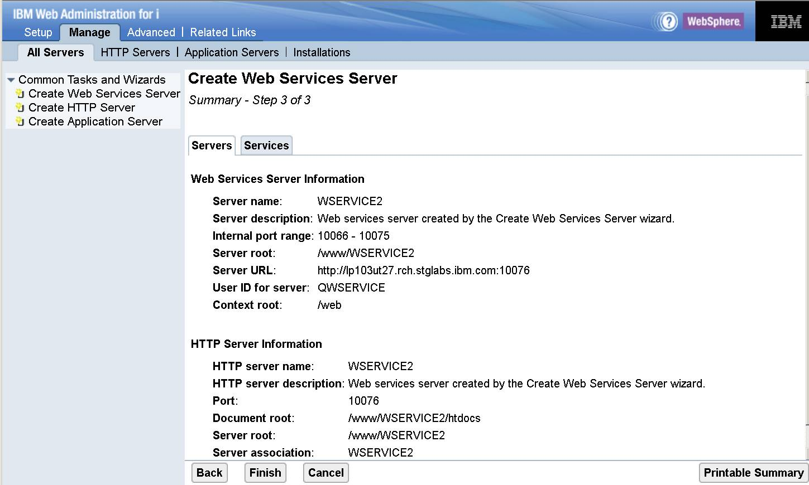

# パート 2：IBM i用統合Webサービス・サーバーを使用したRESTサービスの構築

### 簡易RESTfulアプリケーションのデプロイ

English version: https://developer.ibm.com/tutorials/i-rest-web-services-server2/

###### 最新の英語版コンテンツは上記URLを参照してください。

### Author: Nadir Amra
last_updated: 2015-05-08

## はじめに

数年前から、ILEプログラムとサービス・プログラムを、SOAPプロトコル・ベースのWebサービスとしてデプロイすることが可能でした。それはオペレーティング・システムの一部である統合Webサービス・サーバーを使用したものです。この記事が公開されるまで、統合Webサービス・サーバーはRESTサービスをサポートしていませんでした。

この記事は、統合Webサービス・サーバーにおけるRESTサポートに関するシリーズの2番目のパートです。本シリーズの残りのパートは、ここで説明する基本概念を土台にしています：

* [パート 1](../../Tutorials/i-rest-web-services-server1/)は、REST Webサービスの背後にある基本概念と、統合Webサービス・サーバーがRESTサービスをサポートする方法について説明します。
* パート 2は、簡単なILEアプリケーションをRESTful Webサービスとしてデプロイするための手順を説明します。
* [パート 3](../../Tutorials/i-rest-web-services-server3/)は、より多くのREST機能を使う複雑なILEアプリケーションをデプロイするための手順を説明します。

## 前提条件

### ソフトウェア

統合Webサービス・サーバーにおけるRESTサポートに必要なすべてのPTFを取得するためには、最新のグループPTFをロードする必要があります。表1はIBM iオペレーティング・システムのサポートされる各リリースに必要なHTTPグループPTFです。

 **表 1. ソフトウェア前提条件**
 <table border="0" cellpadding="0" cellspacing="0" class="ibm-data-table" data-widget="datatable"><thead> <tr> <th class="ibm-background-neutral-white-30"> IBM i リリース </th> <th class="ibm-background-neutral-white-30"> HTTPグループPTF </th></tr></thead> <tbody> <tr> <td> IBM i 7.2 </td> <td> SF99713 （level 6以降） </td></tr> <tr> <td> IBM i 7.1 </td> <td> SF99368 （level 32以降） </td></tr></tbody></table>

### 前提知識

この記事を読む前に、本シリーズの [パート 1](../../Tutorials/i-rest-web-services-server1/) を読んで、RESTの原則と用語を理解しておいてください。  [参考情報](#_Resources)セクションには、RESTに関する各種情報へのリンクがあります。また、JavaScript Object Notation（JSON）とXMLに関する基本的な概念を理解しておいてください。

## 簡易RESTfulアプリケーション

この説明で使用する例は、ILE RPGで書いたアプリケーションで、温度を華氏から摂氏に変換します。このアプリケーションは、QSYSDIRライブラリーのサービス・プログラムQIWSSAMPLE内にパッケージされています。サービス・プログラムは統合Webサービス・サーバーの一部として含まれており、エクスポート・プロシージャー CONVERTTEMPを含みます。

プロシージャーのソース（リスト1）は、以下の場所にあります：  `/QIBM/ProdData/OS/WebServices/samples/server/ConvertTemp/CNVRTTMP.RPGLE`

**リスト 1. 簡易RESTアプリケーションのRPGソース**
<code-listing html-highlight="all-highlighting-off"><pre>&lpar;newline&rpar;&lpar;newline&rpar;&lpar;newline&rpar;h nomain PGMINFO(&#8727;PCML:&#8727;MODULE)&lpar;newline&rpar;d ConvertTemp     pr&lpar;newline&rpar;d tempIn                  10      const&lpar;newline&rpar;d tempOut                 10&lpar;newline&rpar;&lpar;newline&rpar;p ConvertTemp     b                   export&lpar;newline&rpar;d ConvertTemp     pi &lpar;newline&rpar;d tempIn                  10      const &lpar;newline&rpar;d tempOut                 10&lpar;newline&rpar;&lpar;newline&rpar;d tempI           s       8P   2&lpar;newline&rpar;d tempO           s       8P   2&lpar;newline&rpar;d value           S       50A&lpar;newline&rpar; /free&lpar;newline&rpar; value = %STR(%ADDR(tempIn));&lpar;newline&rpar; tempI=%DEC(value:7:2);&lpar;newline&rpar; tempO = (5/9)&#8727;(tempI &#8209; 32);&lpar;newline&rpar; value = %CHAR(tempO);&lpar;newline&rpar; tempOut = value;&lpar;newline&rpar; %STR(%ADDR(tempOut):10)=tempOut;&lpar;newline&rpar; /end&#8209;free&lpar;newline&rpar; p ConvertTemp   e &lpar;newline&rpar;&lpar;newline&rpar;&lpar;newline&rpar;</pre></code-listing>

デプロイ予定のRESTful Webサービスは大変シンプルです。アプリケーションが必要とする入力は、華氏から摂氏に変換される温度だけです。そして、摂氏表現の温度を戻します。

## デプロイ前に行っておくべきこと

実際にRESTful Webサービスをデプロイする前に、これから行うことを熟考することは良いことです。RESTful Webサービスをデプロイする際には、少なくとも以下の質問に対する回答が必要です：

* リソースがサポートするHTTPメソッドは何か？
* URIをどのような外観にするか？
* どのタイプの入力コンテンツをサポートするか？
* どのタイプでデータを返すか？

デプロイ予定の簡易アプリケーションに限定して、これらの基本的な質問を確認してみましょう。

### リソースがサポートするHTTPメソッドは何か？

サポートするHTTPメソッドは、GET、POST、PUT、そしてDELETEです。サポートするHTTPメソッドによって、クライアントがデータを送る方法が変わります。例えば、リソース・メソッドがXMLあるいはJSON文書を受け取るならば、リソース・メソッドをPOSTあるいはPUTのHTTPメソッドにバインドすることになります。

デプロイする簡易アプリケーションにおいて、期待する唯一の入力は変換対象の温度です。このため、クライアントは、入力の温度をURLの一部を用いて渡すことができます。クライアントはペイロードを送る必要がないので、HTTPメソッドはGETになります。

プロシージャー（リソース・メソッド）は1つしかないため、これで完了です。

### URIをどのような外観にするか？

RESTサービスはリソースの操作をベースにします。RESTfulサービスのリソースはアドレス可能で、RESTにおけるアドレス指定の基本的な方法はURLです。REST URIの設計は、それ自身がアートであり、この記事のスコープ外です。ここで強調したいのは、簡潔さと一貫性が重要であるということです。

温度変換の例では、URIを以下のような外観にします：   `<context-root>/ftoc/{temp}`

ここで、_{temp}_ は華氏で表現された温度であり、摂氏に変換されるものです。例えば、華氏123度が摂氏では何度になるかを知りたければ、クライアントが送るURIは以下のようになるでしょう：  `/web/services/ftoc/123`

**注：** 上記URIは、このサーバーではデフォルトのコンテキスト・ルート（`/web/services`）が変更されていないことを前提としています。

### どのタイプの入力コンテンツ・タイプをサポートするか？

HTTP GETリクエストにはペイロードが無いので、入力のコンテンツ・タイプについて気にする必要がありません。この例では、デフォルトの設定を使用し、全てのコンテンツ・タイプを受け入れます。

### どのタイプでデータを返すか？

ここでは3つの選択肢があります。クライアントが受け取るタイプに応じて、XML、JSON、または双方を返すことができます。この例では、JSONを返します。

これで、簡易アプリケーションをRESTful Webサービスとしてデプロイする準備が整いました。

## ステップ 1. 統合Webサービス・サーバーの作成

ILEプログラム・オブジェクトをRESTサービスとしてデプロイするためには、統合Webサービス・サーバーが作成済みで、それがバージョン2.6以上でなければなりません。すでに作成済みのものがあれば、このセクションをスキップして、"<a href="#_step2">ステップ 2. ILEアプリケーションをRESTful Webサービスとしてデプロイする</a>" に進んでください。

統合Webサービス・サーバーを作成するという点においては、何も変更はありません。サーバーはSOAPとREST Webサービス双方を含みます。

Webサービス・サーバーのウィザードを起動するには、IBM Web Administration for iのGUIにサインオンし、**Create Web Services Server** ウィザードのリンクをクリックする必要があります。URL: 'http://hostname:2001/HTTPAdmin'を指定し、ブラウザーからWeb Admin GUI for IBM iにアクセスし、サインオンしてください。ここで、hostnameはサーバーのホスト名です（Web管理サーバー用にSSLを構成している場合、URLは 'https://hostname:2010/HTTPAdmin'になることに注意してください）。Webサービス・サーバーを作成するためには、`*`ALLOBJまたは`*`IOSYSCFG特殊権限を持っている必要があります。あるいは、IBM i 6.1以降のリリースならば、Webサービス・サーバーを作成する許可が与えられている必要があります。Common Tasks and Wizards見出し下のナビゲーション・バーのリンク、あるいは **Setup** タブのメイン・ページ（図1参照）のリンクをクリックして、**Common Tasks and Wizards** ウィザードを立ち上げます。

 **図 1. Create Web Services Serverへのリンク**
 <figure></img></figure>

### ステップ 1-1. Webサービス・サーバー名の指定

作成するWebサービス・サーバーに、名前を付けられます（図2参照）。必要なら短い説明を記述することもできます。

 **図 2. Webサービス・サーバー名の指定**
 <figure></img></figure>

ここでは、そのままデフォルト値を使用し、フォーム下部にある **Next** をクリックします。

### ステップ 1-2. サーバーのユーザーID指定

サーバーのジョブを実行するためのユーザーIDを指定します。既存のユーザーIDを指定する、新規ユーザーIDを作成する、あるいはデフォルトのユーザーIDを使用することができます。ここでは、デフォルト・ユーザーIDのQWSERVICEを使用します。

**注**：サーバー用に指定したユーザーIDは有効になっており、パスワードが*NONE以外でなければなりません。ここで指定したユーザーIDが、この条件に合っていることを確認にしてください。

 **図 3. Webサービス・サーバー名の指定**
 <figure></img></figure>

フォーム下部の **Next** をクリックしてください。

### ステップ 1-3. サマリー

ウィザードにはサマリー・ページが表示されます（図4参照）。サーバー作成タスクを開始する前に、Webサービス・サーバーの詳細を最終確認することができます。

 **図 4. サーバー作成サマリー**
 <figure></img></figure>

サマリー・ページの下部にある **Finish** をクリックすると、サーバーの作成を開始します。サーバーが作成されると、ウィザードはWebサービス・サーバーとHTTPサーバーを開始します。全てが順調に進むと、図5のように、サーバーが **Running** 状況になり、デプロイされているサービス（サーバーに含まれているサンプルWebサービス）がアクティブ（サービス名の横の緑の丸印）になっていることが分かります。

 **図 5. サーバー稼働中の表示**
 <figure></img></figure>

おめでとうございます。これでWebサービス・サーバーの作成に成功しました。次のステップでは、ILEプログラム・オブジェクトをRESTful Webサービスとしてデプロイする方法を説明します。

## ステップ 2. ILEアプリケーションをRESTful Webサービスとしてデプロイする {: #_step2}

以下の表は、これからデプロイするRESTful Webサービスの各種設定をまとめたものです：

 **表 2. RESTful WebサービスのREST情報**
 <table border="0" cellpadding="0" cellspacing="0" class="ibm-data-table" data-widget="datatable" summary=""><thead> <tr> <th class="ibm-background-neutral-white-30"></th></tr></thead> <tbody> <tr> <td> <strong>プロシージャー</strong></td> <td> CONVERTTEMP </td></tr> <tr> <td> <strong>URI</strong></td> <td> <code>../ftoc/{temp}</code></td></tr> <tr> <td> <strong>HTTPメソッド</strong></td> <td> GET </td></tr> <tr> <td> <strong>照会ストリング</strong></td> <td> 無視 </td></tr> <tr> <td> <strong>リクエスト本体</strong></td> <td> 無視 </td></tr> <tr> <td> <strong>レスポンス・コード</strong></td> <td> 200 OK </td></tr> <tr> <td> <strong>レスポンス本体</strong></td> <td> JSON </td></tr></tbody></table>

これから画面イメージを見ていきますが、**New panel alert!** の表示は、REST Webサービス・サポートの一環で、パネルが新規に追加された、あるいは更新されていることを示します。それでは、開始しましょう。

### ステップ 2-1. IBM iプログラム・オブジェクトをWebサービスとしてデプロイする

ナビゲーション・バーにある **Deploy New Service** ウィザードのリンクをクリックしてください。図6のパネルを参照してください。

 **図 6. Webサービスのデプロイ – ステップ 1**
 <figure></img></figure>

New panel alert! この新しいパネルではSOAPあるいはREST Webサービスの選択を行います。これからREST Webサービスをデプロイするので、RESTを選択します。

**Next** をクリックして続けます。

### ステップ 2-2. IBM iプログラム・オブジェクトの場所を指定する

ここで、Webサービスの元となるILEプログラム・オブジェクトの名前を指定する必要があります。システム上でプログラム・オブジェクトの場所を特定する方法は2つあります。デフォルトの方法は、**Specify IBM i library and ILE object name (Recommended)** オプションを使用して、プログラムとライブラリー名を指定することです。もうひとつの方法は、統合ファイル・システム（IFS）をブラウズしてプログラム・オブジェクトを検索することです。/QSYS.LIBのように、大量のオブジェクトを含むディレクトリーを指定した場合、しばらく時間がかかる可能性があります。

 **図 7. Webサービスのデプロイ – ステップ 2**
 <figure></img></figure>

ライブラリー名に **qsysdir** を、ILEオブジェクト名に **qiwssample** を入力し、**Next** をクリックします。

### ステップ 2-3. リソース（Webサービス）の名前を指定する

New panel alert! ここで、Webサービス（つまりリソース）に意味のあるサービス名を付け、説明を記入します。デフォルトでは、サービス名と説明は、選択したプログラム・オブジェクトの名前です（図8参照）。

 **図 8. Webサービスのデプロイ – ステップ 3**
 <figure></img></figure>

リソース名は `ftoc` に変更されています。さらに、リソースのURIパス・テンプレートを設定できます。この例では、リソースのためのURIパス・テンプレートが、変数 `temp` と正規表現を含んでいます。この正規表現は、変数の値に数字のみを取りうるように限定したものです。これはURIの外観として想定した形にマッチし、以下のような形式になります：  `../ftoc/{temp}`  **Next** をクリックして続行します。

### ステップ 2-4. エクスポート・プロシージャーを選択し、リソース・メソッドとして外部化する

ウィザードはエクスポートされたプロシージャーのリストを表示します（図9参照）。サービス・プログラム（オブジェクト・タイプ `*`SRVPGM）では、1つあるいは複数のプロシージャーが存在することがあります。プログラム（オブジェクト・タイプ `*`PGM）では、プロシージャーは1つしか存在せず、これがプログラムの主エントリー・ポイントになります。プロシージャー行を展開すると、プロシージャーのパラメーターと各種パラメーター属性が表示されます。

 **図 9. Webサービスのデプロイ – ステップ 4**
 <figure></img></figure>

パラメーター属性は変更可能です。多くの場合、Webサービス・クライアントが送るデータを制御する、あるいはクライアントへのレスポンス・データを制御するために、パラメーター属性は変更されます。

この例では、TEMPINパラメーターが入力パラメーターで、TEMPOUTパラメーターは出力パラメーターです。WebサービスのクライアントはTEMPINパラメーターに値を渡す必要があり、クライアント・リクエストへのレスポンスはTEMPOUTパラメーターに戻されます。

**Next** をクリックして続行します。

### ステップ 2-5. リソース・メソッド情報を指定する

New panel alert! このパネル（図10参照）は、プロシージャー単位に各種REST属性を指定するために使います。

 **図 10. Webサービスのデプロイ – ステップ 5**
 <figure></img></figure>

最初の2行は、それぞれリソースのプロシージャー名とURIパス・テンプレートです。ここでは、リソース・メソッド（つまりプロシージャー）をHTTPリクエスト・メソッドのGETにバインドしています。URIパス・テンプレートを指定しないので、`*NONE` を指定しています。入力リクエストのコンテンツ・タイプは何でも良いので、`*ALL` を指定しています。

REST WebサービスはJSONデータを返すので、JSONを指定します。出力パラメーターでHTTPヘッダーやHTTPレスポンス・コードを含むものは無いので、これらのフィールドに*NONEを指定します。

最後に、パラメーターに対してアンラップを選択し、TEMPINパラメーターに対して、URIから値をインジェクトできるようにします。URIパス・テンプレート変数 `temp` を使用しますが、それはリソースのURIパス・テンプレートで定義されます。

### ステップ 2-6. 本サービスに対してユーザーIDを指定する

本サービスを実行するユーザーIDを指定する必要があります。図11のように、サーバーのユーザーIDで実行する、あるいは既存ユーザーIDを指定して実行することができます。

 **図 11. Webサービスのデプロイ – ステップ 6**
 <figure></img></figure>

Webサービスが正しく稼働するためには、ユーザーID状況が `*`ENABLED でければなりません。また、パスワードには `*`NONE 以外の値を設定しなければなりません。指定したユーザーIDが無効、あるいはパスワードが `*`NONE の場合、警告メッセージが表示され、サービスを正しく実行できないことがあります。また、プログラム・オブジェクトが使用するリソースやオブジェクトに対して、指定するユーザーIDに適切な権限が必要です。これらには、ライブラリー、データベース、およびファイルなどがあります。

この例では、デフォルトを使用します。**Next** をクリックして続行します。

### ステップ 2-7. ライブラリー・リストを指定する

プログラム・オブジェクトの正常動作に必要なライブラリーを設定します（図12参照）。

 **図 12. Webサービスのデプロイ – ステップ 7**
 <figure></img></figure>

ライブラリーの追加場所として、ライブラリー・リストのユーザー部分の先頭、あるいはユーザー部分の最後を選択できます。**Next** をクリックして続行します。

### ステップ 2-8. 引き渡すトランスポート情報を指定する

クライアント・リクエストに関連するトランスポート情報のうち、何をWebサービス実装コードに渡すかを指定します（図13参照）。情報は環境変数として渡されます。

 **図 13. Webサービスのデプロイ – ステップ 8**
 <figure></img></figure>

トランスポート・メタデータ（Transport Metadata）のREMOTE_ADDRが、環境変数REMOTE_ADDRを通してWebサービスの実装コードに渡されます。

HTTPヘッダー（HTTP Headers）セクションでは、Webサービス実装コードに渡すトランスポート・ヘッダー（例えばHTTPヘッダー）を指定します。トランスポート・ヘッダーは環境変数として渡されます。HTTPヘッダーに対する環境変数名は、指定されたHTTPヘッダーで構成されますが、それらは全て大文字で接頭語'`HTTP_`'で始まります。例えば、'`Content-type`'が指定されると、環境変数は'`HTTP_CONTENT-TYPE`'になります。Webサービス・リクエスト内にHTTPヘッダーが渡されない場合、環境変数値はnull文字列にセットされます。

**Next** をクリックして続行します。

### ステップ 2-9. Webサービスのデプロイ – ステップ 9

Webサービスのデプロイ・ウィザードはサマリー・ページを表示します（図14）。デプロイ作業中のWebサービスに関する詳細を確認することができます。

 **図 14. Webサービスのデプロイ – ステップ 9（サマリー）**
 <figure></img></figure>

サービス（**Service**）タブでは、デプロイ中のサービスに関する情報を確認できます。

メソッド（**Method**）タブをクリックすると、リソース・メソッドを確認できます。これはデプロイ対象として選択したプロシージャーに対応します（図15）。

 **図 15. Webサービスのデプロイ – ステップ 9（メソッド・タブ）**
 <figure></img></figure>

リクエスト情報（**Request Information**）タブをクリックすると、Webサービスの実行コードに渡すトランスポート情報を確認できます（図16参照）。

 **図 16. Webサービスのデプロイ – ステップ 9（リクエスト情報タブ）**
 <figure></img></figure>

サマリー・ページの下部にある **Finish** ボタンをクリックすると、導入プロセスが開始します。Webサービスのデプロイが完了すると、デプロイしたサービスがアクティブ（サービス名の横の緑の丸印）になります。図17はこの様子を示します：

 **図 17. 成功裏にデプロイされたRESTful Webサービス**
 <figure></img></figure>

おめでとうございます。これでILEプログラム・オブジェクトをRESTful Webサービスとしてデプロイすることに成功しました。

SOAPと異なり、IBM Web AdministrationのGUIにはRESTサービスをテストするためのクライアントは提供されません。しかし、デプロイしたWebサービスには、HTTP GETリクエスト・メソッドにバインドされたリソース・メソッドがあるので、ブラウザーを用いてサービスを簡単にテストできます（他のHTTPリクエスト・メソッドを使っているサービスについては、SoapUIなどの外部ツールが必要です）。図18はリクエストの結果を示します。

 **図 18. Webサービスのテスト**
 <figure></img></figure>

## Summary

本シリーズの[パート 1](../../Tutorials/i-rest-web-services-server1/)では、REST Webサービスの背後にある基本概念と、統合Webサービス・サーバーがRESTサービスをサポートする方法について説明しました。この記事では、簡易ILEアプリケーションをRESTful Webサービスとしてデプロイする方法を説明しました。

[パート 3](../../Tutorials/i-rest-web-services-server3/)は、より多くのREST機能を使う複雑なILEアプリケーションをデプロイするための手順を説明します。

<a id="_Resources" />

## 参考情報 

* IBM iの統合Webサービスのサポートに関しては、[製品のWebページ](https://www.ibm.com/systems/power/software/i/iws/)を参照してください。
* 本シリーズの[パート 1](../../Tutorials/i-rest-web-services-server1/)は、REST Webサービスの背後にある基本概念と、統合Webサービス・サーバーがRESTサービスをサポートする方法の説明から始めています。
* [RESTful Web services: The basics](https://developer.ibm.com/articles/ws-restful/)は、RESTの概要について説明しています。
* HTTPプロトコルとコンテンツ・ネゴシエーションについては、[HTTP protocol and content negotiation information](https://www.w3.org/Protocols/rfc2616/rfc2616.html)を参照してください。
* Java正規表現については、Javaチュートリアルが提供する[regular expressions](https://docs.oracle.com/javase/tutorial/essential/regex/)のレッスンを参照してください。
