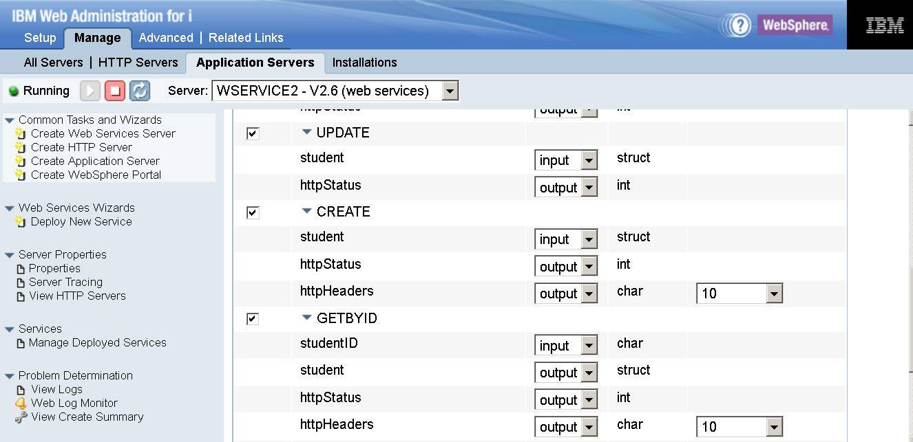

# パート 3：IBM i用統合Webサービス・サーバーを使用したRESTサービスの構築

### 複数HTTPメソッドを使用するRESTfulアプリケーションのデプロイ

English version: https://developer.ibm.com/tutorials/i-rest-web-services-server3/

###### 最新の英語版コンテンツは上記URLを参照してください。

### Author: Nadir Amra
last_updated: 2015-05-08

## はじめに

数年前から、ILEプログラムとサービス・プログラムを、SOAPプロトコル・ベースのWebサービスとしてデプロイすることが可能でした。それはオペレーティング・システムの一部である統合Webサービス・サーバーを使用したものです。最近まで、統合Webサービス・サーバーはRESTサービスをサポートしていませんでした。

この記事は統合Webサービス・サーバーにおけるRESTサポートに関するシリーズの3番目のパートです。

* [パート 1](../../Tutorials/i-rest-web-services-server1/)は、REST Webサービスの背後にある基本概念と、統合Webサービス・サーバーがRESTサービスをサポートする方法について説明します。
* [パート 2](../../Tutorials/i-rest-web-services-server2/)は、簡単なILEアプリケーションをRESTful Webサービスとしてデプロイするための手順を説明します。
* パート 3では、より多くのREST機能を使う複雑なILEアプリケーションをデプロイするための手順を説明します。

## 前提条件

### _ソフトウェア_

統合Webサービス・サーバーにおけるRESTサポートに必要なすべてのPTFを取得するためには、最新のグループPTFをロードする必要があります。表1はIBM iオペレーティング・システムのサポートされる各リリースに必要なHTTPグループPTFです。

 **表 1. ソフトウェア前提条件**
 <table border="0" cellpadding="0" cellspacing="0" class="ibm-data-table" data-widget="datatable" summary=""> <thead> <tr> <th class="ibm-background-neutral-white-30" style="vertical-align:top"> IBM i リリース </th> <th class="ibm-background-neutral-white-30" style="vertical-align:top"> HTTPグループPTF </th></tr></thead> <tbody> <tr> <td style="vertical-align:top"> i 7.2 </td> <td style="vertical-align:top"> SF99713 （level 6以降） </td></tr> <tr> <td style="vertical-align:top"> i 7.1 </td> <td style="vertical-align:top"> SF99368 （level 32以降） </td></tr></tbody></table>

### _前提知識_

この記事を読む前に、本シリーズの [パート 1](../../Tutorials/i-rest-web-services-server1/)を読んで、RESTの原則と用語を理解しておいてください。

[参考情報](#_Resources)セクションには、RESTに関する各種情報へのリンクがあります。また、JavaScript Object Notation（JSON）とXMLに関する基本的な概念を理解しておいてください。

## 本RESTfulアプリケーションについて

この説明の中で使用する例は、サンプルの学生情報登録アプリケーション（SRA）です。このサンプルSRAアプリケーションが提供する学生情報登録管理機能により、以下のことが行えます：

* 新しく学生情報を登録
* 登録済学生情報の編集
* 登録済学生情報の一覧
* 登録から学生情報を削除

SRAはサービス・プログラム STUDENTSRC で構成されています。これは、RESTfulサービス（つまりプロシージャー）を含んでおり、基本的な作成・読み出し・更新・削除（_Create-Read-Update-Delete_： CRUD）データベース・ロジックと、学生情報レコードが保管されているデータベース・ファイル STUDENTDBを提供します。

リスト1はアプリケーションのソースの一部です。このソースから、STUDENTSRCサービス・プログラム（RESTfulリソース）からエクスポートされるプロシージャーのプロトタイプを確認できます。

**リスト 1. SRAアプリケーション・ソースの一部**
<code-listing html-highlight="all-highlighting-off"><pre>&lpar;newline&rpar;&lpar;newline&rpar;h NOMAIN PGMINFO(&#8727;PCML:&#8727;MODULE:&#8727;DCLCASE)&lpar;newline&rpar;&lpar;newline&rpar;D studentRec      DS                  qualified template&lpar;newline&rpar;D  studentID                     9A&lpar;newline&rpar;D  firstName                    50A&lpar;newline&rpar;D  lastName                     50A&lpar;newline&rpar;D  gender                       10A&lpar;newline&rpar;&lpar;newline&rpar;D getAll          PR&lpar;newline&rpar;D  students&#95;...&lpar;newline&rpar;D  LENGTH                       10i 0&lpar;newline&rpar;D  students                           likeds(studentRec) dim(1000)&lpar;newline&rpar;D                                     options(&#8727;varsize)&lpar;newline&rpar;D  httpHeaders                 100a   dim(10)&lpar;newline&rpar;&lpar;newline&rpar;D getByID         PR&lpar;newline&rpar;D  studentID                     9a   const&lpar;newline&rpar;D  student                            likeds(studentRec)&lpar;newline&rpar;D  httpStatus                   10i 0&lpar;newline&rpar;D  httpHeaders                 100a   dim(10)&lpar;newline&rpar;&lpar;newline&rpar;D create          PR       &lpar;newline&rpar;D  student                            likeds(studentRec)&lpar;newline&rpar;D  httpStatus                   10i 0&lpar;newline&rpar;D  httpHeaders                 100a   dim(10)&lpar;newline&rpar;&lpar;newline&rpar;D update          PR       &lpar;newline&rpar;D  student                            likeds(studentRec)&lpar;newline&rpar;D  httpStatus                   10i 0&lpar;newline&rpar;&lpar;newline&rpar;D remove          PR       &lpar;newline&rpar;D  studentID                     9a   const&lpar;newline&rpar;D  httpStatus                   10i 0&lpar;newline&rpar;</pre></code-listing>

リソース・プログラム・オブジェクトは以下の5つのプロシージャーを定義します：

* **getAll**: 全ての学生情報の取得
* **getById**: 学生IDを用いた特定の学生情報の取得
* **create**: 新規学生情報レコードの作成
* **update**: 学生情報レコードの更新
* **remove**: 特定の学生情報レコードの削除

データ構造体テンプレート（`studentRec`）はデータベース・ファイルのフィールドを定義します。データ構造体を外部記述データ構造体を使って定義することもできます。しかし、XMLのエレメント名やJSONフィールド名の大/小文字の制御を行いたいので、外部定義のデータ構造体を使用しません。これらの名前は生成するプログラム・インタフェース情報から得られます。以前は、エレメントやフィールド名は全て大文字でした。しかし、IBM i 7.1（PTF SI55340)とIBM i 7.2（PTF SI55442）で導入された新しい機能によって、PGMINFO制御仕様書キーワード `*`DCLCASEパラメーターを使用して、大/小文字を制御できるようになりました。この指定を用いると、プログラム・インターフェース情報内の名前は、RPGソース・ファイルで定義した名前の大/小文字と同じになります。

## デプロイ前に行っておくべきこと

パート 2と同様に、RESTful Webサービスを実際にデプロイする前に、いくつかのことを明確にする必要があります。要約すると、RESTful Webサービスをデプロイする際には、少なくとも以下の質問に対する回答が必要です：

1. URI（Uniform Resource Identifier）をどのような外観にするか？
2. リソースがサポートするHTTPメソッドは何か？
3. どのタイプの入力コンテンツをサポートするか？
4. どのタイプでデータを返すか？

以降のセクションでは、デプロイ予定のアプリケーションに限定して、これらの基本的な質問を確認してみましょう。表2は、SRAアプリケーションで使用するHTTPメソッドとUniform Resource Identifiers（URI）のマッピング一覧です。

 **表 2. HTTPメソッドとURIのマッピング**
 <table border="0" cellpadding="0" cellspacing="0" class="ibm-data-table" data-widget="datatable" summary=""><thead> <tr> <th class="ibm-background-neutral-white-30" style="vertical-align:top"> HTTPメソッド </th> <th class="ibm-background-neutral-white-30" style="vertical-align:top"> URI </th> <th class="ibm-background-neutral-white-30" style="vertical-align:top"> 説明 </th></tr></thead> <tbody> <tr> <td style="vertical-align:top"> GET </td> <td style="vertical-align:top"> / <em>context-root</em>/students </td> <td style="vertical-align:top"> 全ての登録済学生情報を取得する </td></tr> <tr> <td style="vertical-align:top"> GET </td> <td style="vertical-align:top"> / <em>context-root</em>/students/{ <em>id</em>} </td> <td style="vertical-align:top"> 特定の登録済学生情報を取得する </td></tr> <tr> <td style="vertical-align:top"> POST </td> <td style="vertical-align:top"> / <em>context-root</em>/students </td> <td style="vertical-align:top"> 新しく学生情報を登録する </td></tr> <tr> <td style="vertical-align:top"> PUT </td> <td style="vertical-align:top"> / <em>context-root</em>/students </td> <td style="vertical-align:top"> 登録済学生情報を更新する </td></tr> <tr> <td style="vertical-align:top"> DELETE </td> <td style="vertical-align:top"> / <em>context-root</em>/students/{ <em>id</em>} </td> <td style="vertical-align:top"> 登録済学生情報を削除する </td></tr></tbody></table>

**注：** 統合Webサービス・サーバーにおけるデフォルトのコンテキスト・ルート（_context-root_）は `/web/services` です。

### _全ての登録済学生情報を取得する_

リスト2は `getAll()` プロシージャーです。このプロシージャーは、全登録済学生情報の取得に使用され、HTTP GETメソッドにマップされます。

**リスト 2. getAll()プロシージャー**
<code-listing html-highlight="all-highlighting-off"><pre>&lpar;newline&rpar;P getAll          B                   EXPORT&lpar;newline&rpar;D getAll          PI&lpar;newline&rpar;D  students&#95;...&lpar;newline&rpar;D  LENGTH                       10i 0&lpar;newline&rpar;D  students                           likeds(studentRec) dim(1000)&lpar;newline&rpar;D                                     options(&#8727;varsize)&lpar;newline&rpar;D  httpStatus                   10i 0&lpar;newline&rpar;D  httpHeaders                 100a   dim(10)&lpar;newline&rpar; /FREE&lpar;newline&rpar; clear httpHeaders;&lpar;newline&rpar; clear students;&lpar;newline&rpar; students&#95;LENGTH = 0;&lpar;newline&rpar;&lpar;newline&rpar; openStudentDB();&lpar;newline&rpar;&lpar;newline&rpar; setll &#8727;loval STUDENTDB;&lpar;newline&rpar;&lpar;newline&rpar; read(e) studentR;&lpar;newline&rpar; if (%ERROR);&lpar;newline&rpar;  httpStatus = H&#95;SERVERERROR;&lpar;newline&rpar;  return;&lpar;newline&rpar; endif;&lpar;newline&rpar;&lpar;newline&rpar; dow (NOT %eof);&lpar;newline&rpar;  students&#95;LENGTH = students&#95;LENGTH+1;&lpar;newline&rpar;  students(students&#95;LENGTH).studentID =  studentID;&lpar;newline&rpar;  students(students&#95;LENGTH).firstName =  firstName;&lpar;newline&rpar;  students(students&#95;LENGTH).lastName  =  lastName;&lpar;newline&rpar;  students(students&#95;LENGTH).gender    =  gender;&lpar;newline&rpar;&lpar;newline&rpar;  read(e) studentR;&lpar;newline&rpar;  if (%ERROR);&lpar;newline&rpar;    httpStatus = H&#95;SERVERERROR;&lpar;newline&rpar;    return;&lpar;newline&rpar;  endif;&lpar;newline&rpar; enddo;&lpar;newline&rpar;&lpar;newline&rpar; httpStatus = H&#95;OK;&lpar;newline&rpar; httpHeaders(1) = 'Cache&#8209;Control: no&#8209;cache, no&#8209;store';&lpar;newline&rpar;&lpar;newline&rpar; closeStudentDB();&lpar;newline&rpar; /END&#8209;FREE&lpar;newline&rpar;P getAll          E&lpar;newline&rpar;        </pre></code-listing>

パラメーター・リストの中に、学生情報レコードの配列と、配列内の学生情報登録レコード数を示す長さフィールドがあることに注意してください。長さフィールドに値を設定しないと、レスポンスには空エレメントが入り、クライアントとサーバー双方でパフォーマンス低下を引き起こす可能性があります。

`httpStatus` パラメーターは、クライアントに返すHTTPステータス・コード用に使います。予期しないエラーが起きると、HTTPステータス・コード `H_SERVERERROR`（500）を返します。それ以外の場合は、`H_OK`（200）を返します。

`httpHeaders` パラメーターは、HTTPヘッダーの返信用に使用します。この例では、レスポンスをキャッシュされたくないので、`Cache-Control` HTTPヘッダーをセットしています。

### _特定の登録済学生情報を取得する_

リスト3は `getByID()` プロシージャーです。このプロシージャーは登録済学生情報の取得に使用され、HTTP GETメソッドにマップされます。

**リスト 3. getByID()プロシージャー**
<code-listing html-highlight="all-highlighting-off"><pre>&lpar;newline&rpar;    &lpar;newline&rpar;P getByID         B                   EXPORT&lpar;newline&rpar;D getByID         PI&lpar;newline&rpar;D  studentID                     9a   const&lpar;newline&rpar;D  student                            likeds(studentRec)&lpar;newline&rpar;D  httpStatus                   10i 0&lpar;newline&rpar;D  httpHeaders                 100a   dim(10)&lpar;newline&rpar; /FREE&lpar;newline&rpar; clear httpHeaders;&lpar;newline&rpar; clear student;&lpar;newline&rpar;&lpar;newline&rpar; openStudentDB();&lpar;newline&rpar;&lpar;newline&rpar; chain(e) studentID STUDENTDB;&lpar;newline&rpar; if (%ERROR);&lpar;newline&rpar;  httpStatus = H&#95;SERVERERROR;&lpar;newline&rpar;  return;&lpar;newline&rpar; elseif %FOUND;&lpar;newline&rpar;  student.studentID = studentID;&lpar;newline&rpar;  student.firstName = firstName;&lpar;newline&rpar;  student.lastName  = lastName;&lpar;newline&rpar;  student.gender    = gender;&lpar;newline&rpar;&lpar;newline&rpar;  httpStatus = H&#95;OK;&lpar;newline&rpar; else;&lpar;newline&rpar;  httpStatus = H&#95;NOTFOUND;&lpar;newline&rpar; endif;&lpar;newline&rpar;&lpar;newline&rpar; httpHeaders(1) = 'Cache&#8209;Control: no&#8209;cache, no&#8209;store';&lpar;newline&rpar;&lpar;newline&rpar; closeStudentDB();&lpar;newline&rpar; /END&#8209;FREE&lpar;newline&rpar;P getByID         E&lpar;newline&rpar;</pre></code-listing>

`studentID` パラメーターは入力パラメーターで、データベースの登録済学生情報を取得するためのキーとして使用します。登録が見つからない場合、HTTPステータス・コード `H_NOTFOUND`（404）を返します。キャッシュ制御HTTPヘッダーをセットして、レスポンスがキャッシュされないようにしています。

### _新しく学生情報を登録する_

リスト4は `create()` プロシージャーです。このプロシージャーは新規学生情報の登録に使用され、HTTP POSTメソッドにマップされます。

**リスト 4. create()プロシージャー**
<code-listing html-highlight="all-highlighting-off"><pre>&lpar;newline&rpar;P create          B                   EXPORT&lpar;newline&rpar;D create          PI        &lpar;newline&rpar;D  student                            likeds(studentRec)&lpar;newline&rpar;D  httpStatus                   10i 0&lpar;newline&rpar;D  httpHeaders                 100a   dim(10)&lpar;newline&rpar; /FREE&lpar;newline&rpar; openStudentDB();&lpar;newline&rpar;&lpar;newline&rpar; studentID = student.studentID;&lpar;newline&rpar; firstName = student.firstName;&lpar;newline&rpar; lastName  = student.lastName;&lpar;newline&rpar; gender    = student.gender;&lpar;newline&rpar;&lpar;newline&rpar; write(e) studentR;&lpar;newline&rpar; if NOT %ERROR;&lpar;newline&rpar;  httpStatus = H&#95;CREATED;&lpar;newline&rpar;  httpHeaders(1) = 'LOCATION: ' + '&lpar;http&rpar;server/web/service/students/' + studentID;&lpar;newline&rpar; elseif %STATUS = ERR&#95;DUPLICATE&#95;WRITE;&lpar;newline&rpar;  httpStatus = H&#95;CONFLICT;&lpar;newline&rpar; else;&lpar;newline&rpar;  httpStatus = H&#95;SERVERERROR;&lpar;newline&rpar; endif;&lpar;newline&rpar;&lpar;newline&rpar; closeStudentDB();&lpar;newline&rpar; /END&#8209;FREE&lpar;newline&rpar;P create          E&lpar;newline&rpar;</pre></code-listing>

データベースに学生IDが既に存在している場合、HTTPステータス・コード `H_CONFLICT`（409）を返します。登録が成功したら、HTTPステータス・コード `H_CREATED`（201）を返します。HTTP 201ステータス・コードのレスポンスでは、本リクエストで作成した新リソースのURIをセットした`Location` HTTPを返します。

### _登録済学生情報を更新する_

リスト5は `update()` プロシージャーです。このプロシージャーは登録済学生情報の更新に使用され、HTTP PUTメソッドにマップされます。

**リスト 5. update()プロシージャー**
<code-listing html-highlight="all-highlighting-off"><pre>&lpar;newline&rpar;P update          B                   EXPORT&lpar;newline&rpar;D update          PI   &lpar;newline&rpar;D  student                            likeds(studentRec)&lpar;newline&rpar;D  httpStatus                   10i 0&lpar;newline&rpar; /FREE&lpar;newline&rpar; openStudentDB();&lpar;newline&rpar;&lpar;newline&rpar; chain(e) student.studentID STUDENTDB;&lpar;newline&rpar; if (%ERROR);&lpar;newline&rpar;  httpStatus = H&#95;SERVERERROR;&lpar;newline&rpar;  return;&lpar;newline&rpar; elseif %FOUND;&lpar;newline&rpar;  studentID = student.studentID;&lpar;newline&rpar;  firstName = student.firstName;&lpar;newline&rpar;  lastName  = student.lastName;&lpar;newline&rpar;  gender    = student.gender;&lpar;newline&rpar;&lpar;newline&rpar;  update(e) studentR;&lpar;newline&rpar;  if NOT %ERROR;&lpar;newline&rpar;    httpStatus = H&#95;NOCONTENT;&lpar;newline&rpar;  else;&lpar;newline&rpar;    httpStatus = H&#95;NOTFOUND;&lpar;newline&rpar;  endif;&lpar;newline&rpar; else;&lpar;newline&rpar;  httpStatus = H&#95;NOTFOUND;&lpar;newline&rpar; endif;&lpar;newline&rpar;&lpar;newline&rpar; closeStudentDB();&lpar;newline&rpar; /END&#8209;FREE&lpar;newline&rpar;P update          E&lpar;newline&rpar;</pre></code-listing>

学生IDが見つからない場合、`H_NOTFOUND`（404）のHTTPステータス・コードを返します。更新操作が成功すると、`H_NOCONTENT`（204）のHTTPステータス・コードを返します。これは、プロシージャーが返すデータが無いからです。

### _登録済学生情報を削除する_

リスト6は `remove()` プロシージャーです。このプロシージャーは登録済学生情報の削除に使用され、HTTP DELETEメソッドにマップされます。

**リスト 6. remove()プロシージャー**
<code-listing html-highlight="all-highlighting-off"><pre>&lpar;newline&rpar;P remove          B                   EXPORT&lpar;newline&rpar;D remove          PI    &lpar;newline&rpar;D  studentID                     9a   Const&lpar;newline&rpar;D  httpStatus                   10i 0&lpar;newline&rpar; /FREE&lpar;newline&rpar; openStudentDB();&lpar;newline&rpar;&lpar;newline&rpar; chain(e) studentID STUDENTDB;&lpar;newline&rpar; if (%ERROR);&lpar;newline&rpar;  httpStatus = H&#95;SERVERERROR;&lpar;newline&rpar;  return;&lpar;newline&rpar; elseif %FOUND;&lpar;newline&rpar;  delete(e) studentR;&lpar;newline&rpar;  if NOT %ERROR;&lpar;newline&rpar;    httpStatus = H&#95;NOCONTENT;&lpar;newline&rpar;  elseif NOT %FOUND;&lpar;newline&rpar;    httpStatus = H&#95;NOTFOUND;&lpar;newline&rpar;  else;&lpar;newline&rpar;    httpStatus = H&#95;SERVERERROR;&lpar;newline&rpar;  endif;&lpar;newline&rpar; else;&lpar;newline&rpar;  httpStatus = H&#95;NOTFOUND;&lpar;newline&rpar; endif;&lpar;newline&rpar;&lpar;newline&rpar; closeStudentDB();&lpar;newline&rpar; /END&#8209;FREE&lpar;newline&rpar;P remove          E&lpar;newline&rpar;</pre></code-listing>

学生IDが見つからない場合、`H_NOTFOUND`（404）HTTPステータス・コードを返します。削除操作が正常終了すると、`H_NOCONTENT`（204）HTTPステータス・コードを返します。これは、プロシージャーが返すデータが無いからです。

## 事例におけるニーズ

この記事内で開発するREST API事例は、学生情報登録データベースを前提としています。この事例は、REST規範に従って学生情報の取得、追加、削除、および更新を可能にすることに重点を置いています。

ご自身のサーバー上で各ステップを再実行する場合、SRAアプリケーションのソースは[ダウンロード](#_Download)のセクションで入手できます。

## ステップ 1. アプリケーション・データベースのファイルをセットアップする

この例では、STUDENTSRCライブラリーにSTUDENTDBのDBファイルを作成します。ライブラリーを作成するために、以下のCLコマンドを実行します：

<code-listing html-highlight="all-highlighting-off"><pre>CRTLIB STUDENTRSC</pre></code-listing>

表を作成するために、以下のSQLコマンドを実行します：

<code-listing html-highlight="all-highlighting-off"><pre>&lpar;newline&rpar;CREATE TABLE STUDENTRSC/STUDENTDB&lpar;newline&rpar; ("Student ID"  FOR COLUMN studentID CHAR (9) NOT NULL,   &lpar;newline&rpar;  "First Name"  FOR COLUMN firstName CHAR (50) NOT NULL,&lpar;newline&rpar;  "last Name"   FOR COLUMN lastName  CHAR (50) NOT NULL,&lpar;newline&rpar;  "Gender Type" FOR COLUMN gender CHAR (10) NOT NULL,&lpar;newline&rpar;  PRIMARY KEY ( studentID ))&lpar;newline&rpar;  RCDFMT studentr&lpar;newline&rpar;</pre></code-listing>

表にサンプルの登録用学生情報データを入力するために、以下のSQLコマンドを実行します：

<code-listing html-highlight="all-highlighting-off"><pre>&lpar;newline&rpar;INSERT INTO STUDENTRSC/STUDENTDB&lpar;newline&rpar; (studentID, firstName, lastName, gender)&lpar;newline&rpar; VALUES('823M934LA', 'Nadir', 'Amra', 'Male'),&lpar;newline&rpar;       ('826M660CF', 'John', 'Doe', 'Male'),&lpar;newline&rpar;       ('747F023ZX', 'Jane', 'Amra', 'Female') &lpar;newline&rpar;       </pre></code-listing>

## ステップ 2. 統合Webサービス・サーバーを作成する

ILEプログラム・オブジェクトをRESTサービスとしてデプロイするためには、統合Webサービス・サーバーが作成済みで、それがバージョン2.6以上でなければなりません。すでに作成済みのものがあれば、このセクションをスキップしてもかまいません。新たに作らなければならない場合は、本シリーズの [パート 2](../../Tutorials/i-rest-web-services-server2/)を読んで、サーバー作成方法を学習してください。

## ステップ 3. ILEアプリケーションをRESTful Webサービスとしてデプロイする

それでは、SRAアプリケーション・サービス・プログラムをRESTful Webサービスとしてデプロイしましょう。STUDENTSRCサービス・プログラムはSTUDENTSRCライブラリーにあります。

### _ステップ 3-1. IBM iプログラム・オブジェクトをWebサービスとしてデプロイする_

ナビゲーション・バーにある **Deploy New Service** ウィザードをクリックし、ウィザードを開始して新規Webサービスをデプロイします。

 **図 1. Webサービスのデプロイ – ステップ 1**
 <figure></img></figure>

Deploy New Serviceページ上で、SOAPあるいはRESTのWebサービスをデプロイすることができます（図1参照）。ここでは、REST Webサービスをデプロイしているので、RESTオプションを選択します。

**Next** をクリックします。

### _ステップ 3-2. IBM iプログラム・オブジェクトの場所を指定する_

ここで、Webサービスの元となるILEプログラム・オブジェクトの名前を指定する必要があります。システム上でプログラム・オブジェクトの場所を特定する方法は2つあります。デフォルトの方法は、**Specify IBM i library and ILE object name (Recommended)** オプションを使用して、プログラムとライブラリー名を指定することです。もうひとつの方法は、統合ファイル・システム（IFS）をブラウズしてプログラム・オブジェクトを検索することです。/QSYS.LIBのように、大量のオブジェクトを含むディレクトリーを指定した場合、しばらく時間がかかる可能性があります。

 **図 2. Webサービスのデプロイ – ステップ 2**
 <figure></img></figure>

ライブラリー名としてstudentsrc、ILEオブジェクト名としてstudentsrcを入力し、**Next** をクリックします。

### _ステップ 3-3. リソース（Webサービス）に名前を指定する_

ここで、Webサービス（RESTfulリソース）に意味のあるサービス名を与え、説明を記入する必要があります。デフォルトでは、サービス名と説明は選択したプログラム・オブジェクトの名前が設定されます（図3参照）。

 **図 3. Webサービスのデプロイ – ステップ 3**
 <figure></img></figure>

リソース名は `students` に変更されています。さらに、リソースに対してURIパス・テンプレートを設定することができます。この例では何も指定しません。なぜなら、リソース名変更後のリソースへのパスが以下のようになっているからです：

/_context-root_/students

**Next** をクリックします。

### _ステップ 3-4. エクスポート・プロシージャーを選択して、リソース・メソッドを外部化する_

次のスクリーンでは、エクスポートされたプロシージャーのリストが表示されます（図4参照）。サービス・プログラム（オブジェクト・タイプ `*`SRVPGM）では、1つあるいは複数のプロシージャーが存在することがあります。プログラム（オブジェクト・タイプ `*`PGM）では、プロシージャーは1つしか存在せず、これがプログラムの主エントリー・ポイントになります。プロシージャー行を展開すると、プロシージャーのパラメーターと各種パラメーター属性が表示されます。

 **図 4. Webサービスのデプロイ – ステップ 4**
 <figure></img></figure>

パラメーター属性は変更可能です。多くの場合、Webサービス・クライアントが送るデータを制御する、あるいはクライアントへのレスポンス・データを制御するために、パラメーター属性は変更されます。

図4を見ると、`REMOVE` プロシージャーが学生情報の登録を削除するために使用されるプロシージャーであることが分かります。そこには、2つのパラメーター `studentID` と `httpStatus` があります。`studentID` パラメーターは削除する学生のIDであり、プロシージャーへの入力パラメータです。 `httpStatus` パラメーターはクライアントに返すHTTPステータス・コードで、出力パラメーターとして指定されています。

Export proceduresセクションを下にスクロールしていくと、`UPDATE`、`CREATE`、および `GETBYID` プロシージャーがあります（図5参照）。パラメーターを入力、あるいは出力パラメータとして指定しています。

**図 5. Webサービスのデプロイ – ステップ 4（update、create、getByID）**
 <figure> </img></figure>

さらにもう少し下にスクロールすると、`GETALL` プロシージャーがあり、これはデータベース内の全登録済学生情報を戻しします（図6参照）。

 **図 6. Webサービスのデプロイ – ステップ 4（getAll）**
 <figure></img></figure>

図6のように値を設定すると、プロシージャーはリクエストを処理して1000人分の学生情報レコードを含むレスポンスを返します。その中の3人分の学生情報レコードは登録した学生情報データを含み、残り997人分の学生情報レコードは空です。ここでは、登録済学生数だけを返したいので、`students` パラメータの列カウントを変更して、`students_LENGTH` パラメーターを参照するようにします（図7参照）。このパラメーターは `GETALL` プロシージャーによって登録済学生数にセットされ、これによってレスポンスは登録済学生数だけを含むようになります。

 **図 7. Webサービスのデプロイ – ステップ 4（getAll）修正版**
 <figure></img></figure>

**Next** をクリックします。

### _ステップ 3-5. リソース・メソッド情報を指定する_

このステップを説明する前に、これからデプロイするRESTfulアプリケーションのREST情報をまとめておきましょう。表3はSRAアプリケーションの各リソース・メソッド（すなわちプロシージャー）のREST情報です。

 **表 3. 各プロシージャーのREST情報**
 <table border="0" class="ibm-data-table" summary=""><thead> <tr> <th class="ibm-background-neutral-white-30"></th></tr></thead> <tbody> <tr> <th id="" rowspan="6" scope="row">REMOVE</th> <th headers="1stgrade teacher" id="" scope="row">URL</th> <td headers=""> <em>/context-root/students/{id}</em></td></tr> <tr> <th id="" scope="row">Method</th> <td headers="">DELETE</td></tr> <tr> <th id="" scope="row">Request body</th> <td headers="">None</td></tr> <tr> <th rowspan="3">Returns</th> <td>204 No content</td></tr> <tr> <td>404 Not found</td></tr> <tr> <td>500 Server error</td></tr> <tr> <th id="" rowspan="6" scope="row">UPDATE</th> <th headers="1stgrade teacher" id="" scope="row">URL</th> <td headers=""> <em>/context-root/students</em></td></tr> <tr> <th id="" scope="row">Method</th> <td headers="">PUT</td></tr> <tr> <th id="" scope="row">Request body</th> <td headers="">JSON</td></tr> <tr> <th rowspan="3">Returns</th> <td>204 No content</td></tr> <tr> <td>404 Not found</td></tr> <tr> <td>500 Server error</td></tr> <tr> <th id="" rowspan="6" scope="row">CREATE</th> <th headers="1stgrade teacher" id="" scope="row">URL</th> <td headers=""> <em>/context-root/students</em></td></tr> <tr> <th id="" scope="row">Method</th> <td headers="">POST</td></tr> <tr> <th id="" scope="row">Request body</th> <td headers="">JSON</td></tr> <tr> <th rowspan="3">Returns</th> <td>201 Created</td></tr> <tr> <td>409 Conflict</td></tr> <tr> <td>500 Server error</td></tr> <tr> <th id="" rowspan="6" scope="row">GETBYID</th> <th headers="1stgrade teacher" id="" scope="row">URL</th> <td headers=""> <em>/context-root/students/{id}</em></td></tr> <tr> <th id="" scope="row">Method</th> <td headers="">GET</td></tr> <tr> <th id="" scope="row">Request body</th> <td headers="">None</td></tr> <tr> <th rowspan="3">Returns</th> <td>200 OK & JSON</td></tr> <tr> <td>404 Not found</td></tr> <tr> <td>500 Server error</td></tr> <tr> <th id="" rowspan="5" scope="row">GETALL</th> <th headers="1stgrade teacher" id="" scope="row">URL</th> <td headers=""> <em>/context-root/students</em></td></tr> <tr> <th id="" scope="row">Method</th> <td headers="">GET</td></tr> <tr> <th id="" scope="row">Request body</th> <td headers="">None</td></tr> <tr> <th rowspan="2">Returns</th> <td>200 OK & JSON</td></tr> <tr> <td>500 Server error</td></tr></tbody></table>

最初に処理するのは、`REMOVE` プロシージャーです。

 **図 8. Webサービスのデプロイ – ステップ 5（REMOVE）**
 <figure></img></figure>

図8から以下のことが分かります：

* HTTPリクエスト・メソッドはDELETEに設定されています（**1**）。
* 表3で見たように、URIは以下のフォーマットになります：  /_context-root_/students/_{id}_  これは、学生ID情報がURIの一部として渡されるということです。これを実現するために、URIパス・テンプレートを指定して（**2**）、URIにマッチする全HTTP DELETEリクエストが、`REMOVE` に渡されるようにします。また、正規表現 `\w{9}` を使用することで、登録IDが確実に9文字のワードになります。
* プロシージャーはエンティティ本体を戻さないので、出力メディア・タイプはなんでも構いません。この場合、JSONを選択していますが（**3**）、デフォルトのXMLでもJSONでも構いません。
* プロシージャーはレスポンス・コードを返すので、HTTPレスポンス・コードとして `httpStatus` パラメーターを使用します（**4**）。
* URIパス変数である `id` を `studentID` パラメーターにインジェクトしようとしています。そのため、入力ソース（Input Source）として `*PATH_PARAM` を指定し、挿入するID（Identifier)として選択します（**5**）。

**Next** をクリックして `UPDATE` プロシージャーを処理します（図9）。

 **図 9. Webサービスのデプロイ – ステップ 5（UPDATE）**
 <figure></img></figure>

図9から以下のことが分かります：

* HTTPリクエスト・メソッドはPUTに設定されています（**1**）。
* 入力データのフォーマットはJSONです（**2**）。
* プロシージャーはエンティティ本体を戻しません。図9のように、ここではJSONを選択していますが（**3**）、デフォルトのXMLでもJSONでも構いません。
* プロシージャーはレスポンス・コードを返すので、HTTPレスポンス・コードとして `httpStatus` パラメーターを使用します（**4**）。

**Next** をクリックして、 `CREATE` プロシージャーを処理します（図10）。

 **図 10. Webサービスのデプロイ – ステップ 5（CREATE）**
 <figure></img></figure>

図10から以下のことが分かります：

* HTTPリクエスト・メソッドはPOSTに設定されています（**1**）。
* 入力データのフォーマットはJSONです（**2**）。
* プロシージャーはエンティティ本体を戻しません。ここでもJSONを選択していますが（**3**）、デフォルトのXMLでもJSONでも構いません。
* プロシージャーはレスポンス・コードを返すので、HTTPレスポンス・コードとして `httpStatus` パラメーターを使用します（**4**）。
* プロシージャーがHTTPヘッダーを戻すように指定しています（**5**）。学生情報の登録が成功したら、HTTPロケーション・ヘッダーがセットされることを思い出してください。

**Next** をクリックして、`GETBYID` プロシージャーを処理します（図11）。

 **図 11. Webサービスのデプロイ – ステップ 5（GETBYID）**
 <figure></img></figure>

図11から以下のことが分かります：

* HTTPリクエスト・メソッドはGETに設定されています（**1**）。
* 表3で見たように、URIは以下のフォーマットになります：  /_context-root_/students/_{id}_  これは、学生ID情報がURIの一部として渡されるということです。これを実現するために、URIパス・テンプレートを指定して（**2**）、URIにマッチする全HTTP GETリクエストが、`GETBYID` に渡されるようにします。また、正規表現 `\w{9}` を使用することで、登録IDが確実に9文字のワードになります。
* 出力データのフォーマットはJSONです（**3**）。
* プロシージャーはレスポンス・コードを返すので、HTTPレスポンス・コードとして `httpStatus` パラメーターを使用します（**4**）。
* プロシージャーがHTTPヘッダーを戻すように指定しています（**5**）。登録済学生情報を返すとき、HTTPキャッシング・ヘッダーがセットされることを思い出してください。
* URIパス変数である `id` を `studentID` パラメーターにインジェクトしようとしています。そのため、入力ソース（Input Source）として `*PATH_PARAM` を指定し、挿入するID（Identifier）として選択します（**6**）。

**Next** ボタンをクリックして、`GETALL` プロシージャーを処理します（図12）。

 **図 12. Webサービスのデプロイ – ステップ 5（GETALL）**
 <figure></img></figure>

図12から以下のことが分かります：

* HTTPリクエスト・メソッドはGETに設定されています（**1**）。
* 出力データのフォーマットはJSONです（**2**）。
* プロシージャーはレスポンス・コードを返すので、HTTPレスポンス・コードとして `httpStatus` パラメーターを使用します（**3**）。
* プロシージャーがHTTPヘッダーを返すように指定しています（**4**）。登録済学生情報を返すとき、HTTPキャッシング・ヘッダーがセットされることを思い出してください。

これでREST情報の設定が完了しました。**Next** をクリックしてください。

### ステップ 3-6. 本サービスに対してユーザーIDを指定する

本サービスを実行するユーザーIDを指定する必要があります。図13のように、サーバーのユーザーIDで実行する、あるいは既存ユーザーIDを指定して実行することができます。

 **図 13. Webサービスのデプロイ – ステップ 6**
 <figure></img></figure>

Webサービスが正しく稼働するためには、ユーザーID状況が `*`ENABLED でければなりません。また、パスワードには `*`NONE 以外の値を設定しなければなりません。指定したユーザーIDが無効、あるいはパスワードが `*`NONE の場合、警告メッセージが表示され、サービスを正しく実行できないことがあります。また、プログラム・オブジェクトが使用するリソースやオブジェクトに対して、指定するユーザーIDに適切な権限が必要です。これらには、ライブラリー、データベース、およびファイルなどがあります。

この例では、デフォルトを使用します。**Next** をクリックしてください。

### ステップ 3-7. ライブラリー・リストを指定する

プログラム・オブジェクトが正しく機能するために必要なライブラリーを設定します（図14参照）。

 **図 14. Webサービスのデプロイ – ステップ 7**
 <figure></img></figure>

ライブラリーの追加場所として、ライブラリー・リストのユーザー部分の先頭、あるいはユーザー部分の最後を選択できます。**Next** をクリックしてください。

### ステップ 3-8. 引き渡すトランスポート情報を指定する

クライアント・リクエストに関連するトランスポート情報のうち、何をWebサービス実装コードに渡すかを指定します（図15参照）。情報は環境変数として渡されます。

 **図 15. Webサービスのデプロイ – ステップ 8**
 <figure></img></figure>

トランスポート・メタデータ（Transport Metadata）のREMOTE_ADDRが、環境変数REMOTE_ADDRを通してWebサービスの実装コードに渡されます。

HTTPヘッダー（HTTP Headers）セクションでは、Webサービス実装コードに渡すトランスポート・ヘッダー（例えばHTTPヘッダー）を指定します。トランスポート・ヘッダーは環境変数として渡されます。HTTPヘッダーに対する環境変数名は、指定されたHTTPヘッダーで構成されますが、それらは全て大文字で接頭語'`HTTP_`'で始まります。例えば、'`Content-type`'が指定されると、環境変数は'`HTTP_CONTENT-TYPE`'になります。Webサービス・リクエストにHTTPヘッダーが渡されない場合、環境変数値はnull文字列にセットされます。

**Next** をクリックします。

### ステップ 3-9. Deploy web service – ステップ 9

Webサービスのデプロイ・ウィザードはサマリー・ページを表示します（図16）。デプロイ作業中のWebサービスに関する詳細を確認することができます。

 **図 16. Webサービスのデプロイ – ステップ 9（サマリー）**
 <figure></img></figure>

サマリー・ページの下部にある **Finish** をクリックすると、導入プロセスが開始します。Webサービスのデプロイが完了すると、デプロイしたサービスがアクティブ（サービス名左側の緑の丸印）になります。図17はこの様子を示しています。

 **図 17. 成功裏にデプロイされたRESTful Webサービス**
 <figure></img></figure>

おめでとうございます。これでILEプログラム・オブジェクトをRESTful Webサービスとしてデプロイすることに成功しました。

SOAPと異なり、IBM Web AdministrationのGUIにはRESTサービスをテストするためのクライアントは提供されません。`HTTP GET` リクエスト・メソッドにバインドされたリソース・メソッドは、ブラウザーを用いて簡単にサービスをテストできます。図18は全登録学生情報の取得リクエストに対する結果です。

 **図 18. Webサービスのテスト – 全登録済学生情報の取得**
 <figure></img></figure>

図19は学生IDが823M934LAの学生情報レコードの取得リクエストに対する結果です。

 **図 19. Webサービスのテスト – 特定の登録済学生情報の取得**
 <figure></img></figure>

これ以外のリソース・メソッドをテストするには、外部ツール（例えばSoapUI）を使用しなければなりません。図20は新規学生情報の登録をSoapUIを用いてリクエストした結果です。

 **図 20. Webサービスのテスト – 新規学生情報の登録**
 <figure></img></figure>

図20から、新規学生情報を登録しているので、HTTPメソッドがPOSTになっていることが分かります（**1**）。（**2**）のサブパネルはJSONフォーマットの登録用新規情報データで、HTTP POSTリクエストの一部としてサーバーに送付されます。リクエストをサブミットした結果として、サーバーからのレスポンスにはJSONデータは含まれていません（**3**）。作成のリクエストは成功しているので、RESTサービスはHTTPステータス・コード201（Created）と、新しく作成した登録済学生情報リソースのURLを含むロケーション・ヘッダーを返します（**4**）。

## まとめ

本シリーズの[パート 1](../../Tutorials/i-rest-web-services-server1/)では、REST Webサービスの背後にある基本概念と、統合Webサービス・サーバーがRESTサービスをサポートする方法について説明しました。[パート 2](../../Tutorials/i-rest-web-services-server2/)では、シンプルなILEアプリケーションをRESTful Webサービスとしてデプロイする方法を説明しました。この記事では、より多くのREST機能を使う複雑なILEアプリケーションをデプロイする方法を説明しました。

統合Webサービス・サーバーによるRESTサポートは、IBM iプラットフォーム上のILEプログラムおよびサービス・プログラムに基づくREST APIの作成・デプロイの強固な基盤を提供します。IBM Web Administration for i GUIは高度に直感的です。これをWebサービスのデプロイに使用すれば、ユーザー固有のREST APIのプロトタイピングとデプロイを素早く行うために必要なすべてのものが揃います。さあ、始めまませんか？

<a id="_Download" />

## ダウンロード

 <table border="0" cellpadding="0" cellspacing="0" class="ibm-data-table" data-widget="datatable" summary=""> <thead> <tr> <th class="ibm-background-neutral-white-30" style="vertical-align:top"> Description </th> <th class="ibm-background-neutral-white-30" style="vertical-align:top"> Name </th> <th class="ibm-background-neutral-white-30" style="vertical-align:top"> Size </th></tr></thead> <tbody> <tr> <td style="vertical-align:top"> Source code </td> <td style="vertical-align:top"> <a href="https://www.ibm.com/developerworks/ibmi/library/i-rest-web-services-server3/IBMi.REST.SRA.Src.zip">IBMi.REST.SRA.Src.zip</a></td> <td style="vertical-align:top"> 4 KB </td></tr></tbody></table>

<a id="_Resources" />

## 参考情報

* IBM iの統合Webサービスのサポートに関しては、[製品のWebページ](https://www.ibm.com/systems/power/software/i/iws/)を参照してください。
* 本シリーズの[パート 1](../../Tutorials/i-rest-web-services-server1/)は、REST Webサービスの背後にある基本概念と、統合Webサービス・サーバーがRESTサービスをサポートする方法の説明から始めています。
* [パート 2](../../Tutorials/i-rest-web-services-server2/)は、シンプルなILEアプリケーションをRESTful Webサービスとしてデプロイするステップを説明しています。
* [RESTful Web services: The basics](https://developer.ibm.com/articles/ws-restful/)は、RESTの概要について説明しています。
* HTTPプロトコルとコンテンツ・ネゴシエーションについては、[RFC 2616](https://www.w3.org/Protocols/rfc2616/rfc2616.html)を参照してください。
* Java正規表現については、Javaチュートリアルが提供する[正規表現](https://docs.oracle.com/javase/tutorial/essential/regex/)のレッスンを参照してください。
