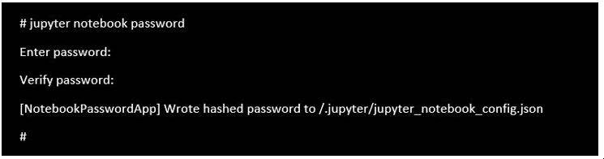

# IBM AIX への Python 機械学習パッケージの導入と構成

### AIX 上のオープン・ソース機械学習ツール

English version: https://developer.ibm.com/tutorials/machine-learning-with-python-on-aix/

###### 最新の英語版コンテンツは上記URLを参照してください。

### Authors: Sanket Rathi, Phani Kumar Ayyagari
last_updated: 2020-01-10

## はじめに

機械学習は人工知能の一分野であり、膨大なデータの中から認知されていない知見を引き出し、予測を実行することを可能にします。機械学習アルゴリズムはデータ・サイエンティストによって作成され、データの傾向を理解し、単純な解析を超えた予測を提供します。Python は人気のプログラミング言語で、機械学習アルゴリズムの記述に広く使用されていますが、これはそのシンプルさと高い適用性によるものです。多くのパッケージが Python で書かれ、データ・サイエンティストによるデータ分析、データの可視化、データの前処理、特徴抽出、モデル構築、トレーニング、評価、および機械学習アルゴリズム・モデルのデプロイを可能にします。

このチュートリアルは、 Python ベースの機械学習パッケージのエコシステムを IBM&reg; AIX&reg; 上に導入し、構成する手順を説明します。これらのパッケージを使用して、AIX ユーザーはデータ・マイニング、データ分析、科学計算、データ描画、さらにその他の機械学習タスクを効率的に行うことができます。これらの Python 機械学習パッケージには、NumPy、Pandas、Scikit-learn、SciPy、そして Matplotlib などがあります。

これらのパッケージは全て Python ベースのため、最新バージョンの Python が AIX 上に導入されている必要があります。Python を AIX 上に導入するためには YUM を使用するか、または [AIX toolbox](https://www.ibm.com/support/pages/node/883796) から直接導入することができます。このチュートリアルでは Python3 について説明しますが、Python2 についても同様に成り立ちます。ここでは、これらの機械学習パッケージを実行するために、python3-3.7.1.-1 あるいはそれ以降のバージョンの Python を、[AIX toolbox](https://www.ibm.com/support/pages/node/883796) から導入する必要があります。

このチュートリアルでは、AIX 上に機械学習パッケージを導入するために、Python のパッケージ管理ツールである pip を使用します。これらのパッケージは、pip が導入を行う際にコンパイルされます。これは、Python Package Index（PyPI）レポジトリーに、パッケージの AIX 用バイナリー・バージョンが無いためです。

## YUM による Python 導入

オープン・ソースの RPM パッケージを導入する最も簡単な方法は YUM であり、これを使用すればパッケージとその依存モジュールに関する事前知識が必要ありません。AIX 上に YUM を導入するためには、yum.sh スクリプトを [AIX toolbox repository](http://ftp.software.ibm.com/aix/freeSoftware/aixtoolbox/ezinstall/ppc/yum.sh) からダウンロードし、root ユーザーで実行します。

YUM を導入する過程で、Python2 がデフォルトで導入されます。YUM のセットアップと導入が終わったら、`yum update` コマンドを使用して、全てのパッケージを最新のレベルに更新します。

## 機械学習パッケージ導入の前提条件

pip を用いて、AIX 上で機械学習パッケージをビルドし導入するためには、以下のオープン・ソース・パッケージが必要です。YUM を使用して、これらのパッケージを AIX toolbox から導入します。

* blas
* freetype2-devel
* gcc
* gcc-c++
* gcc-gfortran
* lapack
* libpng-devel
* python3
* python3-devel
* xz
* zeromq
* zeromq-devel

YUM を使用してこれらのパッケージを全て導入します。

```
# yum install gcc  xz python3 gcc-c++ gcc-gfortran freetype2-devel libpng-devel zeromq zeromq-devel lapack blas python3-devel
```

**図 1. YUM によるオープン・ソース・パッケージ導入時の出力**


このコマンドが正常終了すると、Python3 および Python 機械学習パッケージを導入するために必要な依存パッケージが、マシン上に導入されます。

## その他の設定

機械学習パッケージを導入するために、以下の追加設定を行う必要があります。

* 設定されているリソース制限を緩和する<br />
  Matplotlib や NumPy などの機械学習パッケージを正常に導入するために、使用可能なプロセス・リソースを多くする必要があります。スタックとデータのリソース制限を緩和するためには、ulimit コマンドを使用します。スタックとデータのリソース制限を値で指定することができます。値が分からない場合は、unlimited を指定することができます。

  以下のコマンドを使用して、リソース制限を unlimited にすることができます：

  ```
  # ulimit -d unlimited
  ````

* 必要スペース量を設定する<br />
  エラーを起こさずにこれらのパッケージを導入するためには、/tmp と /opt に少なくとも 1GB のファイル・システムの空きが必要です。
  
  ```
  # chfs -a size=+1G /tmp
  # chfs -a size=+1G /opt
  ```

* パスを設定する<br />
  パッケージのバイナリーは /opt/freeware/bin パスに導入されます。そのため、このパスを `PATH` 環境変数に追加します。
  
  ```
  # export PATH=$PATH:/opt/freeware/bin
  ```
  
## 機械学習パッケージの導入

機械学習 Python パッケージを導入するために、pip を使用できます。Python3 では、pip は Python の一部として組み込まれています。最初に、以下のコマンドで NumPy を導入します：

```
# python3 -m pip install numpy
```

**図 2. pip による NumPy パッケージ導入時の出力**


NumPy の導入に成功したら、以下のコマンドを使用して残りのパッケージを導入します：

```
# python3 -m pip install pandas scipy scikit-learn matplotlib flask
```

**図 3. pip による Pandas、SciPy、Scikit-learn、Matplotlib、および Flask パッケージ導入時の出力**


ここでは限られた数のパッケージだけを指定しましたが、他の機械学習パッケージも `python3 -m pip install <package_name>` コマンドで導入することができます。これらのパッケージの導入には数分（通常、数個のパッケージで5から10分）かかります。これはパッケージ導入時に C あるいは C++ のソース・コードをコンパイルするからです。pip は単一コア・モードで実行するため、並列ビルドを行なってはいけません。

### AIX 上に Jupyter Notebook の導入と構成

Jupyter Notebook は Web アプリケーションで、データ分析や統計解析、およびデータ可視化のためのコードを作成したり、機械学習アルゴリズムを実行したりすることができます。AIX ユーザーは、Jupyter Notebook を使用して既存のモデルをインポート、あるいは独自のデータ分析や機械学習モデルを作成することができます。

以下の手順で、Jupyter サーバーを AIX 上に導入し、構成を行います：

1. 以下のコマンドを実行して、Jupyter パッケージを導入します：
   
   ```
   # python3 -m pip install jupyter
   ```
   
   **図 4. pip による Jupyter パッケージ導入時の出力**
   
 
1. Jupyter フォルダーが無い、あるいは Jupyter フォルダー内に notebook 構成ファイルが無い場合は、以下のコマンドを実行します：
  
   ```
   # jupyter notebook --generate-config
   ```
   
   ~/.jupyter/jupyter_notebook_config.py という構成ファイルが作成されます。ファイルには、Jupyter サーバーが使用する様々な設定可能パラメータが入っています。
   
   **図 5. Jupyter notebook 構成ファイルの生成**
   
   
1. Web アクセスを保護するために、Jupyter パスワードをセットできます。このステップはオプションです。
   
   ```
   # jupyter notebook password
   ```
   
   パスワードのハッシュがファイルに書き込まれます。
   
   **図 6. Jupyter notebook のパスワード生成**
   
   
1. ステップ 3 で生成したファイル（jupyter_notebook_config.py）内のパラメータを変更します。ファイルを任意のエディターで開きます。
   
   ```
   # vi ~/.jupyter/jupyter_notebook_config.py
   ```
   
   各行の最初にあるコメント記号 # を削除し、以下の変更を行います：
   
   ```
   c.NotebookApp.ip = '0.0.0.0'
   c.NotebookApp.open_browser = False
   c.NotebookApp.port = 8888
   ```
   
   8888 はデフォルトのポート番号です。デフォルトのポート番号を変更するためには、ファイル内の本パラメーターを編集する必要があります。
   
1. 以下のコマンドで Jupyter サーバーを起動します：
   
   ```
   # jupyter notebook
   ```
   
   root でログインしたセッションでこのコマンドを実行することを推奨しません。しかし、`–allow-root` オプションを使用してこれを回避できます。
   
   **図 7. Jupyter サーバーの起動**
   
   
   Jupyter サーバー起動時のコマンド・ライン・オプションについては、こちらを参照してください：[https://jupyter-notebook.readthedocs.io/en/latest/config.html](https://jupyter-notebook.readthedocs.io/en/latest/config.html).
   
1. Jupyter サーバーへのアクセス

      1. `http://<HOSTNAME>:8888` にブラウザーからアクセスして notebook を開き、ステップ 3 でセットしたパスワードを入力して notebook にログインします。

      1. 自己署名証明書を使用したセキュアー・モード・プロトコル（HTTPS）で Jupyter notebook にアクセスするためには、[https://jupyter-notebook.readthedocs.io/en/stable/public_server.html](https://jupyter-notebook.readthedocs.io/en/stable/public_server.html) に記述されているステップを参照してください。

      1. 独自の notebook の作成や、.jpnyb がファイル名の最後に付いた既存の notebook をインポートして独自のモデルを作成してください。

## まとめ

Python 機械学習ツールは、データ・サイエンティスト達の間で大変良く使われています。多くの AIX ユーザーが、これらのパッケージを AIX 上で実行し、AI アプリケーションを作成することに興味を持っています。このチュートリアルでは、AIX Toolbox オープン・ソース・パッケージを使用して、これらの機械学習パッケージ全てを簡単に導入する方法を説明しました。
