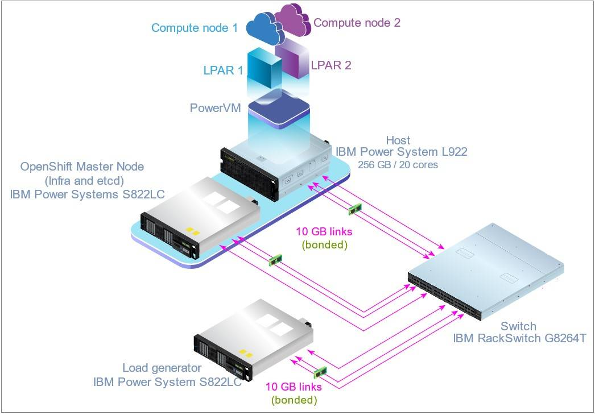
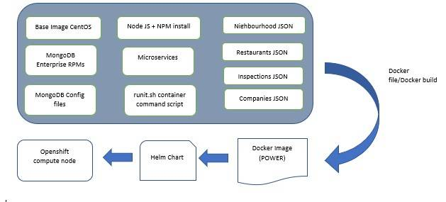
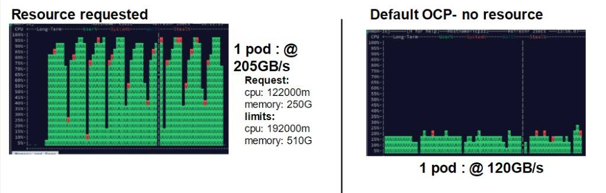
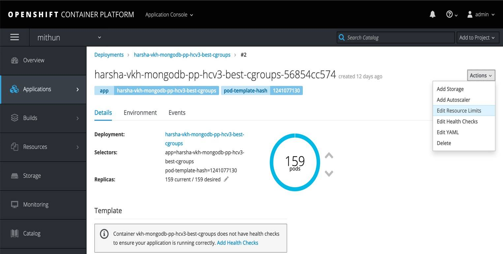
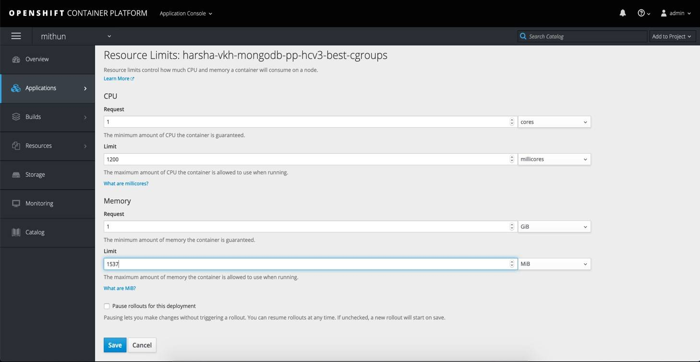

# Red Hat OpenShift Container Platform 上で MongoDB と Node.js を実行する

### OpenShift on IBM Power Systems でのベンチマーク用ワークロードの構成

English version: https://developer.ibm.com/tutorials/mongodb-nodejs-on-openshift/

###### 最新の英語版コンテンツは上記URLを参照してください。

### Authors: Bruce Semple, Calvin Sze, Krishna Harsha Voora, Lilian Romero, Mithun H R
last_updated: 2019-12-18

## はじめに

本チュートリアルは、IBM&reg; Power&reg;　上で Red Hat&reg; OpenShift Container Platform（以降、略して OCP）を構成し、デプロイ用にアプリケーションのビルドを行い、そして OCP 上にデプロイした経験を記録したものです。Helm チャートを使用して、OCP クラスター上の MongoDB で稼働する地理空間情報アプリケーションの定義、導入、そして更新を行います。MongoDB 上で稼働する地理空間情報アプリケーションの Docker イメージは、ビルド後 OpenShift Docker レジストリーにプッシュされ、Helm を使用してデプロイされます。このチュートリアルは、IBM Power プラットフォーム上の OCP クラスターで、最適なパフォーマンスで最大数のコンテナーを実現するために用いたチューニングについても説明します。

ワークロードの種類として、計算主体の地理空間情報ワークロードを選択しましたが、これは MongoDB のチュートリアルをベースにしており、こちらから取得可能です : [https://docs.mongodb.com/manual/tutorial/geospatial-tutorial/](https://docs.mongodb.com/manual/tutorial/geospatial-tutorial/)。このワークロードを DevOps シナリオで使用し、所定のパフォーマンス・レベルを満たす最大数のコンテナーを提供するプラットフォームを決定します。このチュートリアルは、IBM Power Systems&trade; ノードの OpenShift Container Platform 上にワークロードを構成する手順を説明します。

このチュートリアルの目的は、IBM Power Architecture&reg; 上に OCP を構成したときの経験と構成に対する推奨、および考慮点を共有し、文書化することです。この考慮点は、OpenShift Container Platform 上に Docker イメージをデプロイする際に活用できるはずです（最初の OCP アプリケーション導入において、少しでも時間を節約できることを望んでいます）。

## OCP on Power の導入と構成

IBM は Red Hat 社と協力して、Red Hat OpenShift Container Platform を IBM Power System 上で利用できるようにしました。

### トポロジーの説明

本インフラストラクチャーは、マスター・ノード、計算ノード、および負荷生成システムから成ります。IBM Power System L922 サーバーを計算ノードとして、S822LC サーバーを負荷生成システムとして使用し、さらに IBM RackSwitch モデル G8264-T で全システムを接続しています。

##### 図 1. サーバー・トポロジー


### IBM Power Systems

SUT（試験対象システム）として使用する IBM Power System L922（9009-22L）は、通常 2.9GHz で動作する CPU が 2 ソケット（ソケットあたり 10 コア）、2 つの 388GB ソリッド・ステート・ドライブ（SSD）、2つの 10Gb 2 ポート・ネットワーク、および 256GB メモリーを搭載しています。この Power サーバー（L922）は、同サイズの 2 論理区画（LPAR）に分割されています。各 LPAR を SMT8 Dedicated モードで構成しています。これらの LPAR を計算ノードとして使用します。IBM Power System S822LC サーバーは、負荷を生成するために使用され、CPU が 2 ソケット（ソケットあたり 10 コア）、256GB メモリー、および 10Gb 2 ポート・ネットワークを搭載します。IBM Power System 822LC サーバーは、コントロール・プレーンとして使用され、CPU が 2 ソケット（ソケットあたり 10 コア）、256GB メモリー、および 10Gb 2 ポート・ネットワークを搭載します。IBM Power Systems では、Red Hat Enterprise Linux 7.6 を使用します。

### ネットワーク構成

使用したスイッチは、IBM RackSwitch モデル G8264-T です。全てのシステムは 10Gb ネットワークを使用します。各システムは 2 ポートの 10Gb アダプター・カードを搭載し、ボンディングされて 20Gbps のスループットを発揮します。

**注**: 2 つの 10Gb によるリンク集約ネットワーク・インターフェースの実際の最大帯域幅は、約 18.8Gbps です。

### ソフトウェア・スタック

ソフトウェア・スタックは、以下のコンポーネントを含みます :

* RHEL 7.6 (3.10.0-957.12.1.el7.ppc64le)
* OpenShift v3.11.98
* MongoDB Enterprise 4.0.2
* Node.js v 8.14.1 (REST APIs)
* Node modules
  * `express`
  * `mongoose`
  * `async`
  * `ejs`
  * `body-parser`
  * `passport`
  * `passport-http`
  * `router`
  * `mongodb` （ドライバー）

### 外部ストレージ

この検証で使用する計算主体のワークロードは、大量の永続的ストレージを必要としません。テスト・ベッドはサーバー内のローカル・ストレージを使用し、追加の外部ストレージ・サブシステムは不要です。

## OpenShift 上でのシステムのビルドとデプロイ

コンテナーの各インスタンスには、MongoDB インスタンスが 1 個、コレクションが 4 個、およびマイクロサービスを提供する Node.js アプリケーションが含まれています。マイクロサービス用 JavaScript アプリケーションは、コンテナー内のデータベース・インスタンスに対して最大 20 接続まで行うように構成されています。

##### 図 2. Dockerイメージのビルドとデプロイ


各 OpenShift 計算ノード用に Docker イメージを構成・デプロイするために、1 個の Helm チャートをビルドします。

### 構成手順

前提条件として、IBM Power System 上に Red Hat Enterprise Linux オペレーティング・システム 7.6 以上が導入されていることを確認してください。
以下の手順を実施して、OpenShift on IBM Power Systems を導入・構成してください。本検証では、この環境を MongoDB データベース上の地理空間情報ワークロードで使用します。

1. クラスター（マスターと計算）ノード間で、パスワード・レス *ssh* を構成します。
1. OpenShift 導入用パッケージを含む OpenShift Enterprise レポジトリーを構成します。レポジトリーは、サブスクリプション・マネージャーを使用する、あるいは OpenShift パッケージを含むローカル・レポジトリーを指定することで、構成することができます。
1. マスター・ノード上の OpenShift 3.11 用に、ansible の 2.6.X（推奨）を次の場所から導入します : [https://releases.ansible.com/ansible](https://releases.ansible.com/ansible) <br />
   `$yum install ansible-2.6.9-1.el7.ans.noarch.rpm -y`
1. この検証でのコンテナーのランタイム・エンジンは、Docker です。マスター・ノード上で、関連 yum パッケージを導入し、こちらに記述されている手順に従ってください [https://docs.openshift.com/container-platform/3.11/install/host_preparation.html](https://docs.openshift.com/container-platform/3.11/install/host_preparation.html) 。<br />
   `$ yum install wget git net-tools bind-utils yum-utils iptables-services bridge-utils bash-completion kexec-tools sos psacct -y`
1. OSE（OpenShift Enterprise）repo が、*local-rhn-server-extras* と *local-rhn-server-epel* と共にマスター・ノード上に構成されており、有効化されていることも確認してください。それでは、yum を使用して openshift-ansible を導入しましょう。<br />
   `$yum install openshift-ansible -y`  
    OSE レポジトリーを有効化するために、次の文書の手順に従ってください :  
    [https://docs.openshift.com/container-platform/3.11/install/host_preparation.html#host-registration](ttps://docs.openshift.com/container-platform/3.11/install/host_preparation.html#host-registration)
1. openshift-ansible を導入したら、サンプルの hosts ファイルを使用します。このファイルは */usr/share/doc/openshift-ansible-docs-3.11.92/docs/example-inventories/* に置かれおり、クラスター上のホスト構成の参考にすることができます。
1. hosts 構成ファイル内で、*openshift_deployment_type = ‘openshift-enterprise’* を指定します。これは、IBM Power Systems pp64le における推奨デプロイ・モードです。
1. 有効な Red Hat アカウント（サブスクリプションと関連づける必要はありません）があることを確認してください。これは、redhat-registry から ppc64le 用 Docker イメージをプルする必要があるからです。以下のように確認してください :<br />
  `$docker login https://registry.redhat.io`  
   もし Red Hat アカウントを持っていなければ、以下の URL からアカウントを登録できます :  
   [https://www.redhat.com/wapps/ugc/register.html](https://www.redhat.com/wapps/ugc/register.html)
1. 最適なインベントリーをコピーし、*/etc/ansible* 下にステージします。これは、マスター・ノード上に前提条件を導入する際に使用します。<br />
   `$cd /usr/share/ansible/openshift-ansible/`  
   `$ansible-playbook -i /etc/ansible/hosts.12 playbooks/prerequisites.yml`  
    ここで、*/etc/ansible/hosts.12* は、使用されている hosts ファイルです。
1. 以下のコマンドをマスター・ノード上で実行して、クラスターをデプロイします :<br />
    `$ansible-playbook -i /etc/ansible/hosts.12 playbooks/deploy_cluster.yml`

### 導入の確認

以下のコマンドを使用して、クラスター内のマスター・ノードが開始済みで、全計算ノードが稼働中であり、作動可能状態にあることを確認してください :

```
$oc get nodes

For example:
$ oc get nodes
NAME                                   STATUS                     ROLES          AGE       VERSION
p136n135.pbm.ihost.com   Ready                      compute        9d        v1.11.0+d4cacc0
p230n134.pbm.ihost.com   Ready                     infra,master   9d        v1.11.0+d4cacc0
```

クラスター内の全ノードの状態（STATUS）が作動可能（Ready）である必要があります。

### GUI にアクセスするための手順

OCP の GUI コンソールを確認・アクセスするために、Web コンソールのポート番号とマスター・ノードのホスト名を使用します。

マスター・ノードのホスト名が master.openshift.com ならば、コンソールのURLはこのようになります : `https://master.openshift.com:8443/console` 。

### サンプルの hosts ファイル

クラスターをデプロイする際に、以下の hosts ファイルを参考にしてください。

```
[OSEv3:children]
masters
nodes
etcd

[OSEv3:vars]
#openshift_deployment_type='origin'
openshift_deployment_type='openshift-enterprise'

system_images_registry="registry.access.redhat.com/openshift3/"

ansible_user=root

openshift_disable_check=package_version,disk_availability,docker_storage,memory_availability

openshift_master_identity_providers=[{'name': 'allow_all', 'login': 'true', 'challenge': 'true', 'kind': 'AllowAllPasswordIdentityProvider'}]
openshift_auth_type=allowall

oreg_auth_user=<username>
oreg_auth_password=<password>
#oreg_test_login=false

debug_level=5

[masters]
<IP address>

[etcd]
<IP address>

[nodes]
<IP address> openshift_node_group_name="node-config-master-infra"
<IP address> openshift_node_group_name="node-config-compute"
<IP address> openshift_node_group_name="node-config-compute"
```

## OCP/Linux on Power のチューニング

使用するシステムが最適なパフォーマンスを発揮するように、以下で説明するパラメーターを使用してシステムのチューニングを行います。使用する環境に応じて、他のチューニング・オプションが良い場合もあります。特に指定がない限り、全てのシステムにこのチューニング・オプションを適用します。

### オペレーティング・システムのチューニング

以下の手順で、システムが最適なパフォーマンスを発揮するようにチューニングします :

1. クラスター内の全ノード上で、irqbalance サービスを停止・無効にします<br />
   `$systemctl stop irqbalance.service`  
   `$systemctl disable irqbalance.service`
1. Security Enhanced-Linux (SELinux) が *enforcing* 状態にない場合は、*enforcing* 状態に変更したあとに以下のコマンドを実行し、LPARを再起動します。<br />
   `$touch /.autorelabel`
1. 計算ノード用にチューニング設定 :  
   同時マルチスレッド（Simultaneous Multithreading: SMT）の snooze delay の設定 :<br />
   `$ppc64_cpu --smt-snooze-delay=0`

### ソケットのチューニング

*/etc/sysctl.conf* 内で、ソケットのバックログを最大値（*net.core.somaxconn=32768*）に設定し、ポートをフル・レンジ（*net.ipv4.ip_local_port_range=1024  65535*）で使用します。

以下のコマンドで、ソケットの再利用を有効にします :<br />

`$echo "1" > /proc/sys/net/ipv4/tcp_tw_recycle`  
`$echo "1" > /proc/sys/net/ipv4/tcp_tw_reuse`

### ネットワーク・チューニング

OpenShift Container Platform は、ポッド間の通信に Software Defined Networking（SDN）を使用します。ポッド・ネットワークの確立・維持は OpenShift SDN が行います。OpenShift SDN は、Open vSwitch（OVS）を使用して、オーバーレイ・ネットワークを構成します。

OpenShift の導入・構成をしている間に、ネットワークに関する以下の重要な考慮点を確認することをお勧めします :

1. 必ず */etc/sysconfig/network-scripts/ifcfg-ethxxx* ファイル内に、`NM_CONTROLLED=yes` を含むようにしてください。
1. クラスターに参加する全ノードに対する DNS エントリーが、正しく設定されていることを確認してください。
1. ネットワーク・スイッチのファームウェアが最新になっており、サポートされているレベルであることを確認してください。
1. OpenShift は dnsmasq をセットアップし、*/etc/resolv.conf* を書き換えるので、*/etc/sysconfig/network-scripts/ifcfg-ethxx* の中に以下のエントリーを追加してください。<br />
  例 :<br />
   `DNS1=`  
   `DNS2=`  
   `DOMAIN=`  
1. ネットワーク・マネージャーが有効化されていることを確認してください。<br />
   `$yum install NetworkManager`  
   `$ systemctl enable NetworkManager`

10G ネットワーク用にボンディングを使用します。以下の表はパラメーター設定です。

##### 表 1. TCP/IP レシーブ・キュー構成

|システム| Receive/Transmit キュー・サイズ| Receive/Transmit 複合|
|--|--|--|
|コントロール・プレーン| 4078| 25|
|計算ノード| 4078| 20|

例 :<br />

`$ethtool -G enP1pos1 rx 4078 tx 4078`  
`$ethtool -L enP1p0s1 combined 20`

アプリケーションは MASS ライブラリーの数値計算機能を使用します。こちらを参照してください : [http://public.dhe.ibm.com/software/server/POWER/Linux/xl-compiler/eval/ppc64le/rhel7/ibm-xl-compiler-eval.repo](http://public.dhe.ibm.com/software/server/POWER/Linux/xl-compiler/eval/ppc64le/rhel7/ibm-xl-compiler-eval.repo)

### システム毎のチューニング

スループットを最大化するために、システム毎に以下の設定を行うことができます :

1. 負荷生成サーバー上でソケット再利用の設定を行います。<br />
   `$echo “1” >/proc/sys/net/ipv4/tcp_tw_recycle`  
   `$echo “1" >/proc/sys/net/ipv4/tcp_tw_reuse`
1. 全ノード上で snooze delay をオフにします。<br />
   `$ppc64_cpu --smt-snooze-delay=0`

## ポッドのサービス品質（QoS）の構成

本記事記述チームがワークロードのデプロイ用 YAML のリソース・スタンザを変更したところ、その影響の大きさは驚くべきものでした。OpenShift ドキュメント ([https://docs.openshift.com/container-platform/3.11/admin_guide/overcommit.html#qos-classes](https://docs.openshift.com/container-platform/3.11/admin_guide/overcommit.html#qos-classes)) は、これらのリソース設定がサービス品質（QoS）をどのように決定するかを説明しています。それは、ポッドに割り当る CPU 能力の決定に使用する割り当てアルゴリズムです。

上記記事を要約すると、OpenShift は以下のような３つの層のサービスを確立しています :

* Guaranteed QoS
* Burstable QoS
* BestEffort QoS

##### 表 2. サービス品質のクラス
|<div style="width:60px"> QoS 名 </div> |<div style="width:90px">優先順位</div>  |<div style="width:110px"> リソース・スタンザ・パラメーター</div>  | 説明 / 用途 |
|--------|:----------:|:-----------:|------------|
|Guaranteed | 1-highest  |limits = requests  |高優先順位、時間依存タスク  |
|Burstable | 2| limits > requests  | 最も一般的なワークロード – vCPU アクセス時の即時アクセスの最大化  |
|BestEffort | 3-Lowest | Not set  | 低優先順位 – システムがリソース不足になったとき、最初に強制終了される  - バックグランドで動くシステムのハウスキーピング |

図 3 は CPU リソース管理の例（異なるテスト・ベッドとワークロードからの抽出）です。画面キャプチャー・イメージ内で、Y 軸は CPU 使用率、X 軸は各 vCPU を 1 桁の列で表現しています。ここで使用しているサーバーには vCPU が 192 個あります。左側は Burstable QoS で稼働中のポッドであり、右側は BestEffort QoS（リソース・パラメーターの指定なし）で稼働しているポッドです。BestEffort QoS（右側の図）では、vCPU の使用率は OCP によってスロットル調整されます。この QoS サービスで稼働している全ポッドは、vCPU リソースに確実にアクセスできるはずです。Burstable（左側の図）に変更すると、OCP はスロットル調整を行わず、ポッドが上限に達するまで使用できるようになります。

##### 図 3. リソース使用率 – Burstable QoS と BestEffort QoS の比較



*異なるワークロードとテスト・ベッド、Mel Bakhsi（IBM） による結果からの引用*

この例では、BestEffort から Burstable への変更によって、単一ポッドのスループットが70%向上しました。

リソースの制限は OCP のユーザー・インターフェースから簡単に構成できます。

**Applications -> Deployments** をクリックします。**Actions** ドロップ・ダウン・メニューをクリックし、**Edit Resource Limits** をクリックします。
##### 図 4. リソース制限の編集


### Burstable QoS

Burstable QoS で配置するポッドに対しては、ポッド内の各コンテナーに関連づけられた Request が必要です。そして、CPU とメモリーの Limit フィールドに値を設定しなければなりません。これらは同じ値である必要はありません。これでコンテナーは Burstable QoS に適合します。このクラスの QoS は、2番目の優先順位になります。

OpenShift Container Platform での Burstable QoS の設定方法を示します。図 5 を見ると、CPU とメモリーに対する Request と Limit フィールドの値は、同じではありません。

##### 図 5. Burstable QoS

この事例で使用したワークロードに対しては、Burstable QoS が最良のスループットをもたらすことが分かりました。したがって、ワークロードに対して最もフィットする設定を見つけるために、異なる QoS オプションを試してみる価値があります。
## Docker イメージのビルドと OpenShift Docker レジストリーへのプッシュ

OpenShift は、統合された Docker レジストリーを提供し、Docker イメージを配置し、新しいイメージを必要に応じてプロビジョニングします。以下の手順を実施して、新しいカスタムイメージをビルドし、それを OpenShift レジストリーにプッシュします。

1. OCP マスター・ノードで以下のコマンドを実行します。

   ```
   $oc login -u admin
   (パスワードを入力します。ここでは admin/admin) ( https://docs.openshift.com/container-platform/3.11/cli_reference/get_started_cli.html#basic-setup-and-login )
   $oc new-project harsha
   （“harsha” はプロジェクト名です）
   $oc project harsha
   （harsha プロジェクトにスイッチします）
   $cd /home/harsha/CombinedImage/
   （このフォルダーには、Dockerfile とイメージをビルドするために必要なファイルとパッケージがあります）
   $docker build -t vkh-mongodb-ppc64le:v6 .
   $docker tag vkh-mongodb-ppc64le:v6 docker-registry.default.svc:5000/harsha/vkh-mongodb-ppc64le:v6
   ```

1. Web コンソールからトークン・ベースのログインを生成します。<br />
   `$oc login https://p136n143.pbm.ihost.com:8443 --token=<TOKEN>`
1. OpenShift レジストリーにログインするために、以前のトークンを使用します。<br />
   `$docker login -u admin -p 'oc whoami -t' docker-registry.default.svc:5000`
1. マスター・ノード上の OpenShift プライベート・レジストリーに、イメージをプッシュします。<br />
   `$docker push docker-registry.default.svc:5000/harsha/vkh-mongodb-ppc64le:v6`
1. Helm チャートを導入します。<br />
   `$helm install -n <chart name>`

## OCP 上で Helm と Tiller を使用してアプリケーションをデプロイ

パッケージ化と OCP でのデプロイに Helm と Tiller を使用します。パッケージ化と OCP でのデプロイ用に Operator も使用できます。これは、Operator Lifecycle Manager が OCP on IBM Power Systems 3.11 のテクノロジー・プレビューに含まれているからです。この検証では、パッケージ化とデプロイのために Helm を用いました。ポッドは Helm 機能を補完する必要がありますが、OCP はポッドを使用して Tiller サービスを起動しないので、こちらに述べられている手順を使用して Tiller を導入します : [https://blog.openshift.com/getting-started-helm-openshift/](https://blog.openshift.com/getting-started-helm-openshift/) （ 注 OpenShift >=3.6 ）

こちらに IBM ppc64le 用ダウンロード・イメージがあります : [https://github.com/helm/helm/releases](https://github.com/helm/helm/releases)

### Helm と Tiller のビルドと導入

この検証では、Helm と Tiller のバージョン 2.9.1 バイナリーをシステム上でビルドし、ホスト上で Tiller をネィティブに起動します。HELM_HOST には Tiller が稼働する *\<IP_ADDR:PORT\>* を指定し、そこで Tiller が稼働します。システム上でネィティブにバイナリーをビルドするための詳細な手順を以下に示します。

1. Go のディストリビューションをダウンロードします ([https://golang.org/doc/install](https://golang.org/doc/install)) 。
1. 以下のコマンドを実行して、Helm と Tiller をマスター・ノード上でビルドします。

   ```
   $mkdir -p $GOPATH/src/k8s.io
   $cd $GOPATH/src/k8s.io
   $git clone https://github.com/kubernetes/helm.git
   $cd helm
   $git checkout v2.9.1
   $make bootstrap build
   $cd bin
   $export PATH=$PWD:$PATH
   ```

   $GOPATH は Go パッケージが導入されているディレクトリーです。
1. 以下のコマンドを実行して、Helm と Tiller のブートストラップを行います。

   ```
   $helm init
   $nohup tiller 2>&1 &
   $lsof -i:44134
   $export HELM_HOST=0.0.0.0:4413
   ````

## まとめ

本検証の内容は、IBM Power 上に OpenShift Container Platform を導入する方法について、その全体像と今後の参考となる情報を提供するものです。本レポートは、主に実装部分、およびコマンドとスクリプトについて説明しました。コマンドとスクリプトは OpenShift Container Platform 上にワークロードを構成するために用いたものです。コンテナー密度を最高にするために、ワークロードを SMT8 構成で実行しました。

この検証報告は次のような重要な概念を説明しました : - Helm と Tiller を OpenShift Container Platform で使用、- Docker イメージのビルドと OpenShift Docker レジストリーへのプッシュ、- OpenShift Container Platform on IBM Power Systems 上のワークロード構成時に各ステージで取り入れるべき最適化。

## 付録

このセクションは、検証内容をよりよく理解するための追加情報です。

### Dockerfile

ppc64le の Docker イメージをビルドするために、以下の Dockerfile を使用しました。

```
#
#  MongoDB Dockerfile
#   -- modified by Bruce Semple for MongoDB Proofpoint Exercise on ICp
#   -- modified by Krishna Harsha Voora for MongoDB Proofpoint Exercise on # OCP
#
#  https://github.com/dockerfile/mongodb
#

# FROM dockerfile/ubuntuaa
FROM ppc64le/centos:7
ENV NODE_ENV production
ENV PORT 3000

#
# Pre-Defined System Configuration..
#
COPY linux/limits.conf  /etc/security/limits.conf
COPY linux/defrag      /sys/kernel/mm/transparent_hugepage/defrag
# Install MongoDB Enterprise from RPM downloaded from
# https://repo.mongodb.com/yum/redhat/7/mongodb-enterprise/4.0/ppc64le/RPMS/
#
WORKDIR /install
ADD  *.rpm  /install/
ADD datasets/*.json /install/
ADD *.sh /install/
# pick up the library that Calvin built with the ATC
ADD *.so /install/

# Run as root #
USER root
#
# add a plugin to yum so that it will automatically download dependencies
#
RUN yum -y -v  install yum-utils yum-plugin-ovl
#
# Set LD_PRELOAD environment Variable
#
RUN  yum -y  install /install/mongodb-enterprise-server-4.0.2-1.el7.ppc64le.rpm
RUN  yum  -y install /install/mongodb-enterprise-shell-4.0.2-1.el7.ppc64le.rpm
RUN  yum -y  install /install/mongodb-enterprise-tools-4.0.2-1.el7.ppc64le.rpm

# This might be the license file
#RUN  yum -y  install /install/mongodb-enterprise-4.0.2-1.el7.ppc64le.rpma
#
# **** Replace the Default MONGOD.CONF file with ours -- specifically to #allow outside connections
#
ADD mongodb/mongod.conf /etc
#
# Adjust the ulimits for Mongo
#
ADD linux/30_adjustlimits.conf /etc/security/limits.d
RUN yum -y install wget

#
# Now Install Node -- pull Binary from nodejs.org
#

WORKDIR "/nodejs"
RUN  wget  https://nodejs.org/dist/v8.14.1/node-v8.14.1-linux-ppc64le.tar.xz
RUN  tar -xvf node-v8.14.1-linux-ppc64le.tar.xz
ENV PATH=/nodejs/node-v8.14.1-linux-ppc64le/bin:$PATH

#
# Check if Node is working
RUN node --version
#

#
# Copy in Node Application
# ADD will pull the whole directory
#      - Including package.json file (needed by npm package  install)
#      - Including creategeoindexes.js File
WORKDIR "/app"
ADD ./nodeAppV4 /app/
ADD nodeAppV4/createGeoIndexes.js  /app/
RUN cd /app;
RUN rm -rf ./node_modules;
#
# Run as user root
USER root
RUN yum -y install openssl-devel.ppc64le yum-plugin-ovl.noarch
RUN yum -y install gcc
#
# Now install the various NODE Modules
#
RUN npm install   async --unsafe-perm
RUN npm install   body-parser --unsafe-perm
RUN npm install   ejs  --unsafe-perm
RUN npm install  passport --unsafe-perm
RUN npm install  passport-http   --unsafe-perm
RUN npm install   router --unsafe-perm
RUN npm install  express --unsafe-perm
RUN npm install   mongodb --unsafe-perm
RUN npm install  mongoose --unsafe-perm

# Create directories.
RUN mkdir -p /data/db
RUN chmod 777 /data/
RUN chmod 777 /data/db/
RUN chmod -R 777 /var/
VOLUME ["/data/db"]
RUN chmod +x /install/runit.sh

# Define default command.
USER mongod
ENTRYPOINT  ["/bin/bash","-c","/install/runit.sh"]

# Set the LD_PRELOAD environment
ENV LD_PRELOAD=/install/libmass.so


#EXPOSE 27017
#EXPOSE 28017
EXPOSE 3000

```

### Helm チャート

Sample values.yaml file

```
replicaCount: 2

#platform: ppc64le
# platform: ppc64le
platform: amd64

image:
  repository: docker-registry.default.svc:5000/mithun1/mhr-mongodb-x86
  #repository: mycluster.icp:8500/default/bps-combined-ppc64le
  tag: v3
  pullPolicy: Always
service:
  externalPort: 3000
  internalPort: 3000
#ingress:
#  path: /ingP9/
#  rewrite: /
livenessProbe:
  initialDelaySeconds: 60
  periodSeconds: 60
  timeoutSeconds: 10
  failureThreshold: 5
resources:
  limits:
    cpu: 1
    memory: 1024Mi
  requests:
    cpu: 1
    memory: 512Mi

```

### Runit.sh スクリプト

エントリー・ポイントのファイルとして、Dockerfile 内で使用します。

```
#! /bin/bash

#
# Set some Operating system configuration options prior to starting #MongoDB deamon
#
rm -rf /var/log/mongodb/mongod.log

#
# Start the MongoDB deamon
#

# Updated by Krishna Harsha Voora to see if vkh-mongodb-ppc64le:v6 Docker-#Image works
mongod --bind_ip_all &

#
# wait a few minutes for Mongo to start up
#
sleep 15s
#
# Import the datasets
#

mongoimport  --uri mongodb://localhost:27017/proofpoint01  -c restaurants    /install/restaurants_idFixed.json
mongoimport  --uri mongodb://localhost:27017/proofpoint01  -c neighborhoods /install/neighborhoods_idFixed.json
mongoimport  --uri mongodb://localhost:27017/proofpoint01  -c companies   /install/companies_noID.json
mongoimport  --uri mongodb://localhost:27017/proofpoint01  -c inspections    /install/city_inspections_FixID.json
#
# Create the GeoIndexes
#
mongo proofpoint01 /app/createGeoIndexes.js

# Start up node via node package manager
#
npm start
#

```

### CreateGeoIndexes.js

これは、JavaScript のコード・スニペットで、以下の地理空間情報インデックスをビルドするために runit.sh スクリプトが呼び出します。

* `db.restaurants.createIndex({ location: "2dsphere" })`
* `db.neighborhoods.createIndex({ geometry: "2dsphere" })`

### 使用するマイクロサービス

本アプリケーション・プログラムは、以下のような特徴を持つ各種マイクロサービスを提供します :

* 地理空間情報をベースにしたマイクロサービス
* シンプルなデータ構造の非地理空間情報をベースにしたマイクロサービス
* 複雑なデータ構造を伴う非地理空間情報（企業コレクションに対する照会）をベースにしたマイクロサービス

 しかし、このテスト・セットでは、5 つの地理空間情報ベースのマイクロサービスだけを使用します。これらのマイクロサービスは MongoDB の地理空間情報機能を使用し、プロセッサー主体のワークロードとなります。

このテストでは、以下の 5 つのマイクロサービスを使用します :

* /api/get10neighborhoodsV2Iterate
* /api/getMyNeighborhoodv2Iterate
* /api/getNeighborhoodsIntersectingTriangleIterate
* /api/getRestaurantRingIteration
* /api/getMyNeighborhoodRestaurantsV3Iterate

詳細は、”本ドライバーで利用可能なマイクロサービス“セクションを参照してください。

### 本ドライバーで利用可能なマイクロサービス

Node.js アプリケーションは以下の REST（Representational State Transfer）ベースのマイクロサービスをサポートします。

**注**: たくさんの地理空間情報関連の API に `:loopnum` パラメーターがあることがわかります。これらのマイクロサービスは、プロセッサー負荷を生成することが目的であることを思い出してください。トランザクションが十分な負荷を生成しないことが判明した、あるいは単に重い負荷を必要とする場合、`:loopnum` パラメーターを増やすことができます。

* 正常性 / PING 関連（全て HTTP の Get Request）
  * `/` “First test of returning a JSON object” メッセージを含む JSON オブジェクトを返します。
  * `/xx` “command xxx” メッセージを含む JSON オブジェクトを返します。
  * `/yy` “command yyy” メッセージを含む JSON オブジェクトを返します。
  * `/health` “Ready” メッセージを含む JSON オブジェクトを返します。コンテナーの正常性あるいは作動可能状況を確認するために、OpenShift がこのサービスを使用します。
* To-Do リストのアプリケーション・サポート 
  * `(get) /api/activities`  
    アクティビティー・リストを含む JSON オブジェクトを返します。
  * `(post) /api/activities`  
    アクティビティーを作成します。
  * `(get) /api/activities/:activity_id`  
    ID で指定されたアクティビティーを返します。
  * `(put) /api/activities/:activity_id`  
    ID で指定されたアクティビティーを更新します。
  * `(delete) /api/activities/:activity_id`  
    ID で指定されたアクティビティーを削除します。
  * `(get) /api/activities/date/:date`  
    アクティビティーを日付で探します。
  * `(put) /api/activities/addtodate/:activity_id/:date`  
    ID と日付で識別されるアクティビティーの、名前と数量を更新します。
* 地理空間情報関連（地区とレストランのコレクションに対する操作）（全て HTTP の Get Request）  
  * `/api/oneNeighborhood`  
    地区 JSON オブジェクトを返します。
  * `/api/neighborhoodByName/:name`  
    名前で地区を検索し、地区 JSON オブジェクトを返します。
  * `/api/neighborhoodByID/:id`  
    ID で地区を検索し、地区 JSON オブジェクトを返します。
  * `/api/countRestaurants`
    レストラン・コレクション内のレストラン数を含む JSON オブジェクトを返します。
  * `/api/countNeighborhoods`  
    地区コレクション内の地区数を含む JSON オブジェクトを返します。
  * `/api/restaurantsNearMe`  
    点 [-73.93414657, 40.82302903]（経度、緯度の順番）を中心とする 15 マイル内のレストランのリストを含む JSON オブジェクトを返します。この点はコロラド州デンバー地域です。
  * `/api/restaurantsInRangeV2/:range`  
    定点 [-73.93414657, 40.82302903]（経度、緯度）から指定された半径内にあるレストランのリストを含む JSON オブジェクトを返します。
  * `/api/get10neighborhoods`  
    最初の 10 個をスキップしたあとで MongoDB が戻す 10 個の地区を返します。
  * `/api/get10neighborhoodsV2Iterate/:loopnum`  
    このマイクロサービスは以下のタスクを実行します :
    * 最初の 10 個をスキップした後で、10 個の地区を返すように MongoDB に指示する。
    * 最初の 50 個をスキップした後で、10 個の地区を返すように MongoDB に指示する。
    * 最初の 100 個をスキップした後で、10 個の地区を返すように MongoDB に指示する。
    * 最初の 150 個をスキップした後で、10 個の地区を返すように MongoDB に指示する。
    * 最後のコールで MongoDB が返した 10 個の地区のリストを含む JSON オブジェクトを返す。
  * `/api/getMyNeighborhood`  
    点 [-73.93414657, 40.82302903]（経度、緯度）を含む地区を返します。
  * `/api/getMyLocalRestaurantsV3Iterate/:loopnum`  
    このマイクロサービスは以下のタスクを実行します :
    1. 最初に地区コレクションの照会を行って、点 [経度: -73.93414657, 緯度: 40.82302903] を含む地区を検索する。
    1. 次に、検索した地区に関連づけられた多角形を用いて、レストラン・コレクションからこの地区に含まれるレストランを検索し、特定する。
    1. ループ回数がパラメーターで渡され、直前のステップをn回ループした後、マイクロサービスは応答を返す。
    1. レストランのリストを含む JSON オブジェクトを返す。
  * `/api/getRestaurantsRingIteration/:long/:lat/:mindistance/:distance/:loopnum`  
    呼び出し時に渡される `:long, :lat` で指定した点を中心に、内側と外側の環に囲まれた（ドーナッツ形状）領域にあるレストランのリストを含む JSON を返します。内側の環は `:mindistance` パラメーターで定義され、外側の環は `:distance` パラメーターで定義されます。以前と同様に、本マイクロサービスは `:loopnum` パラメーターをサポートし、応答を返す前に繰り返す地理空間情報コールの回数を指定できます。
  * `/api/getMyNeighborhoodV2Iterate/:long/:lat/:loopnum`  
    この API は、地理空間情報上の点の経度と緯度、そしてループ回数をパラメーターとして受け取ります。渡した点を含む地域を検索します。オプションで、 `:loopnum` で指定された値によって照会を n 回繰り返し、その後指定した点を包含する地域の名前を含む JSON オブジェクトを返します。
  * `/api/getNeighborhoodsIntersectingTriangleIterate/:long/:lat/:loopnum`  
    三角形の底辺が 2 点 [-73.70,40.50] と [-73.70, 40.9] に固定されます。渡されるのは三角形の頂点です。頂点を変化させることで、三角形と重なる地域が変わります。さらに、照会を n 回繰り返した後に応答を返すことを選択できます。この API は、三角形と重なる領域のリストを含む JSON を戻します。
* 会社と監査のコレクション（全て Get）
  * `/api/getCompaniesByEmployeesWIteration/:ltnum/:number`  
    API コール時に渡された数より多い従業員が在籍する会社のリストとその数を含む JSON オブジェクトを返します。返す会社のリストには次のフィールドがあります：名前、従業員数、設立年、および製品数。他の API と同様に、照会を n 回 （`:number`）繰り返した後に応答を返すオプションを提供します。
  * `/api/getInspectionsByZipCodeIteration/:gtzip/:ltzip/:number`  
    この API はある郵便番号のエリアで行われた監査のリストを返します。単一の郵便番号エリアだけが必要なときは、`:gtzip` と `:ltzip` の値を同じ郵便番号にします。以前と同様に、照会を n 回（`:number`）繰り返した後に応答を返すオプションを提供します。戻す JSON オブジェクト内には、以下がリストされます：名前、住所郵便番号、監査番号、および合格/不合格の結果。

### データ・セット/コレクション・スキーマ

このセクションは、各コレクションのスキーマ（データ構造）について具体的に説明します。

#### Neighborhood

以下は、*Neighborhood* コレクションのスキーマです。

```
const neighborhoodSchema = new Schema({
    geometry: {
     coordinates: {
            type: [[[Number]]], // Array of arrays of arrays of numbers
            required: true
        },
  type: {
           type: String,
           enum: ['Polygon'],
           required: true
        }
     },
   name: String,
  }
```

#### Restaurants
以下は、*Restaurants* コレクションのスキーマです。

```
const restaurantSchema = new Schema({
        name: String,
    location: {
    type: {
    type: String,
    enum: ['Point'],
    required: false
    },
    coordinates: {
    type: [Number],
    required: false
    }
    }
    }
```

#### Inspections

以下は、*Inspections* コレクションのスキーマです。

```
const inspectionsSchema = new Schema({
  id: {
  type: 'String'
  },
  certificate_number: {
  type: 'Number'
  },
  business_name: {
  type: 'String'
  },
  date: {
  type: 'Date'
  },
  result: {
  type: 'String'
  },
  sector: {
  type: 'Date'
  },
  address: {
  city: {
  type: 'String'
  },
  zip: {
  type: 'Number'
  },
  street: {
  type: 'String'
  },
  number: {
  type: 'Number'
  }
  }
```

#### Companies

以下は、*Companies* コレクションのスキーマです。

```
const companiesSchema = new Schema({
  name: {
  type: 'String'
  },
  permalink: {
  type: 'String'
  },
  crunchbase_url: {
  type: 'String'
  },
  homepage_url: {
  type: 'String'
  },
  blog_url: {
  type: 'String'
  },
  blog_feed_url: {
  type: 'String'
  },
  twitter_username: {
  type: 'String'
  },
  category_code: {
  type: 'String'
  },
  number_of_employees: {
  type: 'Number'
  },
  founded_year: {
  type: 'Number'
  },
  founded_month: {
  type: 'Number'
  },
  founded_day: {
  type: 'Number'
  },
  deadpooled_year: {
  type: 'Number'
  },
  tag_list: {
  type: 'String'
  },
  alias_list: {
  type: 'String'
  },
  email_address: {
  type: 'String'
  },
  phone_number: {
  type: 'String'
  },
  description: {
  type: 'String'
  },
  created_at: {
  $date: {
  type: 'Number'
  }
  },
  updated_at: {
  type: 'Date'
  },
  overview: {
  type: 'String'
  },
  image: {
  available_sizes: {
  type: [
  'Array'
  ]
  }
  },
  products: {
  type: [
  'Mixed'
  ]
  },
  relationships: {
  type: [
  'Mixed'
  ]
  },
  competitions: {
  type: [
  'Mixed'
  ]
  },
  providerships: {
  type: 'Array'
  },
  total_money_raised: {
  type: 'String'
  },
  funding_rounds: {
  type: [
  'Mixed'
  ]
  },
  investments: {
  type: 'Array'
  },
  acquisition: {
  price_amount: {
  type: 'Number'
  },
  price_currency_code: {
  type: 'String'
  },
  term_code: {
  type: 'String'
  },
  source_url: {
  type: 'String'
  },
  source_description: {
  type: 'String'
  },
  acquired_year: {
  type: 'Number'
  },
  acquired_month: {
  type: 'Number'
  },
  acquired_day: {
  type: 'Number'
  },
  acquiring_company: {
  name: {
  type: 'String'
  },
  permalink: {
  type: 'String'
  }
  }
  },
  acquisitions: {
  type: 'Array'
  },
  offices: {
  type: [
  'Mixed'
  ]
  },
  milestones: {
  type: [
  'Mixed'
  ]
  },
  video_embeds: {
  type: 'Array'
  },
  screenshots: {
  type: [
  'Mixed'
  ]
  },
  external_links: {
  type: [
  'Mixed'
  ]
  },
  partners: {
  type: 'Array'
  }
  }
```

#### Activity スキーマ（To Do リストのマイクロサービス用）

```
const activitySchema = new Schema({
        activity_name: String,
    quantity: Number,
    date: {type: Date, default: Date.now}
          })
```

## 追加情報

IBM POWER9&reg; プロセッサー・ベースのサーバーの詳細については、IBM 担当者、または IBM ビジネス・パートナー様に問い合わせるか、次の Web サイトを参照してください :
[https://www.ibm.com/it-infrastructure/power/power9](https://www.ibm.com/it-infrastructure/power/power9)
POWER9 上で開発を行う場合は、Linux on IBM Power Systems の開発者ポータルを確認してください : [https://developer.ibm.com/linuxonpower/](https://developer.ibm.com/linuxonpower/)
