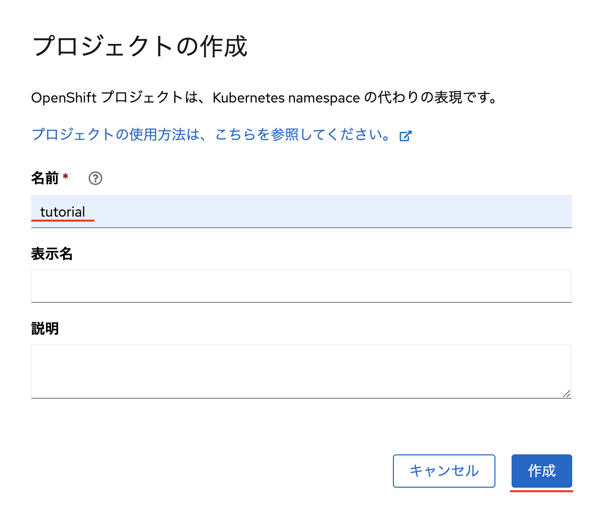
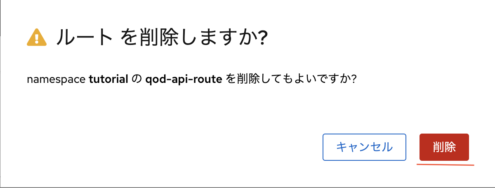
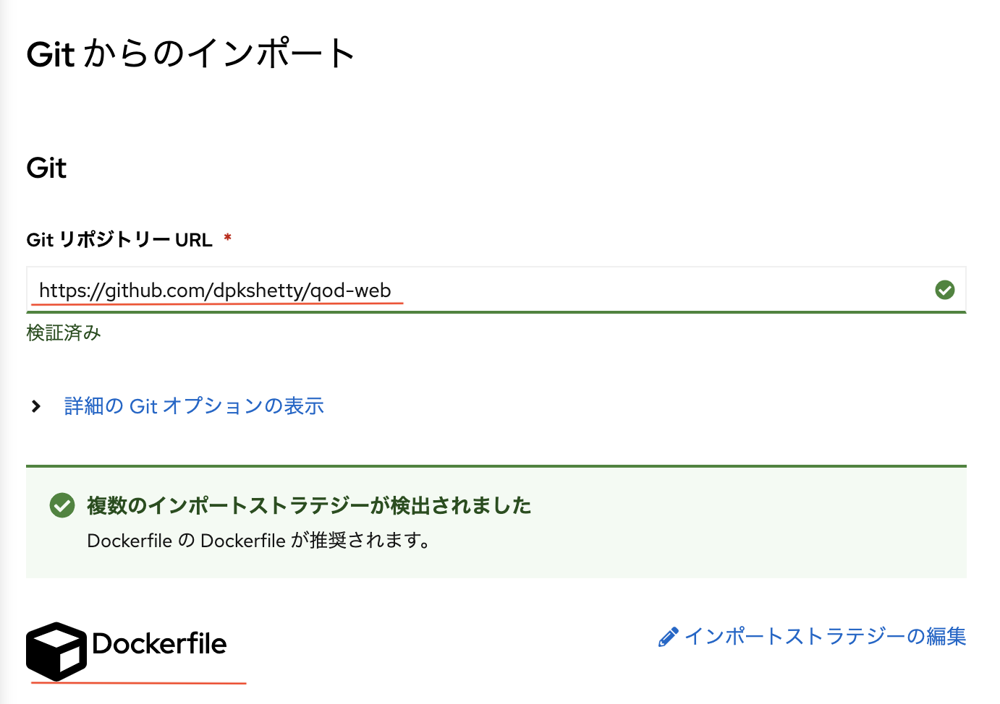

## はじめに

このチュートリアルでは、Red Hat OpenShift Container Platform が提供するグラフィカルコンソールを使用して、ハイブリッドクラウド環境に 3 階層のアプリケーションを迅速にデプロイする方法を紹介します。このアプリケーションには、以下のものが含まれます。

* アプリケーションのデータを保持するバックエンドの MariaDB データベース
* データベースに接続し、いくつかのビジネスロジックを提供する Node.js コードに基づくアプリケーションプログラミングインターフェース (API) 層
* Node.jsコードをベースにした、ユーザーが操作するWebフロントエンド

このチュートリアルは、**OpenShift Container Platform の概念と用語を学ぶように、シンプルに設計されているので、OpenShift Container Platform のグラフィカルインターフェース (Web コンソールとしても知られています)** のみを使用します。これは、アプリケーションコンポーネントの視覚的な表現を提供し、コマンドラインインターフェイスの使用や、YAMLのような言語を使用して構成ファイルを作成する必要はありません。

グラフィカルなツールを使用することで、ハイブリッドクラウドアプリケーションのさまざまなコンポーネントがどのように配置され、接続されているかを確認することができるようになります。また、従来の仮想マシン（VM）ベースの環境では経験したことのない複雑さが、このプラットフォームでは取り除かれているため、個別のマイクロサービスをいかに簡単に接続できるかを体験することができます。これには、コンポーネントを接続するために必要なネットワークの設定とルーティング、およびデータベースへのアクセス認証情報をユーザーから切り離すことによるセキュリティ上の利点が含まれます。

今回導入するアプリケーションは、「Quote of the Day」（QOD:今日の名言）と呼ばれるものです。

このアプリケーションは、完全な形でデプロイされると、毎日異なる「今日の名言」、または名言(quotes)データベースからの「ランダムな名言」を取得する機能を備えたシンプルなウェブページが提供されます。

QODアプリケーションの以下の3つの層のソースコードは、GitHubでホストされています。

* <a href="https://github.com/dpkshetty/qod-db" target="_blank" rel="noopener noreferrer">データベース層</a>
* <a href="https://github.com/dpkshetty/qod-api" target="_blank" rel="noopener noreferrer">API サービス層</a> 
* <a href="https://github.com/dpkshetty/qod-web" target="_blank" rel="noopener noreferrer">Web アプリ層</a> 

デプロイ完了後、3層アプリケーションは以下の図のようになります。

## 前提条件

この3層アプリケーションをデプロイする前に、以下の前提条件が満たされていることを確認してください。

* Red Hat OpenShift Container Platform クラスターにアクセスできること。このコンテンツの画像は、**IBM Power Virtual Server上の OpenShift バージョン 4.10.xx**を使用しています。このチュートリアルで説明する手順は、他の OpenShift プラットフォームでも同様に動作するはずですが、GUI 画面やダイアログボックスの一部が若干異なって見えるかもしれません。
* Red Hat OpenShift Container Platform クラスターにアクセスできない場合は、Red Hat の <a href="https://developers.redhat.com/developer-sandbox" target="_blank" rel="noopener noreferrer">developer sandbox for Red Hat OpenShift</a> を通じてアクセスすることができます。あるいは、お持ちのコンピューター上に<a href="https://developers.redhat.com/products/openshift-local/overview" target="_blank" rel="noopener noreferrer">Red Hat OpenShift Local</a>開発環境を構築することも可能です。

## 想定される時間

1時間

## ステップ

1. [新しいプロジェクトを作成する](#step1)
1. [データベース (DB) 層をデプロイする](#step2)

   2a. [DB 層をテストする(オプション)](#step2a)
1. [API 層をデプロイする](#step3)

   3a. [API サービスをテストする - 動かないことの確認](#step3a)

   3b. [シークレットを使って環境変数をインジェクトする](#step3b)
   
   3c. [APIサービスをテストする - 動作することの確認](#step3c)

   3d. [APIテスト自動化のためのHTTPまたはHTTPSのルートを作成する(オプション)](#step3d)
1. [ウェブ階層をデプロイする](#step4)

   4a. [Pod作成時に環境変数を注入する](#step4a)

<a id='step1' />

## 1.新しいプロジェクトを作成する

1. 3層アプリケーションをデプロイする新しい OpenShift プロジェクトを作成します。**Administrator** ビューで、**プロジェクト**をクリックし、**プロジェクトの作成** をクリックします。
   
   

2. [プロジェクトの作成] ダイアログボックスで、新しいプロジェクトの名前を入力し、**作成/Create**をクリックします。このコンテンツでは、**tutorial**という名前で新しいプロジェクトを作成します。

   

<a id='step2' />

## 2.データベース(DB)層のデプロイ

このセクションでは、qod という名前の MariaDB データベースをホストするデータベース層をデプロイします。このデータベースは、quotes、genres、authorsといったテーブルを持ち、それぞれ名言(quotes)、名言の異なるジャンル(genres)、名言の著者(authors)を事前に入力することになります。

1. **Developer**パースペクティブに切り替え、プロジェクトが選択されていることを確認し (このコンテンツでは 'tutorial') 、 **+追加**をクリックします。

   

1. **Gitからのインポート/Import from Git**をクリックします。

   

   **注**:OpenShiftの古いバージョンでは、別途 **From Dockerfile** というオプションがある場合があり、これを代わりに選択する必要があります。

1. [Gitからのインポート/Import from Git] ダイアログボックスで、以下のフィールドに指定された値を入力します。

   * **Git リポジトリー URL/Git Repo URL**: <a href="https://github.com/dpkshetty/qod-db" target="_blank" rel="noopener noreferrer">https://github.com/dpkshetty/qod-db</a>
       *(Tabキーを押して、'Validated'と表示されるのを待ちます)*。
      OpenShiftはGitリポジトリを調べ、qod-dbリポジトリに存在する<a href="https://github.com/dpkshetty/qod-db/blob/master/Dockerfile" target="_blank" rel="noopener noreferrer">Dockerfile</a> により、Dockerfileからのインポートを自動検出します。
   * **アプリケーション名**: QOD
   * **Name**: qod-db (この名前は、DBマイクロサービスにアクセスするためのDNSエントリーを含む、OpenShiftが作成するすべてのリソースに使用されます)
   * **Deployment** (デフォルト) を選択しておいてください。
   * **ターゲットポート**: 3306 (DB サービスが接続をリッスンするように設計されているポートを見つけるために、<a href="https://github.com/dpkshetty/qod-db/blob/master/README.md" target="_blank" rel="noopener noreferrer">README.md</a> ファイルを参照してください)。
   * **Create a route to the Application** のチェックボックスをオフにします。  
   **注意**: DBサービスを外部に公開する必要はないため、DBサービスへのルートは必要ありません。クラスタ内部からしかアクセスされませんし、外部ルートを持たないことでDBサービスも外部からの攻撃からより安全になります。
   * **作成/Create** をクリックします。

   
   
   

   **次に起こること**は、OpenShiftがGitHubリポジトリからソースコードを取得し、Dockerfileを使用してDockerイメージを作成し、そのイメージをOpenShift内部のイメージレジストリに保存し、そのDockerイメージからデータベース用のマイクロサービスアプリケーション（バックエンド層）となるPod（アプリケーションとも呼ばれる）を作成することです。このアプリケーションはMariaDBを起動し、quotes, genres, authorsという3つのテーブルを持ち、それぞれ異なるquotes, genres, authorがあらかじめ入力された**qod**という名前のDBを作成します。

1. トポロジーのページに戻ります。デプロイメント・オブジェクトを表す **D qod-db**をクリックします。ビルドプロセスが終了し、Podが **Running** 状態になるのを待ちます。このPodは、ポート 3306 で利用可能な DB マイクロサービスであり (サービス情報から確認できます)、ルートがないため、このサービスはクラスタの外側からアクセスできません。
   
   **注意**: ビルドの実行中に大きな円の左下にあるアイコンをクリックすると、実行中のビルドプロセスのログを見ることができます。

   

**おめでとうございます！** この段階で、qod という名前のデータベースを持ち、quotes, authors, genre テーブルがあらかじめ入力された DB層を正常にデプロイしました。

<a id='step2a' />

### 2a. DB 層をテストする(オプション)

（この手順は任意です）もう一歩深く踏み込んで、データベースと複数のテーブルが正常に作成されたかどうかを確認したい人のために、Pod の内部に入り、MySQL CLI を使って検査することができます。
<a href="https://github.com/dpkshetty/qod-db/blob/master/Dockerfile#:~:text=ENV%20MYSQL_USER%3Duser,ENV%20MYSQL_DATABASE%3Dqod" target="_blank" rel="noopener noreferrer">Dockerfile</a>を確認すると、そこに データベースのユーザー認証がハードコードされているので、それを使って データベースとその中にあるテーブルにアクセスすることにしましょう。

1. **ログの表示/View Logs**をクリックしてPodビューに移動し、**ターミナル/Terminal**をクリックしてPod内に入り、以下のスクリーンキャプチャに示すようにMySQL CLIを実行します。
  
   
   
   

   MySQL CLI（上記画面キャプチャ）では、ユーザー名をuser、パスワードを*pass*（Dockerfileから取得）、ホスト名を*qod-db*（DBサービス導入時の名前と同じ）としています。

   
   

1. authors、genres、quotesのテーブルがあらかじめ作成されていることに注目する。
1. 必要に応じて、以下の画面キャプチャーに示すように、これらのテーブルに問い合わせるSQLコマンドを実行します。

   

   SQLクエリーコマンドは、約500行をリストアップし、各行にはそれぞれ異なる名言が登録されていることに注意してください。

   

<a id='step3'/>

## 3.API 層をデプロイする

API 層はアプリケーションのビジネスロジック層 (最も単純な意味での) を提供します。ユーザーからリクエストを受け取り (通常はフロントエンドのウェブ層から)、DB に対して SQL クエリを実行してリクエストを処理し、ウェブインタフェースを通じてユーザーにレスポンスを返します。このQODアプリケーションの場合、API層は、正しいSQLクエリを形成し、qod-dbマイクロサービスを使用してデータベースから名言を取得することによって、毎日とランダムな名言のリクエストを処理するように設計されています。

1. **+追加/+Add** をクリックしてから、**Gitからのインポート/Import from Git** をクリックします。
   
   

1. Import from Gitダイアログボックスで、必須フィールドに以下の値を入力します。

   * **Git リポジトリー URL/Git Repo URL**: <a href="https://github.com/dpkshetty/qod-api" target="_blank" rel="noopener noreferrer">https://github.com/dpkshetty/qod-api</a>
   *(Tabキーを押して、**Validated**と表示されるのを待ちます)*
   OpenShiftはGitリポジトリを調べ、qod-apiリポジトリに存在する<a href="https://github.com/dpkshetty/qod-api/blob/master/Dockerfile" target="_blank" rel="noopener noreferrer">Dockerfile</a> により、このリポジトリからは「Dockerfileからのインポート」と自動検出します。

     **注意**:また、ソースコードから直接イメージをビルドするオプションなど、独自のビルド戦略を選択することもできます。これは Red Hat の Source to Image 機能を使用し、開発者が独自の Dockerfile を記述する必要性をなくします。
   * **アプリケーション名**: ドロップダウンリストを使用して、既存のアプリケーショングループからQODを選択します。
   * **名前**: qod-api (この名前は、APIマイクロサービスにアクセスするためのDNSエントリーを含む、OpenShiftが作成するすべてのリソースに使用されます).
   * **Deployment** (デフォルト) を選択したままにしてください。
   * **ターゲットポート**:8080 (<a href="https://github.com/dpkshetty/qod-api/blob/master/README.md" target="_blank" rel="noopener noreferrer">README.md</a> ファイルは、APIサービスを実行するために設計されているポートを記載しています).
   * **Create a route to the Application** のチェックボックスをオフにします。

     **注意**: APIサービスを外部に公開する必要はないため、APIサービスへのルート(Route)は必要ありません。このAPIサービスはOpenShiftクラスタ内部からしかアクセスされません。また外部ルートを持たないことで、APIサービスもクラスタ外部からの攻撃からより安全になります!
1. **Create** をクリックします。

   
   
   

   **次に起こること**は、OpenShiftがGitリポジトリからソースコードを取得し、Dockerfileを使用してDockerイメージを作成し、そのイメージをOpenShift内部のイメージレジストリに保存し、そのDockerイメージからPod（アプリケーションとしても知られています）を作成することで、このAPIマイクロサービスアプリケーションであるミドル層が作られます。

1. Topology ページに戻ります。デプロイメント・オブジェクトを表す **D qod-api** をクリックします。ビルドプロセスが終了し、ポッドが **Running** 状態になるのを待ちます。このポッドは、ポート8080で利用可能なAPIマイクロサービスであり（サービス情報から分かるように）、ルートがないため、このサービスはクラスタの外からアクセスできないことが保証されます。
   
   

<a id='ステップ3a' />

### 3a.APIサービスのテスト - 動かないことの確認

1. 早速、APIサービスが期待通りに動作するかどうか確認してみましょう。qod-api podをクリックしてPodビューに入り、**Terminal**をクリックします。これにより、APIサービスポッド内にログオンし、Linuxシェルが表示されます。

   
   

2. このAPIサービスでは、多くのREST APIエンドポイントを公開しており、そのうちの一つが `/daily` エンドポイントです。もし興味があれば、<a href="https://github.com/dpkshetty/qod-api/blob/master/app.js" target="_blank" rel="noopener noreferrer">ソースコード</a>を参照してください。このエンドポイントは、今日の日付に基づいた今日の名言を返します。API サービスはポート 8080 で実行されていることが分かっています。curl ユーティリティを使用して、`/daily` エンドポイントが期待通りに動作するかどうかテストしてください。ターミナルで以下のコマンドを入力し、レスポンスを確認してください。エラーがスローされます!

   `curl http://localhost:8080/daily`

   

   このエラーは、APIサービスが受信したリクエストを処理するためにDBサービスと通信する必要があるため、予期されるものです。APIサービスには、DBサービスに接続する方法を指示する設定情報を提供していません。APIサービスの<a href="https://github.com/dpkshetty/qod-api/blob/master/app.js#:~:text=host%20%20%20%203A%20process,.DB_PASS%2C" target="_blank" rel="noopener noreferrer">app.js</a> コードを見てみると、DBサービスに接続するには以下の環境変数が必要であることが分かります。APIサービスの<a href="https://github.com/dpkshetty/qod-api/blob/master/README.md" target="_blank" rel="noopener noreferrer">README</a>ファイルにも同じことが書かれています!

   * DB_HOST
   * DB_USER
   * DB_PASS

<a id='step3b'/>

### 3b.シークレットを使って環境変数を注入する

OpenShiftは、シークレット(Secret)機能を使って、Podに環境変数を注入する巧妙な方法を提供しています。シークレットを作成して、API Podに環境変数を設定してみましょう。

1. 左のナビゲーションメニューの **Secrets** をクリックし、**Create** をクリックします。次に、**Key/Value secret**をクリックします。

   

   

2. Key/ValueのSecret作成ページで、必須フィールドに以下の値を入力します。
   * **シークレット名**: qod-db-credentials
   * **キー**:DB_HOST
   * **値**: qod-db
   1. 新しいエントリを追加するために**+キー/値の追加**をクリックし、以下の値を入力します。
        * **キー**：DB_USER
        * **値**：user
   2. 新しいエントリを追加するために**+キー/値の追加**をクリックし、以下の値を入力します。
        * **キー**：DB_PASS
        * **値**：pass
   3. **作成**をクリックします。

   **注意**:これらは、<a href="https://github.com/dpkshetty/qod-api/blob/master/README.md" target="_blank" rel="noopener noreferrer">README.md</a> ファイルに記述されているように、APIサービスがDBサービスにアクセスするために必要な環境変数です。

   

3. **シークレットのワークロードへの追加**をクリックします。シークレットのワークロードへの追加 ページで、ドロップダウン リストから **qod-api** Deploymentオプションを選択し、 **環境変数** オプションを選択して **保存** をクリックします。

   
   

   **次に起こること**は、OpenShiftがこれらの環境変数を注入した状態で**qod-api** Podを再起動し、これによりAPIサービスがDBサービスと通信できるようになることです。
4. 左側のナビゲーションペインのトポロジーをクリックし、**D qod-api**をクリックして**Resources**タブを開き、新しいポッドが**Running**の状態になるのを待ちます。

   

<a id='step3c'/>

### 3c.APIサービスをテストする - 動作することの確認

1. **qod-api** PodをクリックしてPodビューに入り、**Terminal**をクリックします。これにより、APIサービス・ポッド内にログオンし、Linuxシェルが開かれます。

   
   

1. `curl`コマンドを実行すると、今度は正常に実行され、毎日の名言とその明言ID、著者、ジャンル情報が返されるはずです。
   
   `curl http://localhost:8080/daily`

   

   **おめでとうございます！** API 層をデプロイし、DB 層とリンクさせることに成功しました。APIサービスの出力はJSON形式ですが、これはあまりユーザーフレンドリーではありません。そこで、APIサービスの出力を加工し、人にとって直感的な方法で表示するWeb層(チュートリアルで後述)の出番です。

<a id='step3d' />

### 3d. API テスト自動化のための HTTP または HTTPS (該当する場合) ルートを作成する (オプション)

（この手順は任意です）前のステップでは、Podの中に入って、 `*/daily*` RESTエンドポイントにアクセスしました。これはクイックチェックには良いのですが、多くのGUIステップを含むため、自動化には向いていません。実際のシナリオでは、自動化されたテストスクリプトを使用してAPIレイヤーをテストしたいと思うでしょう。

テスト目的のために、クラスタの外部からアクセスできるように、APIサービスのためにHTTPまたはHTTPS（クラスタに適用）ルートを作成することができます。そして、APIテスト自動化スクリプトのターゲットとしてルートURLを使用することができます。

1.APIサービスのルートを作成するには、**Administrator**パースペクティブに切り替えて、**Networking -> Routes**をクリックします。次に、**ルートの作成 (Create Route)**をクリックします。

   

1. 「ルートの作成」ページで、必須項目に以下の値を入力します。
   
   * **名前**: qod-api-route
   * **Service**: qod-api
   * **Target port**:8080

   **注意**：クラスターの設定によっては、HTTPSのセキュアなルートを使用することが義務付けられている場合がありますが、必要に応じてHTTP (非セキュア) ルートを作成することもできます。

   

   * **セキュアなルート (Secure Route)** チェックボックスを選択します (任意、HTTPSを利用する場合のみ)。
   * **以下のオプションの値を指定します**。
     * **TLS終端 (TLS Termination)**: Edge(任意、HTTPSを利用する場合のみ)
     * **安全でないトラフィック (Insecure Traffic)**:なし(任意、HTTPSを利用する場合のみオプション)
   * 残りのフィールドのデフォルト値を保持し、**作成 (Create)**をクリックします。

    

2. ルートの詳細ページで、ロケーションURL（https://...で始まるもの）をクリックします。新しいブラウザのタブが開き、APIサーバーのバージョンが表示されます。

    
    

3. 同様に、URLを編集し、/versionを/dailyや/randomに置き換えることで、それぞれ日毎の名言やランダムな名言を取得することができます。

    

   

4. もし興味があれば、特定の名言やジャンルをIDから取得することもできます。

    

    

   **おめでとうございます！** これで、APIサービスにルートを追加し、そのRESTエンドポイントにクラスタ外からアクセスできるようにすることに成功しました。この方法は、任意の API レベルのテスト自動化を実行するために使用できます。その後、ルート (Route)を削除して API サービスをクラスタ外部からの攻撃から保護することができます。

   ルート (Route)を削除する必要がある場合は、**Administrator** ビューで **Routes** をクリックし、**qod-api-route** (必要な場合) を検索してください。
 
    

5. 縦３点リーダーのアイコン(3つの点がある)をクリックし、**ルートの削除 (Delete Route)**をクリックし、**削除 (Delete)**をクリックするとルートが削除されます。

    

    

    

<a id='step4'/>

## 4.Web 層をデプロイする

このセクションでは、フロントエンドの Web 層をデプロイします。Web 層は外部ルートを持ちます。なぜなら、この層はユーザーとやりとりするサービスだからです。ユーザーのリクエストに応じて、毎日の名言かランダムな名言を表示します。

1. **Developer** パースペクティブに切り替え、プロジェクトが選択されていることを確認し (このコンテンツの場合は **tutorial**) 、 **+追加/+Add** をクリックします。

    

1. **Gitからのインポート**をクリックします。

    

1. Import from Git ページで、以下のフィールドに必要な値を入力します。
   * **Git Repo URL**:<a href="https://github.com/dpkshetty/qod-web" target="_blank" rel="noopener noreferrer">https://github.com/dpkshetty/qod-web</a>
       (**Tab**を押して、**Validated**と表示されるのを待ちます)
      OpenShiftはGitリポジトリを調べ、qod-dbリポジトリにDockerfileが存在するため、インポート戦略を<a href="https://github.com/dpkshetty/qod-web/blob/master/Dockerfile" target="_blank" rel="noopener noreferrer">Dockerfile</a> として自動検出します。
   * **アプリケーション**: QOD
   * **Name**: qod-web (この名前は、WebマイクロサービスにアクセスするためのDNSエントリを含む、OpenShiftが作成するすべてのリソースに使用されます)
   * デプロイメント(デフォルト)を選択したままにする
   * **ターゲットポート**: 8080 (<a href="https://github.com/dpkshetty/qod-web/blob/master/README.md" target="_blank" rel="noopener noreferrer">README.md</a> ファイルには、ウェブサービスを実行するためのポートが記載されています)
   * **Create a route to the Application** チェックボックスを選択します。
  
     **注**：クラスタの構成によってはHTTPSルートを必須としています。クラスタがそうでない場合は、HTTPSルートの作成に使用する以下のステップをスキップできます。
   * **Secure Route** チェックボックスを選択し、他のフィールドに次の値を入力します。
      * **TLS Termination**: Edge 
      * **Insecure Traffic**: なし
   * 残りのフィールドはデフォルト値のままにしておきます。

     **注意**: この時点では、**作成/Create** をクリックしないでください!次のステップに進みます。

    
    
    
    

<a id='step4a'/>

### 4a.ポッド作成時に環境変数を注入する

API層で行ったように、Web層が正常に動作するためには、API層と連携する必要があります。<a href="https://github.com/dpkshetty/qod-web/blob/master/README.md" target="_blank" rel="noopener noreferrer">README.md</a> ファイルから、環境変数 `QOD_API_URL` を定義する必要があることが分かります。OpenShiftでは、Pod作成時に環境変数を指定する方法が用意されています。

1.フォームを一番下までスクロールして、**Deployment**をクリックすると、環境変数オプションが表示されます。
   
   
   

1.Deploymentページで、環境変数に以下の値を設定します。
   * **Name**: QOD_API_URL
   * **Value**: http://qod-api:8080 (末尾にスラッシュを使用しないでください)
  
   次に、**作成/Create**をクリックします。

   

   **次に起こること**は、OpenShiftがGitリポジトリからソースコードを取得し、Dockerfileを使用してDockerイメージを作成し、そのイメージをOpenShift内部のイメージレジストリに保存し、そのDockerイメージからポッド（アプリケーションとしても知られています）を作成することで、それがWebマイクロサービスアプリケーション（ブラウザーに対するフロントエンド層）になるのです。HTTPS (またはHTTP) URLは、ユーザーに対してWebアプリケーションを提供します。

1. Topology ページで、デプロイメント・オブジェクトを表す **D qod-web** をクリックします。ビルドが完了し、ポッドが **Running** 状態になるのを待ちます。このポッドは、ポート8080で利用可能なWebマイクロサービスであり（サービス情報から分かる）、外部HTTPS（またはHTTP、該当する場合）ルートが作成されています。

   
   

1. HTTPS (またはHTTP) URLをクリックし、Webアプリケーションが正常に実行され、今日の名言が表示されていることを確認します。

   
   

1. **Random Quote**をクリックすると、毎回DBからランダムに名言を表示します。

   
   
   

   これで、Pod作成時に Deployment フィールド (advanced options) を使って初期化した `QOD_API_URL` 環境変数が機能し、ウェブ層が API 層と正常に通信できるようになったことが確認できました。この環境変数を使用すると、ウェブ層が API 層と正常に通信できるようになります。

   **おめでとうございます！** アプリケーションのフロントエンド Web 層のデプロイに成功し、環境変数を使用して API 層とリンクし、ユーザーがアプリケーションにアクセスするための外部ルート/URLを公開しました。

1. (**オプション この手順は任意です**) OpenShift は、異なるサービスが互いにどのように接続するかを示すために、Topology ビューでビジュアルコネクタを提供します。Topology ビューで、矢印がポップアップするまで各サービスにカーソルを置き、それをドラッグして他のサービスに接続します。次のスクリーンキャプチャに示すように、アプリケーションを構成するさまざまなサービス間のトラフィックの流れをよりよく視覚化するのに役立ちます。

   

## まとめ

このチュートリアルでは、各層に独立したマイクロサービスを使用して Red Hat OpenShift Container Platform でシンプルな 3 層アプリケーションをデプロイする方法を学びました。また、secret を使用してマイクロサービスの認証情報を別のマイクロサービスに渡す方法、および環境変数を使用してマイクロサービスをリンクする方法を学びました。さらに、APIとデータベース層のセキュリティを維持しながら、Web層のみを外部に公開することで、3層アプリケーションを安全に展開する方法を学びました。最も重要なことは、新しい仮想マシンやネットワーク、開発環境を設定することなく、OpenShift環境内で新しいアプリケーションをいかに早くデプロイできるか、その結果、開発期間を短縮し、管理負担を軽減できるかを確認できたことでしょう。

アプリケーションのCI/CD自動化をDevOpsスタイルで実現するために、Githubのコード変更に応じて個々のアプリケーション層のビルドとデプロイを自動化したい状況もあるかもしれません。そのような場合は、<a href="https://developer.ibm.com/tutorials/continuous-deployment-s2i-and-webhooks/" target="_blank" rel="noopener noreferrer">Enable continuous deployment using Red Hat OpenShift S2I and GitHub webhooks</a> tutorial を参照して、OpenShift で GitHub webhooks を使用して、自動ワークフローを作成する方法を学んでください。OpenShift クラスタがエンタープライズファイアウォールの内側にある場合は、<a href="https://developer.ibm.com/learningpaths/exploring-openshift-powervs/deliver-your-webhooks-without-worrying-about-firewalls/" target="_blank" rel="noopener noreferrer">Deliver webhooks without worrying about firewalls</a> tutorial で GitHub webhooks をファイアウォールを通して動作させる方法を参照することができます。

