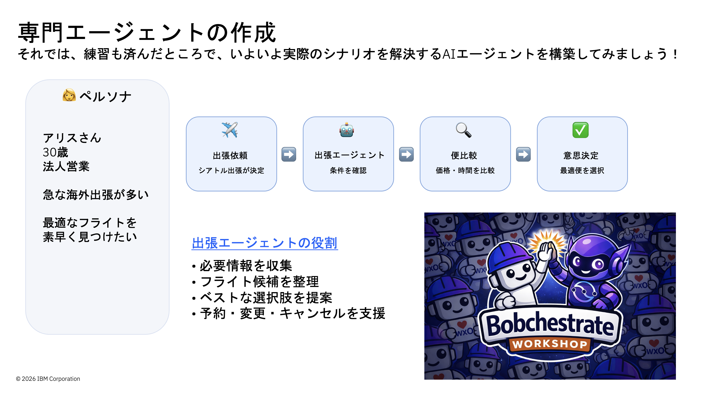

# Bobchestrate (IBM Bob × watsonx Orchestrate) ハンズオン

## 概要
IBM Bob x watsonx Orchestrateのハンズオンです。
AI エージェントの進化は、ビジネスのあり方を根本から変えつつあります。しかし、そのポテンシャルを最大限に引き出し、現場で実用的な価値を生み出すためには、単なるAI の試行錯誤を超えたシステム設計と統合が不可欠です。
本ハンズオンでは、開発体験を劇的に向上させるIBM Bob を活用しながらIBM watsonx Orchestrate 上にAI エージェントを構築し、この複雑な課題に対する解決策を実践的に学びます。


## 目的
IBM Bob というAI コーディングエージェントで、業務効率化エージェントを実装する

- 想定所要時間: 1時間


## シナリオ
**ペルソナ：アリスさん（30歳・法人営業）**
- 急な海外出張が多い
- 最適なフライトを素早く見つけたい

```
シアトル出張が決定
　→ 出張エージェントが条件を確認
　→ 便を比較（価格・時間）
　→ 最適便を選択
```


## ハンズオンの流れ
| ステップ | 内容 |
|------|------|
| [01_事前準備](lab-scenario/01_事前準備.md) | ハンズオン当日までに準備いただく事項 |
| [02_当日確認](lab-scenario/02_当日確認.md) | ハンズオン当日に確認する事項 |
| [03_アーキテクチャー概要](lab-scenario/03_アーキテクチャー概要.md) | システム全体の構成 |
| [04_Lab1](lab-scenario/04_Lab1.md) | 単純なAI エージェントを作成する |
| [05_Lab2](lab-scenario/05_Lab2.md) | 専門エージェントを作成する |


