# 2. 当日確認

## 2-1. IBM Bob の起動
1. IBM Bobを起動します。

2. 任意のディレクトリに、今回の作業場所とするフォルダを作成します。

3. フォルダを表示します。
    1. ①Bobの左上にある「ファイル」をクリックし、②「フォルダーを開く」をクリックします。
    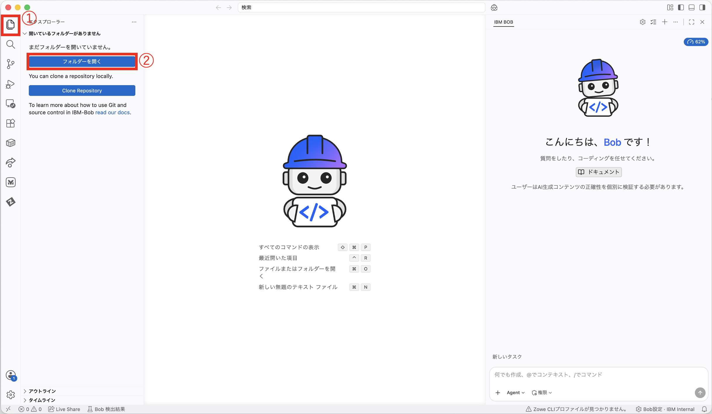
    1. ①作成したフォルダを選択し、②「開く」をクリックします。
    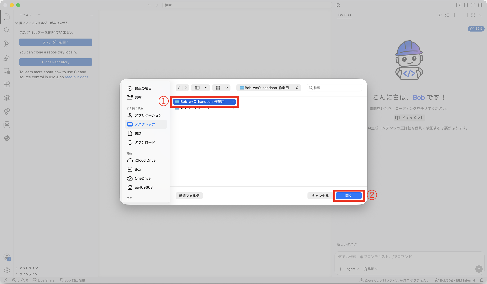
    1. 開くと、画面左側に開いたフォルダ名が表示されます。
    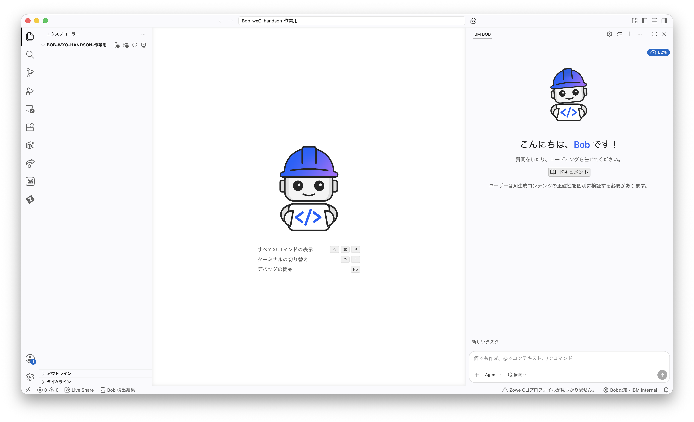

4. IBM Bob へのログイン
    1. 「Bob にログイン」ボタンをクリックします。
    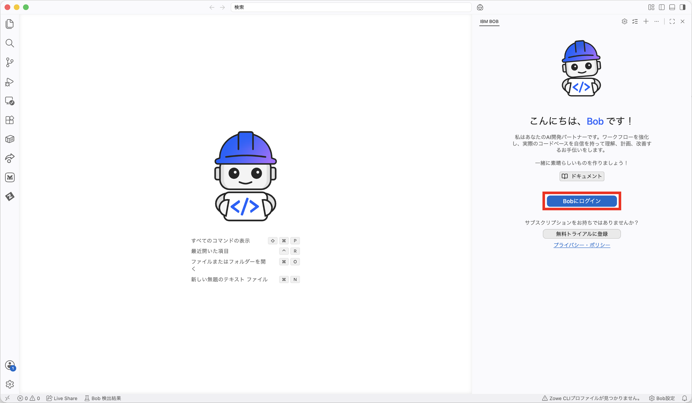
    1. 許可を求められるので、「許可」をクリックします。
    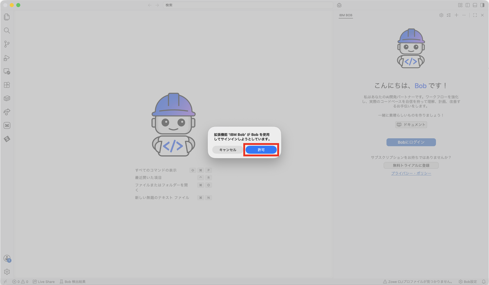
    1. 「開く」をクリックします。
    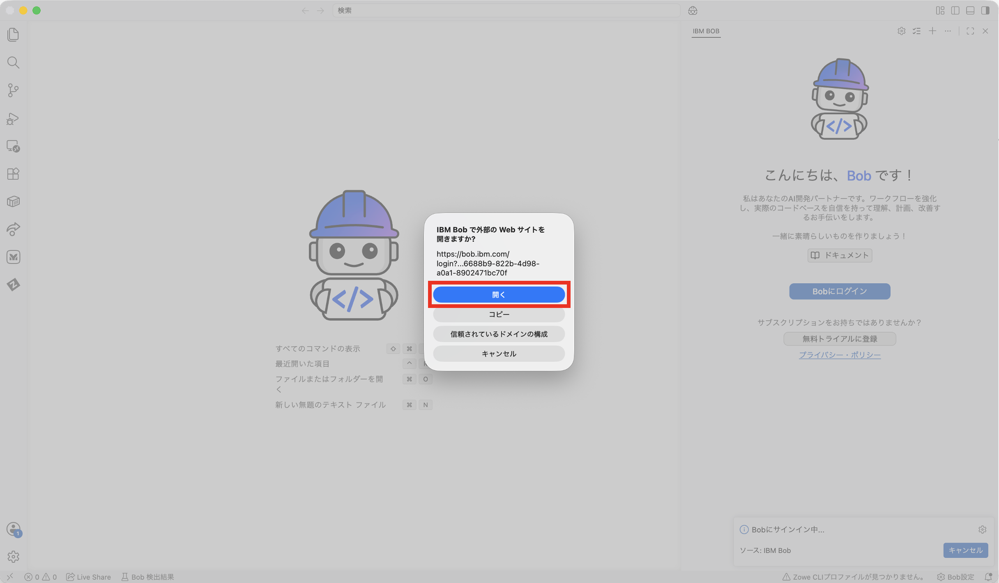
    1. ブラウザが開くので、事前に作成いただいたIBM id でログインします。
    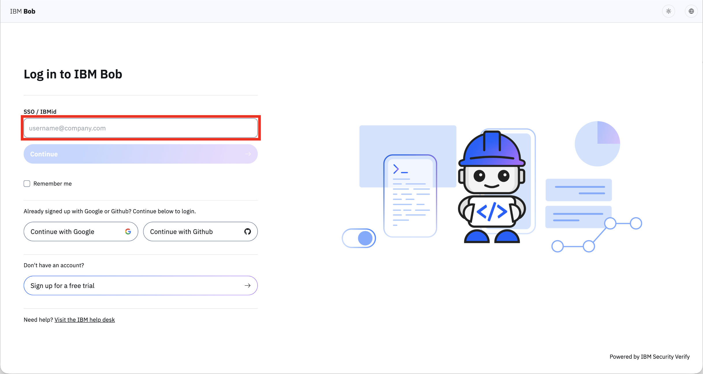
    1. ポップアップが表示されますので、「IBM Bob を開く」をクリックします。
    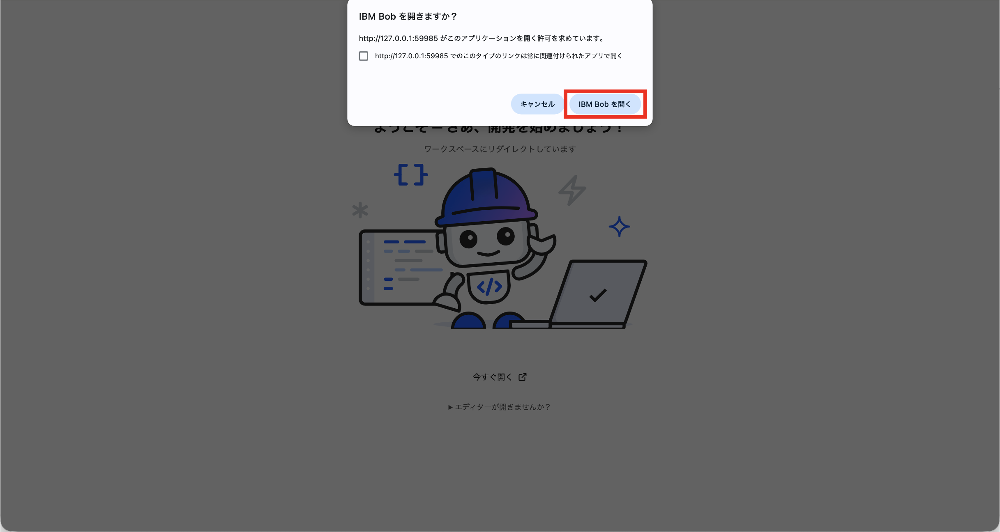
    1. ログインに成功すると、Bobとのチャット画面が表示されます。
    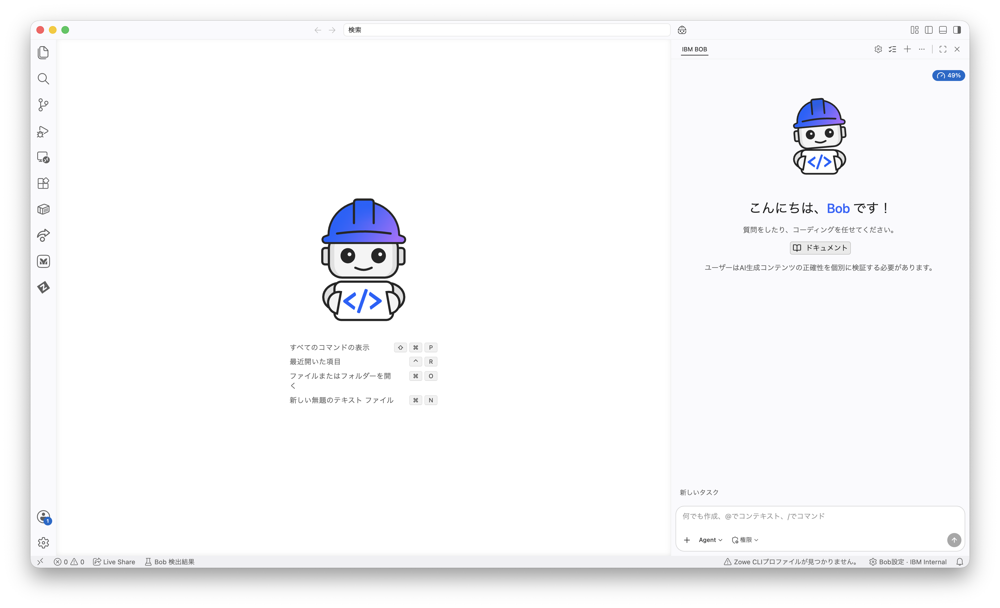


## 2-2. uv の動作確認
以下のコマンドを実行し、uv がインストールされていることを確認してください。

**実行コマンド**
```
uv --version
```
**出力例**
```
% uv --version
uv 0.9.28 (Homebrew 2026-01-29)
```


## 2-3. Python の動作確認
以下のコマンドを実行し、Python がインストールされていることを確認してください。

**実行コマンド**
```
python --version
```
**出力例**
```
% python --version
Python 3.11.3
```

> [!WARNING]
> **注意！** Python もしくはuv のインストールがお済みでない場合は、Bob に以下の指示を出して環境設定を支援してもらうことができます。
>
> ```
> 現在のOSとCPUを確認した上で、Python3.11とuvの最新安定版をインストールしてください。
> ```


## 2-4. watsonx Orchestrate の起動
講師から案内された環境、もしくはご自身でお持ちの環境にアクセスしてください。


## 2-5. MCP サーバーをIBM Bob にインストール

### 2-5-1. MCP(Model Context Protocol) サーバーとは
MCP は、AIシステムが外部ツールやサービスと対話できるようにする標準化された通信プロトコルです。
MCPサーバーは、外部ツールとデータソースに接続することでBobの機能を拡張します。

### 2-5-2. MCP を使用する理由
MCPにより、Bobで以下が可能になります：
- コア変更なしに機能を拡張 
- 必要に応じて特殊な機能を有効化

### 2-5-3. インストール可能なMCP サーバーの例
- File System
- GitHub
- Sequential Thinking
- MongoDB
- Terraform
- watsonx-orchestrate-adk
など

### 2-5-4. IBM Bob にインストール
Bob に以下を指示します。
```
watsonx-orchestrate-adk-docsのMCPサーバー設定を追加してください。
```


## 2-6. watsonx Orchestrate の認証情報を取得

### 2-6-1. インスタンスURL を取得
1. ①右上のユーザーアイコンをクリックし、②「設定」をクリックします。
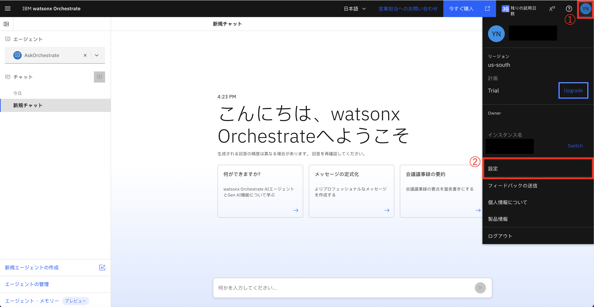
2. ①「API の詳細」をクリックし、②サービス・インスタンスURLをコピーします。
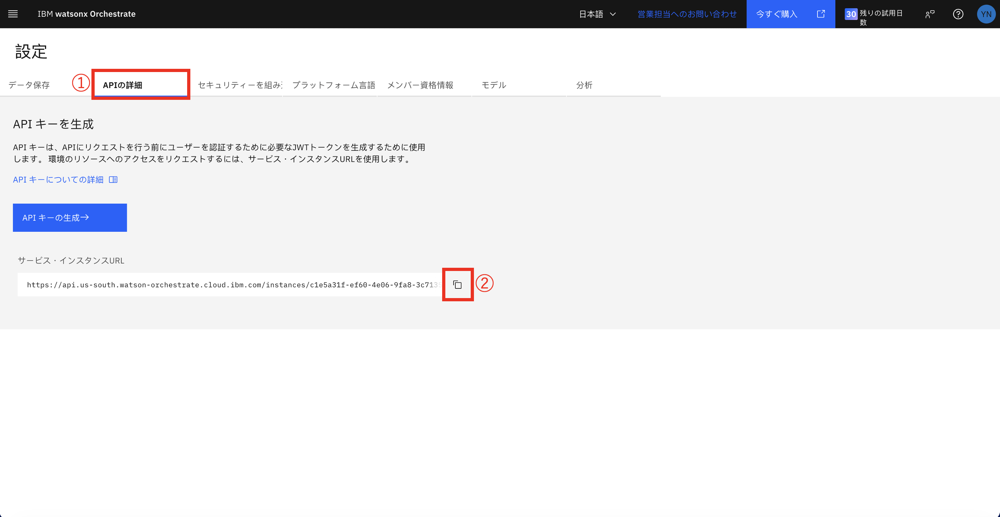
3. メモなどに控えておきます。

### 2-6-2. API キーを取得

1. ①「API の詳細」をクリックし、②「API キーの作成」をクリックします。
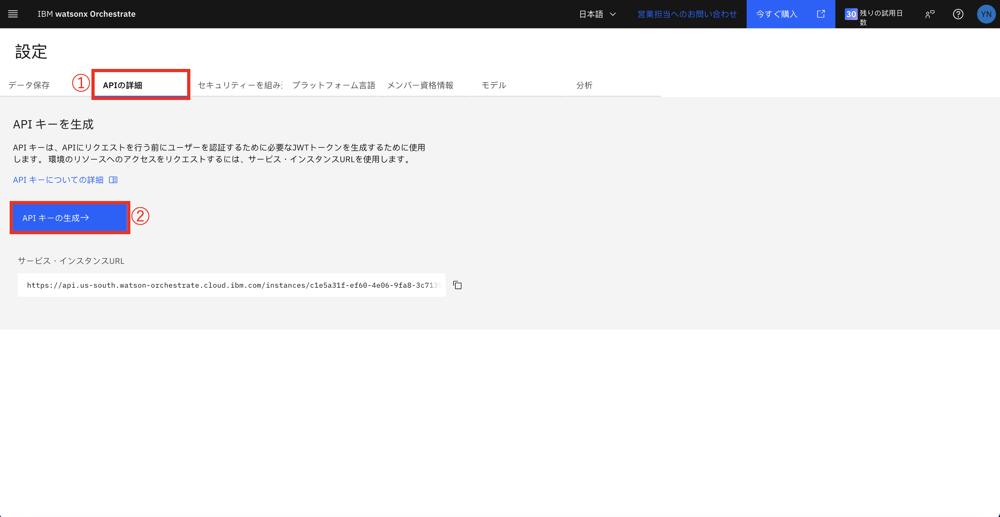
2. メモなどに控えておきます。


## 2-6-3. watsonx Orchestrate ADK(Agent Development Kit) のセットアップ
ADK のセットアップは、コマンドラインで実行します。

1. Bob 右上をクリックしてコマンドラインインターフェースを開きます。
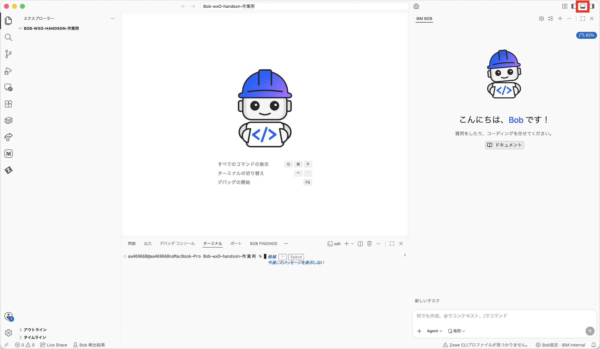

2. 以下を実行して、ADK をインストールします。

    **実行コマンド**
    ```
    uv init && uv add ibm-watsonx-orchestrate
    ```
    **出力例**
    ```
    % uv init && uv add ibm-watsonx-orchestrate
    Initialized project `xxxxx`
    Using CPython 3.11.3 interpreter at: /Users/xxxxx/xxxxx/xxxxx/python/3.11.3/bin/python3.11
    Creating virtual environment at: .venv
    Resolved 40 packages in 249ms
    Prepared 37 packages in 324ms
    Installed 37 packages in 33ms
    + annotated-doc==0.0.5
    + annotated-types==0.8.0
    + anyio==4.14.2
    + certifi==2026.7.22
    + charset-normalizer==3.4.9
    + click==8.4.2
    + docstring-parser==0.18.0
    + h11==0.16.0
    + httpcore==1.0.9
    + httpx==0.28.1
    + ibm-cloud-sdk-core==3.26.0
    + ibm-watsonx-orchestrate==2.14.0
    + ibm-watsonx-orchestrate-clients==2.14.0
    + ibm-watsonx-orchestrate-core==2.14.0
    + idna==3.18
    + jsonref==1.1.0
    + markdown-it-py==4.2.0
    + mdurl==0.1.2
    + packaging==26.3
    + pydantic==2.13.4
    + pydantic-core==2.46.4
    + pygments==2.20.0
    + pyjwt==2.13.0
    + python-dateutil==2.9.0.post0
    + python-dotenv==1.2.2
    + pytz==2026.3.post1
    + pyyaml==6.0.3
    + redis==8.1.0
    + requests==2.34.2
    + rich==13.9.4
    + shellingham==1.5.4
    + six==1.17.0
    + typer==0.27.1
    + typing-extensions==4.16.0
    + typing-inspection==0.4.3
    + urllib3==2.7.0
    + websocket-client==1.9.0
    ```

3. wxO インスタンスとローカル環境の接続を設定します。`<environment-name>` には任意の環境の名前(例：wxo-handson)、`<service-instance-url>`には [###インスタンスURL を取得](###インスタンスURLを取得) でコピーしたURL を入力します。
    
    **実行コマンド**
    ```
    uv run orchestrate env add -n <environment-name> -u <service-instance-url>
    ```
    **出力例**
    ```
    % uv run orchestrate env add -n wxo-handson -u https://api.ap-southeast-1.dl.watson-orchestrate.ibm.com/instances/xxxxx
    [INFO] - Environment 'wxo-handson' has been created
    ```

4. 上記で作成した環境をアクティベートします。API キーの入力を求められるので、[###API キーを取得](###APIキーを取得) でコピーしたAPI キーを入力します。
    
    **実行コマンド**
    ```
    uv run orchestrate env activate <environment-name>
    ```
    **出力例**
    ```
    % uv run orchestrate env activate wxo-handson       
    Please enter WXO API key: 
    [WARNING] - Using 'mcsp' Auth Type. If this is incorrect please use the '--type' flag to explicitly choose one of ibm_iam, mcsp_v1, mcsp_v2 or cpd
    [INFO] - Environment 'wxo-handson' is now active
    ```

> [!NOTE]
> **now active** と表示されたらOK

### 2-6-4. IBM Bob によるADK の操作
ADK にはエージェント一覧を表示させるコマンドがありますが、Bobに自然文で指示をしてエージェントの一覧を表示させてみましょう。

```
uvでorchestrateコマンドを使用して、いま接続しているwatsonx Orchestrateの環境にあるエージェントの一覧を表示して。
```
**実行例**
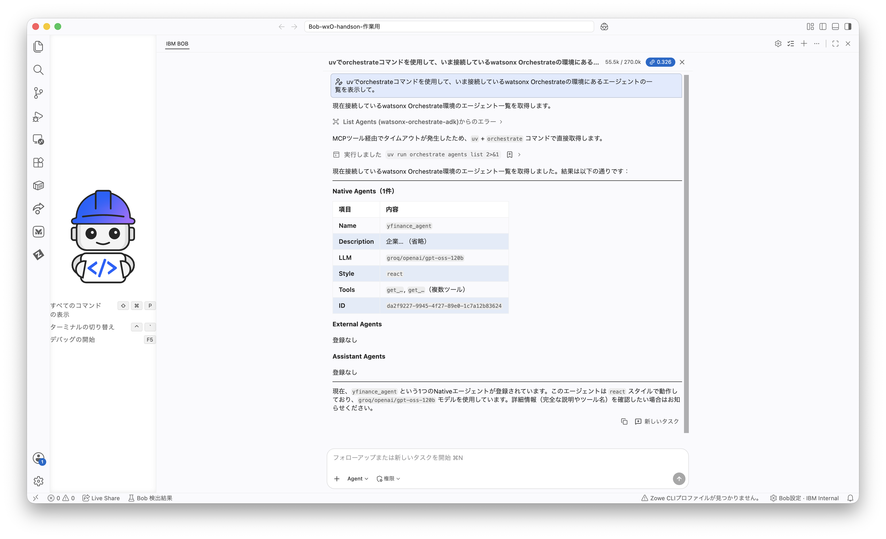

次のステップは [03_アーキテクチャー概要](03_アーキテクチャー概要.md) です。
