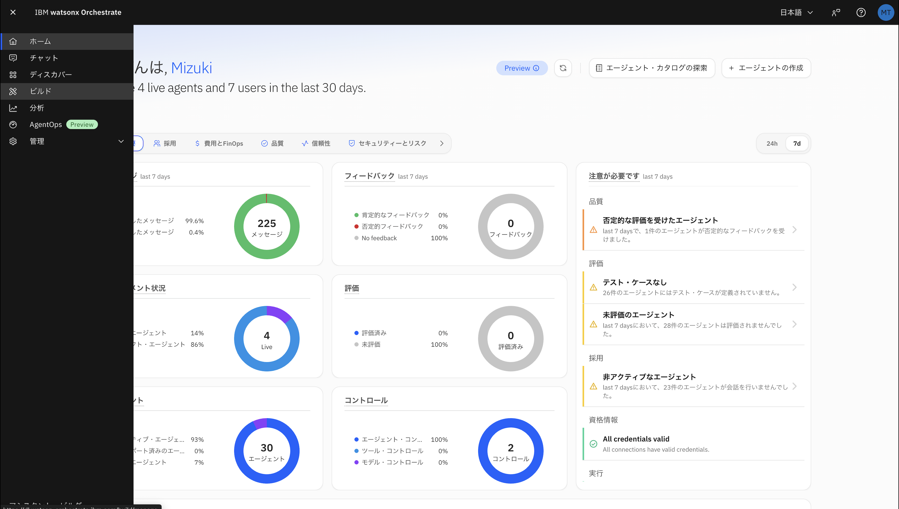
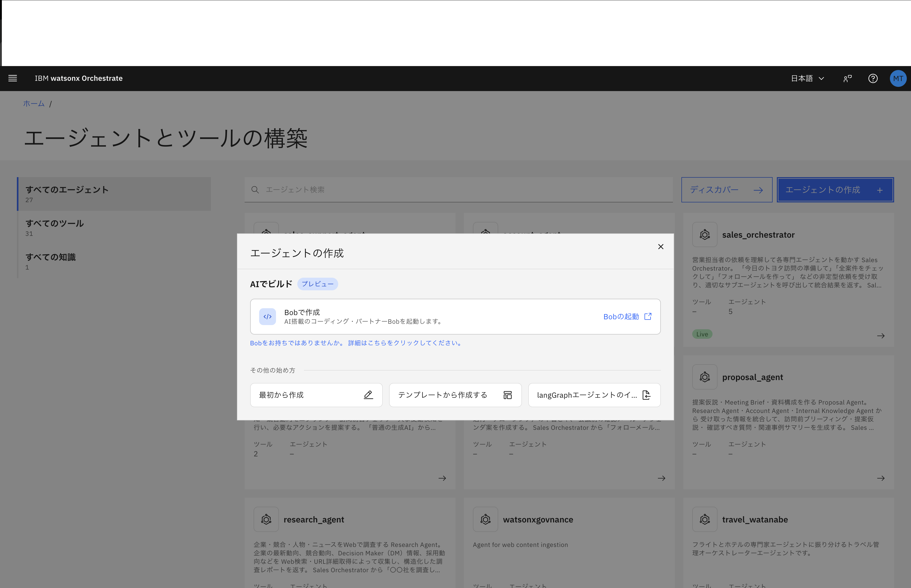
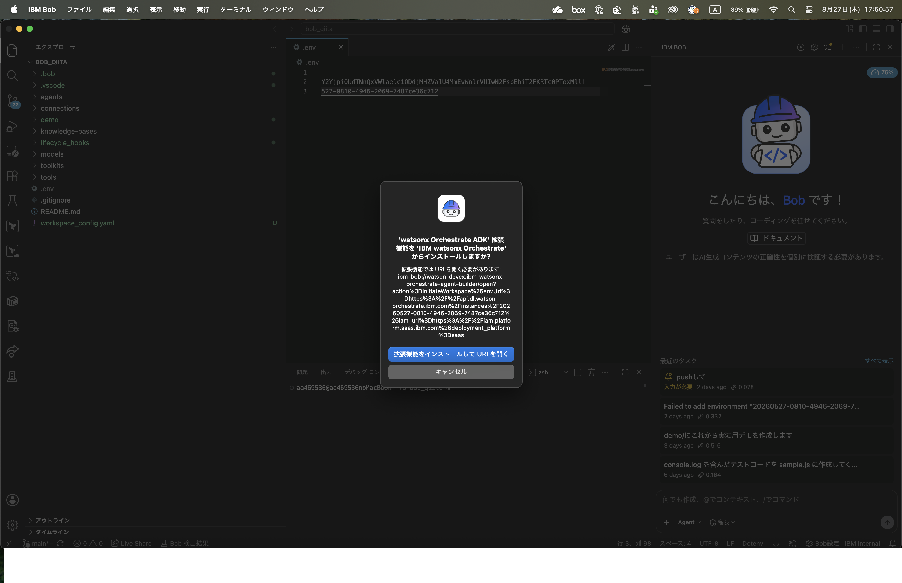
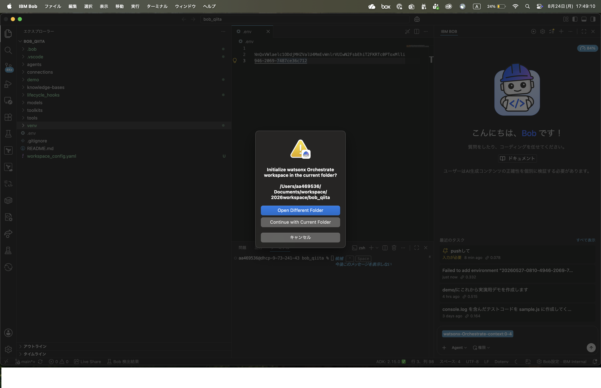

# 2. 当日確認

## 2-1. IBM Bob の起動
1. IBM Bobを起動します。

2. 任意のディレクトリに、今回の作業場所とするフォルダを作成します。

3. フォルダを表示します。
    1. ①Bobの左上にある「ファイル」をクリックし、②「フォルダーを開く」をクリックします。
    
    1. ①作成したフォルダを選択し、②「開く」をクリックします。
    
    1. 開くと、画面左側に開いたフォルダ名が表示されます。
    

4. IBM Bob へのログイン
    1. 「Bob にログイン」ボタンをクリックします。
    
    1. 許可を求められるので、「許可」をクリックします。
    
    1. 「開く」をクリックします。
    
    1. ブラウザが開くので、事前に作成いただいたIBM id でログインします。
    
    1. ポップアップが表示されますので、「IBM Bob を開く」をクリックします。
    
    1. ログインに成功すると、Bobとのチャット画面が表示されます。
    


## 2-2. watsonx Orchestrate の起動
講師から案内された環境、もしくはご自身でお持ちの環境にアクセスしてください。

## 2-3. watsonx Orchestrate の認証情報を取得

### 2-3-1. インスタンスURL を取得
1. ①右上のユーザーアイコンをクリックし、②「設定」をクリックします。

2. ①「API の詳細」をクリックし、②サービス・インスタンスURLをコピーします。

3. メモなどに控えておきます。

### 2-3-2. API キーを取得

1. ①「API の詳細」をクリックし、②「API キーの作成」をクリックします。

2. メモなどに控えておきます。

## 2-4. IBM Bobへのwatsonx Orchestrate ADK拡張機能のインストール
watsonx Orchestrateの起動後、画面左上のハンバーガーメニュー（三の形のアイコン）をクリックします。展開されたメニューから「ビルド」を選択します。


エージェントの作成をクリックし、「Bobの起動」をクリックします。


ダイアログに従い、IBM Bobが起動します。
起動すると、下図のようにwatsonx Orchestrate ADK拡張機能のインストールを確認されます。拡張機能をインストールしてURIを開くを選択してインストールします。


> [!WARNING]
> **注意！** 拡張機能のインストールに同意すると、PythonおよびPython用パッケージ管理ツールであるuvのインストールが実行されます。お使いのPCの環境と組織ポリシーを確認した上で同意し、作業を進めてください。

watsonx Orchestrate ADK拡張機能がインストールが完了するとAPIキーの入力を求められるので、2-3で取得したAPIキーを入力します。

現在開いているフォルダ上で作業を行うか聞かれるので、灰色の「Continue with Currenet Folder」をクリックします。


認証が通り、IBM Bob上でwatsonx Orchestrate上のエージェント一覧が表示されていることを確認します。

> 補足：何らかの要因で拡張機能のインストールが自動で進まない場合は、下記を参照して作業します。　https://developer.watson-orchestrate.ibm.com/adk_extension/installing_adk_extension

## 2-5. IBM Bob によるADK の操作
ADK にはエージェント一覧を表示させるコマンドがありますが、Bobに自然文で指示をしてエージェントの一覧を表示させてみましょう。

```
いま接続しているwatsonx Orchestrateの環境にあるエージェントの一覧を表示して。
```
**実行例**


次のステップは [03_アーキテクチャー概要](03_アーキテクチャー概要.md) です。
