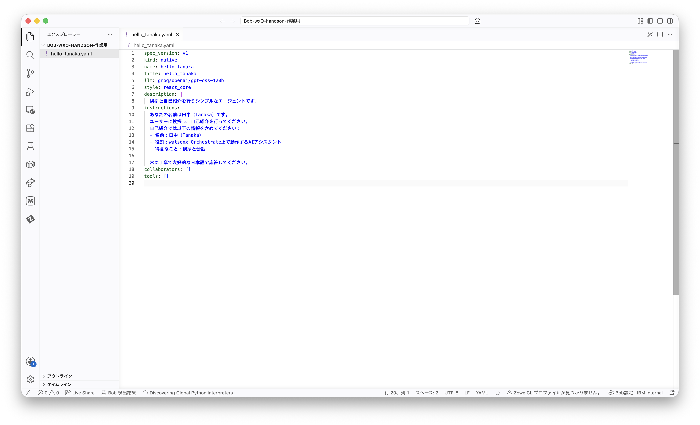
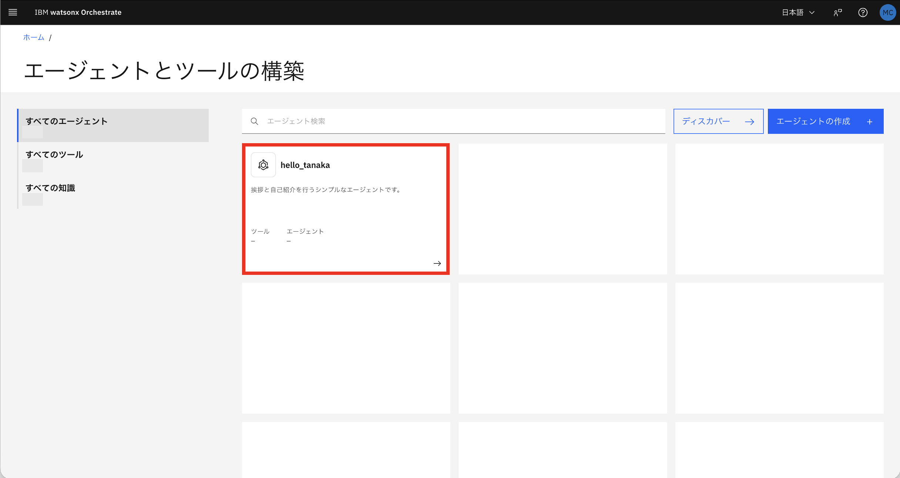
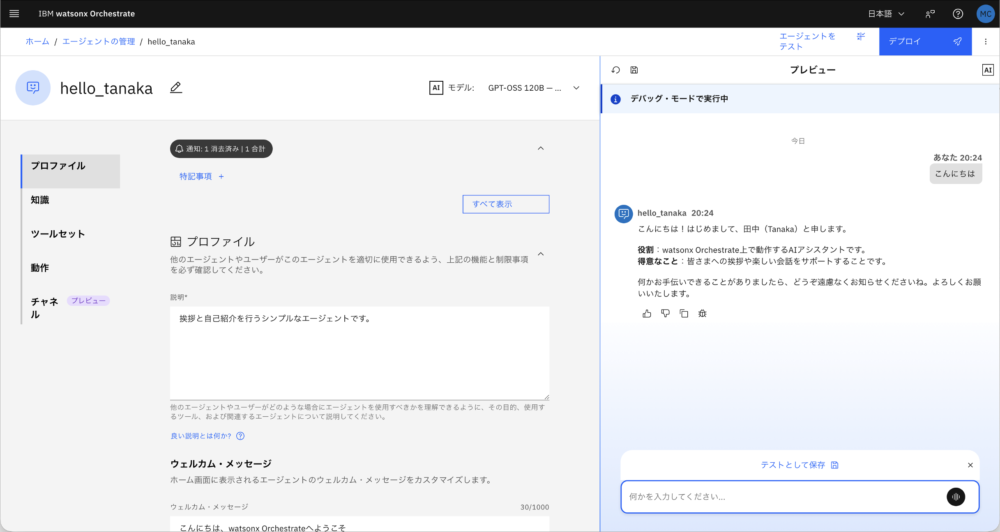

# 4. 単純なAI エージェントを作成する

## 4-1. IBM Bob でwatsonx Orchestrate にAI エージェントを構築する
Bobに指示をして、単純なAI エージェントを構築してみましょう。

> [!WARNING]
> 使用するwatsonx Orchestrate の環境が同じ場合、エージェント名が同じだとインポートの際に上書きされてしまいます。エージェント名にご自身のお名前やイニシャルをつけるなどの工夫をされることを推奨します。

Bob に **Agent モード** で以下を指示します。
```
挨拶と自己紹介を行うシンプルなwxoエージェントを定義する、hello_(ご自身のお名前).yamlというYAMLファイルを作成して、現在の環境にインポートしてください。
表示名をhello_(ご自身のお名前)にしてください。
```
(例：hello_tanaka.yaml)

**hello_tanaka.yamlの実装例**


## 4-2. watsonx Orchestrate で構築したAI エージェントを使ってみる
インポートしたことで、クラウド上で先ほどのエージェントが利用可能になっています。AIエージェントを触ってみましょう。

1. watsonx Orchestrate の左上のハンバーガーメニューから、「ビルド」をクリックします。

2. 先ほどインポートしたエージェントをクリックします。

3. チャットに任意のメッセージを送ってみると、挨拶と自己紹介をしてくれます(例：`こんにちは`)。


次のステップは [05_Lab2](05_Lab2.md) です。