# 5. 専門エージェントを作成する

## 5-1. 専門エージェントを構築する(1)
IBM Bob と一緒に、専門エージェントを実装しましょう。

1. Bob に **Agent モード** で以下を指示します。
    ```
    まずフライトの検索・予約・変更・キャンセルの機能を持つツールをそれぞれ作成し、その上でそれらが組み込まれているエージェントを作成してください。ツールのファイル名には "_(ご自身のお名前)" をつけて、エージェントのファイル名は `flight_(ご自身のお名前).yaml` としてください。wxOへのインポートはまだしないでください。
    ```
    (例：flight_tanaka.yaml)

    **出力例**
    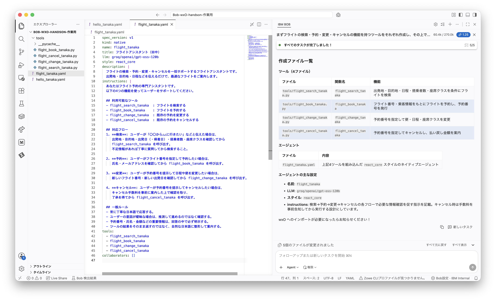

2. 続けて、Bobに **Agent モード** で以下を指示します。
    ```
    wxo用に、すべてのエージェントとツールを正しい順序でインポートするシェルスクリプトを作成して実行してください。
    各エージェントはその連携相手となるエージェントがインポートされた後にインポートされるようにしてください。
    ```

    **出力例**
    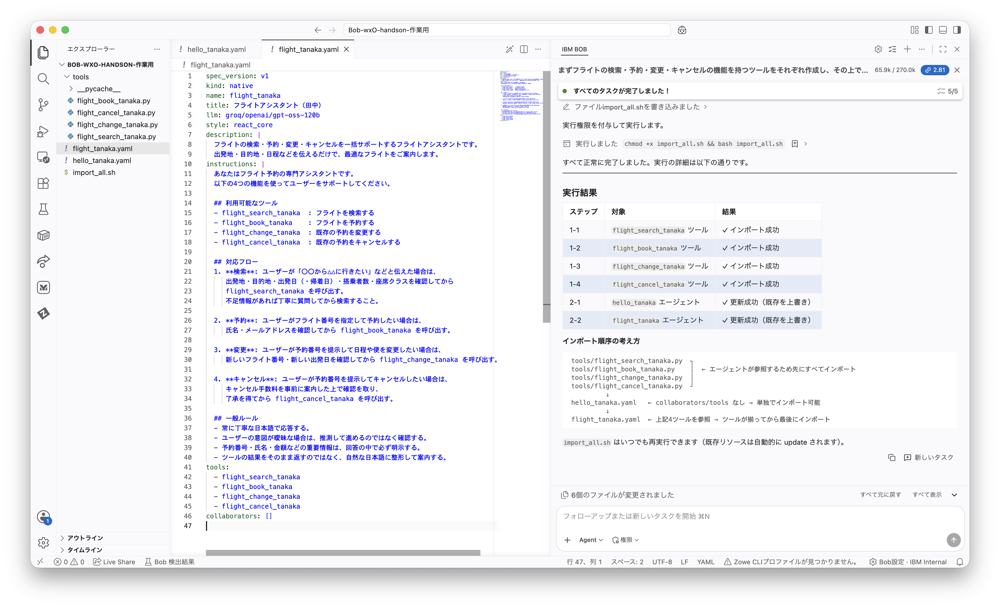


## 5-2. watsonx Orchestrate で専門エージェントを使ってみる(1)

1. watsonx Orchestrate の左上のハンバーガーメニューから、「ビルド」をクリックします。
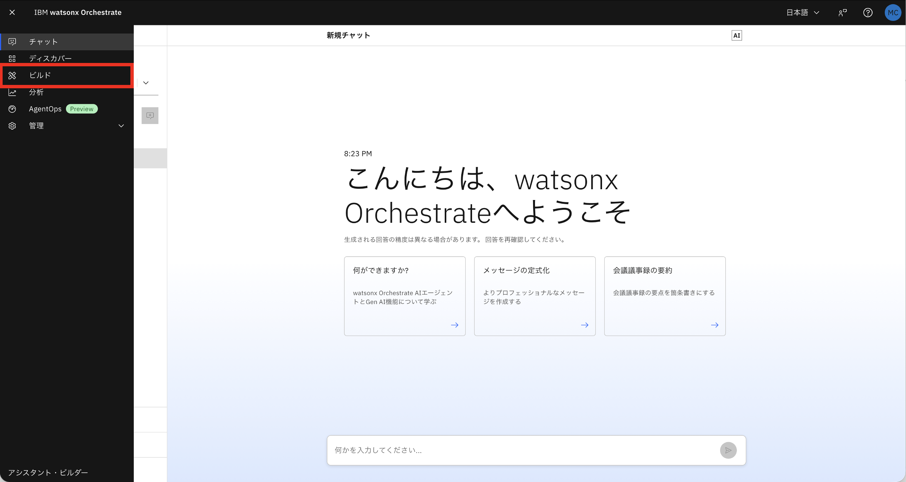

2. `flight_(ご自身の名前)` エージェントをクリックします。
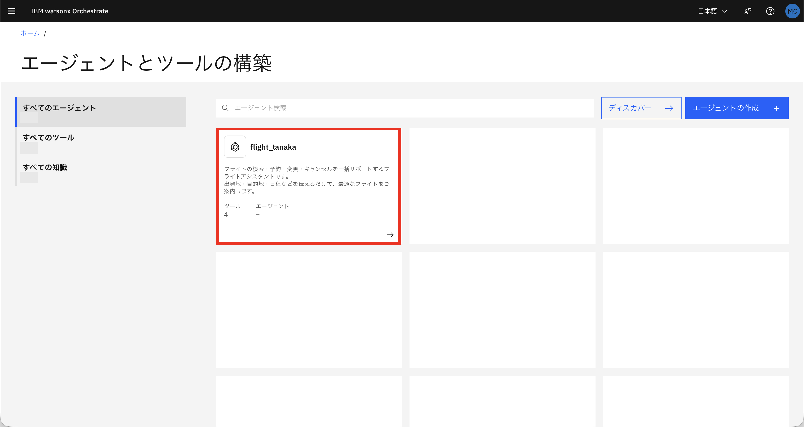

3. チャットに任意のメッセージを送ってみましょう(例：`8月18日に東京からダラスへ行きたい`)。
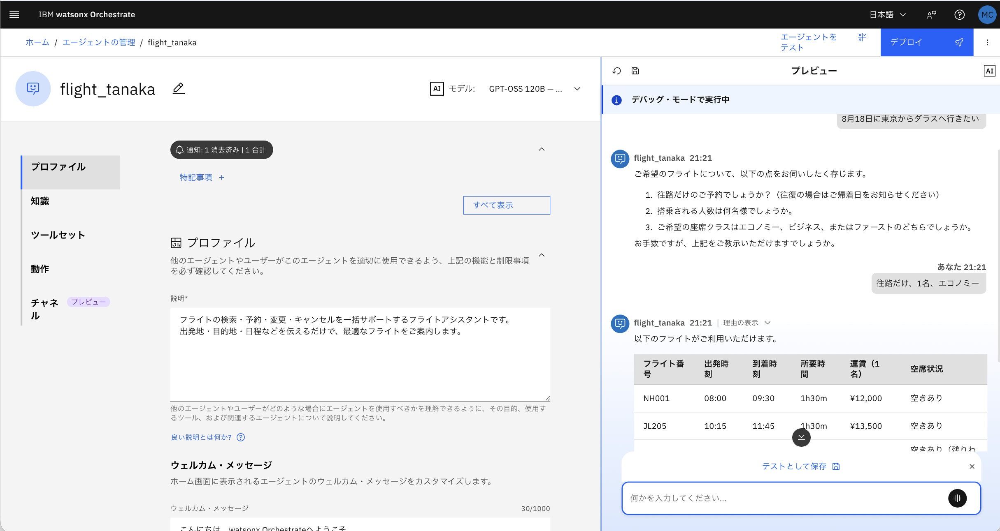

4. モデルの応答に日本語が不自然などの問題がある場合は、GUI上でモデルの切り替えを試してみましょう。
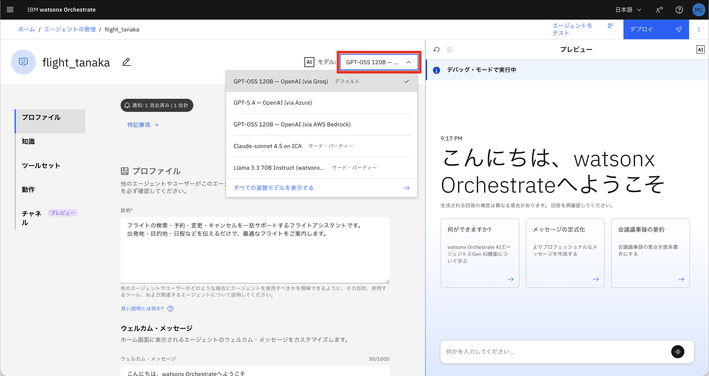

> [!TIP]
> エージェントはツールの呼び出しに必要な要素が不足している場合、対話形式で状況を確認した上で実行します。


## 5-3. 専門エージェントを構築する(2)
フライトエージェントに続けて、ホテルエージェントも構築します。

1. [5-2](#5-2-watsonx-orchestrate-で専門エージェントを使ってみる1)のチャットに続けて、Bob に **Agent モード** で以下を指示します。
    ```
    まずホテルのの検索・予約・変更・キャンセルの機能を持つツールをそれぞれ作成し、その上でそれらが組み込まれているエージェントを作成してください。ツールのファイル名には "_(ご自身のお名前)" をつけて、エージェントのファイル名は `hotel_(ご自身のお名前).yaml` としてください。wxOへのインポートはまだしないでください。
    ```
    (例：hotel_tanaka.yaml)

    **出力例**
    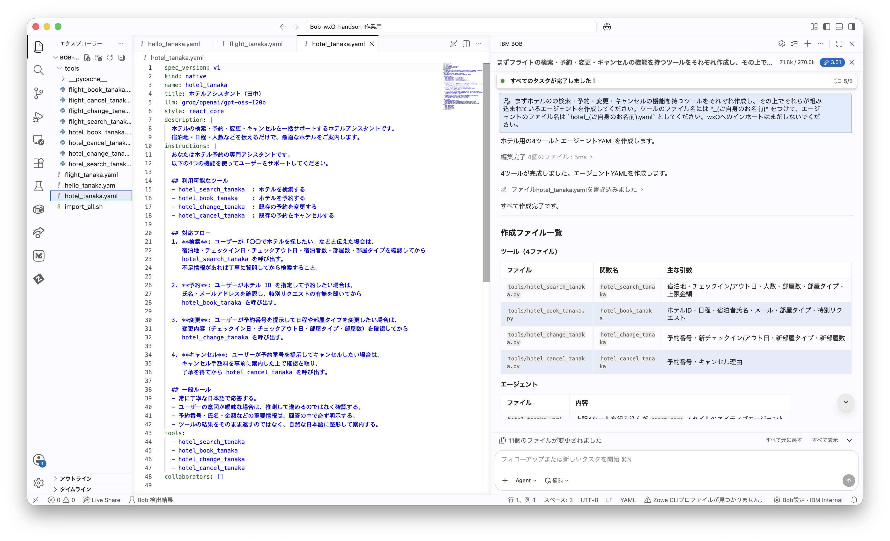

2. 続けて、親エージェントを構築します。Bobに **Agent モード** で以下を指示します。
    ```
    travel_(ご自身のお名前).yaml というファイル名で、flightとhotelの2つの専門家子エージェントを明確に振り分けるエージェントを作成してください。 
    ```
    (例：travel_tanaka.yaml)

    **出力例**
    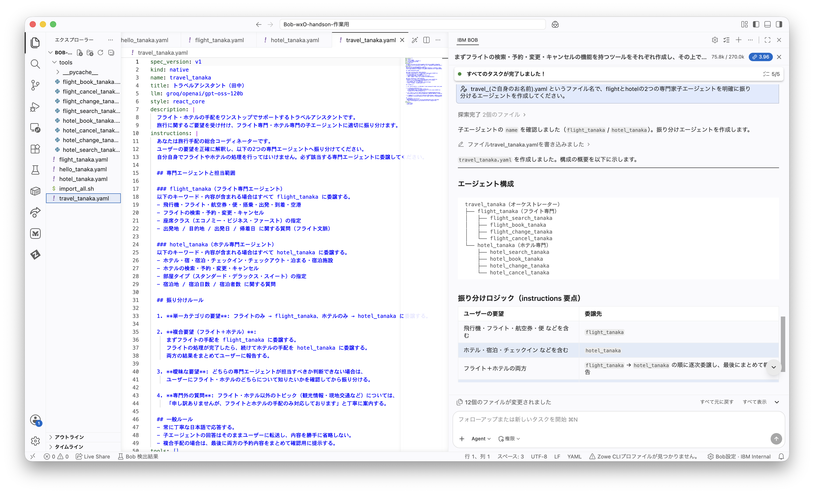

3. 続けて、Bobに **Agent モード** で以下を指示します。
    ```
    wxo用に、すべてのエージェントとツールを正しい順序でインポートするシェルスクリプトを作成して実行してください。
    各エージェントはその連携相手となるエージェントがインポートされた後にインポートされるようにしてください。
    ```

> [!TIP]
> wxOのビルドで、3つのエージェントがインポートされていることを確認します。
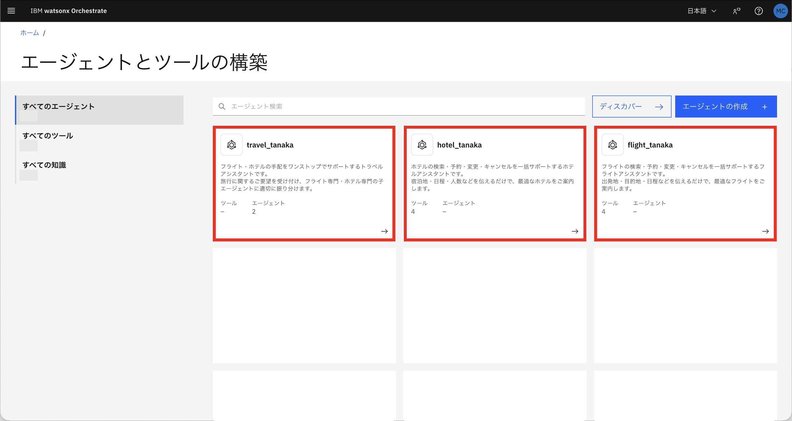


## 5-4. watsonx Orchestrate で専門エージェントを使ってみる(2)

1. watsonx Orchestrate の左上のハンバーガーメニューから、「ビルド」をクリックします。


2. `travel_(ご自身の名前)` エージェント(親エージェント) をクリックします。
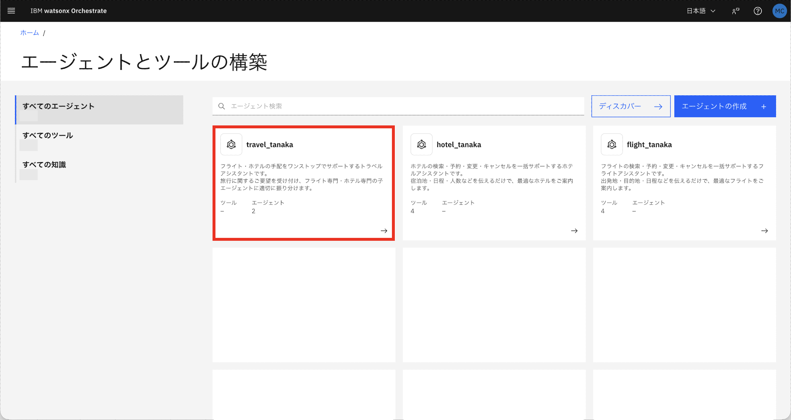

3. チャットに任意のメッセージを送ってみましょう(例：`8月18日から8月25日まで、ダラスに行きます。東京からの飛行機とホテルを予約したいです。`)。

4. 「理由の表示」をクリックすると、親エージェントが子エージェントにどのようなリクエストを出し、子エージェントがどのような返答をしているのかを確認することができます。
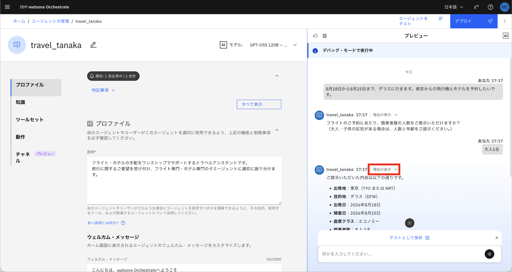


> [!TIP]
> こちらの場合は、親エージェントであるtravel_tanaka エージェントが子エージェントであるflight_tanaka エージェントにルーティングしていることがわかります。
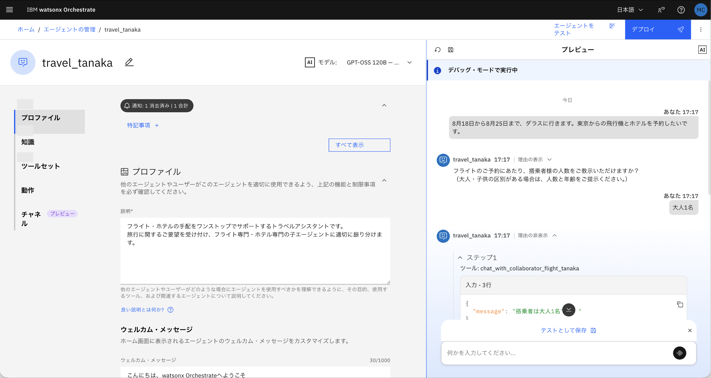

