# プロジェクト1: 仕様駆動コーディング - 詳細なラボ手順

**推定完了時間:** 1-2時間  
**推定コスト:** $2-$3

## 目次
1. [概要](#概要)
2. [前提条件](#前提条件)
3. [ラボのセットアップ](#ラボのセットアップ)
4. [ステップバイステップの手順](#ステップバイステップの手順)
5. [トラブルシューティングガイド](#トラブルシューティングガイド)


## 概要

このハンズオンラボでは、Bobを使用した**仕様駆動コーディング**により、PDF請求書ファイルを処理する生成AIアプリケーションコンポーネントを開発します。このアプリケーションは、以下を含む複数のオープンソースAPIおよびフレームワークと統合されます:
- **LangChain** - LLMアプリケーション構築のためのフレームワーク
- **watsonx.ai** - LLM推論のためのIBM AIプラットフォーム
- **Docling** - ドキュメント処理ライブラリ
- **Streamlit** - Webアプリケーションフレームワーク

最終的なコンポーネントは、PDF請求書からデータを抽出し、表形式とグラフ形式の両方で結果を表示します。

**重要:** これは、スタンドアロンのエンドツーエンドアプリケーションではなく、より大規模なシステムへの統合を目的とした再利用可能なコンポーネントです。


## 前提条件

このラボを開始する前に、以下がインストールおよび設定されていることを確認してください:

### 必要なソフトウェア
1. **Git**
   - コマンドラインGit（Bobでの使用を推奨）
   
2. **Bob IDE**
   
3. **Python ランタイム**
   - バージョン3.11（このラボでテスト済み）または3.13

4. **watsonx.ai アクセス**
   - アクティブなIBM Cloudアカウント
   - watsonx.aiサービスへのアクセス

## ステップバイステップの手順

### ステップ1: ドラフト仕様と請求書を含むリポジトリのクローン

**目的:** ドラフト仕様とサンプル請求書ファイルを含むプロジェクトリポジトリをダウンロードします。

**アクション1.1:** Bob IDEを開き、Bobを使用してリポジトリをクローンします
- Bobのチャットインターフェースを開きます
- 以下のプロンプトを入力します:

```
リポジトリからプロジェクト1のみをダウンロードしてください: https://github.ibm.com/elowery/WW-Bobathon/tree/main/Project1_Spec_Dev
```

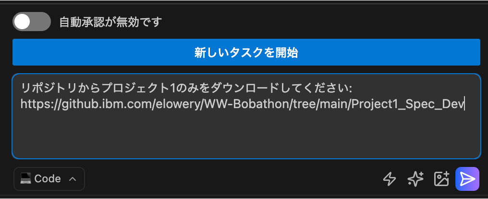

**アクション1.2:** Bobがgit cloneコマンドを実行するのを待ち、リポジトリが正常にクローンされたことを確認します
- ワークスペースに新しいファイルとフォルダが表示されることを確認します
- 以下を探します: `spec/draft_spec.txt`、PDFファイルを含む`examples/`フォルダ

**✓ チェックポイント:** 以下の構造が表示されるはずです:
```
Project1_Spec_Dev/
├── spec/
│   └── draft_spec.txt
├── examples/
│   ├── example1.pdf
│   ├── example2.pdf
│   └── example3.pdf
```
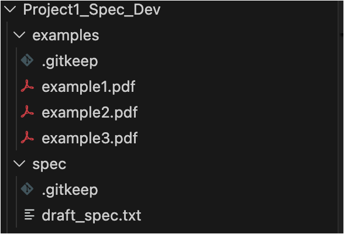

---

### ステップ2: ドラフト仕様のレビュー

**目的:** 初期要件を理解し、必要に応じて予備的な変更を行います。

**アクション2.1:** ドラフト仕様ファイルを開きます
- Bobのファイルエクスプローラーで`spec/draft_spec.txt`に移動します
- クリックしてファイルを開きます

**アクション2.2:** ドラフト仕様を日本語に翻訳します
- Bobで新しいタスクを開始します
- **Code**モードで、以下のプロンプトを入力します:

```
@/Project1_Spec_Dev/spec/draft_spec.txt を日本語に翻訳して、draft_spec_ja.txtとして保存してください。
```

- Bobが翻訳を完了するのを待ちます
- `spec/draft_spec_ja.txt`が作成されたことを確認します

**アクション2.3:** 仕様全体を読みます
- 以下に注意してください:
  - アプリケーション要件
  - 期待される機能
  - 技術スタック要件

**アクション2.4:** （オプション）予備的な編集を行います
- 不足している要件や明確化が必要な点を特定した場合
- Bobでファイルを直接編集します
- 変更を保存します（Ctrl+SまたはCmd+S）

**✓ チェックポイント:** ドラフト仕様をレビューし、プロジェクト要件を理解しました。

---

### ステップ3: Bobでドラフト仕様を改善する

**目的:** BobのAI機能を使用して、ドラフト仕様を強化し、正式化します。

**アクション3.1:** Bobに仕様の改善を依頼します
- Bobで新しいタスクを開始します
- **Code**モードで、以下のプロンプトを入力します:

```
@/Project1_Spec_Dev/spec/draft_spec_ja.txt のアプリケーション開発仕様を改善してください。master_spec.mdとして保存してください。
```
**アクション3.2:** Bobが改善された仕様を生成するのを待ちます
- Bobがドラフトを分析します
- より詳細で構造化された仕様を生成します
- `master_spec.md`として保存します

**アクション3.3:** 各セクションを注意深くレビューします
以下を確認します:
- ✓ 明確なプロジェクト目標
- ✓ 詳細な機能要件
- ✓ 技術アーキテクチャの説明
- ✓ API統合仕様
- ✓ データフロー図または説明
- ✓ UI/UX要件
- ✓ エラー処理仕様
- ✓ テスト要件

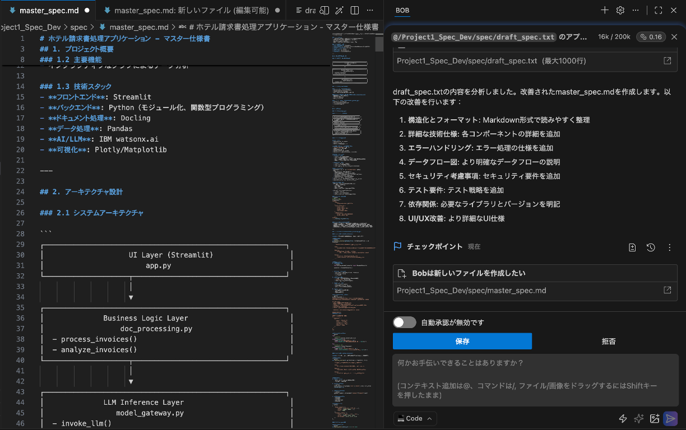

**✓ チェックポイント:** `master_spec.md`が完成し、コード生成の準備が整いました。

---

### ステップ4: 仕様からコードを生成する

**目的:** Bobを使用して、仕様に基づいてアプリケーションコードを自動生成します。

**アクション4.1:** 新しいタスクを開始し、**Code**モードで以下のプロンプトを入力します:

```
@/Project1_Spec_Dev/spec/master_spec.md に基づいて完全なアプリケーションコードを生成してください。必要なすべてのPythonファイル、設定ファイル、および依存関係のためのrequirements.txtを「hotel_invoice_app」フォルダに作成してください。
```

**アクション4.2:** Bobのコード生成プロセスを監視します。
Bobは実装ステップを追跡するためのToDoリストを作成します。

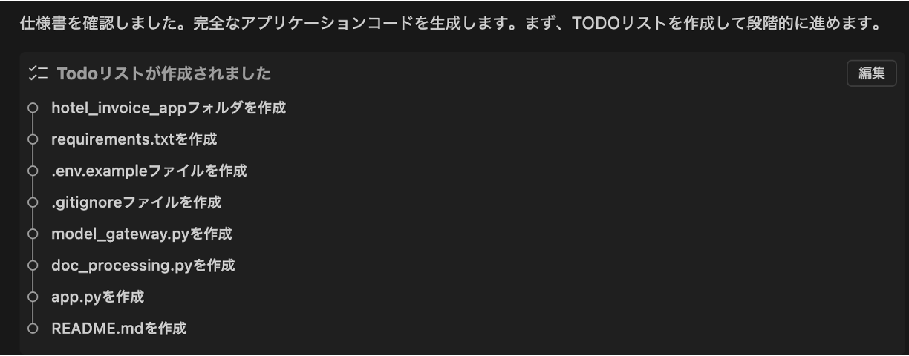

**アクション4.3:** 生成されたファイル構造をレビューします
Bobが以下を作成したことを確認します:
- メインアプリケーションファイル（例: `app.py`）
- 異なるコンポーネント用のモジュールファイル
- 設定ファイル（例: `.env.example`）
- すべての依存関係を含む`requirements.txt`
- READMEまたはセットアップ手順

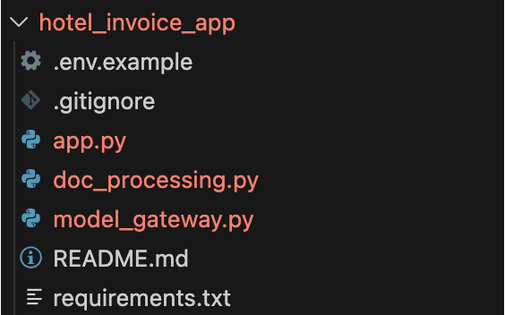

**✓ チェックポイント:** すべてのアプリケーションコードファイルが正常に生成されました。

---

### ステップ5: watsonx.ai APIキーの生成

**目的:** watsonx.ai統合に必要なAPI認証情報を取得します。

**アクション5.1:** Webブラウザを開き、watsonx.aiに移動します
- URL: https://dataplatform.cloud.ibm.com/wx/home?context=wx
- IBM Cloud認証情報でログインします

**アクション5.2:** ウェルカムページに移動します
- ログイン後、watsonx.aiウェルカムページが表示されます
- 「Developer Access」セクションを探します

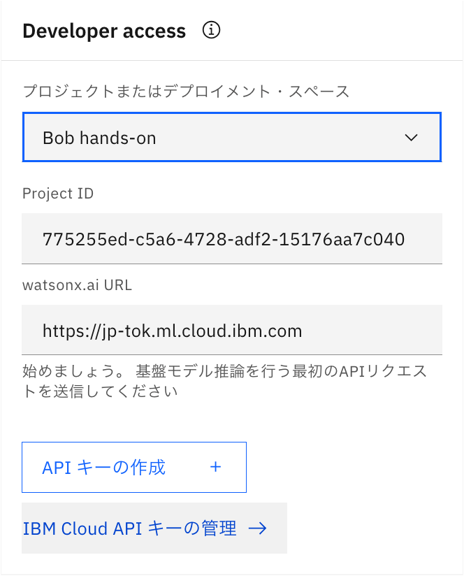

**アクション5.3:** watsonx.aiランタイムが関連付けられているプロジェクトを選択し、プロジェクトIDとwatsonx.ai URLをコピーします。後で必要になります。

**アクション5.4:** 「APIキーの作成」をクリックします
- Developer Accessセクションの「Create API key」ボタンをクリックします
- ダイアログが表示されます
- APIキーの名前を入力します（例: 「Invoice Processing App」）
- 「作成」をクリックします

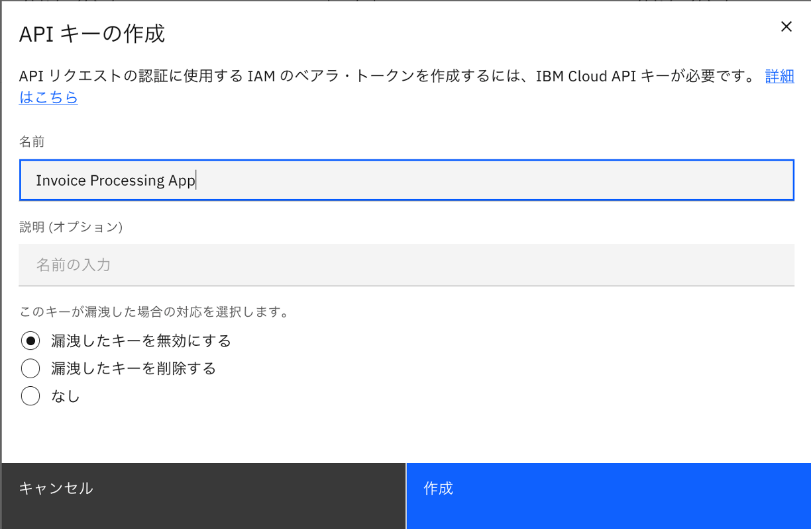

**アクション5.5:** APIキーをコピーして安全に保存します
- **重要:** APIキーをすぐにコピーしてください
- 安全な場所に保存してください
- 再度表示することはできません

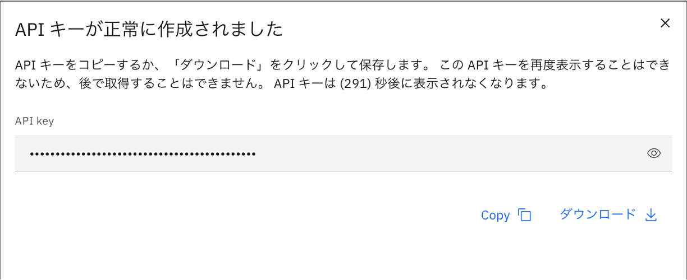

**⚠️ 重要な注意事項:**
- watsonx.aiへのアクセス権がない場合は、インストラクターに一時的なAPIキーを依頼してください
- APIキーをバージョン管理にコミットしないでください
- APIキーは機密情報として扱ってください

**✓ チェックポイント:** watsonx.ai認証情報を正常に生成し、保存しました。

---

### ステップ6: アプリケーションの設定

**目的:** API認証情報とその他の必要な値でアプリケーション設定をセットアップします。

**アクション6.1:** .envファイルを作成します
- `.env.example`を`.env`にリネームします
- エディタで`.env`ファイルを開きます

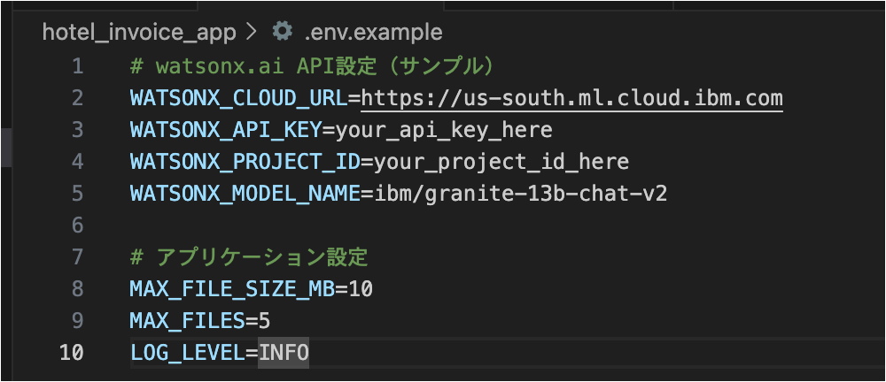
**アクション6.2:** 必要な値を入力します:

- プレースホルダーを実際のAPIキーに置き換えます
- watsonx.aiプロジェクトIDを入力します
- watsonx.ai API URLを設定します（通常は`https://us-south.ml.cloud.ibm.com`）
- 注意: LLM名として`openai/gpt-oss-120b`を使用してください。Bobは利用できなくなった別のモデルを使用する可能性があります。watsonx.aiインスタンスを確認し、利用可能なほかのLLMを選択することもできます。
他のLLMを利用する場合、下記のドキュメントでモデルidを確認できます：
https://jp-tok.dataplatform.cloud.ibm.com/docs/content/wsj/analyze-data/fm-models.html?context=wx&audience=wdp
```
WATSONX_LLM_NAME=openai/gpt-oss-120b
```
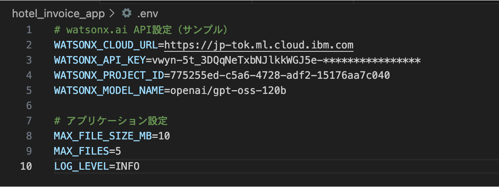

**アクション6.3:** .envファイルを保存します
- Ctrl+S（Windows/Linux）またはCmd+S（Mac）を押します
- ファイルが保存されたことを確認します

**アクション6.4:** .envが.gitignoreに含まれていることを確認します
- `.gitignore`ファイルを開きます
- シークレットのコミットを防ぐために`.env`がリストされていることを確認します

**✓ チェックポイント:** アプリケーションは、必要なすべての認証情報と設定で完全に構成されました。

---

### ステップ7: 依存関係のインストールと環境のセットアップ

**目的:** 必要なすべてのPythonパッケージをインストールし、ランタイム環境を準備します。

**アクション7.1:** 仮想環境を作成します（推奨）。
Bobでターミナルを開き、以下を実行します:

```bash
cd hotel_invoice_app
python3 -m venv .venv
```

**アクション7.2:** 仮想環境をアクティブ化します

**Windows:**
```bash
.venv\Scripts\activate
```

**macOS/Linux:**
```bash
source .venv/bin/activate
```

ターミナルプロンプトに`(.venv)`プレフィックスが表示されるはずです。

**アクション7.3:** 必要なパッケージをインストールします
以下のコマンドを実行します:

```bash
pip install -r requirements.txt
```

これにより、以下を含むすべての依存関係がインストールされます:
- LangChain
- pdfplumber
- Streamlit
- watsonx.ai SDK
- その他の必要なパッケージ

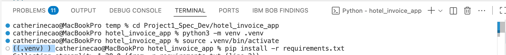

**アクション7.4:** インストールが完了するまで待ちます
- 数分かかる場合があります
- エラーメッセージに注意してください

**アクション7.5:** インストールを確認します
主要なパッケージがインストールされていることを確認します:

```bash
pip list | grep -E "langchain|docling|streamlit"
```

**注意**: 環境の作成と依存関係のインストールは一度だけ行う必要があります。次回アプリを実行する際は、このステップをスキップして、プロジェクトで作成した環境を再利用できます。


### ステップ8: アプリケーションのテストとトラブルシューティング

**目的:** 生成されたアプリケーションを実行し、Bobでトラブルシューティングを行います。

**アクション8.1:** 仮想環境がアクティブ化されているターミナルで以下のコマンドを実行します（ターミナルプロンプトに`(.venv)`プレフィックスが表示されているはずです）:
```
streamlit run app.py 
```
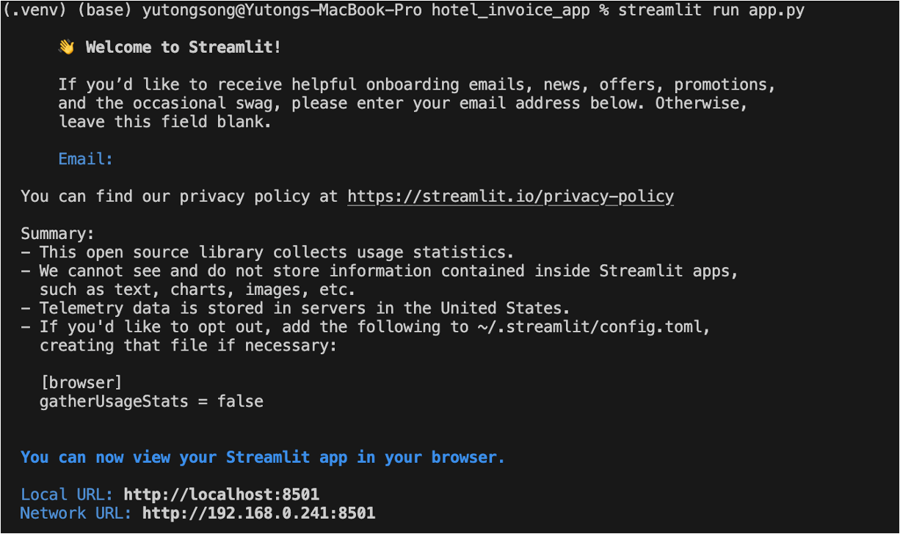

**✓ チェックポイント:** http://localhost:8501/ でアプリのUIが表示されるはずです。

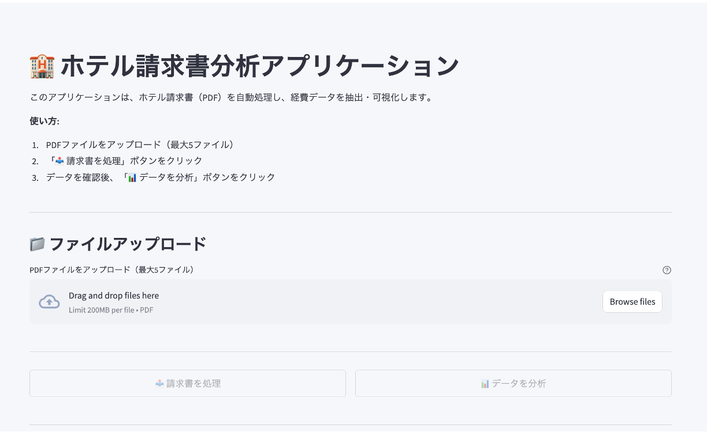

**アクション8.2:** ドキュメントをアップロードしてアプリをテストします: **Browse files**をクリックして**examples**フォルダからPDFを選択し、**Submit**をクリックします。

エラーが発生する可能性がありますが、これはBobが最初の試行ですべてを正しく取得できない可能性があるため、予想されることです。エラーは以下に示すものとは異なる場合があります。

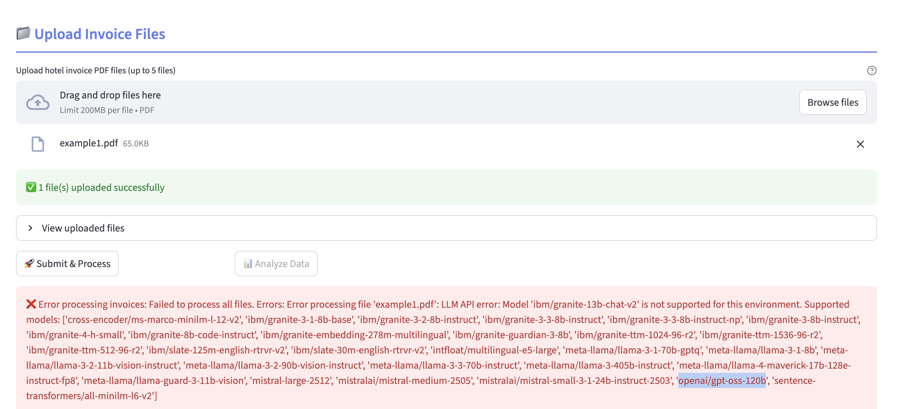

同じエラーがターミナルにも表示されます。組み込みユーティリティを使用してエラーの詳細をBobと共有し、問題の修正を依頼します。

**アクション8.3:** **Code**モードで新しいタスクを作成します。ターミナルでエラーを選択し、右クリックしてアクションメニューを表示し、IBM Bob > Add Terminal Content to Contextをクリックします。**Send**をクリックしてエラーの詳細をBobと共有します。

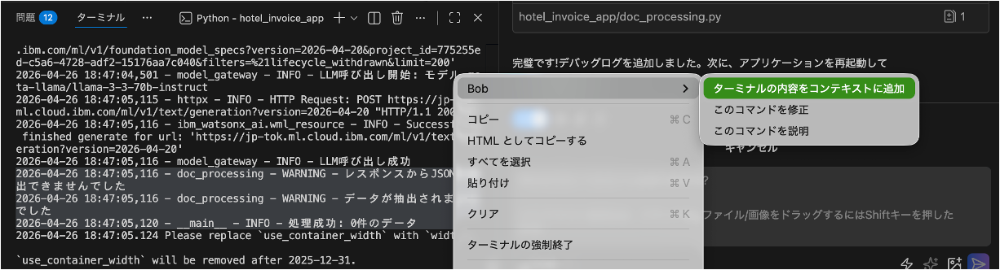

Bobはエラーメッセージを分析し、修正を提案します。トラブルシューティング中、プロジェクトで使用されているフレームワークをしっかり理解していると役立ちます。これにより、Bobにどこで変更を加えるべきかを指示し、途中で発生する間違いを修正できます。

例えば、私たちのケースでは、Bobは問題がプロンプト構築によって引き起こされたことを正しく特定しました。現在のプロンプトはJSON出力を要求していますが、モデルは説明テキストで応答していました。その後、Bobはconstruct_extraction_prompt関数を更新して、モデルがJSONを返すようにしました。ただし、streamlitアプリを実行する間違ったコマンドを提案しました。アプリを実行する正しいコマンドは、先ほど作成した仮想環境で`streamlit run app.py`です。また、streamlitは変更を自動的に反映するため、アプリを再起動する必要はありません。

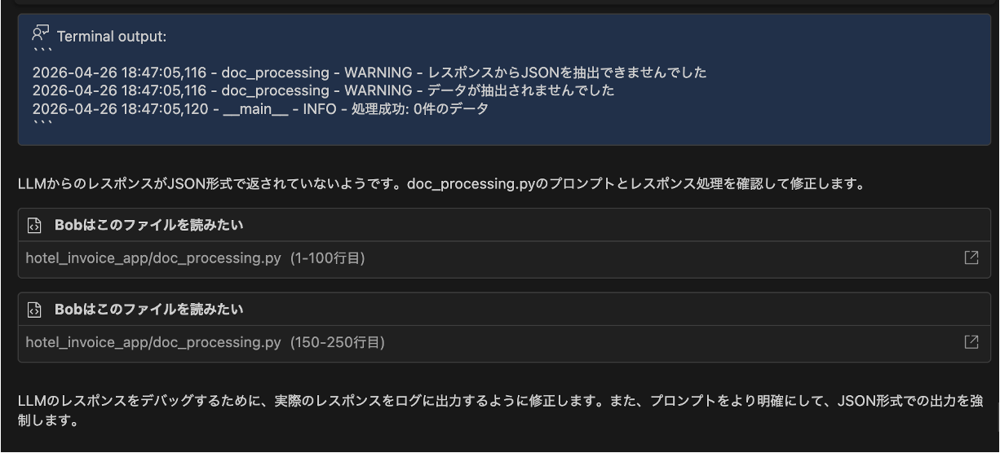

**アクション8.4:** Bobに正しいStreamlitコマンドを実行するよう依頼する代わりに、単にアプリを更新できます。変更は自動的に反映されます。

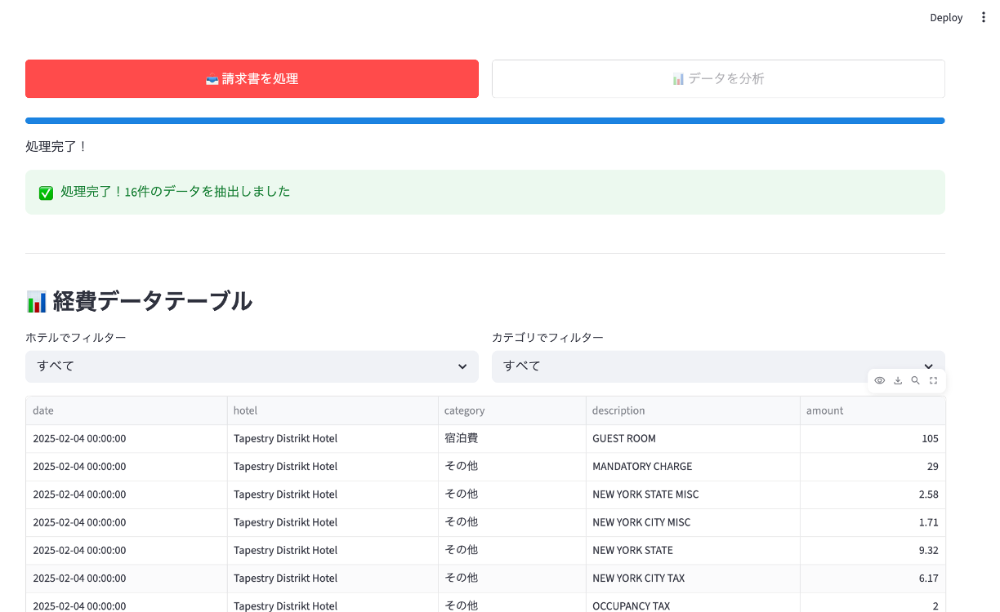

アプリで気づいたもう1つの問題は、請求書が抽出された直後に「データを分析」ボタンがグレーアウトされてクリックできないことです。

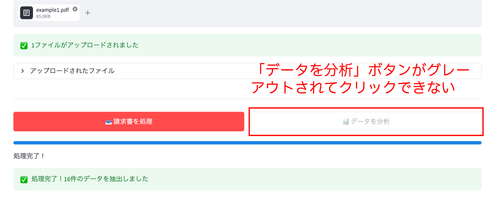

この状況をスクリーンショットと共にBobと共有し、修正を依頼できます。

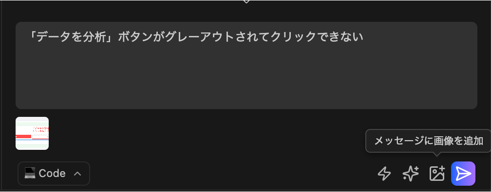

Bobはほぼ即座に問題の根本原因を特定し、修正しました。

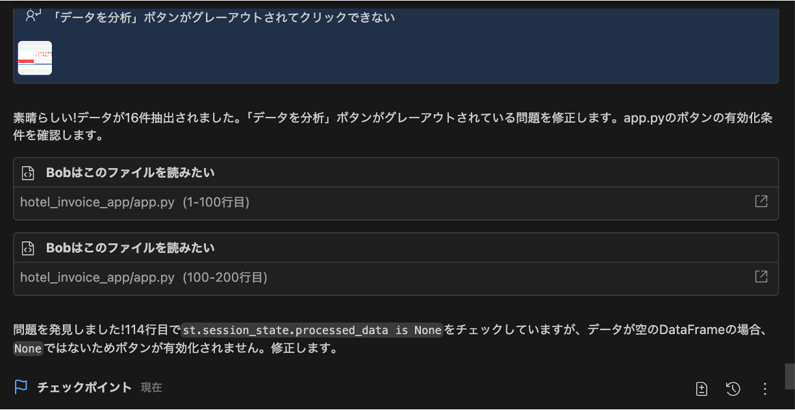

視覚化を含む完全に機能するアプリが得られるまで、Bobとのトラブルシューティングプロセスを繰り返す必要がある場合があります。

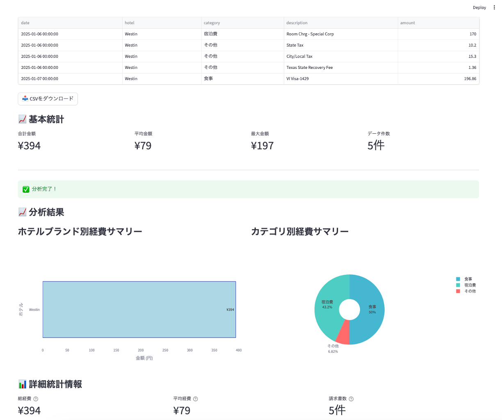

おめでとうございます！請求書からデータを抽出し、視覚化を生成できる完全に機能するアプリの構築に成功しました。

オプションで、以下についてBobに推奨事項を尋ねることができます:
- テスト
- セキュリティレビュー
- デプロイメント

サンプルプロンプト:
- アプリケーションを手動でテストしました。将来の変更のためにテストを自動化するには何をすべきですか？
- このアプリケーションのセキュリティレビューを実行してください。
- このアプリケーションをPodmanで実行されるローカルコンテナとIBM Cloudにデプロイしたいと思います。手順を説明してください。


## トラブルシューティングガイド

Doclingの使用に関する注意事項:
- Doclingはドキュメント前処理のためのPythonライブラリの1つですが、特にpipとcondaの両方をパッケージ管理に使用したPython環境がある場合、ラップトップでのセットアップが困難な場合があります。
- Doclingで問題が発生した場合は、Bobでトラブルシューティングを試みることができます。(プロンプト例："依存関係の競合は解消が難しそうです。アプリの機能要件に基づいて、同じ機能をほかのライブラリで実現できないか、改めて検討します。")
- 通常、Pythonプロジェクト用に新しい仮想環境を作成すると、問題を回避できます。  
- または、ドキュメント処理にDoclingの代わりにpdfplumberを使用するように仕様を変更できます。