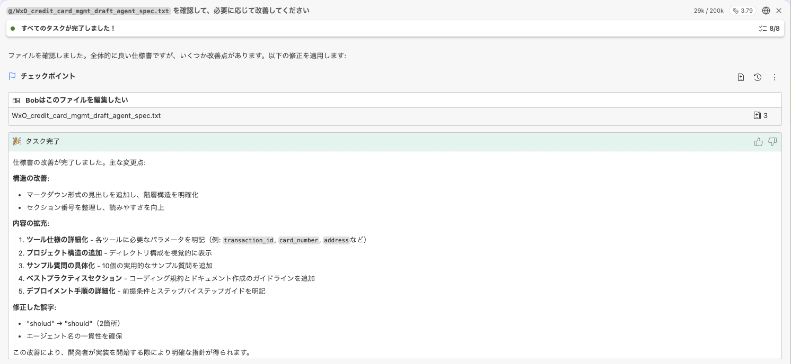
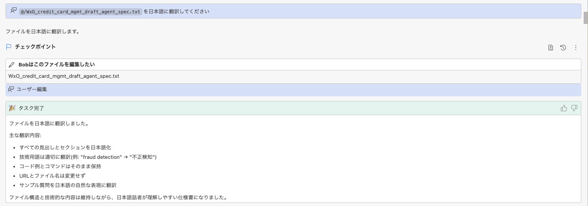
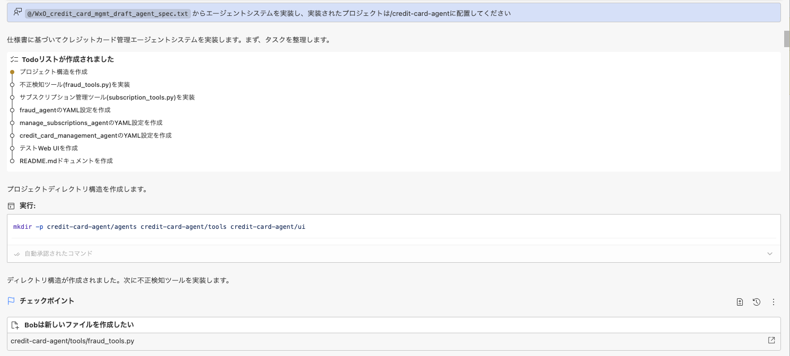
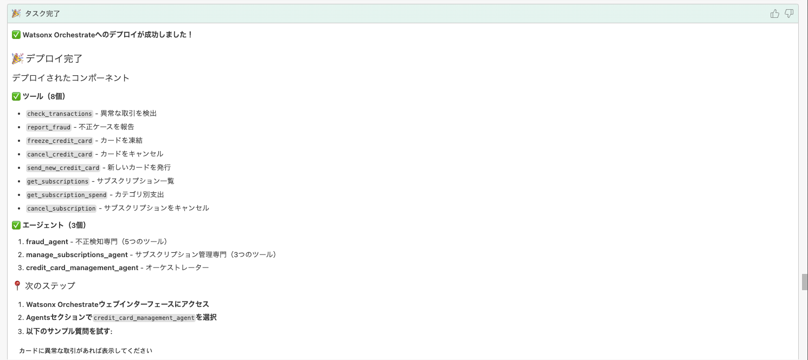
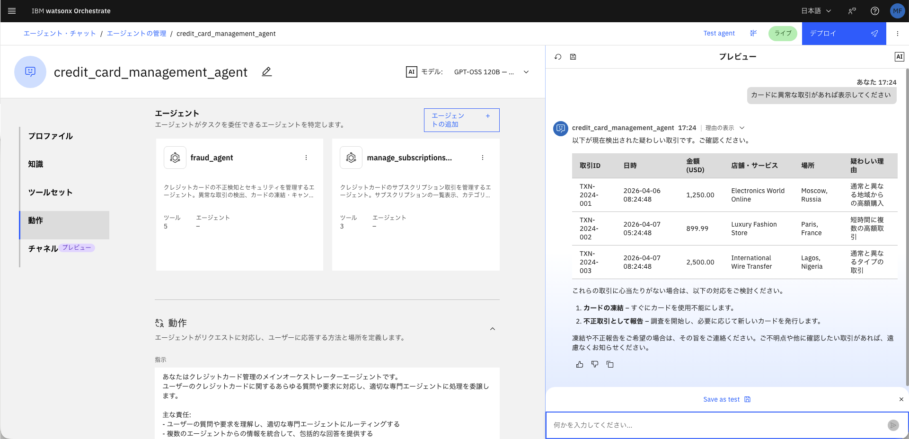
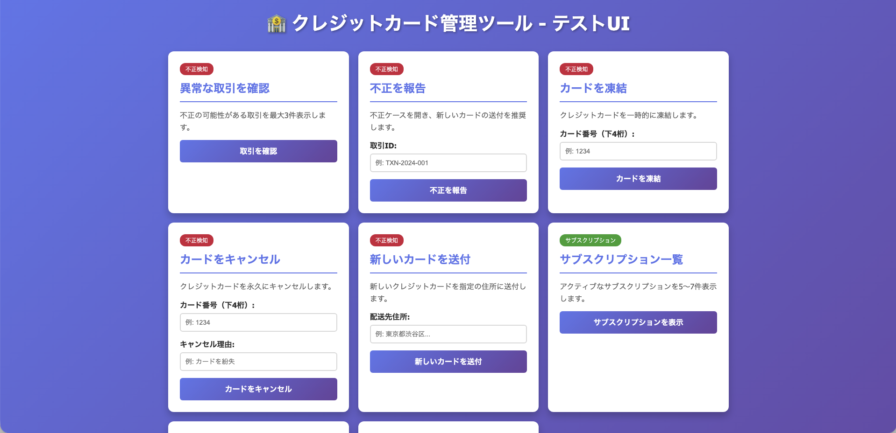

# Credit Card Agent を実装してwatsonx Orchestrate にデプロイする

## 動画
+ https://ibm.box.com/s/8megtlukqia0ltwvmgg3zwarpydboses

## 要件
+ Git アカウント
+ Bob のインストール
+ Bob のPython 拡張
+ Python 3.12/3.13
+ watsonx Orchestrate インスタンスへのアクセス権限
+ watsonx Orchestrate ADK 最新版

## ハンズオンシナリオ

1. リポジトリ内のハンズオン用サンプル([hands-on](hands-on))をダウンロードし、Bobがアクセスできるフォルダに配置

2. Bob へ仕様書([hands-on/WxO_credit_card_mgmt_draft_agent_spec.txt](hands-on/WxO_credit_card_mgmt_draft_agent_spec.txt))に誤った表記があった場合に改善するように指示を与える (Planモード)
```
WxO_credit_card_mgmt_draft_agent_spec.txt を確認して、必要に応じて改善してください
```



3. Bob へ英語の仕様書を日本語に翻訳するように指示を与える
```
WxO_credit_card_mgmt_draft_agent_spec.txt を日本語に翻訳してください
```


4. Bob へ仕様書をもとにエージェントを実装するように指示を与える
```
WxO_credit_card_mgmt_draft_agent_spec.txt をもとにエージェントシステムを実装し、実装されたプロジェクトは /credit-card-agent に配置してください
```


5. 実装したエージェントをwatsonx Orchestrate にデプロイするために、環境を有効化する.  
    
    5.1. ターミナルでコマンドを実行
    ```
    orchestrate env active wxo-aws
    # wxo-aws の部分は自身の環境名に置き換えてください
    ```

    5.2. API key の入力を求められるので入力し、Enter

    5.3. `[INFO] - Environment 'wxo-aws' is now active` と表示されたら有効化が完了

6. Bob へエージェントをデプロイするように指示を与える
```
README.md をもとに、watsonx Orchestrate へエージェントをデプロイしてください
```
タスク完了画面


7. デプロイされたエージェントをテストする

    7.1. watsonx Orchestrate のGUI でテスト
        
    a. 実装したエージェント `credit_card_management_agent` を選択
        
    b. ツールに`fraud_agent` と`manage_subscription_agent` を追加
        
    c. テストチャットをリフレッシュして質問を入力してテストする
        
    ```
    例: 
    カードに異常な取引があれば表示してください
    ストリーミングサービスにいくら使っていますか?
    ```
    


    7.2. Bob が実装したブラウザ用テストUI を起動するように指示を与える
    ```
    test_ui.html を使用してテストUI を起動してください
    ```
    

