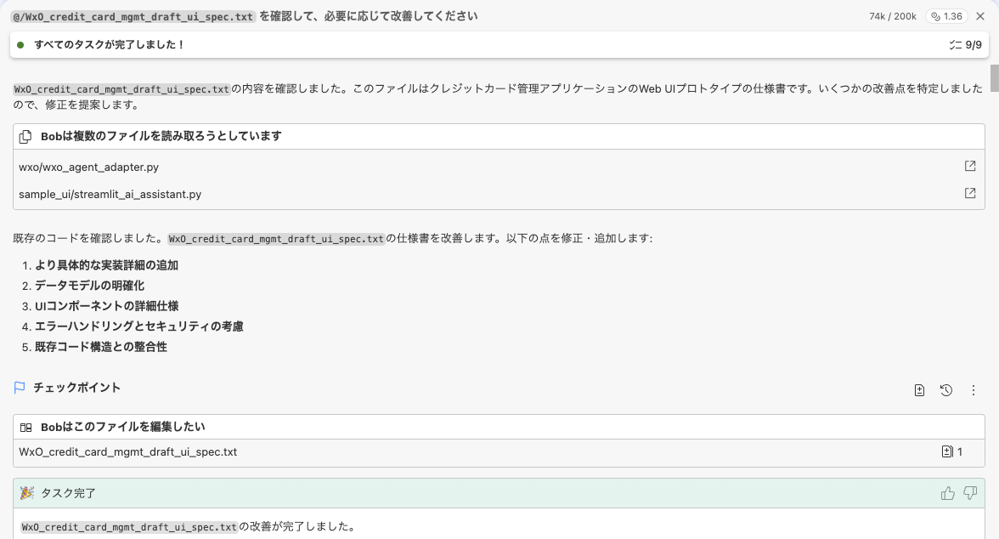
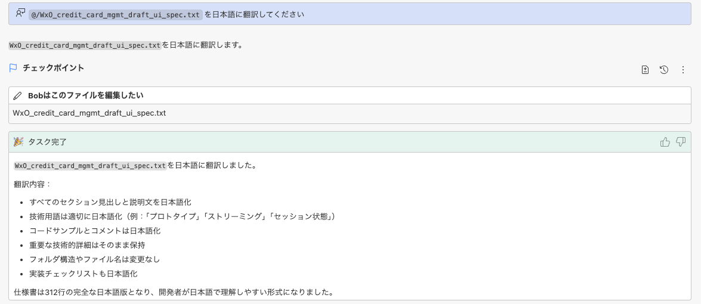
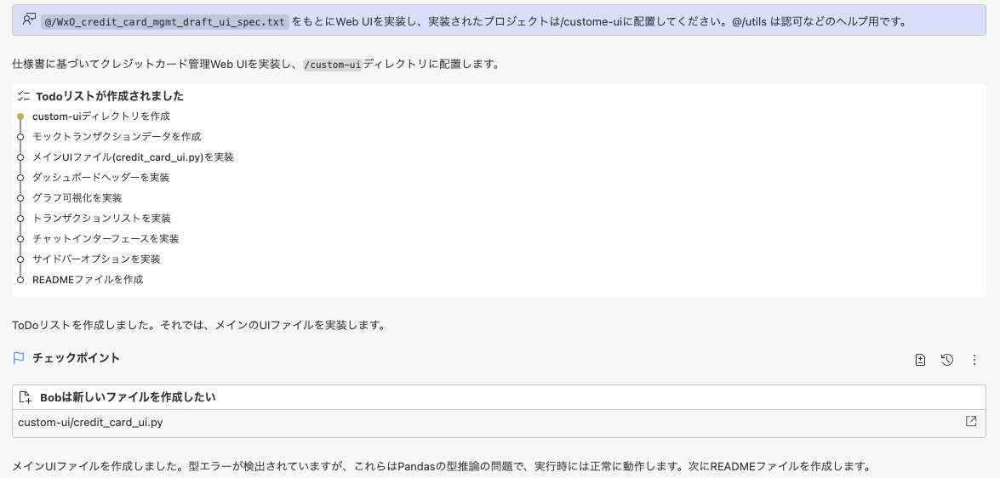
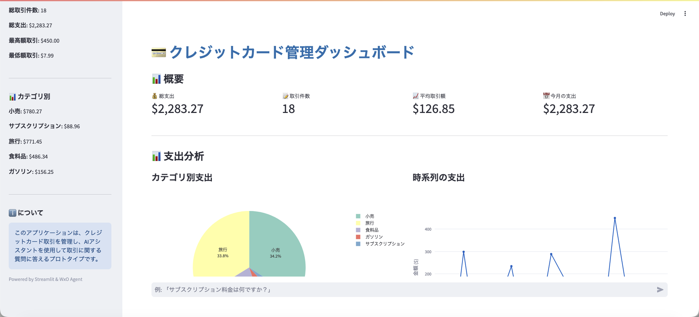

# Credit Card 管理アプリのWeb UI を作成する

## ハンズオンシナリオ
1. リポジトリ内のハンズオン用サンプル([hands-on](hands-on))をダウンロードし、Bobがアクセスできるフォルダに配置

2. [.env.sample](.env.sample) を .env にリネームし、環境変数を設定する

3. Bob へ仕様書([hands-on/WxO_credit_card_mgmt_draft_ui_spec.txt](hands-on/WxO_credit_card_mgmt_draft_ui_spec.txt))に誤った表記があった場合に改善するように指示を与える (Planモード)
```
WxO_credit_card_mgmt_draft_ui_spec.txt を確認して、必要に応じて改善してください
```


4. Bob へ英語の仕様書を日本語に翻訳するように指示を与える
```
WxO_credit_card_mgmt_draft_ui_spec.txt を日本語に翻訳してください
```


5. Bob へ仕様書をもとにWeb UI を実装するように指示を与える
```
WxO_credit_card_mgmt_draft_ui_spec.txt をもとにWeb UI を実装し、実装されたプロジェクトは /custome-ui に配置してください
```


6. Bob へWeb UI を起動するように指示を与える
```
Web UI を起動してください
```

