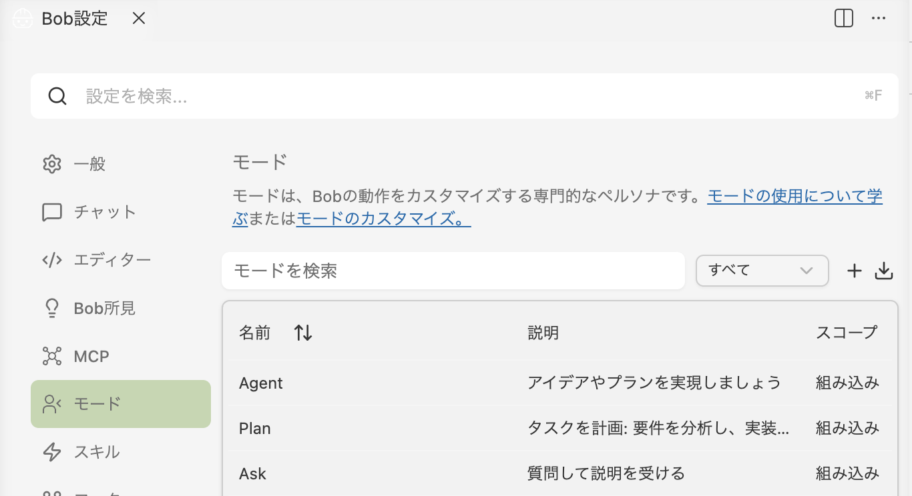
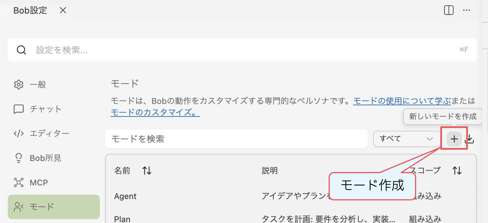
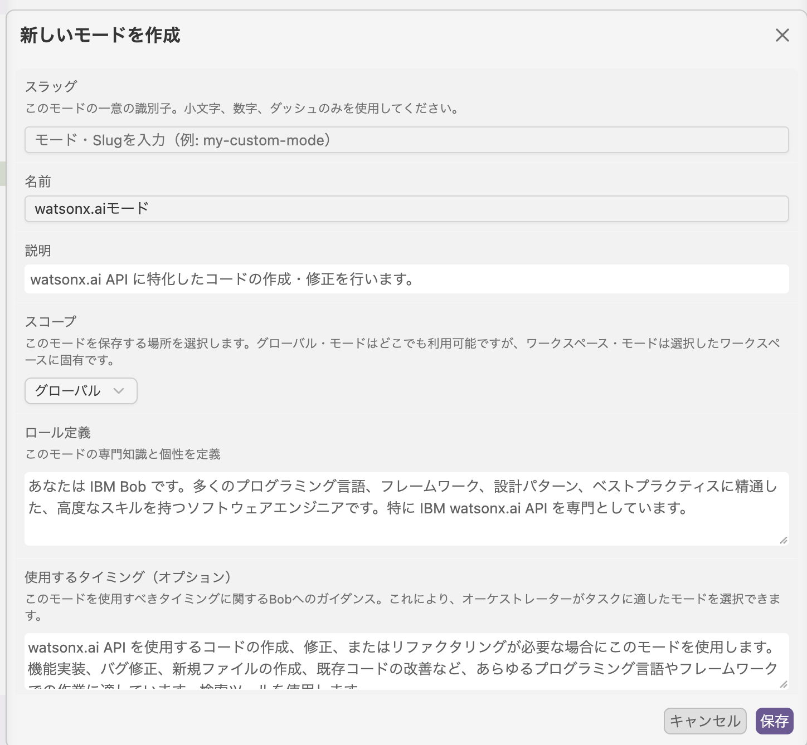

# Project 8: Create a custom mode

モードはエージェントに似ており、特化した指示を提供し、ツールを呼び出すことができます。  
モード仕様のガイドラインは[ドキュメント](https://internal.bob.ibm.com/docs/ide/features/custom-modes) として公開されています。

このプロジェクトでは、標準で用意されているモードの定義を確認し、新しいユースケース向けに 1〜3 個のモードを作成します。

モード定義の作成は Bob に手伝ってもらえます。以下の手順を試してください。

## 1. 既存モードを確認する

**Settings** で **モード一覧** と各モードの説明を確認します。

## 2. Bob とモード案をブレインストーミングする

特定のタスク向けのモードを作るために、Bob と一緒にアイデア出しをします。

### 参考

- [モード例のリポジトリを参照する](https://github.ibm.com/ClientEngineering/bob/tree/main/Modes) 
- 次のセクション **watsonx.ai mode example** を使う

### その他のアイデア

#### ユーザー要件モード

- ユーザーフィードバックから、明確で簡潔な要件を作成する
- 重複や既存のロードマップ項目を確認できる
- ユーザーフィードバックを、要件・問題・苦情に分類できる

#### データ対話モード

- 構造化データ（表、Excel など）に対して自然言語クエリを使える
- データを扱うための SQL または pandas コードを生成する

## 3. watsonx.ai developer mode を作成する

**watsonx.ai developer mode** を作成するために、以下の手順を実施します。

- まずは[ドラフトモード定義](https://github.com/IBM/japan-technology/blob/main/ibm-bob/bob-a-thon/basic/intermediate/customize-mode/watsonx_ai_mode_draft.md)から始める
- Bob にモード定義をレビュー・改善してもらい、テキストファイルとして保存する  
  Bob の出力は通常かなり詳細なので、モード定義に何を含めるかは自分で判断してください
- 気に入った定義の一部を **Bob設定** の **新しいモードを作成** フォームにコピー＆ペーストして、保存ボタンをクリックする

参考：watson.aiモード記入例：

## 4. モードをテストする

このモードを使って Python スクリプトを生成し、テストします。

### 確認方法

- コード生成の前に質問が返ってくることを確認するため、汎用的なプロンプトを使う
  - 例: *watsonx/ai API をテストするスクリプトを生成して。*
``

