# System Architecture - Banking Applications

## Executive Summary

This document provides a comprehensive architectural overview of the Banking Demo system, focusing on the capabilities and differences between Bank 1 (Savings Bank) and Bank 2 (Investment Bank), their technical implementations, and data flows.

## System Evolution

The project has evolved through four distinct phases:

### Phase 1: Dual Python Banks
- Both banks implemented as Python Flask APIs
- Basic REST endpoints
- In-memory data storage
- Simple inter-bank transfers

### Phase 2: Terraform & Ansible Integration
- Terraform for infrastructure provisioning
- Ansible for application configuration
- Eliminated deployment duplication
- Introduced persistent storage

### Phase 3: Modern UI for Bank 1
- Bank 1 upgraded with React frontend
- Material-UI component library
- Modern dashboard and analytics
- Bank 2 remains traditional Flask

### Phase 4: Azure Cloud Deployment
- Added Azure deployment option
- Azure Container Instances
- Azure Container Registry
- Azure File Shares for persistence
- Maintained local deployment option

## High-Level Architecture

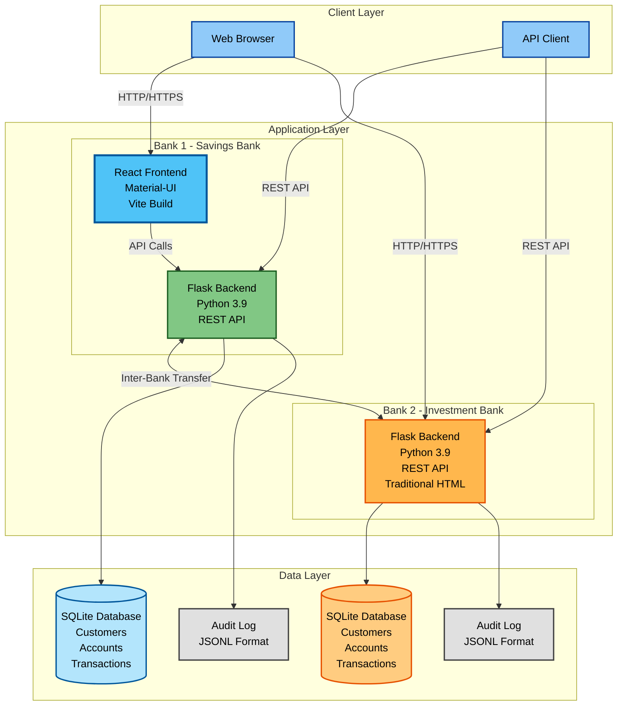

## Bank 1 - Savings Bank (Modern Architecture)

### Technology Stack

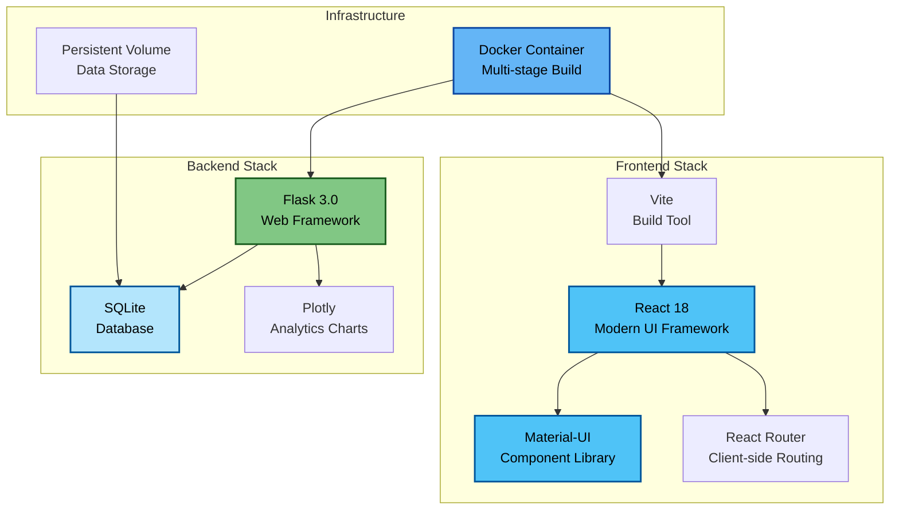

### Key Features

#### Modern Web Interface
- **React-based SPA**: Single-page application with client-side routing
- **Material-UI Components**: Professional, responsive design
- **Dashboard View**: Real-time balance, recent transactions, quick actions
- **Transaction Management**: Searchable, filterable transaction history
- **Transfer Interface**: User-friendly form with validation
- **Analytics Dashboard**: Interactive charts and spending insights
- **Customer Selector**: Admin view to switch between customers

#### Frontend Capabilities
```javascript
// Component Structure
App.jsx
├── Dashboard.jsx          // Overview with balance and quick stats
├── TransactionList.jsx    // Paginated transaction history
├── TransferForm.jsx       // Inter-bank transfer interface
└── Analytics.jsx          // Spending analytics with charts
```

#### Backend API Endpoints

| Endpoint | Method | Purpose | Response |
|----------|--------|---------|----------|
| `/` | GET | Serve React app | HTML |
| `/health` | GET | Health check | JSON status |
| `/api/balance` | POST | Get customer balance | JSON with balance |
| `/api/transactions` | POST | Get transaction history | JSON array |
| `/api/analytics` | POST | Get spending analytics | JSON with charts |
| `/api/transfer` | POST | Transfer to Bank 2 | JSON result |
| `/api/deposit` | POST | Deposit funds | JSON result |
| `/api/custom_query` | POST | Natural language query | JSON result |
| `/api/audit_log` | GET | View audit trail | JSON array |

### Data Model

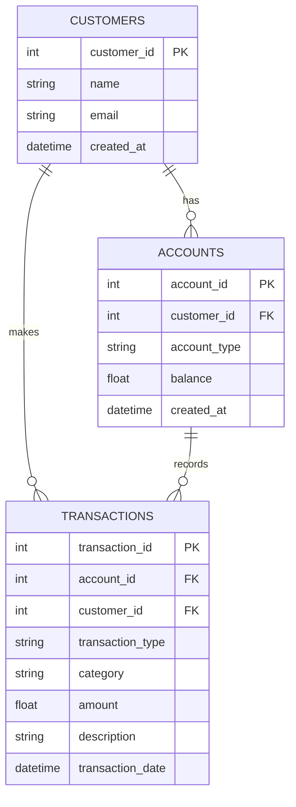

### User Interface Flow

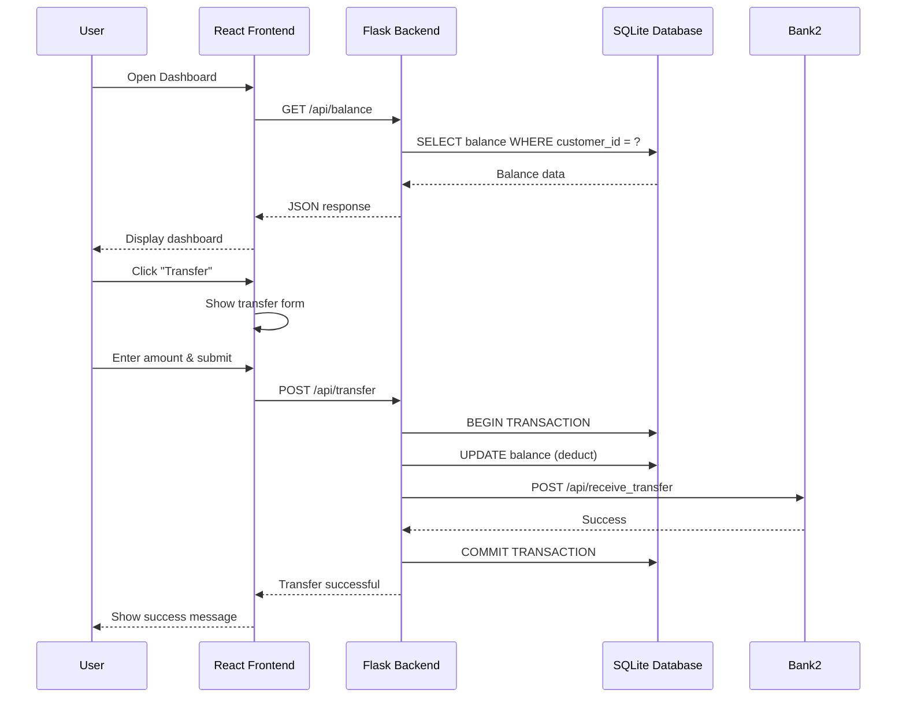

## Bank 2 - Investment Bank (Traditional Architecture)

### Technology Stack

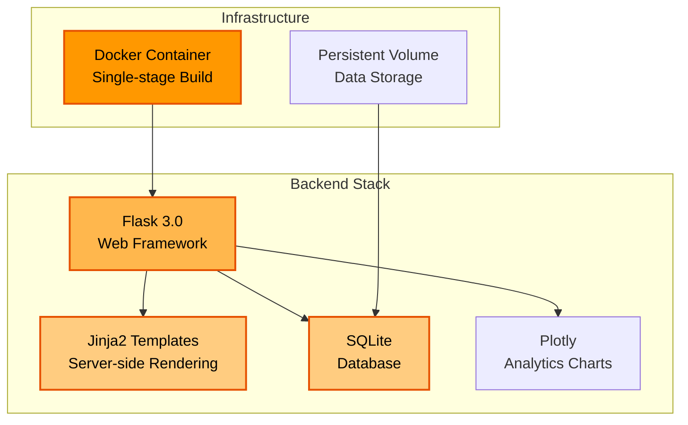

### Key Features

#### Traditional Web Interface
- **Server-side Rendering**: HTML generated by Flask/Jinja2
- **Form-based Interaction**: Traditional POST forms
- **Simple UI**: Functional, straightforward design
- **Blue Color Scheme**: Investment-focused branding

#### Backend API Endpoints

| Endpoint | Method | Purpose | Response |
|----------|--------|---------|----------|
| `/` | GET | Home page with forms | HTML |
| `/health` | GET | Health check | JSON status |
| `/api/balance` | POST | Get customer balance | JSON with balance |
| `/api/transactions` | POST | Get transaction history | JSON array |
| `/api/analytics` | POST | Get investment analytics | JSON with charts |
| `/api/receive_transfer` | POST | Receive from Bank 1 | JSON result |
| `/api/transfer_to_savings` | POST | Transfer to Bank 1 | JSON result |
| `/api/invest` | POST | Make investment | JSON result |
| `/api/withdraw` | POST | Withdraw funds | JSON result |
| `/api/custom_query` | POST | Natural language query | JSON result |
| `/api/audit_log` | GET | View audit trail | JSON array |

### Data Model

Same structure as Bank 1, but with investment-focused categories:
- **Transaction Categories**: stocks, bonds, mutual_funds, etf, crypto
- **Account Types**: investment, portfolio

## Comparison:
## Comparison: Bank 1 vs Bank 2

### Feature Comparison Matrix

| Feature | Bank 1 (Savings) | Bank 2 (Investment) |
|---------|------------------|---------------------|
| **Frontend** | React SPA | Server-rendered HTML |
| **UI Framework** | Material-UI | Basic HTML/CSS |
| **Routing** | Client-side (React Router) | Server-side (Flask) |
| **Build Process** | Multi-stage Docker (Vite + Flask) | Single-stage Docker (Flask only) |
| **User Experience** | Modern, interactive | Traditional, functional |
| **Dashboard** | Rich dashboard with widgets | Simple form-based interface |
| **Analytics** | Interactive Plotly charts | Server-rendered charts |
| **Mobile Support** | Responsive Material-UI | Basic responsive CSS |
| **API Design** | RESTful JSON API | RESTful JSON API |
| **Database** | SQLite with same schema | SQLite with same schema |
| **Security Features** | Parameterized queries, audit logs | Parameterized queries, audit logs |
| **Transaction Types** | Deposits, withdrawals, transfers | Investments, withdrawals, transfers |
| **Color Scheme** | Green (savings-focused) | Blue (investment-focused) |
| **Container Size** | ~200MB (includes Node.js build) | ~150MB (Python only) |
| **Startup Time** | ~5 seconds | ~3 seconds |
| **Resource Usage** | Higher (serves static files) | Lower (minimal frontend) |

### Architectural Differences

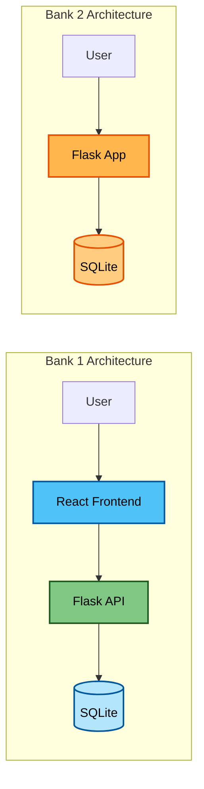

## Inter-Bank Communication

### Transfer Flow: Bank 1 → Bank 2

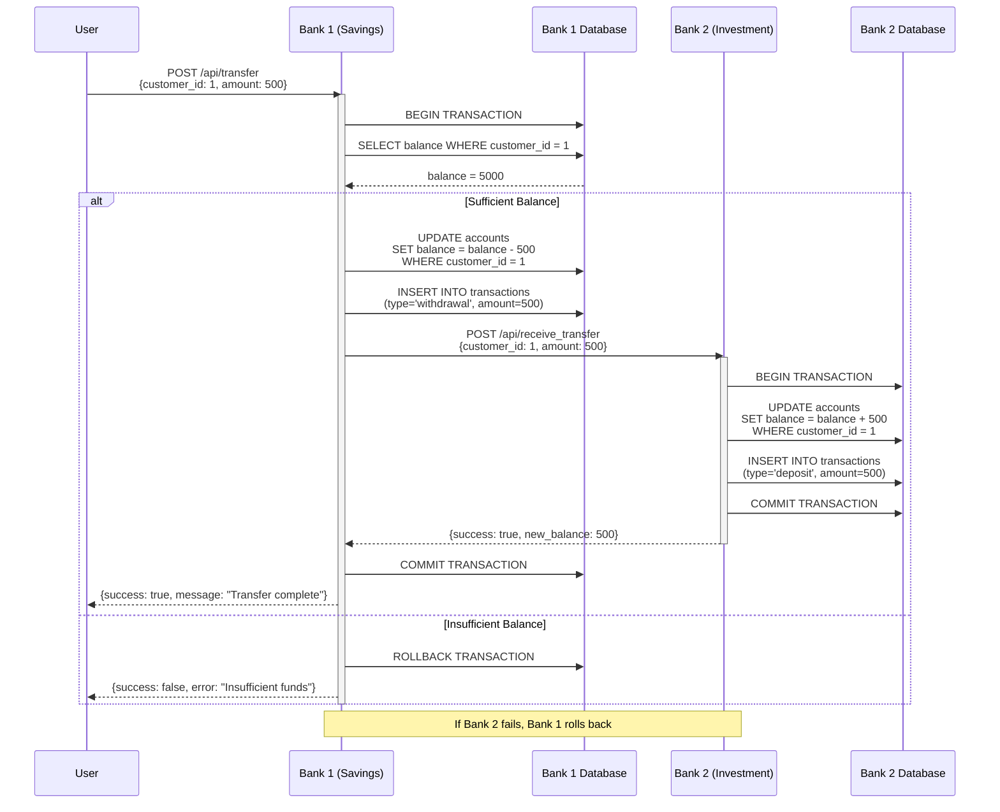

### Transfer Flow: Bank 2 → Bank 1

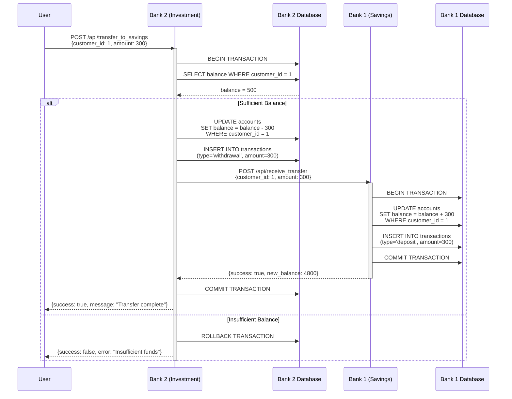

## Data Flow Architecture

### Request Processing Flow

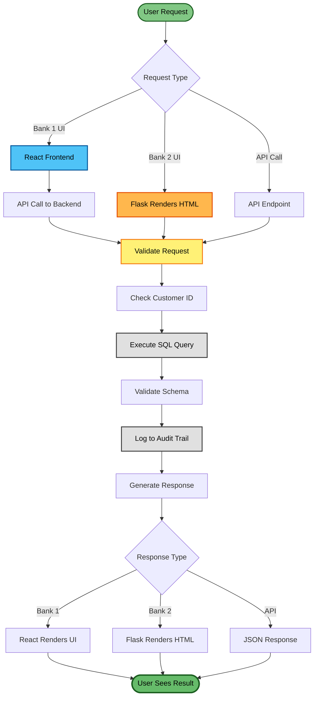

## Security Architecture

### Security Layers

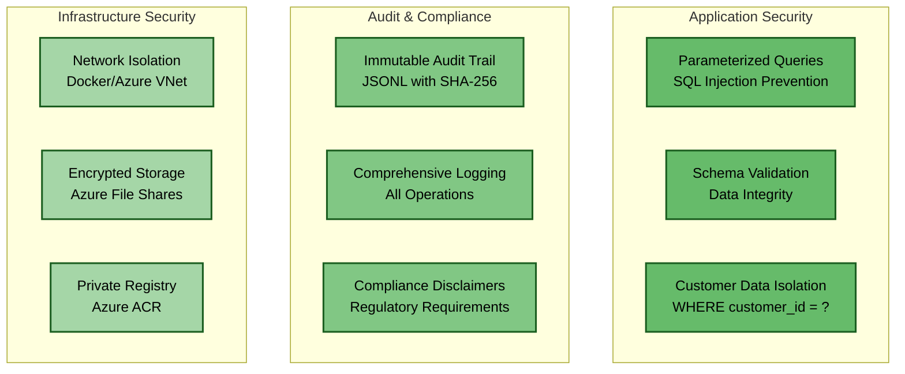

### Security Features

#### Both Banks
- ✅ **Parameterized SQL Queries**: Prevents SQL injection
- ✅ **Schema Validation**: Post-execution data validation
- ✅ **Customer Data Isolation**: Enforced WHERE clauses
- ✅ **Immutable Audit Trail**: JSONL with SHA-256 hashing
- ✅ **Balance Constraints**: Database-level CHECK constraints
- ✅ **Transaction Rollback**: Automatic rollback on failure
- ⚠️ **No Authentication**: Demo environment (add for production)
- ⚠️ **No Rate Limiting**: Add for production
- ⚠️ **HTTP Only**: Add HTTPS for production

## Performance Characteristics

### Resource Usage

| Metric | Bank 1 (Savings) | Bank 2 (Investment) |
|--------|------------------|---------------------|
| **Container Image Size** | ~200 MB | ~150 MB |
| **Memory Usage (Idle)** | ~150 MB | ~100 MB |
| **Memory Usage (Active)** | ~300 MB | ~200 MB |
| **CPU Usage (Idle)** | ~5% | ~3% |
| **Startup Time** | ~5 seconds | ~3 seconds |
| **Response Time (avg)** | ~50ms | ~30ms |
| **Static File Serving** | Yes (React build) | No |

### Scalability Considerations

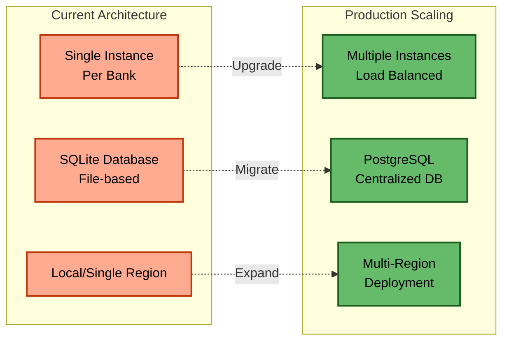

## Technology Decisions

### Why React for Bank 1?

**Advantages:**
- Modern, responsive user experience
- Component reusability
- Rich ecosystem of libraries
- Better mobile support
- Client-side routing (faster navigation)
- Easier to add real-time features

**Trade-offs:**
- Larger container size
- More complex build process
- Higher resource usage
- Requires JavaScript enabled

### Why Traditional Flask for Bank 2?

**Advantages:**
- Simpler architecture
- Smaller container size
- Lower resource usage
- Faster startup time
- Works without JavaScript
- Easier to maintain

**Trade-offs:**
- Less interactive UI
- Full page reloads
- Limited mobile optimization
- Harder to add real-time features

### Why SQLite?

**Advantages:**
- Zero configuration
- File-based (easy backups)
- ACID compliant
- Perfect for demo/development
- Low resource usage

**Trade-offs:**
- Single-writer limitation
- Not suitable for high concurrency
- Limited to single server
- Should migrate to PostgreSQL for production

## Deployment Architecture

### Container Build Process

#### Bank 1 (Multi-stage Build)

```dockerfile
# Stage 1: Build React frontend
FROM node:18 AS frontend-build
WORKDIR /app/frontend
COPY frontend/package*.json ./
RUN npm install
COPY frontend/ ./
RUN npm run build

# Stage 2: Python backend with built frontend
FROM python:3.9-slim
WORKDIR /app
COPY requirements.txt ./
RUN pip install --no-cache-dir -r requirements.txt
COPY app.py ./
COPY --from=frontend-build /app/frontend/dist ./static
EXPOSE 5000
CMD ["python", "app.py"]
```

#### Bank 2 (Single-stage Build)

```dockerfile
FROM python:3.9-slim
WORKDIR /app
COPY requirements.txt ./
RUN pip install --no-cache-dir -r requirements.txt
COPY app.py ./
EXPOSE 5000
CMD ["python", "app.py"]
```

### Network Architecture

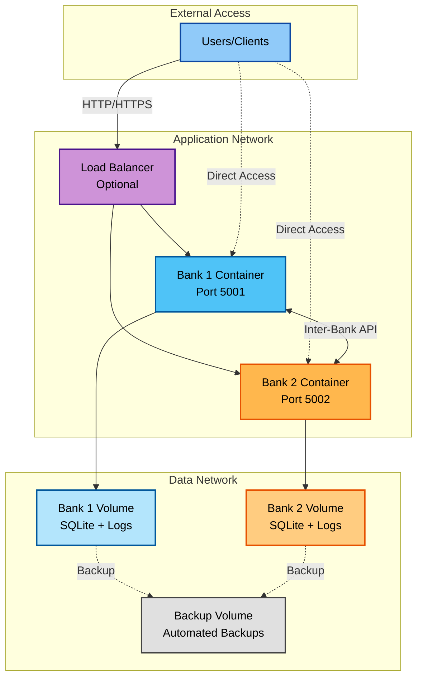

## Future Enhancements

### Planned Improvements

1. **Authentication & Authorization**
   - JWT-based authentication
   - Role-based access control (RBAC)
   - OAuth2 integration

2. **Database Migration**
   - PostgreSQL for production
   - Database replication
   - Connection pooling

3. **Observability**
   - Prometheus metrics
   - Grafana dashboards
   - Distributed tracing (Jaeger)
   - Centralized logging (ELK stack)

4. **High Availability**
   - Multiple container instances
   - Load balancing
   - Health checks and auto-restart
   - Database failover

5. **Security Enhancements**
   - HTTPS/TLS encryption
   - API rate limiting
   - Input sanitization
   - CORS configuration
   - Security headers

6. **Performance Optimization**
   - Redis caching
   - CDN for static assets
   - Database query optimization
   - Connection pooling

## Related Documentation

- [Deployment Overview](../operations/DEPLOYMENT_OVERVIEW.md)
- [Banking Features](../reference/BANKING_FEATURES.md)
- [API Reference](../reference/API_REFERENCE.md)
- [Local Deployment Guide](../guides/LOCAL_DEPLOYMENT.md)
- [Azure Deployment Guide](../guides/AZURE_DEPLOYMENT.md)

---

**Document Version**: 1.0  
**Last Updated**: 2025-11-21  
**Maintained By**: Architecture Team